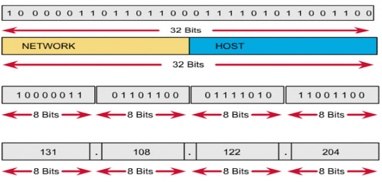
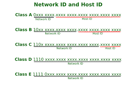
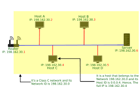
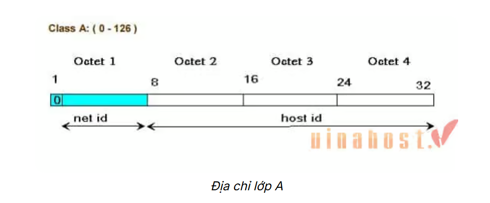
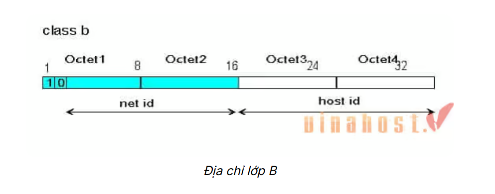
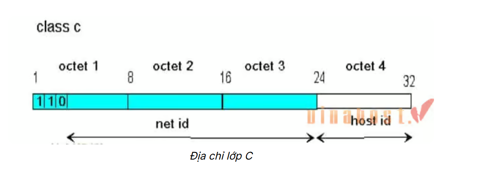
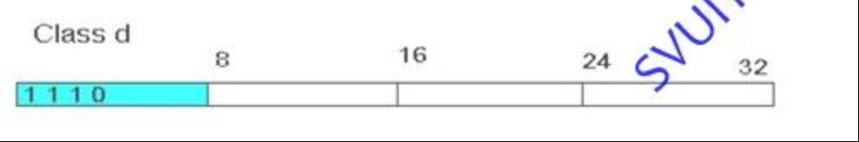

# Tìm hiểu về IPv4
## 1. IPv4 là gì ?
> IPv4 (Internet Protocol version 4) là giao thức mạng phiên bản thứ 4, dùng để định danh và liên kết các thiết bị kết nối vào Internet
> Địa chỉ IPv4 được biểu diễn dưới dạng chuỗi số, ngăn cách với nhau bằng dấu ".",
`Ví dụ: 192.168.1.0`

## 2. Tại sao không có IPv1, IPv2, IPv3, IPv5 ?
-	IPv1, IPv2, IPv3 là các phiên bản thử nghiệm trong quá trình phát triển Internet, chủ yếu dùng để nghiên cứu nội bộ của tổ chức ARPANET
-	IPv5 có tên khác là Steam Protocol được sử dùng để truyền dữ liệu theo thời gian thực (video, voice)

## 3. Cấu trúc của IPv4

-	Là một dãy số nhị phân gồm 32 bit
-	Gồm 4 octet, mỗi octet gồm 8 bit và được ngăn cách nhau bởi dấu “.”,
`Ví dụ: 192.168.1.0`

**Việc đặt địa chỉ IP phải tuân theo các quy tắc sau:**
- Không được đặt những bit ở phần network bằng 0 cùng một lúc. Khi đặt tất cả những bit ở phần network bằng không thì địa chỉ IP sẽ có 3 số đầu là 0.0.0. Đây là một địa chỉ sai.
- Nếu đặt tất cả các bit ở phần host bằng 0 thì số cuối cùng của địa chỉ IP sẽ bằng 0. Khi đó địa chỉ đó là một địa chỉ mạng, không thể dùng làm host. Ví dụ: 191.168.10.0 là một địa chỉ mạng.
- Nếu đặt tất cả các bit ở phần host là 1 thì số cuối cùng của địa chỉ IP là 255. Khi đó địa chỉ này sẽ là một địa chỉ broadcast của mạng đó. Ví dụ: 192.168.10.255 là một địa chỉ broadcast.

## 4. Các thành phần của IPv4
Gồm 2 phần chính: 

- **Network ID** : xác định mạng mà thiết bị đó thuộc về

- **Host ID** : xác định cụ thể thiết bị trong mạng đó
- **Lý do chia Network ID và Host ID**
- Tiết kiệm tài nguyên
- Quản lý hiệu quả hơn
- Hỗ trợ định tuyến
- Phân chia trách nhiệm quản trị

## 5. Các lớp của IPv4
Có 5 lớp : A, B, C, D, E

- **A** : Network gồm 8 bit đầu (bit đầu tiên luôn là 0), Host là 24 bit sau. Địa chỉ mạng chạy từ 1.0.0.0 -> 126.0.0.0. Số lượng mạng là 2^7 – 2 = 126 và số lượng host trên mỗi mạng có 2^24 - 2. Được sử dụng cho các tổ chức lớn với số lượng host nhiều (ISP, doanh nghiệp toàn cầu).

- **B** : Network gồm 16 bit đầu (2 bit đầu tiên là 1|0), Host gồm 16 bit sau. Địa chỉ mạng chạy từ 128.0.0.0 -> 191.255.0.0. Số lượng mạng 2^14  và số lượng host trên mỗi mạng có 2^16 - 2. Dành cho các cơ quan, doanh nghiệp vừa và lớn.

- **C** : Network gồm 24 bit đầu (3 bit đầu luôn là 1|1|0) và Host gồm 8 bit sau. Địa chỉ mạng chạy từ 192.0.0.0 -> 233.255.255.0 và mỗi mạng có 2^21 và số lượng host trên mỗi mạng có 2^8 – 2. Phục vụ các tổ chức nhỏ như văn phòng, tổ chức, mạng gia đình.

- **D** : là những địa chỉ dùng cho công nghệ Multicast (truyền tin đa điểm), 4 bit đầu là 1|1|1|0, bao gồm 224.0.0.0 -> 239.255.255.255. Dùng cho truyền thông multicast, gửi dữ liệu đến một nhóm máy tính cụ thể.

- **E** : có vai trò để dự phòng, 4 bit đầu là 1|1|1|1 từ 240.0.0.0 trở đi. Được sử dụng phục vụ mục đích nghiên cứu, không được sử dụng công khai
- Ta có địa chỉ 127.x.x.x là địa chỉ loopback để kiểm tra kết nối mạng nội bộ trên cùng 1 máy tính

## 6. Phân biệt IP public và IP private
>- IP private là địa chỉ IP được sử dụng để giao tiếp trong cùng một mạng, các thiết bị mạng bên ngoài không thể thấy cũng như truy cập vào địa chỉ này
>- IP public là địa chỉ IP định danh duy nhất trên mạng Internet, được sử dụng để giao tiếp bên ngoài mạng. địa chỉ IP public thường được gán bởi ISP
+ Địa chỉ IP động : là địa chỉ thay đổi thường xuyên. Nó được cấp phát từ một DHCP server (máy chủ cấp phát địa chỉ động) mỗi khi thiết bị kết nối vào mạng.
+ Địa chỉ Ip tĩnh : là một địa chỉ mạng không thay đổi theo thời gian. Nó được gán cho một thiết bị và giữ nguyên cho đến khi có sự thay đổi do người quản trị mạng.

### Kỹ thuật NAT sử dụng để chuyển đổi giữa IP Private và IP Public
- NAT (Network Address Traslation) là kỹ thuật cho phép các máy trong mạng private (IP riêng) gửi request ra ngoài mà không cần IP public. NAT sẽ thay đổi ("dịch") địa chỉ IP nguồn trước khi request ra Internet, và duy trì một bảng mapping để khi có phản hồi quay lại thì forward đúng về máy gốc.
`Ví dụ: Hiểu nôm na, NAT cũng giống như một nhân viên lễ tân tại một văn phòng lớn. Nếu bạn muốn gặp một ai đó trong công ty đều phải thông qua và làm theo hướng dẫn của nhân viên lễ tân. Hoặc nếu bạn muốn gọi điện nói chuyện với một ai đó nhưng người đó không có mặt ở công ty hoặc họ đang bận họp,... bạn có thể để lại tin nhắn cho lễ tân sau đó họ sẽ chuyển tiếp tin nhắn tới người mà bạn cần nói chuyện để thông báo. Trong một trường hợp khác bạn có thể nói chuyện với lễ tân và yêu cầu họ nối máy đến người bạn cần gặp.`

## 7. Cách chia địa chỉ IPv4
Gọi n là số bit mượn và m là số bit host còn lại. Ta có:
+  Số subnet có thể chia được:
2n  nếu có hỗ trợ subnet – zero.
2n – 2   nếu không hỗ trợ subnet – zero.
+ Số host có thể có trên mỗi subnet: 2m – 2 (host/subnet).
-   Với mỗi subnet chia được:
+  Địa chỉ mạng có octet bị mượn là bội số của bước nhảy
+  Địa chỉ host đầu = địa chỉ mạng + 1 (cần hiểu cộng 1 ở đây là lùi về sau một địa chỉ).
+  Địa chỉ broadcast = địa chỉ mạng kế tiếp – 1 (cần hiểu trừ 1 ở đây là lùi về phía trước một địa chỉ).
+  Địa chỉ host cuối = địa chỉ broadcast – 1 (cần hiểu trừ 1 ở đây là lùi về phía trước một địa chỉ).
-    Để tính ra subnet mask được sử dụng, ta sử dụng cách nhớ: phần mạng của địa chỉ chạy đến đâu, các bit 1 của subnet mask chạy đến đó

`Ví dụ`
-	Ip 192.168.1.0/24, chia thành 6 mạng con và mỗi mạng có 60 máy tính
-	2^h - 2 > 60 -> n = 6 (mượn 2 bit từ phần host), subnet mask 24 + 2 -> /26 (32 – 6 = 26 bit cho mạng và 6 bit cho host) subnet mask -> 255.255.255.192
-	Bước nhảy 256 – 192 = 64
| Stt	|   Địa chỉ mạng	    |   Dải ip host 	            |   Địa chỉ broadcast|
|  1	|   192.168.1.0/26	    |192.168.1.1->192.168.1.62	    |192.168.1.63        |
|  2    |   192.168.1.64/26	    |192.168.1.65->192.168.1.12	    |192.168.1.127       |
|  3    |   192.168.1.128/26	|192.168.1.129->192.168.1.190	|192.168.1.191       |
|  4    |   192.168.1.192/26	|192.168.1.193->192.168.1.254	|192.168.1.255       |

## 8. Phân biệt multicast và broadcast
> Khái niệm
- Broadcast (Quảng bá): Gói tin được gửi đến tất cả các thiết bị trong cùng một phân đoạn mạng (Local Network). Ngay cả khi thiết bị không cần thông tin đó, nó vẫn phải nhận và xử lý gói tin (ở mức độ nhất định) trước khi quyết định hủy bỏ.
- Multicast (Đa điểm): Gói tin được gửi đến một nhóm cụ thể các thiết bị có quan tâm. Chỉ những thiết bị nào đăng ký gia nhập nhóm Multicast đó mới nhận và xử lý dữ liệu.
> Địa chỉ IP sử dụng
- Broadcast: Sử dụng địa chỉ IP đặc biệt mà tất cả các bit phần Host đều bằng 1.
`Ví dụ: 255.255.255.255 (Quảng bá giới hạn) hoặc 192.168.1.255.`
- Multicast: Sử dụng dải địa chỉ Lớp D.
`Ví dụ: Từ 224.0.0.0 đến 239.255.255.255.`
> Hiệu năng và tác động đến mạng
|   Đặc điểm   |   Broadcast  |   Multicast  |
----------------------------------------------------------
|Băng thông    |Gây lãng phí dữ liệu nếu có nhiều  |Tiết kiệm băng thông vì chỉ gửi cho người cần
|              | thiết bị không cần dữ liệu        |
|Xử lý tại Host| Mọi thiết bị đều bị làm phiền     |Chỉ các máy trong nhóm mới tốn tài nguyên xử lý
## 9. tìm hiểu các khái niệm: subnet, subnet mask, prefx

### Subnet
- Subnet là từ viết tắt của "Subnetwork". Đây là việc chia một mạng lớn (như mạng của một nhà mạng ISP) thành các mạng nhỏ hơn (như mạng gia đình hoặc mạng từng phòng ban trong công ty).

### Subnet mask
Subnet mask là một dạng số nhị phân 32bit, cho phép người sử dụng phân tách địa chỉ IP thành địa chỉ mạng và địa chỉ host. Các địa chỉ theo dạng số học sẽ không được sử dụng cho máy chủ.

### Prefix
Prefix là cách viết ngắn gọn của Subnet Mask theo chuẩn CIDR (Classless Inter-Domain Routing). Thay vì viết 255.255.255.0, người ta chỉ cần đếm xem có bao nhiêu bit 1 trong Subnet Mask và viết sau dấu gạch chéo /.