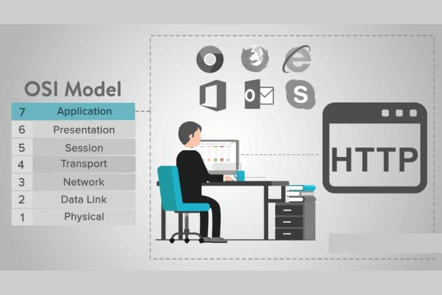
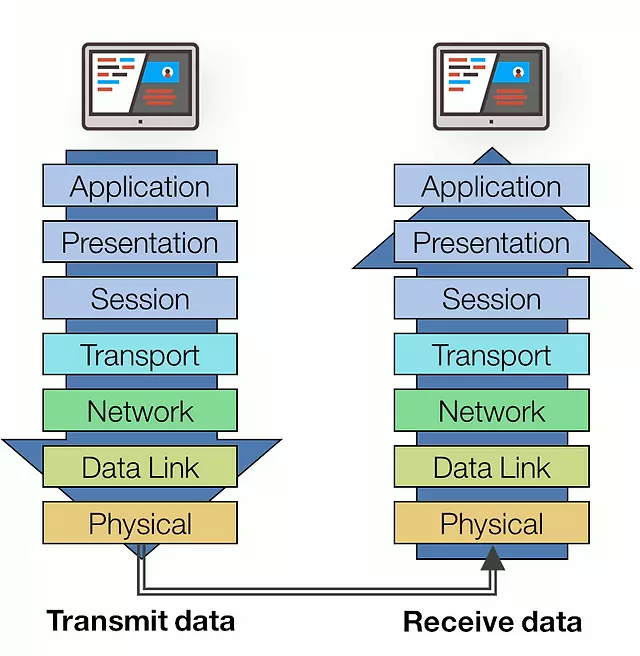
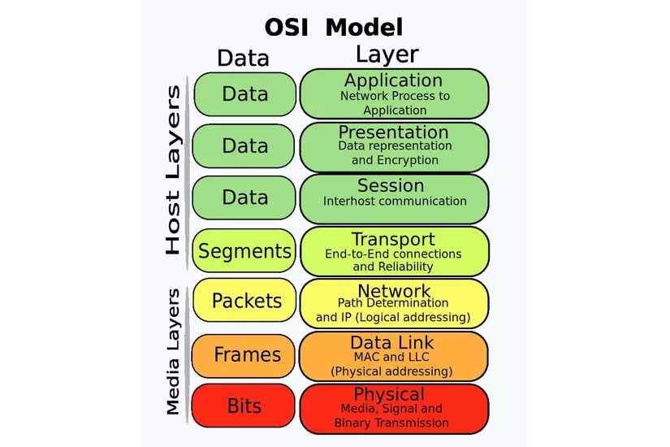
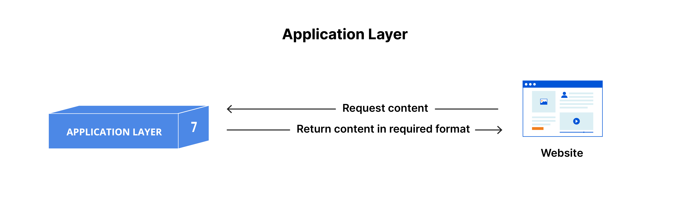
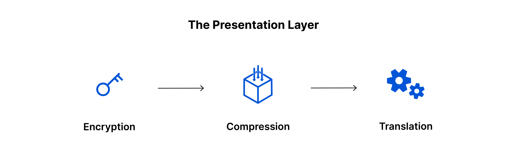
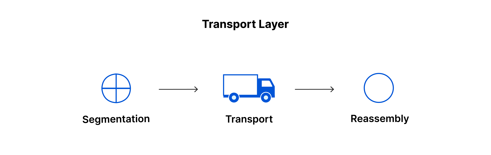
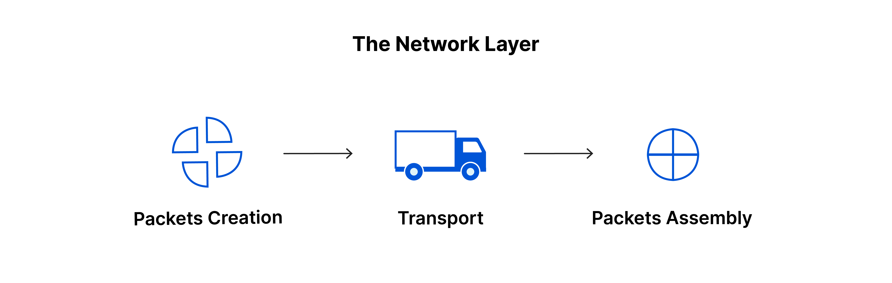
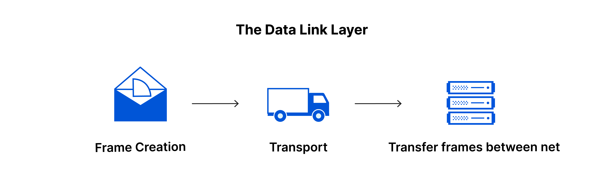
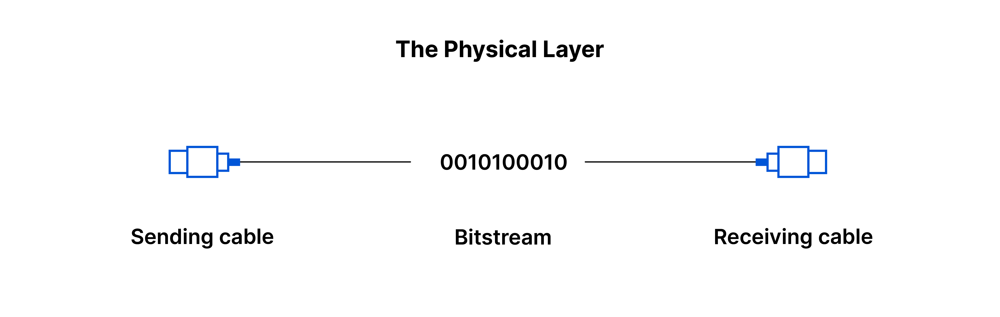
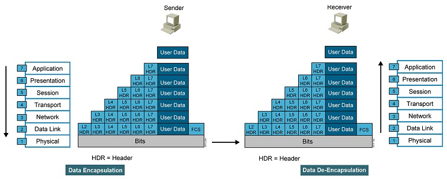

# Tìm hiểu mô hình OSI
## I Mô hình OSI là gì ?
### 1. Khái niệm.

- Mô hình OSI là gì? Mô hình OSI (Open Systems Interconnection) là một khung làm việc cơ bản giúp hiểu và mô tả cách một hệ thống mạng hoạt động. Được phát triển bởi Tổ chức Tiêu chuẩn Hóa Quốc tế (ISO), mô hình OSI đã trở thành một nguồn kiến thức cơ bản quan trọng trong lĩnh vực mạng và truyền thông.
- Mô hình OSI chia nhỏ quá trình truyền thông mạng thành 7 tầng (layer). Mỗi tầng đảm nhiệm một chức năng cụ thể. Các chức năng này tương tác theo thứ tự từ trên xuống dưới. Các tầng trong mô hình OSI gồm: Physical, Data Link, Network, Transport, Session, Presentation và Application. Mô hình OSI đưa ra các giao thức, tiêu chuẩn cho mỗi tầng để đảm bảo các thiết bị mạng khác nhau có thể giao tiếp, kết nối với nhau.
### 2. Vai trò của mô hình OSI
>Mô hình OSI không phải là một thiết bị hay phần mềm cụ thể, mà là một khung tham chiếu với các vai trò chính:
+ **Chuẩn hóa**: Giúp các nhà sản xuất phần cứng và phần mềm tạo ra các sản phẩm có thể làm việc cùng nhau (tính tương thích).

+ **Chia nhỏ quy trình phức tạp**: Chia việc truyền tin khổng lồ thành 7 tầng nhỏ hơn, giúp việc học tập, thiết kế và quản trị mạng trở nên dễ dàng hơn.

+ **Giao diện rõ ràng**: Xác định rõ ràng các dịch vụ mà một tầng cung cấp cho tầng trên nó và cách các tầng tương tác.

+ **Hỗ trợ khắc phục sự cố (Troubleshooting)**: Giúp kỹ thuật viên khoanh vùng lỗi. (Ví dụ: Nếu dây cáp đứt, họ biết lỗi ở Tầng 1; nếu sai địa chỉ IP, họ biết lỗi ở Tầng 3).
### Ưu/ nhược điểm của mô hình OSI
> Ưu điểm
- **Tính linh hoạt**: Bạn có thể thay đổi công nghệ ở một tầng mà không ảnh hưởng đến các tầng khác. Ví dụ: Bạn thay thế cáp đồng (Tầng 1) bằng cáp quang, nhưng ứng dụng web (Tầng 7) của bạn vẫn hoạt động bình thường.

- **Dễ dàng phát triển sản phẩm**: Các nhà phát triển chỉ cần tập trung vào tầng mà sản phẩm của họ hoạt động thay vì phải thiết kế lại toàn bộ hệ thống từ đầu đến cuối.

- **Tính giảng dạy cao**: Đây là công cụ tốt nhất để đào tạo về mạng, giúp người mới bắt đầu hình dung được dòng chảy dữ liệu một cách logic.

- **Giảm thiểu sự phức tạp**: Bằng cách chia nhỏ các chức năng mạng, mô hình này giúp giảm bớt sự chồng chéo và nhầm lẫn trong thiết kế hệ thống.

> Nhược điểm
- **Tính lý thuyết thuần túy**: OSI là mô hình tham chiếu, không phải mô hình thực thi. Trong thực tế, các tầng thường bị gộp lại (như mô hình TCP/IP chỉ có 4 hoặc 5 tầng).

- **Sự trùng lặp chức năng**: Một số chức năng xuất hiện ở nhiều tầng gây lãng phí tài nguyên. Ví dụ: Việc kiểm soát lỗi (Error Control) xuất hiện ở cả Tầng 2 (Data Link) và Tầng 4 (Transport).

- **Độ trễ hệ thống**: Vì dữ liệu phải đi qua tất cả 7 tầng (thêm Header ở máy gửi và gỡ Header ở máy nhận), quá trình này đôi khi gây tốn tài nguyên CPU và làm chậm tốc độ truyền tin.

- **Phân tầng không đồng đều**: Một số tầng rất "bận rộn" và quan trọng (như Tầng 2, 3, 4), trong khi một số tầng khác lại khá ít việc (như Tầng 5 - Session và Tầng 6 - Presentation).
## II. Các lớp trong mô hình OSI
- Mô hình bao gồm 7 tầng riêng biệt nhưng chúng liên kết chặt chẽ với nhau, mỗi tầng đều có nhiệm vụ gửi/nhận dữ liệu từ tầng kề trên hoặc kề dưới nó. Tại thiết bị gửi, dữ liệu xuất phát từ tầng ứng dụng (Application layer), lần lượt được chuyển tiếp và xử lý qua mỗi tầng, cho tới tầng vật lý (Physical layer); bên nhận thu được dữ liệu từ tầng vật lý, chuyển tiếp và xử lý lần lượt qua các tầng, cho tới tầng ứng dụng, thiết bị nhận đón tiếp dữ liệu tại đây.

- Có thể hình dung việc gửi và nhận dữ liệu dựa trên mô hình OSI giống như quá trình gửi và nhận thư: dữ liệu là nội dung thư, được ghi vào giấy, cho vào phong bì thư, đóng phong bì, dán tem, cho vào hòm thư, người đưa thư chuyển thư trong hòm tới hòm thư đích, bên nhận sẽ thực hiện ngược lại các bước này, cuối cùng đọc được nội dung thư. Mỗi bước đều lấy dữ liệu từ bước trước và xử lý thêm một thao tác, dữ liệu cũng được chuyển đổi từ hình trạng này tới hình trạng khác. Trong mô hình OSI cũng vậy, tương ứng với mỗi tầng, dữ liệu được thể hiện ở một hình thái khác nhau:

### 1. Application Layer (Tầng ứng dụng)

> Khái niệm
- Đây là tầng duy nhất tương tác trực tiếp với dữ liệu từ người dùng. Các ứng dụng phần mềm như trình duyệt web và ứng dụng gửi email dựa vào tầng ứng dụng để bắt đầu quá trình giao tiếp. Tuy nhiên, cần làm rõ rằng: bản thân các ứng dụng phần mềm (như Chrome hay Outlook) không nằm trong tầng ứng dụng; thay vào đó, tầng ứng dụng chịu trách nhiệm về các giao thức và thao tác dữ liệu mà phần mềm sử dụng để hiển thị thông tin có ý nghĩa cho người dùng.
- Các giao thức của tầng ứng dụng bao gồm HTTP (duyệt web) và SMTP (giao thức truyền tải thư tín đơn giản – một trong những giao thức cho phép giao tiếp email).
> Chức năng
- **Xác định đối tác giao tiếp**: Tầng này kiểm tra xem người bạn muốn gửi tin nhắn có đang online hay không và có sẵn sàng nhận dữ liệu không.
- **Xác thực và bảo mật**: Kiểm tra danh tính người dùng (đăng nhập/mật khẩu) trước khi cho phép truy cập dữ liệu.
- **Đảm bảo tính nhất quán của dữ liệu**: Nếu bạn đang thực hiện một giao dịch ngân hàng, tầng ứng dụng đảm bảo rằng nếu có lỗi xảy ra, giao dịch đó phải được hủy bỏ hoàn toàn thay vì thực hiện dở dang.
> Giao thức tiêu biểu: HTTP, FTP, SMTP, DNS.

### 2. Presentation Layer (Tầng trình diễn)

> Khái niệm
- Tầng này chịu trách nhiệm chính trong việc chuẩn bị dữ liệu sao cho tầng ứng dụng có thể sử dụng được; nói cách khác, tầng 6 làm cho dữ liệu trở nên "có thể trình diễn" để các ứng dụng tiêu thụ. Tầng trình diễn chịu trách nhiệm về thông dịch (translation), mã hóa (encryption) và nén (compression) dữ liệu.
- Hai thiết bị đang giao tiếp có thể sử dụng các phương thức mã hóa (encoding) khác nhau, vì vậy tầng 6 chịu trách nhiệm thông dịch dữ liệu đến thành một cú pháp mà tầng ứng dụng của thiết bị nhận có thể hiểu được.
- Nếu các thiết bị đang giao tiếp qua một kết nối được mã hóa, tầng 6 chịu trách nhiệm thêm mã hóa ở phía người gửi cũng như giải mã ở phía người nhận để nó có thể trình diện cho tầng ứng dụng dữ liệu chưa mã hóa, có thể đọc được.
- Cuối cùng, tầng trình diễn cũng chịu trách nhiệm nén dữ liệu mà nó nhận được từ tầng ứng dụng trước khi chuyển xuống tầng 5. Việc này giúp cải thiện tốc độ và hiệu quả giao tiếp bằng cách giảm thiểu lượng dữ liệu sẽ được truyền đi.
> Chức năng
Tầng Trình diễn thường được ví như một "Thông dịch viên" hoặc "Trợ lý ngôn ngữ" của mô hình OSI. Nó đảm bảo rằng "ngôn ngữ" của máy gửi và máy nhận là tương thích với nhau.
- **Chức năng Thông dịch (Translation)**
+ Máy tính có thể sử dụng các bảng mã khác nhau để đại diện cho ký tự (ví dụ: máy mainframe dùng mã EBCDIC, trong khi PC dùng mã ASCII hoặc Unicode).
+ Nhiệm vụ: Tầng 6 sẽ chuyển đổi các kiểu dữ liệu (văn bản, số, hình ảnh) từ định dạng riêng của máy gửi sang một định dạng chung trên đường truyền, và ngược lại ở máy nhận.

- **Chức năng Mã hóa & Giải mã (Encryption & Decryption)**
+ Đây là tầng xử lý bảo mật ở mức độ trình diễn dữ liệu.
+ Tại máy gửi: Nó biến đổi dữ liệu dễ đọc thành các chuỗi ký tự vô nghĩa (mật mã) để nếu bị đánh cắp trên đường truyền, kẻ xấu cũng không đọc được.
+ Tại máy nhận: Nó giải mã lại thành dữ liệu gốc để ứng dụng sử dụng.
Ví dụ: Khi bạn thực hiện thanh toán online, tầng này giúp xử lý các chuẩn mã hóa như SSL/TLS.

- **Chức năng Nén dữ liệu (Compression)**
+ Giống như việc bạn dùng WinRAR để nén file trước khi gửi đi.
+ Nhiệm vụ: Tìm các phần dữ liệu lặp lại và thu gọn chúng lại để gói tin nhỏ hơn.
+ Tác dụng: Cực kỳ quan trọng khi bạn xem Livestream hoặc gọi Video. Nếu không có sự nén dữ liệu ở tầng 6, video sẽ bị giật lag vì dung lượng dữ liệu gốc quá lớn so với băng thông mạng.

- **Định dạng tệp tin (File Formatting)**
Tầng 6 quy định các chuẩn định dạng để các ứng dụng ở tầng 7 nhận diện được:
+ Hình ảnh: JPEG, GIF, PNG.
+ Âm thanh/Video: MP3, MP4, AVI.
+ Văn bản: RTF, HTML.

### 3. Session Layer (Tầng phiên)

> Khái niệm
- Đây là tầng chịu trách nhiệm cho việc mở và đóng giao tiếp giữa hai thiết bị. Khoảng thời gian từ khi giao tiếp được mở cho đến khi đóng được gọi là một phiên (session). Tầng phiên đảm bảo rằng phiên làm việc được mở đủ lâu để chuyển hết tất cả dữ liệu đang được trao đổi, và sau đó nhanh chóng đóng phiên để tránh lãng phí tài nguyên.

- Tầng phiên cũng đồng bộ hóa việc truyền dữ liệu với các điểm kiểm tra (checkpoints). Ví dụ, nếu một tệp tin dung lượng 100 megabyte đang được truyền đi, tầng phiên có thể đặt một điểm kiểm tra sau mỗi 5 megabyte. Trong trường hợp bị ngắt kết nối hoặc gặp sự cố sau khi đã truyền được 52 megabyte, phiên làm việc có thể được khôi phục từ điểm kiểm tra cuối cùng, nghĩa là chỉ cần truyền thêm 50 megabyte dữ liệu còn lại. Nếu không có các điểm kiểm tra, toàn bộ quá trình truyền tải sẽ phải bắt đầu lại từ đầu.
> Chức năng
- **Quản lý hội thoại (Dialogue Control)**
Tầng 5 quyết định phương thức giao tiếp giữa hai máy tính:
Đơn công (Simplex): Dữ liệu chỉ đi một chiều (như TV).
Bán song công (Half-duplex): Dữ liệu đi hai chiều nhưng không cùng lúc (như bộ đàm).
Song công toàn phần (Full-duplex): Hai bên có thể nói và nghe cùng lúc (như điện thoại).

- **Đồng bộ hóa và Điểm kiểm tra (Checkpoints)**
Đây là chức năng quan trọng nhất mà hình ảnh của bạn đã đề cập. Hãy tưởng tượng bạn đang tải một bộ phim nặng:
+ Cơ chế: Tầng 5 chèn các mã đánh dấu (Sync bits) vào luồng dữ liệu.
+ Lợi ích: Nó giúp hệ thống có khả năng chịu lỗi (Fault Tolerance). Khi mạng chập chờn, bạn không phải tải lại từ 0%. Đây chính là lý do các trình quản lý tải xuống (như IDM) có thể "Resume" lại quá trình download.

- **Quản trị phiên (Session Administration)**
+ Xác thực (Authentication): Khi bạn đăng nhập vào một website, Tầng 5 giúp duy trì trạng thái đăng nhập đó. Bạn không cần phải nhập mật khẩu mỗi khi bấm sang một trang con khác trong cùng một website.
+ Ủy quyền (Authorization): Đảm bảo phiên làm việc của bạn có quyền truy cập vào các tài nguyên cụ thể.

- **Mối liên hệ với Socket**
+ Tầng Phiên sử dụng các Socket để định danh duy nhất một kết nối. Một máy tính có thể có hàng trăm "phiên" làm việc cùng lúc (vừa lướt web, vừa nghe nhạc, vừa chat). Tầng 5 đảm bảo dữ liệu của phiên chat không bị nhảy nhầm sang cửa sổ trình duyệt web.
### 4. Transport Layer (Tầng vận chuyển)

> Khái niệm
- Tầng 4 chịu trách nhiệm giao tiếp đầu-cuối (end-to-end) giữa hai thiết bị. Điều này bao gồm việc lấy dữ liệu từ tầng phiên (session layer) và chia nhỏ nó thành các mẩu gọi là phân đoạn (segments) trước khi gửi xuống tầng 3. Tầng giao vận tại thiết bị nhận có trách nhiệm tái hợp các phân đoạn này thành dữ liệu mà tầng phiên có thể tiêu thụ.

- Tầng giao vận cũng chịu trách nhiệm kiểm soát lưu lượng (flow control) và kiểm soát lỗi (error control). Kiểm soát lưu lượng xác định tốc độ truyền tối ưu để đảm bảo bên gửi có kết nối nhanh không làm cho bên nhận có kết nối chậm bị quá tải. Tầng giao vận thực hiện kiểm soát lỗi tại đầu nhận bằng cách đảm bảo dữ liệu nhận được đã đầy đủ, và yêu cầu truyền lại nếu chưa đủ.

- Các giao thức của tầng giao vận bao gồm *Tranmission Control Protocol* (TCP) và *User Datagram Protocol* (UDP).
> Chức năng
**Phân đoạn và Tái hợp (Segmentation & Reassembly)**
+ Nếu bạn gửi một file ảnh dung lượng 10MB, nó không thể bay một lèo qua mạng được vì các thiết bị trung gian có giới hạn kích thước gói tin.
+ Tại máy gửi: Tầng 4 cắt 10MB đó thành hàng ngàn phân đoạn nhỏ (Segments), mỗi đoạn được đánh số thứ tự (Sequence Number).
+ Tại máy nhận: Dựa vào số thứ tự, tầng 4 sẽ ghép chúng lại theo đúng vị trí cũ, kể cả khi các đoạn này đến đích không đúng trình tự.

**Kiểm soát lưu lượng (Flow Control)**
+ Hãy tưởng tượng máy gửi là một vòi nước cực mạnh, còn máy nhận là một cái xô nhỏ. Nếu vòi nước xả quá nhanh, xô sẽ tràn và mất nước.
+ Cơ chế: Tầng 4 cho phép máy nhận gửi tín hiệu báo cho máy gửi: "Chậm lại một chút, tôi xử lý không kịp!". Điều này đảm bảo tính ổn định của hệ thống.

**Kiểm soát lỗi (Error Control)**
+ Tầng 4 đảm bảo dữ liệu đến nơi "không thiếu một cộng tóc".
+ Nếu một phân đoạn bị mất trên đường đi, máy nhận sẽ phát hiện ra (dựa vào số thứ tự bị khuyết) và yêu cầu máy gửi: "Tôi thiếu đoạn số 5, hãy gửi lại cho tôi".

**Định danh ứng dụng qua Cổng (Port Number)**
+ Đây là chức năng cực kỳ quan trọng giúp máy tính phân biệt được dữ liệu nào là của Web, dữ liệu nào là của game.
+ Ví dụ: Khi dữ liệu đến máy bạn, tầng 4 nhìn vào số Port:
        Port 80/443: Chuyển lên trình duyệt Web.
        Port 25: Chuyển lên ứng dụng Email.

- Đơn vị dữ liệu: Segment (TCP) hoặc Datagram (UDP).

### 5. Network Layer (Tầng mạng)

> Khái niệm
- Tầng mạng chịu trách nhiệm tạo điều kiện cho việc truyền dữ liệu giữa hai mạng khác nhau. Nếu hai thiết bị đang giao tiếp trong cùng một mạng thì tầng mạng là không cần thiết. Tầng mạng chia nhỏ các phân đoạn (segments) từ tầng giao vận thành các đơn vị nhỏ hơn, gọi là gói tin (packets) tại thiết bị gửi, và ráp lại các gói tin này tại thiết bị nhận. Tầng mạng cũng tìm con đường vật lý tốt nhất để dữ liệu đi đến đích; quá trình này được gọi là định tuyến (routing).
- Các giao thức của tầng mạng bao gồm IP, Internet Control Message Protocol (ICMP), Internet Group Message Protocol (IGMP) và bộ giao thức IPsec.
> Chức năng
- **Định tuyến (Routing) - "Người chỉ đường"**
+ Đây là chức năng quan trọng nhất của Tầng 3. Khi một gói tin cần đi từ Việt Nam sang Mỹ, nó phải đi qua rất nhiều trạm trung gian (Routers).
+ Cơ chế: Các Router sử dụng bảng định tuyến (Routing Table) và các thuật toán để quyết định: "Đi đường cáp quang biển hay đi đường vệ tinh thì nhanh hơn?".
+ Đặc điểm: Tầng mạng không quan tâm đến việc dữ liệu đi qua loại cáp nào, nó chỉ quan tâm đến việc tìm ra con đường ngắn nhất và ít tắc nghẽn nhất.

- **Địa chỉ logic (IP Addressing)**
+ Để biết gói tin đi về đâu, Tầng 3 sử dụng Địa chỉ IP.
+ IP nguồn & IP đích: Mỗi gói tin được dán nhãn địa chỉ IP của máy gửi và máy nhận.
+ Sự khác biệt: Khác với địa chỉ MAC (cố định vào phần cứng ở Tầng 2), địa chỉ IP có thể thay đổi tùy thuộc vào mạng mà bạn đang kết nối.

- **Phân đoạn và Tái hợp Gói tin (Fragmentation & Reassembly)**
+ Mỗi mạng có một giới hạn kích thước gói tin khác nhau (gọi là MTU - Maximum Transmission Unit).
+ Cơ chế: Nếu một Segment từ Tầng 4 quá lớn để đi qua một mạng trung gian, Tầng 3 tại Router sẽ "xẻ" nhỏ nó thành nhiều gói tin (Packets) nhỏ hơn nữa.
+ Tái hợp: Tại đích đến, Tầng 3 sẽ thu thập đủ các mảnh nhỏ này và ghép lại thành dữ liệu ban đầu trước khi chuyển lên Tầng 4.

- **Các giao thức quan trọng khác**
+ ICMP: Dùng để thông báo lỗi. Ví dụ khi bạn dùng lệnh ping mà thấy "Request timed out", đó chính là ICMP đang báo cáo rằng gói tin không đến được đích.
+ IPsec: Một bộ giao thức dùng để bảo mật (mã hóa) dữ liệu ngay tại Tầng 3, thường dùng trong các kết nối VPN.

- Đơn vị dữ liệu: Packet.

### 6. Data Link Layer (Tầng liên kết dữ liệu)

> Khái niệm
- Tầng liên kết dữ liệu rất giống với tầng mạng, ngoại trừ việc tầng liên kết dữ liệu tạo điều kiện cho việc truyền dữ liệu giữa hai thiết bị trong cùng một mạng. Tầng liên kết dữ liệu lấy các Packets từ tầng mạng và chia nhỏ chúng thành các phần nhỏ hơn gọi là Frames (khung hình). Giống như tầng mạng, tầng liên kết dữ liệu cũng chịu trách nhiệm kiểm soát lưu lượng (flow control) và kiểm soát lỗi (error control) trong phạm vi giao tiếp nội bộ mạng (Trong khi đó, tầng giao vận chỉ thực hiện kiểm soát lưu lượng và kiểm soát lỗi cho các giao tiếp liên mạng).
> Chức năng
Tầng Liên kết dữ liệu là tầng "thực dụng" nhất, vì nó phải đối phó với thực tế là dây cáp có thể bị nhiễu và các thiết bị có thể tranh giành nhau đường truyền.

- **Địa chỉ vật lý (MAC Address)**
+ Khác với địa chỉ IP (địa chỉ logic có thể thay đổi), mỗi card mạng (NIC) trên thế giới có một địa chỉ MAC duy nhất được nhà sản xuất ghi đè vào phần cứng.
+ Vai trò: Trong một mạng LAN, dữ liệu không đi tìm IP mà đi tìm MAC. Khi bạn gửi dữ liệu đến một máy tính cùng phòng, Switch sẽ nhìn vào địa chỉ MAC để đẩy dữ liệu đến đúng cổng.

- **Hai phân lớp con (LLC và MAC)**
Để xử lý khối lượng công việc phức tạp, Tầng 2 được chia thành 2 lớp nhỏ:
+ Logical Link Control (LLC): Lớp này làm việc với tầng trên (Network). Nó chịu trách nhiệm xác định giao thức mạng nào đang được sử dụng và thực hiện kiểm tra lỗi.

+ Media Access Control (MAC): Lớp này làm việc với tầng dưới (Physical). Nó quyết định thiết bị nào được phép truyền dữ liệu tại một thời điểm (Tránh trường hợp hai máy cùng "nói" một lúc gây chồng chéo tín hiệu).

- **Quy trình đóng khung (Framing) và Kiểm tra lỗi (FCS)**
Đây là đặc điểm kỹ thuật quan trọng nhất:
+ Header: Chứa địa chỉ MAC nguồn và MAC đích.
+ Trailer (FCS): đây là tầng duy nhất thêm "đuôi". Phần đuôi này chứa mã kiểm tra lỗi (Cyclic Redundancy Check - CRC). Nếu máy nhận tính toán lại mà thấy sai số, nó biết Frame này đã bị nhiễu điện làm hỏng và sẽ yêu cầu gửi lại.

- **Kiểm soát lưu lượng nội bộ (Intra-network Flow Control)**
Hình ảnh của Cloudflare nhấn mạnh sự khác biệt:
+ Tầng 4: Kiểm soát lưu lượng giữa hai máy tính ở cách xa nhau (Internet).
+ Tầng 2: Kiểm soát lưu lượng giữa hai máy tính cắm trực tiếp vào nhau hoặc qua một Switch. Nó đảm bảo một máy tính cũ, chậm không bị "ngộp" bởi dữ liệu từ một máy tính đời mới chạy quá nhanh trong cùng mạng LAN.

- Đơn vị dữ liệu: Frame.

### 7. Physical Layer (Tầng vật lý)

> Khái niệm
- Tầng này bao gồm các thiết bị vật lý tham gia vào quá trình truyền dữ liệu, chẳng hạn như cáp và switches (các bộ chuyển mạch vật lý). Đây cũng là tầng mà dữ liệu được chuyển đổi thành một dòng bit (bit stream) – một chuỗi các số 1 và 0. Tầng vật lý của cả hai thiết bị cũng phải thống nhất về một quy ước tín hiệu (signal convention) để các số 1 có thể được phân biệt với các số 0 trên cả hai thiết bị.
> Chức năng
- **Chuyển đổi dữ liệu thành Tín hiệu (Signaling)**
+ Nhiệm vụ khó khăn nhất của Tầng 1 là làm sao để truyền số 1 và 0 đi xa mà không bị lẫn lộn.
+ Cáp đồng: Sử dụng các mức điện áp khác nhau (ví dụ: +5V là số 1, 0V là số 0).
+ Cáp quang: Sử dụng các xung ánh sáng (có ánh sáng là 1, không có là 0).
+ Sóng vô tuyến (Wi-Fi/Bluetooth): Sử dụng sự thay đổi về tần số hoặc biên độ sóng.

- **Quy ước tín hiệu (Signal Convention)**
+ Như Cloudflare đã đề cập, hai máy phải "hiểu ý nhau". Nếu máy gửi quy ước 1 giây là 1 bit, nhưng máy nhận lại tưởng 0.5 giây là 1 bit, thì toàn bộ dữ liệu sẽ bị sai lệch hoàn toàn. Tầng 1 đảm bảo sự đồng bộ hóa bit (Bit synchronization) giữa gửi và nhận.

- **Cấu trúc liên kết mạng (Physical Topology)**
Tầng 1 xác định cách các thiết bị kết nối vật lý với nhau:
= Dạng hình sao (Star): Tất cả cắm vào một bộ tập trung.
+ Dạng trục (Bus): Tất cả dùng chung một đường dây dài.
+ Dạng vòng (Ring): Các thiết bị nối thành vòng tròn.

- **Các thiết bị đặc trưng**
+ Cáp: UTP (dây mạng tám lõi), cáp quang, cáp đồng trục.
+ Đầu nối: RJ45 (đầu dây mạng phổ biến).
+ Thiết bị phục hồi: Repeater (dùng để khuếch đại tín hiệu đi xa) và Hub (bộ tập trung tín hiệu thô sơ).

- Đơn vị dữ liệu: Bit.

## III. Quy trình hoạt động của mô hình OSI
- Quy trình hoạt động của mô hình OSI dựa trên hai nguyên tắc cốt lõi: Đóng gói dữ liệu (Encapsulation) tại máy gửi và Mở gói dữ liệu (De-encapsulation) tại máy nhận. Dữ liệu sẽ đi xuyên suốt qua 7 tầng để đến được đích.

### Giai đoạn 1: Tại máy gửi (Quá trình Đóng gói)
Dữ liệu sẽ đi từ tầng cao nhất xuống tầng thấp nhất. Tại mỗi tầng (trừ tầng Vật lý), một mẩu thông tin điều khiển gọi là Header (tiêu đề) sẽ được dán thêm vào.
- Bước 1 (Application): Người dùng tạo ra dữ liệu (ví dụ: soạn tin nhắn). Tầng này xác định dịch vụ mạng phù hợp.
- Bước 2 (Presentation): Dữ liệu được chuyển đổi định dạng, nén hoặc mã hóa để đảm bảo máy nhận có thể hiểu được.
- Bước 3 (Session): Thiết lập một phiên giao dịch giữa máy gửi và máy nhận để đảm bảo luồng thông tin không bị gián đoạn.
- Bước 4 (Transport): Dữ liệu lớn được chia nhỏ thành các Segment. Tầng này thêm Header chứa số cổng (Port) và số thứ tự để máy nhận có thể ghép lại đúng cách.
- Bước 5 (Network): Segment được đóng vào Packet. Tầng này thêm địa chỉ IP nguồn và IP đích để xác định đường đi trên Internet.
- Bước 6 (Data Link): Packet được đóng vào Frame. Tầng này thêm địa chỉ vật lý (MAC Address) để truyền tải giữa các thiết bị trong cùng một mạng nội bộ.
- Bước 7 (Physical): Frame được chuyển đổi thành các dòng bit (0 và 1) và truyền đi qua dây cáp, sóng Wi-Fi hoặc cáp quang.

### Giai đoạn 2: Truyền dẫn trên môi trường mạng
- Dữ liệu dưới dạng tín hiệu vật lý sẽ di chuyển qua các thiết bị trung gian như Switch và Router.
- Router (hoạt động ở tầng 3) sẽ mở gói tin để xem địa chỉ IP đích, sau đó lại đóng gói lại để đẩy sang mạng tiếp theo cho đến khi tới đích.

### Giai đoạn 3: Tại máy nhận (Quá trình Mở gói)
Quá trình này diễn ra ngược lại hoàn toàn so với máy gửi (đi từ tầng 1 lên tầng 7). Mỗi tầng sẽ gỡ bỏ Header mà tầng tương ứng ở máy gửi đã thêm vào.
- Bước 8 (Physical): Nhận tín hiệu và chuyển đổi ngược lại thành các bit nhị phân.
- Bước 9 (Data Link): Kiểm tra địa chỉ MAC. Nếu đúng là gửi cho mình, máy sẽ gỡ bỏ Header tầng 2 để lấy Packet.
- Bước 10 (Network): Kiểm tra địa chỉ IP. Nếu đúng IP của máy, nó gỡ bỏ Header tầng 3 để lấy Segment.
- Bước 11 (Transport): Kiểm tra số thứ tự để ghép lại dữ liệu gốc. Gỡ bỏ Header tầng 4 để lấy dữ liệu ban đầu.
- Bước 12 (Session): Xác định dữ liệu này thuộc về phiên làm việc nào đang mở.
- Bước 13 (Presentation): Giải mã, giải nén dữ liệu về định dạng nguyên bản.
- Bước 14 (Application): Hiển thị nội dung tin nhắn hoặc website lên màn hình cho người dùng.