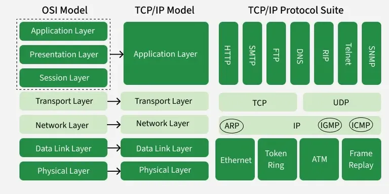
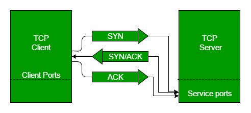
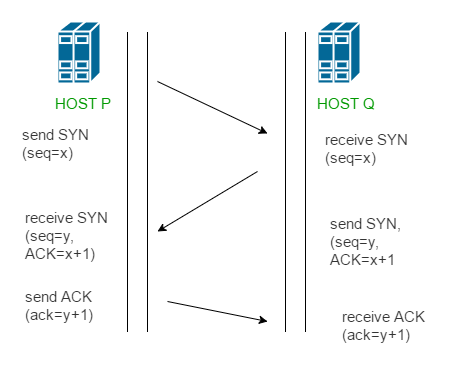
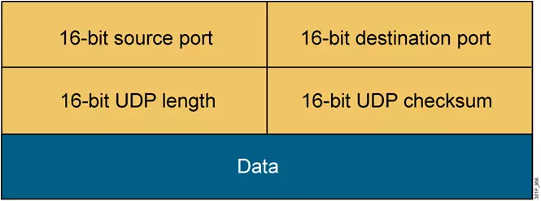
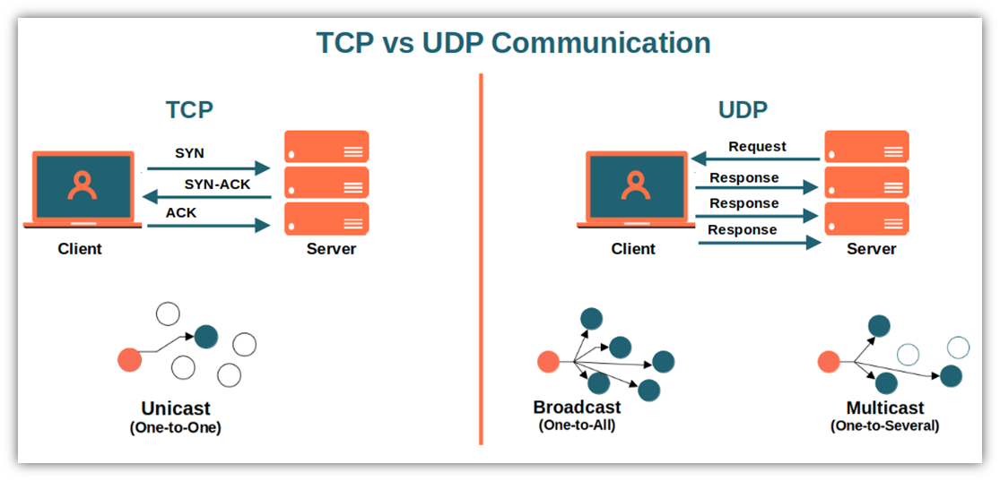

# Tìm hiểu về mô hình TCP/IP
## I Mô hình TCP/IP là gì
### 1. Khái niệm
- TCP/IP, hay còn được viết tắt là TCP TP, là một thuật ngữ chỉ Transmission Control Protocol/Internet Protocol, tức là một bộ giao thức chịu trách nhiệm về việc điều khiển và truyền nhận dữ liệu trong mạng lưới Internet. Đây là một hệ thống giao thức mạng mạnh mẽ, giúp kết nối và truyền thông tin một cách hiệu quả giữa các thiết bị khác nhau trên Internet.

### 2. TCP/IP hoạt động như thế nào ?
- TCP/IP hoạt động dựa trên việc chia nhỏ dữ liệu thành các gói (packets) và đảm bảo được truyền đến đúng đích theo trình tự và chính xác. Bộ giao thức TCP/IP sử dụng hai thành phần chính là TCP và IP để thực hiện quá trình truyền dữ liệu này. Vậy cách thức hoạt động của TCP/IP như thế nào, hãy cùng Viettel IDC theo dõi thông tin sau:
    + TCP chịu trách nhiệm chia nhỏ dữ liệu thành các phân đoạn (segments) và đảm bảo rằng các phân đoạn này được truyền tới đúng đích. Khi một dữ liệu lớn cần được gửi qua mạng, TCP sẽ phân chia các dữ liệu thành nhiều phân đoạn nhỏ để truyền tải dễ dàng hơn. Mỗi phân đoạn được đánh số thứ tự, cho phép quá trình sắp xếp lại dữ liệu tại điểm nhận được diễn ra chính xác. Ngoài ra, TCP cũng có cơ chế kiểm tra lỗi thông qua quá trình checksum, đảm bảo dữ liệu không bị hỏng trong quá trình truyền tải. Nếu phát hiện lỗi hoặc mất gói tin, TCP sẽ yêu cầu gửi lại các phân đoạn bị thiếu hoặc lỗi. Nhờ cơ chế này, TCP đảm bảo tính đáng tin cậy cho việc truyền tải dữ liệu, đặc biệt trong các kết nối cần sự ổn định như truyền file, email, hoặc tải trang web.
    + Trong khi TCP chịu trách nhiệm đảm bảo dữ liệu được chia nhỏ và kiểm tra lỗi thì IP có nhiệm vụ định tuyến các gói tin qua mạng. Mỗi thiết bị kết nối với mạng đều có một địa chỉ IP duy nhất, đóng vai trò như một "địa chỉ nhà" của thiết bị đó. Giao thức IP sử dụng địa chỉ IP này để xác định điểm đến của các gói tin và quyết định đường đi tốt nhất qua mạng. IP không đảm bảo rằng dữ liệu sẽ được gửi qua một con đường cố định. Mặc dù vậy, IP vẫn đảm bảo rằng các gói tin sẽ đến đúng đích thông qua cơ chế quản lý và định tuyến hiệu quả, giúp dữ liệu không bị thất lạc trong quá trình truyền qua mạng.

### 3. So sánh mô hình TCP/IP và OSI
- Trong thế giới mạng máy tính, hai mô hình nổi bật và quan trọng nhất là mô hình OSI (Open Systems Interconnection) và mô hình TCP/IP (Transmission Control Protocol/Internet Protocol). Mỗi mô hình đều cung cấp một khung tham chiếu giúp hiểu biết và thiết kế các hệ thống mạng máy tính, nhưng chúng có những đặc điểm và cách tiếp cận khác nhau.
- Bên cạnh OSI model được xem là mô hình lý thuyết hơn và có nhiều tầng chi tiết, mô hình TCP/IP được coi là phiên bản rút gọn của OSI, được áp dụng rộng rãi trong thực tế. Mô hình TCP/IP tập trung vào ứng dụng thực tế, các tầng được đánh giá là linh hoạt hơn, dễ dàng điều chỉnh để phù hợp với các yêu cầu cụ thể và mở rộng.

## II. Các lớp trong mô hình TCP/IP
### 1. Network Access Layer (Tầng truy cập mạng)
- **Chức năng**
Phân mảnh chức năng (Sub-layers), tầng này thường được chia thành hai lớp con quan trọng:
* LLC (Logical Link Control): Quản lý việc thiết lập các liên kết logic, kiểm soát lưu lượng (Flow Control) để không làm quá tải thiết bị nhận và thực hiện kiểm tra lỗi cơ bản (Error Control).
* MAC (Medium Access Control): Chịu trách nhiệm đóng gói dữ liệu vào các Ethernet Frames và điều khiển việc truy cập vào môi trường truyền dẫn vật lý.

- **Các thành phần chính**
**Địa chỉ MAC (Physical Address)**
+ Mỗi thiết bị mạng có một địa chỉ MAC duy nhất gồm 6 byte (48 bit), được nhà sản xuất nhúng trực tiếp vào Card mạng (NIC). Tầng này sử dụng địa chỉ MAC để xác định chính xác thiết bị đích trong cùng một mạng cục bộ (LAN).

**Cơ chế truy cập môi trường (CSMA/CD)**
+ Máy tính sẽ "nghe" đường truyền trước khi gửi dữ liệu.
+ Nếu đường truyền trống, nó sẽ gửi tin.
+ Nếu xảy ra va chạm (hai máy cùng gửi một lúc), chúng sẽ dừng lại, đợi một khoảng thời gian ngẫu nhiên rồi mới thử lại.

**Đóng gói dữ liệu (Encapsulation)**
Tại đây, các gói IP từ tầng Mạng được bọc thêm:
+ Header: Chứa địa chỉ MAC nguồn và MAC đích.
+ Trailer: Chứa mã kiểm tra lỗi (FCS - Frame Check Sequence) để bên nhận xác định xem dữ liệu có bị hư hỏng trong quá trình truyền hay không.

**Chuyển đổi tín hiệu vật lý**
+ Đây là nơi dữ liệu số (0 và 1) biến thành các thực thể vật lý:
+ Cáp đồng (LAN/Ethernet): Truyền bằng xung điện.
+ Cáp quang: Truyền bằng xung ánh sáng.
+ Mạng không dây (Wi-Fi): Truyền bằng sóng vô tuyến.

### 2. Network Layer (Tầng mạng)
- **Chức năng**
Tầng này thực hiện ba nhiệm vụ cốt lõi để đảm bảo dữ liệu đi từ nguồn đến đích thông qua nhiều mạng khác nhau:
+ Địa chỉ hóa Logic (Logical Addressing): Mỗi thiết bị trong mạng được gán một địa chỉ IP duy nhất. Khác với địa chỉ MAC (địa chỉ vật lý cố định), địa chỉ IP là địa chỉ logic có thể thay đổi tùy vào mạng mà thiết bị kết nối.
+ Định tuyến (Routing): Đây là nhiệm vụ quan trọng nhất. Tầng mạng sử dụng các bộ định tuyến (Router) để chuyển tiếp gói tin từ mạng này sang mạng khác cho đến khi tới đích.
+ Xác định đường đi (Path Determination): Tầng này tính toán và chọn ra con đường tối ưu nhất (ngắn nhất hoặc nhanh nhất) để gửi dữ liệu dựa trên các giao thức định tuyến như OSPF, BGP.
- **Giao thức chính**
+ IP là giao thức tiêu chuẩn duy nhất của tầng này. Có hai phiên bản phổ biến là IPv4 và IPv6.
Khi nhận dữ liệu từ tầng Giao vận (Transport Layer), tầng mạng sẽ thêm một "Header" chứa địa chỉ IP nguồn và IP đích vào dữ liệu để tạo thành một gói IP hoàn chỉnh.
+ Lưu ý quan trọng: Giao thức IP được coi là "unreliable" (không đáng tin cậy) vì nó không đảm bảo gói tin sẽ đến đích hay không bị lỗi. Việc kiểm soát lỗi và đảm bảo tính toàn vẹn của dữ liệu là trách nhiệm của tầng Giao vận phía trên.
- **Cách thức hoạt động của Router**
Router là thiết bị hoạt động chính tại Tầng 3.
+ Khi một gói tin đến Router, nó sẽ kiểm tra địa chỉ IP đích trong Header.
+ Nó đối chiếu địa chỉ này với "Bảng định tuyến" (Routing Table) bên trong để biết nên gửi gói tin qua cổng nào tiếp theo.
+ Trong quá trình này, địa chỉ IP đích luôn giữ nguyên, nhưng địa chỉ MAC (địa chỉ vật lý) sẽ thay đổi qua mỗi "chặng" (hop) để dữ liệu có thể di chuyển giữa các phần cứng khác nhau.
- **Giao thức hỗ trợ: ARP (Address Resolution Protocol)**
+ Mặc dù tầng mạng làm việc với IP, nhưng để gửi dữ liệu qua dây cáp thực tế, nó cần biết địa chỉ MAC của thiết bị.
+ ARP đóng vai trò là "thông dịch viên": nó lấy địa chỉ IP đích và trả về địa chỉ MAC tương ứng của thiết bị đó để tầng Liên kết dữ liệu phía dưới có thể đóng gói Frame và gửi đi.

### 3. Transport Layer (Tầng giao vận)
- **Đơn vị dữ liệu (PDU)**
Tại tầng này, thông điệp từ tầng Ứng dụng sẽ được chia nhỏ thành các đơn vị dữ liệu nhỏ hơn:
+ Nếu sử dụng giao thức TCP, đơn vị này gọi là Segment (Phân đoạn).
+ Nếu sử dụng giao thức UDP, đơn vị này gọi là Datagram.

- **Hai giao thức cốt lõi: TCP vs. UDP**
Tầng giao vận hoạt động chủ yếu dựa trên hai giao thức với tính chất trái ngược nhau:
**TCP (Transmission Control Protocol)**: Tin cậy, hướng kết nối (connection-oriented).
+ Cơ chế: Thiết lập kết nối thông qua "bắt tay 3 bước" (Three-way handshake) trước khi truyền dữ liệu. Nó đảm bảo dữ liệu đến đích không lỗi, đúng thứ tự và có phản hồi (Acknowledgement) cho người gửi.
+ Ứng dụng: Web (HTTP), Email (SMTP), chuyển file (FTP).

**UDP (User Datagram Protocol)**: Tốc độ cao, không hướng kết nối (connectionless).
+ Cơ chế: Gửi dữ liệu đi mà không cần kiểm tra bên nhận đã sẵn sàng chưa hay dữ liệu có đến đích hay không. Không có cơ chế sửa lỗi hay sắp xếp lại thứ tự.
+ Ứng dụng: Livestream, Video Call, Game online, DNS.

- **Các chức năng quản lý thông minh của TCP**
+ Đánh số thứ tự (Sequencing): Mỗi Segment được gán một số thứ tự. Bên nhận sẽ dùng số này để ghép lại thành thông điệp gốc hoàn chỉnh, ngay cả khi các gói tin đến không đúng trình tự.
+ Kiểm soát lỗi (Error Control): Sử dụng trường Checksum. Nếu bên nhận tính toán lại Checksum và thấy sai lệch, nó sẽ hủy gói tin và không gửi phản hồi, buộc bên gửi phải truyền lại sau một khoảng thời gian.
+ Kiểm soát lưu lượng (Flow Control/Congestion Throttling): Đảm bảo bên gửi không truyền quá nhanh khiến bên nhận bị "ngập" dữ liệu. TCP sẽ tự động điều chỉnh tốc độ truyền dựa trên khả năng xử lý của bên nhận và tình trạng tắc nghẽn của mạng.

- **Cổng dịch vụ (Port Numbers)**
Một chức năng cực kỳ quan trọng khác là xác định ứng dụng đích thông qua Số cổng (Port).
+ Địa chỉ IP giúp tìm thấy máy tính, nhưng số cổng giúp tìm thấy ứng dụng cụ thể trên máy tính đó (ví dụ: Port 80 cho Web, Port 25 cho Email). Tầng giao vận sẽ thêm thông tin cổng nguồn và cổng đích vào tiêu đề dữ liệu.
### 4. Application Layer (Tầng ứng dụng)
- **Vai trò và chức năng**
Tầng Ứng dụng không phải là bản thân các ứng dụng (như Chrome hay Outlook) mà là các giao thức chạy bên trong các ứng dụng đó để thực hiện việc trao đổi dữ liệu qua mạng.
+ _Giao diện dịch vụ mạng_: Cung cấp các phương thức tiêu chuẩn để ứng dụng truy cập vào các tài nguyên trên mạng Internet.
+ _Định dạng dữ liệu_: Đảm bảo dữ liệu từ ứng dụng được chuyển đổi sang định dạng mà các tầng bên dưới có thể hiểu và ngược lại (ví dụ: mã hóa văn bản, nén dữ liệu).
+ _Xác thực và cấp phép_: Xử lý việc đăng nhập, kiểm tra quyền truy cập của người dùng đối với các dịch vụ mạng.
- **Các giao thức tiêu biểu**
| Giao thức  | Tên đầy đủ                                              | Công dụng                                                                                                |
|------------|---------------------------------------------------------|----------------------------------------------------------------------------------------------------------|
| HTTP/HTTPS | Hypertext Transfer Protocol                             | Dùng để truyền tải các trang web (văn bản, hình ảnh, video) giữa Web Server và trình duyệt.              |
| DNS        | Domain Name System                                      | "Cuốn danh bạ" của Internet, giúp dịch tên miền (như google.com) thành địa chỉ IP mà máy tính hiểu được. |
| SMTP       | Simple Mail Transfer Protocol                           | Giao thức tiêu chuẩn dùng để gửi email từ máy khách đến máy chủ hoặc giữa các máy chủ email.             |
| POP3/IMAP  | Post Office Protocol / Internet Message Access Protocol | Dùng để nhận và quản lý email từ máy chủ về thiết bị cá nhân.                                            |
| FTP        | File Transfer Protocol                                  | Chuyên dùng để gửi và nhận các tệp tin có dung lượng lớn trên mạng.                                      |
| DHCP       | Dynamic Host Configuration Protocol                     | Tự động cấp phát địa chỉ IP cho các thiết bị khi chúng kết nối vào mạng.                                 |
- **Đơn vị dữ liệu (PDU)**
Tại tầng này, dữ liệu được gọi đơn giản là Application Message (Thông điệp ứng dụng). Khi người dùng thực hiện một hành động (ví dụ: nhấn Enter để truy cập web), tầng này sẽ tạo ra một thông điệp chứa các yêu cầu cụ thể (Request) và chuyển nó xuống tầng Giao vận (Transport Layer).
- **Cách thức hoạt động trong quá trình đóng gói**
+ Khi gửi dữ liệu, Tầng Ứng dụng là điểm khởi đầu của quá trình Encapsulation (Đóng gói).
+ Nó lấy dữ liệu thô từ người dùng.
+ Thêm các thông tin điều khiển cần thiết (Header của giao thức ứng dụng, ví dụ: HTTP Header).
+ Chuyển "món quà" này xuống tầng Giao vận để bọc thêm các lớp bảo vệ tiếp theo.
## III. So sánh mô hình OSi và TCP/IP

> Giống nhau
- Chia sẻ kiến trúc chung
    Cả 2 mô hình đều là mô hình logic và có kiến trúc tương tự vì cả 2 mô hình đều được xây dựng dựa trên các lớp
- Xác định tiêu chuẩn 
    Cả 2 lớp đều có các tiêu chuẩn xác định và chúng cũng cung cấp khuôn khổ được sử dụng để thực hiện các tiêu chuẩn và thiết bị
- Quy trình khắc phục sự cố được đơn giản hóa
    Cả 2 mô hình đã đơn giản hóa quá trình khắc phục sự cố bằng cách chia nhỏ chức năng phức tạp thành các thành phần đơn giản hơn
- Các tiêu chuẩn được xác định trước
    Các tiêu chuẩn và giao thức đã được xác định trước, những mô hình này không xác định lại chúng, chỉ tham khảo hoặc sử dụng lại chúng. Ví dụ, các tiêu chuẩn Ethernet đã được IEEE xác định trước khi phát triển các mô hình 
- Cả 2 đều có chức năng tương tự của các lớp Transport và Network
    Chức năng được thực hiện giữa lớp Presentation và lớp Network tương tự như chức năng được thực hiện ở lớp Transport
> Khác nhau
|         Nội dung         |                                              Mô hình OSI                                             |                               Mô hình TCP/IP                               |
|:------------------------:|:----------------------------------------------------------------------------------------------------:|:--------------------------------------------------------------------------:|
|  Độ tin cậy và phổ biến  | Nhiều người cho rằng đây là mô hình cũ, chỉ để tham khảo, số người sử dụng hạn chế hơn so với TCP/IP | Được chuẩn hóa, nhiều người tin cậy và sử dụng phổ biến trên toàn cầu      |
|   Phương pháp tiếp cận   | Tiếp cận theo chiều dọc                                                                              | Tiếp cận theo chiều ngang                                                  |
| Sự kết hợp giữa các tầng | Mỗi tầng khác nhau sẽ thực hiện một nhiệm vụ khác nhau, không có sự kết hợp giữa bất cứ tầng nào     | Trong tầng ứng dụng có tầng trình diễn và tầng phiên được kết hợp với nhau |
|         Thiết kế         | Phát triển mô hình trước sau đó sẽ phát triển giao thức                                              | Các giao thức được thiết kế trước sau đó phát triển mô hình                |
|       Số lớp (tầng)      | 7                                                                                                    | 4                                                                          |
|       Truyền thông       | Hỗ trợ cả kết nối định tuyến và không dây                                                            | Hỗ trợ truyền thông không kết nối từ tầng mạng                             |
|      Tính phụ thuộc      | Giao thức độc lập                                                                                    | Phụ thuộc vào giao thức                                                    |
## IV. Quy trình hoạt động của mô hình TCP/IP
1. Quá trình Đóng gói (Tại máy gửi)
Dữ liệu đi từ tầng cao nhất xuống tầng thấp nhất, mỗi tầng sẽ "bọc" thêm một lớp thông tin quản lý (Header).
- Tầng Ứng dụng (Application): Người dùng nhập dữ liệu (ví dụ: gõ một tin nhắn). Dữ liệu này được định dạng theo các giao thức như HTTP hay SMTP.
- Tầng Giao vận (Transport): Dữ liệu được chia nhỏ thành các Segment. Tại đây, TCP sẽ thêm Header chứa Số cổng (Port) để xác định ứng dụng nào đang gửi và nhận.
- Tầng Internet/Mạng (Network): Các Segment được đóng gói thành Packet. Tầng này thêm Header chứa Địa chỉ IP nguồn và đích để định hướng đường đi trên mạng Internet.
- Tầng Truy cập mạng (Network Access): Packet được đóng gói thành các Frame. Tầng này thêm địa chỉ vật lý (MAC Address) và mã kiểm tra lỗi. Cuối cùng, dữ liệu được chuyển thành các xung điện hoặc sóng vô tuyến để truyền đi qua dây cáp hoặc Wi-Fi.
2. Quá trình Truyền dẫn (Trên mạng lưới)
Khi gói tin rời khỏi máy tính của bạn:
- Nó đi qua các thiết bị trung gian như Switch và Router.
- Router sẽ chỉ mở lớp vỏ ở Tầng Mạng để đọc địa chỉ IP đích.
- Dựa vào bảng định tuyến, Router sẽ quyết định gửi gói tin đi theo con đường nào nhanh nhất để tới đích.
3. Quá trình Mở gói (Tại máy nhận)
Khi dữ liệu đến máy nhận, quy trình diễn ra ngược lại hoàn toàn. Máy tính sẽ "bóc" từng lớp Header từ dưới lên trên.
- Tầng Truy cập mạng: Kiểm tra địa chỉ MAC xem có đúng là gửi cho mình không và kiểm tra lỗi vật lý. Nếu ổn, nó bóc lớp vỏ Frame và chuyển lên trên.
- Tầng Internet: Kiểm tra địa chỉ IP. Sau đó bóc lớp vỏ Packet và chuyển lên trên.
- Tầng Giao vận: Kiểm tra số cổng để biết dữ liệu này thuộc về ứng dụng nào (Web, Email hay Chat). Nếu dùng TCP, nó sẽ kiểm tra xem các mảnh dữ liệu có đầy đủ và đúng thứ tự không. Sau đó ghép lại và chuyển lên.
- Tầng Ứng dụng: Nhận dữ liệu hoàn chỉnh và hiển thị cho người dùng trên giao diện phần mềm.
## V. Tìm hiểu về giao thức TCP/UDP và so sánh.
### 1. TCP (Transmission Control Protocol)
- **Khái niệm**: Transmission Control Protocol (TCP) là giao thức tiêu chuẩn trên Internet đảm bảo trao đổi thành công các gói dữ liệu giữa các thiết bị qua mạng. TCP là giao thức truyền tải cơ bản cho nhiều loại ứng dụng, bao gồm máy chủ web và trang web, ứng dụng email, FTP và các ứng dụng ngang hàng.

- **Nhiệm vụ**
**Thiết lập kết nối**
Giao thức TCP sử dụng một quá trình gọi là "three-way handshake" để thiết lập kết nối giữa hai máy tính. Quá trình này đảm bảo rằng cả hai máy tính đều đã sẵn sàng để truyền dữ liệu và đã thiết lập các thông số cần thiết để quản lý kết nối.

**Phân mảnh và gói tin hóa**
TCP phân mảnh dữ liệu thành các gói tin nhỏ hơn để truyền đi trên mạng. Mỗi gói tin chứa một phần của dữ liệu gốc và được đánh số thứ tự để đảm bảo thứ tự chính xác khi đến được máy tính đích.

**Kiểm soát luồng dữ liệu**
Chương trình TCP sử dụng cơ chế cửa sổ trượt để kiểm soát việc truyền dữ liệu giữa hai máy tính. Tiện ích cho phép người gửi và người nhận điều chỉnh số lượng gói tin được truyền và nhận trong mỗi khoảng thời gian nhất định. Điều này giúp đảm bảo rằng mạng không bị quá tải và dữ liệu không bị mất.

**Bảo đảm độ tin cậy**
TCP sử dụng các cơ chế kiểm tra lỗi, xác nhận và tạo lại gói tin để đảm bảo việc truyền dữ liệu một cách tin cậy. Nếu một gói tin bị mất hoặc hỏng trong quá trình truyền, TCP sẽ yêu cầu người gửi gửi lại gói tin đó để đảm bảo tính toàn vẹn của dữ liệu.

**Đóng kết nối nhanh**
Khi quá trình truyền dữ liệu hoàn tất, TCP sẽ sử dụng một quy trình gọi là "four-way handshake" để đóng kết nối giữa hai máy tính. Quá trình này đảm bảo rằng cả hai máy tính đều được thông báo về việc kết nối đã được đóng và giải phóng tài nguyên liên quan.

- **Ứng dụng**
**Truyền tệp và tải tệp tin**
+ TCP được sử dụng để truyền dữ liệu tệp và tải tệp tin từ xa. Ví dụ, khi bạn tải xuống một tệp từ một máy chủ web, phiên tải tệp sử dụng giao thức TCP để đảm bảo rằng tất cả các phần của tệp được truyền đúng và có thể thiết lập lại nếu cần.
+ Truyền thông qua mạng TCP được sử dụng trong việc truyền thông và giao tiếp giữa các thiết bị trong mạng. Ví dụ, khi bạn duyệt web, gửi email, truyền tệp qua mạng hoặc sử dụng các ứng dụng truyền thông khác. TCP đảm bảo rằng các gói tin dữ liệu được truyền đi và nhận về một cách tin cậy và có thứ tự.
+ TCP cung cấp cơ chế để thiết lập kết nối an toàn và tin cậy giữa các máy tính từ xa và điều khiển từ xa các thiết bị và máy tính từ xa. Ví dụ, giao diện điều khiển từ xa và máy chủ thông qua giao thức TCP để điều khiển và quản lý các thiết bị từ xa.

**Giao thức truyền thông phạm vi rộng (WAN)**
TCP được sử dụng để truyền thông qua các mạng phạm vi rộng, như Internet. Với việc đảm bảo tính tin cậy và kiểm soát luồng dữ liệu, TCP cho phép truyền dữ liệu khắp thế giới qua các mạng WAN.

**Truyền thông tin trong ứng dụng client-server**
Trong mô hình client-server, giao thức TCP được sử dụng để thiết lập và duy trì kết nối giữa client và server. Ví dụ, ứng dụng email, trò chuyện trực tuyến, truyền tệp qua FTP (File Transfer Protocol) và nhiều ứng dụng khác sử dụng TCP để truyền thông tin giữa client và server.
- **Cấu trúc gói tin TCP**

|           Tên trường           |                                                    Chức năng                                                    |
|:------------------------------:|:---------------------------------------------------------------------------------------------------------------:|
| Source Port (16 bit)           | Số cổng của thiết bị/ứng dụng gửi dữ liệu.                                                                      |
| Destination Port (16 bit)      | Số cổng của thiết bị/ứng dụng nhận dữ liệu.                                                                     |
| Sequence Number (32 bit)       | Đánh số thứ tự gói tin; dùng để tính toán số byte đã truyền và giúp máy nhận sắp xếp lại dữ liệu đúng trình tự. |
| Acknowledgment Number (32 bit) | Xác nhận đã nhận được gói tin nào và thông báo số thứ tự (byte) tiếp theo mà máy nhận đang mong đợi.            |
| DO - Data Offset (4 bit)       | Độ dài của toàn bộ TCP Header tính theo đơn vị Word (1 Word = 4 byte).                                          |
| RSV - Reserved (4 bit)         | Các bit dự phòng, hiện tại luôn được thiết lập bằng 0.                                                          |
| Flags (9 bit)                  | Các bit điều khiển luồng và kết nối (bao gồm: URG, ACK, PSH, RST, SYN, FIN).                                    |
| Windows (16 bit)               | Cơ chế kiểm soát lưu lượng; cho biết số lượng byte mà thiết bị sẵn sàng tiếp nhận thêm.                         |
| Checksum (16 bit)              | Dùng để kiểm tra lỗi cho toàn bộ TCP Segment nhằm đảm bảo dữ liệu không bị hỏng khi truyền.                     |
| Urgent Pointer (16 bit)        | Con trỏ vùng dữ liệu khẩn; chỉ có hiệu lực khi cờ URG được thiết lập để ưu tiên xử lý dữ liệu.                  |
| Options (Tối đa 32 bit)        | Các tùy chọn mở rộng giúp thêm vào TCP các tính năng bổ sung khác.                                              |
- **Three-Way Handsake (Bắt tay ba bước)**

Bắt tay 3 bước (TCP 3-way handshake) là quy trình thiết lập kết nối tin cậy giữa máy khách (Client) và máy chủ (Server) trước khi truyền dữ liệu, bao gồm: SYN (khởi tạo), SYN-ACK (xác nhận-đồng bộ), và ACK (xác nhận cuối cùng). Quá trình này đảm bảo cả hai bên đã sẵn sàng truyền tin.

_Bước 1_: SYN (Synchronize - Đồng bộ hóa)
Ở bước khởi đầu, Host P (Client) muốn kết nối với Host Q (Server).
- Hành động: Host P gửi một gói tin có cờ SYN được bật lên.
- Ý nghĩa: Nó thông báo cho Host Q rằng: "Tôi muốn thiết lập kết nối và tôi sẽ bắt đầu đánh số thứ tự dữ liệu từ số x" (trong hình là seq=x).
- Trạng thái: Host P chuyển sang trạng thái chờ phản hồi.

_Bước 2_: SYN + ACK (Acknowledge - Xác nhận)
Sau khi nhận được yêu cầu, Host Q trả lời để xác nhận.
- Hành động: Host Q gửi lại một gói tin kết hợp cả hai cờ SYN và ACK.
- Thông số kỹ thuật:
    + ACK = x+1: Host Q xác nhận đã nhận được gói x và mong đợi gói tiếp theo từ Host P sẽ là x+1.
    + seq = y: Host Q cũng gửi số thứ tự của riêng mình, bắt đầu từ một số y nào đó.
- Ý nghĩa: "Tôi đã nhận được yêu cầu của bạn (ACK). Tôi đồng ý kết nối và tôi sẽ bắt đầu đánh số thứ tự của mình từ y (SYN)".

_Bước 3_: ACK (Xác nhận cuối cùng)
Cuối cùng, Host P gửi một gói tin xác nhận lại một lần nữa để hoàn tất quá trình.
- Hành động: Host P gửi gói tin có cờ ACK.
- Thông số kỹ thuật:
    + ack = y+1: Host P xác nhận đã nhận được gói y từ Host Q và mong đợi gói tiếp theo là y+1.
- Ý nghĩa: "Tôi đã nhận được xác nhận từ bạn. Bây giờ cả hai chúng ta đã sẵn sàng truyền dữ liệu!"

### 2. UDP (User Datagram Protocol)
- Ngược lại với giao thức TCP thì UDP là giao thức truyền tải hướng không kết nối (connectionless). Nó sẽ không thực hiện thao tác xây dựng kết nối trước khi truyền dữ liệu mà thực hiện truyền ngay lập tức khi có dữ liệu cần truyền (kiểu truyền best effort) => truyền tải rất nhanh cho dữ liệu của lớp ứng dụng.

- **Đặc điểm**
- Không đảm bảo tính tin cậy khi truyền dữ liệu và không có cơ chế phục hồi dữ liệu ( nó không quan tâm gói tin có đến đích hay không, không biết gói tin có bị mất mát trên đường đi hay không) => dễ bị lỗi.
- Không thực hiện các biện pháp đánh số thứ tự cho các đơn vị dữ liệu được truyền…
- Nhanh và hiệu quả hơn đối với các dữ liệu có kích thước nhỏ và yêu cầu khắt khe về thời gian.
- Bản chất không trạng thái nên UDP hữu dụng đối với việc trả lời các truy vấn nhỏ với số lượng lớn người yêu cầu.

- **Ứng dụng**
+ Phương pháp UDP phần lớn được sử dụng bởi các ứng dụng nhạy cảm với thời gian cũng như những máy chủ trả lời các truy vấn nhỏ từ cơ sở khách hàng lớn hơn.
+ UDP tương thích với các chương trình phát gói để gửi trên toàn mạng và gửi đa hướng.
+ UDP cũng được sử dụng trong Domain Name System, Voice over IP và các game trực tuyến.

- **Cấu trúc gói tin UDP**

| Trường thông tin (Field) |  Độ dài  |                                            Mô tả chi tiết chức năng                                           |
|:------------------------:|:--------:|:-------------------------------------------------------------------------------------------------------------:|
| Source Port              | 16 bit   | Định danh cổng của thiết bị gửi; giúp xác định session của ứng dụng đang chạy.                                |
| Destination Port         | 16 bit   | Định danh cổng của thiết bị nhận; được coi là địa chỉ của tầng Transport để chuyển dữ liệu đến đúng ứng dụng. |
| UDP Length               | 16 bit   | Cho biết tổng chiều dài của toàn bộ UDP datagram (bao gồm Header + Data), giá trị từ 0 đến 65.535 byte.       |
| UDP Checksum             | 16 bit   | Sử dụng thuật toán mã vòng CRC để kiểm tra lỗi cho toàn bộ datagram (kiểm tra ở mức độ hạn chế).              |
| Data                     | Biến đổi | Chứa dữ liệu thực tế từ tầng ứng dụng được đóng gói vào trong datagram.                                       |

### 3. So sánh TCP và UDP
**Giống nhau**: đều là các giao thức mạng TCP/IP, có chức năng kết nối các máy lại với nhau và có thể gửi dữ liệu cho nhau….

**Khác nhau**:
|       Đặc điểm      |              TCP (Transmission Control Protocol)             |              UDP (User Datagram Protocol)             |
|:-------------------:|:------------------------------------------------------------:|:-----------------------------------------------------:|
| Tính chất           | Hướng kết nối (Connection-oriented).                         | Không hướng kết nối (Connectionless).                 |
| Độ tin cậy          | Rất cao: Đảm bảo dữ liệu đến đích, đúng thứ tự và không lỗi. | Thấp: Không đảm bảo dữ liệu đến đích hay đúng thứ tự. |
| Tốc độ              | Chậm hơn (do phải bắt tay và kiểm soát lỗi).                 | Rất nhanh (truyền ngay lập tức không chờ đợi).        |
| Quá trình bắt đầu   | Phải thực hiện Bắt tay 3 bước.                               | Không cần bắt tay, gửi dữ liệu ngay.                  |
| Kiểm soát lưu lượng | Có cơ chế Windows để điều chỉnh tốc độ truyền.               | Không có cơ chế kiểm soát lưu lượng.                  |
| Kích thước Header   | Lớn (tối thiểu 20 byte).                                     | Nhỏ (cố định 8 byte).                                 |
| Đơn vị dữ liệu      | Segment (Phân đoạn).                                         | Datagram.                                             |

