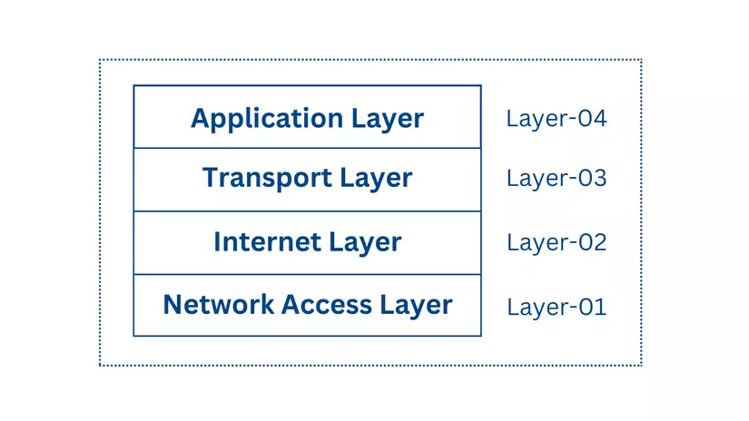
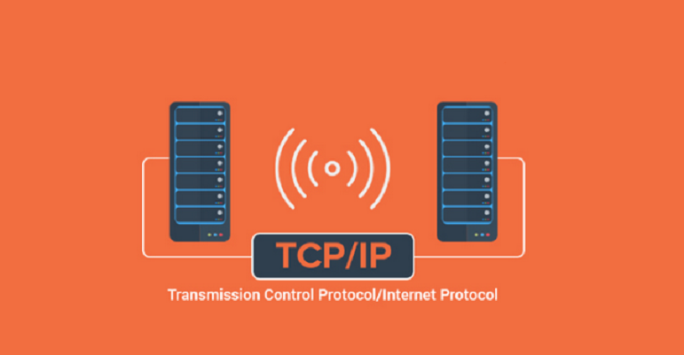

# Tìm hiểu về mô hình TCP/IP
## I Mô hình TCP/IP là gì
### 1. Khái niệm
- TCP/IP, hay còn được viết tắt là TCP TP, là một thuật ngữ chỉ Transmission Control Protocol/Internet Protocol, tức là một bộ giao thức chịu trách nhiệm về việc điều khiển và truyền nhận dữ liệu trong mạng lưới Internet. Đây là một hệ thống giao thức mạng mạnh mẽ, giúp kết nối và truyền thông tin một cách hiệu quả giữa các thiết bị khác nhau trên Internet.

### 2. TCP/IP hoạt động như thế nào ?
- TCP/IP hoạt động dựa trên việc chia nhỏ dữ liệu thành các gói (packets) và đảm bảo được truyền đến đúng đích theo trình tự và chính xác. Bộ giao thức TCP/IP sử dụng hai thành phần chính là TCP và IP để thực hiện quá trình truyền dữ liệu này. Vậy cách thức hoạt động của TCP/IP như thế nào, hãy cùng Viettel IDC theo dõi thông tin sau:
    + TCP chịu trách nhiệm chia nhỏ dữ liệu thành các phân đoạn (segments) và đảm bảo rằng các phân đoạn này được truyền tới đúng đích. Khi một dữ liệu lớn cần được gửi qua mạng, TCP sẽ phân chia các dữ liệu thành nhiều phân đoạn nhỏ để truyền tải dễ dàng hơn. Mỗi phân đoạn được đánh số thứ tự, cho phép quá trình sắp xếp lại dữ liệu tại điểm nhận được diễn ra chính xác. Ngoài ra, TCP cũng có cơ chế kiểm tra lỗi thông qua quá trình checksum, đảm bảo dữ liệu không bị hỏng trong quá trình truyền tải. Nếu phát hiện lỗi hoặc mất gói tin, TCP sẽ yêu cầu gửi lại các phân đoạn bị thiếu hoặc lỗi. Nhờ cơ chế này, TCP đảm bảo tính đáng tin cậy cho việc truyền tải dữ liệu, đặc biệt trong các kết nối cần sự ổn định như truyền file, email, hoặc tải trang web.
    + Trong khi TCP chịu trách nhiệm đảm bảo dữ liệu được chia nhỏ và kiểm tra lỗi thì IP có nhiệm vụ định tuyến các gói tin qua mạng. Mỗi thiết bị kết nối với mạng đều có một địa chỉ IP duy nhất, đóng vai trò như một "địa chỉ nhà" của thiết bị đó. Giao thức IP sử dụng địa chỉ IP này để xác định điểm đến của các gói tin và quyết định đường đi tốt nhất qua mạng. IP không đảm bảo rằng dữ liệu sẽ được gửi qua một con đường cố định. Mặc dù vậy, IP vẫn đảm bảo rằng các gói tin sẽ đến đúng đích thông qua cơ chế quản lý và định tuyến hiệu quả, giúp dữ liệu không bị thất lạc trong quá trình truyền qua mạng.

### 3. So sánh mô hình TCP/IP và OSI
- Trong thế giới mạng máy tính, hai mô hình nổi bật và quan trọng nhất là mô hình OSI (Open Systems Interconnection) và mô hình TCP/IP (Transmission Control Protocol/Internet Protocol). Mỗi mô hình đều cung cấp một khung tham chiếu giúp hiểu biết và thiết kế các hệ thống mạng máy tính, nhưng chúng có những đặc điểm và cách tiếp cận khác nhau.
- Bên cạnh OSI model được xem là mô hình lý thuyết hơn và có nhiều tầng chi tiết, mô hình TCP/IP được coi là phiên bản rút gọn của OSI, được áp dụng rộng rãi trong thực tế. Mô hình TCP/IP tập trung vào ứng dụng thực tế, các tầng được đánh giá là linh hoạt hơn, dễ dàng điều chỉnh để phù hợp với các yêu cầu cụ thể và mở rộng.

## II. Các lớp trong mô hình TCP/IP
### 1. Network Access Layer (Tầng truy cập mạng)
- **Chức năng**
Phân mảnh chức năng (Sub-layers), tầng này thường được chia thành hai lớp con quan trọng:
* LLC (Logical Link Control): Quản lý việc thiết lập các liên kết logic, kiểm soát lưu lượng (Flow Control) để không làm quá tải thiết bị nhận và thực hiện kiểm tra lỗi cơ bản (Error Control).
* MAC (Medium Access Control): Chịu trách nhiệm đóng gói dữ liệu vào các Ethernet Frames và điều khiển việc truy cập vào môi trường truyền dẫn vật lý.

- **Các thành phần chính**
**Địa chỉ MAC (Physical Address)**
+ Mỗi thiết bị mạng có một địa chỉ MAC duy nhất gồm 6 byte (48 bit), được nhà sản xuất nhúng trực tiếp vào Card mạng (NIC). Tầng này sử dụng địa chỉ MAC để xác định chính xác thiết bị đích trong cùng một mạng cục bộ (LAN).

**Cơ chế truy cập môi trường (CSMA/CD)**
+ Máy tính sẽ "nghe" đường truyền trước khi gửi dữ liệu.
+ Nếu đường truyền trống, nó sẽ gửi tin.
+ Nếu xảy ra va chạm (hai máy cùng gửi một lúc), chúng sẽ dừng lại, đợi một khoảng thời gian ngẫu nhiên rồi mới thử lại.

**Đóng gói dữ liệu (Encapsulation)**
Tại đây, các gói IP từ tầng Mạng được bọc thêm:
+ Header: Chứa địa chỉ MAC nguồn và MAC đích.
+ Trailer: Chứa mã kiểm tra lỗi (FCS - Frame Check Sequence) để bên nhận xác định xem dữ liệu có bị hư hỏng trong quá trình truyền hay không.

**Chuyển đổi tín hiệu vật lý**
+ Đây là nơi dữ liệu số (0 và 1) biến thành các thực thể vật lý:
+ Cáp đồng (LAN/Ethernet): Truyền bằng xung điện.
+ Cáp quang: Truyền bằng xung ánh sáng.
+ Mạng không dây (Wi-Fi): Truyền bằng sóng vô tuyến.

### 2. Network Layer (Tầng mạng)
- **Chức năng**
Tầng này thực hiện ba nhiệm vụ cốt lõi để đảm bảo dữ liệu đi từ nguồn đến đích thông qua nhiều mạng khác nhau:
+ Địa chỉ hóa Logic (Logical Addressing): Mỗi thiết bị trong mạng được gán một địa chỉ IP duy nhất. Khác với địa chỉ MAC (địa chỉ vật lý cố định), địa chỉ IP là địa chỉ logic có thể thay đổi tùy vào mạng mà thiết bị kết nối.
+ Định tuyến (Routing): Đây là nhiệm vụ quan trọng nhất. Tầng mạng sử dụng các bộ định tuyến (Router) để chuyển tiếp gói tin từ mạng này sang mạng khác cho đến khi tới đích.
+ Xác định đường đi (Path Determination): Tầng này tính toán và chọn ra con đường tối ưu nhất (ngắn nhất hoặc nhanh nhất) để gửi dữ liệu dựa trên các giao thức định tuyến như OSPF, BGP.
- **Giao thức chính**
+ IP là giao thức tiêu chuẩn duy nhất của tầng này. Có hai phiên bản phổ biến là IPv4 và IPv6.
Khi nhận dữ liệu từ tầng Giao vận (Transport Layer), tầng mạng sẽ thêm một "Header" chứa địa chỉ IP nguồn và IP đích vào dữ liệu để tạo thành một gói IP hoàn chỉnh.
+ Lưu ý quan trọng: Giao thức IP được coi là "unreliable" (không đáng tin cậy) vì nó không đảm bảo gói tin sẽ đến đích hay không bị lỗi. Việc kiểm soát lỗi và đảm bảo tính toàn vẹn của dữ liệu là trách nhiệm của tầng Giao vận phía trên.
- **Cách thức hoạt động của Router**
Router là thiết bị hoạt động chính tại Tầng 3.
+ Khi một gói tin đến Router, nó sẽ kiểm tra địa chỉ IP đích trong Header.
+ Nó đối chiếu địa chỉ này với "Bảng định tuyến" (Routing Table) bên trong để biết nên gửi gói tin qua cổng nào tiếp theo.
+ Trong quá trình này, địa chỉ IP đích luôn giữ nguyên, nhưng địa chỉ MAC (địa chỉ vật lý) sẽ thay đổi qua mỗi "chặng" (hop) để dữ liệu có thể di chuyển giữa các phần cứng khác nhau.
- **Giao thức hỗ trợ: ARP (Address Resolution Protocol)**
+ Mặc dù tầng mạng làm việc với IP, nhưng để gửi dữ liệu qua dây cáp thực tế, nó cần biết địa chỉ MAC của thiết bị.
+ ARP đóng vai trò là "thông dịch viên": nó lấy địa chỉ IP đích và trả về địa chỉ MAC tương ứng của thiết bị đó để tầng Liên kết dữ liệu phía dưới có thể đóng gói Frame và gửi đi.

### 3. Transport Layer (Tầng giao vận)
- **Đơn vị dữ liệu (PDU)**
Tại tầng này, thông điệp từ tầng Ứng dụng sẽ được chia nhỏ thành các đơn vị dữ liệu nhỏ hơn:
+ Nếu sử dụng giao thức TCP, đơn vị này gọi là Segment (Phân đoạn).
+ Nếu sử dụng giao thức UDP, đơn vị này gọi là Datagram.

- **Hai giao thức cốt lõi: TCP vs. UDP**
Tầng giao vận hoạt động chủ yếu dựa trên hai giao thức với tính chất trái ngược nhau:
**TCP (Transmission Control Protocol)**: Tin cậy, hướng kết nối (connection-oriented).
+ Cơ chế: Thiết lập kết nối thông qua "bắt tay 3 bước" (Three-way handshake) trước khi truyền dữ liệu. Nó đảm bảo dữ liệu đến đích không lỗi, đúng thứ tự và có phản hồi (Acknowledgement) cho người gửi.
+ Ứng dụng: Web (HTTP), Email (SMTP), chuyển file (FTP).

**UDP (User Datagram Protocol)**: Tốc độ cao, không hướng kết nối (connectionless).
+ Cơ chế: Gửi dữ liệu đi mà không cần kiểm tra bên nhận đã sẵn sàng chưa hay dữ liệu có đến đích hay không. Không có cơ chế sửa lỗi hay sắp xếp lại thứ tự.
+ Ứng dụng: Livestream, Video Call, Game online, DNS.

- **Các chức năng quản lý thông minh của TCP**
+ Đánh số thứ tự (Sequencing): Mỗi Segment được gán một số thứ tự. Bên nhận sẽ dùng số này để ghép lại thành thông điệp gốc hoàn chỉnh, ngay cả khi các gói tin đến không đúng trình tự.
+ Kiểm soát lỗi (Error Control): Sử dụng trường Checksum. Nếu bên nhận tính toán lại Checksum và thấy sai lệch, nó sẽ hủy gói tin và không gửi phản hồi, buộc bên gửi phải truyền lại sau một khoảng thời gian.
+ Kiểm soát lưu lượng (Flow Control/Congestion Throttling): Đảm bảo bên gửi không truyền quá nhanh khiến bên nhận bị "ngập" dữ liệu. TCP sẽ tự động điều chỉnh tốc độ truyền dựa trên khả năng xử lý của bên nhận và tình trạng tắc nghẽn của mạng.

- **Cổng dịch vụ (Port Numbers)**
Một chức năng cực kỳ quan trọng khác là xác định ứng dụng đích thông qua Số cổng (Port).
+ Địa chỉ IP giúp tìm thấy máy tính, nhưng số cổng giúp tìm thấy ứng dụng cụ thể trên máy tính đó (ví dụ: Port 80 cho Web, Port 25 cho Email). Tầng giao vận sẽ thêm thông tin cổng nguồn và cổng đích vào tiêu đề dữ liệu.
### 4. Application Layer (Tầng ứng dụng)
