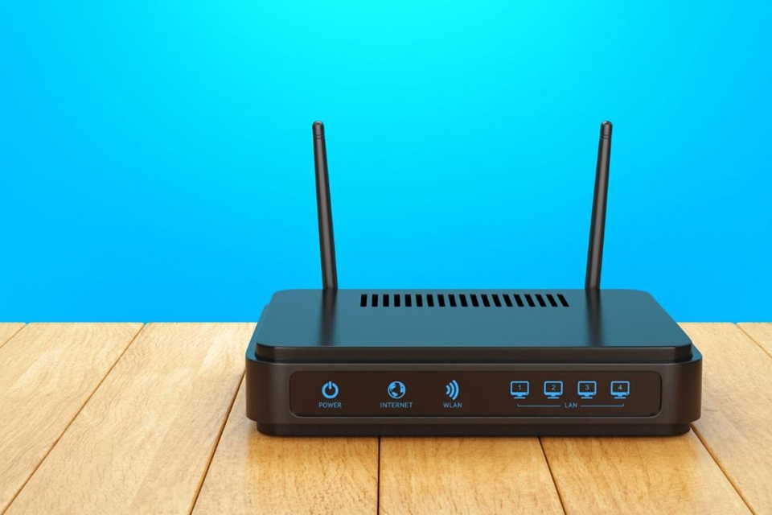
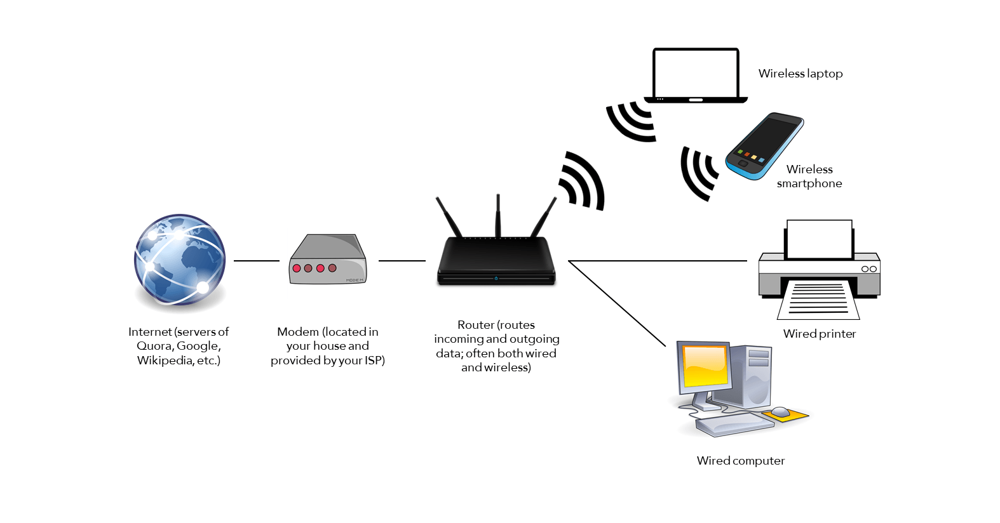
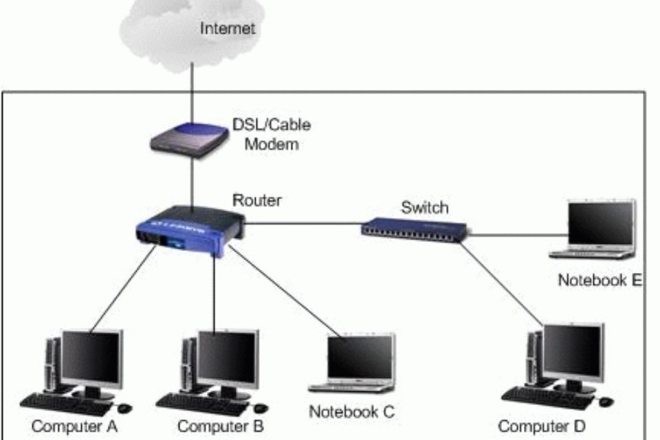
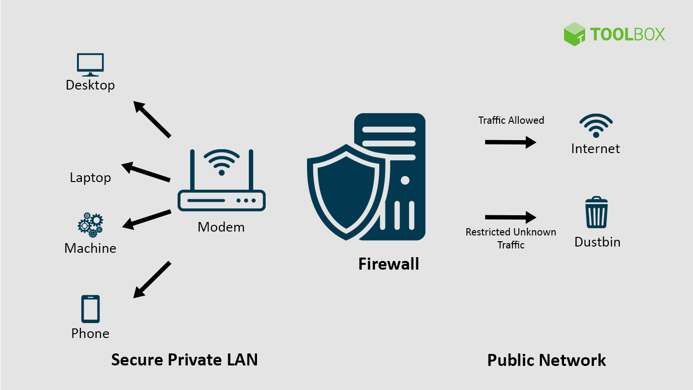
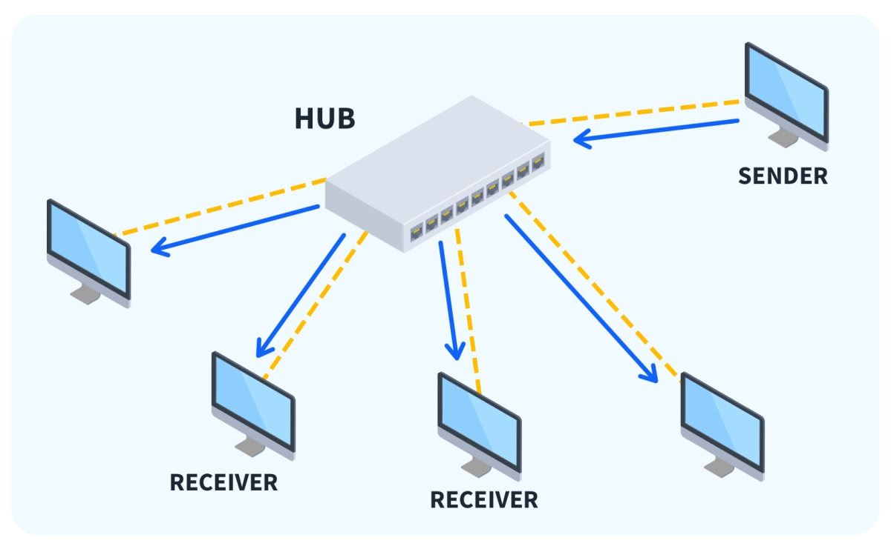
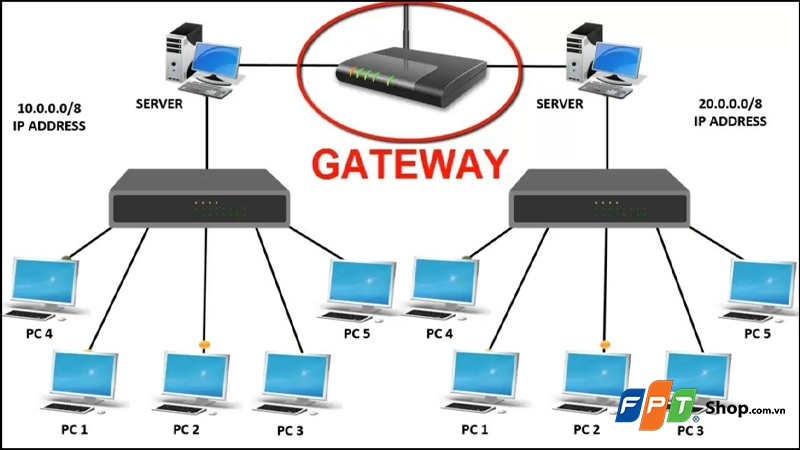
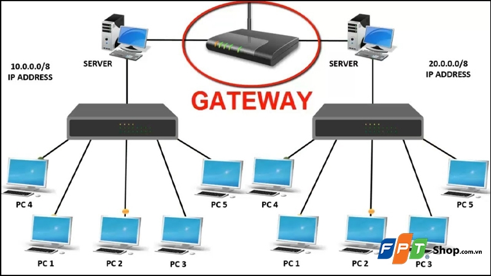
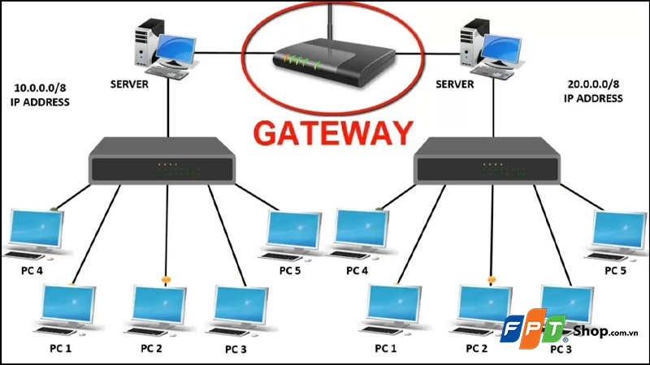
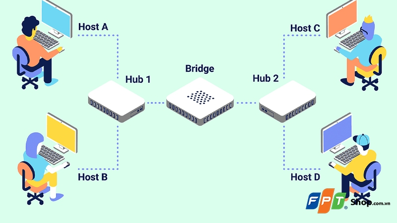

# TÌM HIỂU VỀ THIẾT BỊ MẠNG.
**Khái niệm**
Thiết bị mạng là các loại thiết bị được sử dụng để kết nối 1 hoặc nhiều mạng LAN (mạng máy tính nội bộ) thành 1 hệ thống mạng máy tính cơ bản. Chúng có khả năng kết nối được nhiều thiết bị đầu cuối như máy tính lại với nhau tùy thuộc vào số lượng cổng port trên thiết bị được sử dụng trong mạng.

Các thiết bị mạng chính được sử dụng rất nhiều hiện nay gồm: Repeater, Hub, Bridge, Switch, Router, Firewall và Gateway.
**Vai trò của thiết bị mạng**
Thiết bị mạng giúp hoạt động kết nối internet giữa các thiết bị đầu cuối được ổn định, không bị nhiễu sóng, chập chờn,... Phạm vi truyền tải của mạng rất rộng, có thể kết nối bất cứ khi nào. Ngoài ra, khi lắp đặt thiết bị mạng chúng ta còn có thể quản lý số lượng người kết nối internet và bản thân của thiết bị mạng có thể linh hoạt kết nối với nhiều thiết bị khác nhau, phục vụ cho nhu cầu cuộc sống của người dùng.

Thiết bị mạng đóng vai trò quan trọng không thể thiếu được khi cần lắp đặt một mạng LAN cho 1 văn phòng, công ty, tòa nhà, trường học, cơ quan, tổ chức,... Nhờ có thiết bị mạng mà các thiết bị đầu cuối như: máy tính, máy in, điện thoại, laptop, PC,... có thể kết nối Internet và trao đổi thông tin với nhau.

## MODEM (Bộ điều giải)

**Khái niệm:**
- Modem là kết hợp của hai từ Modulator và Demodulator có nghĩa là thiết bị mã hóa và giải mã các xung điện. Modem là thiết bị giao tiếp với mạng lưới của các nhà cung cấp dịch vụ Internet (ISP), chẳng hạn như FPT Telecom, Viettel,... thành tín hiệu kỹ thuật số, thông qua hệ thống cáp nối đồng trục, cáp quang hay đường dây điện thoại (DSL). Đây chính là cánh cổng để giúp bạn kết nối với Internet quốc tế.
- Nói một cách dễ hiểu hơn: modem biến đổi các dữ liệu số từ các thiết bị kết nối mạng như: Tivi, điện thoại, máy tính,... thành tín hiệu analog để truyền qua dây dẫn. Và ngược lại, modem sẽ dịch các tín hiệu analog thành các dữ liệu số để những thiết bị như máy tính có thể hiểu được.
**Chức năng**
- Modem đóng vai trò trung gian để giao tiếp với các mạng lưới của nhà cung cấp internet (ISP). Nó có chức năng chuyển hóa các gói dữ liệu từ nhà cung cấp dịch vụ mạng (ISP) thành các kết nối internet cho các router hoặc các thiết bị liên kết mạng khác qua địa chỉ IP.

## ROUTER (BỘ ĐỊNH TUYẾN)

**Khái niệm**
Router (bộ định tuyến) là thiết bị mạng có chức năng chuyển tiếp dữ liệu giữa các mạng máy tính. Nói một cách dễ hiểu: router thực hiện điều phối dữ liệu trên Internet, các dữ liệu này sẽ được gửi theo dạng gói từ router này sang router khác thông qua các mạng nhỏ được kết nối với nhau thành một hệ thống mạng liên kết. Gói dữ liệu sẽ được truyền tiếp qua các router cho đến khi chúng tới được điểm đích. Router là một thiết bị mạng thuộc lớp 3 của mô hình OSI (Network Layer).
**Chức năng**
Router có chức năng chính là định tuyến, truyền tải và phân phối dữ liệu giữa các mạng hoặc các thiết bị trong cùng một mạng nội bộ (LAN). Nói cách khác, router giúp dữ liệu di chuyển đúng hướng, đảm bảo mỗi gói tin đến được đích chính xác, đồng thời chia sẻ kết nối Internet cho nhiều thiết bị cùng sử dụng.
**Cấu tạo**
Cấu tạo của router thông thường gồm:
+ Cổng WAN: Trên tất cả các router đều có cổng này, nó cung cấp lớp mạng riêng và dải IP mặc định cho thiết bị (cổng này sẽ có màu xanh hoặc vàng để dễ phân biệt).
+ Cổng LAN: Mỗi router sẽ được trang bị từ 2 cổng LAN trở lên. Đây là cổng mà người dùng có thể kết nối trực tiếp từ router tới máy tính PC, tivi, laptop,... thông qua dây cáp mạng Ethernet. Tùy từng loại router mà tốc độ tối đa truyền tải dữ liệu của cổng LAN sẽ khác nhau.
+ Ăng-ten: Một router wifi sẽ có 2 loại anten là anten trong và anten ngoài. Số lượng râu anten càng nhiều thì tốc độ phát sóng wifi càng cao.
**Ưu điểm**
Kết nối mạng đa dạng: Router cho phép kết nối các mạng khác nhau, bao gồm mạng nội bộ (LAN), mạng diện rộng (WAN), và mạng Internet. Nó giúp các thiết bị trong mạng có thể giao tiếp và chia sẻ dữ liệu một cách hiệu quả.
+ Quản lý và phân phối băng thông: Router có khả năng quản lý và phân phối băng thông hiệu quả, giúp tối ưu hóa việc sử dụng mạng và đảm bảo hiệu suất tốt cho các ứng dụng và dịch vụ quan trọng.
+ Bảo mật mạng: Thiết bị này thường đi kèm với các tính năng bảo mật như tường lửa, mã hóa dữ liệu, và khả năng tạo các mạng riêng ảo giúp bảo vệ mạng khỏi các mối đe dọa từ bên ngoài.
+ Định tuyến động: Router có thể tự động cập nhật và điều chỉnh các đường dẫn mạng dựa trên trạng thái hiện tại của mạng, giúp tối ưu hóa việc truyền tải dữ liệu và giảm thiểu độ trễ.
+ Khả năng mở rộng: Cho phép mở rộng mạng một cách linh hoạt, giúp dễ dàng thêm mới các thiết bị hoặc phân đoạn mạng mà không cần thay đổi cấu trúc mạng hiện có.
**Nhược điểm**
+ Chi phí cao: Các router cao cấp, đặc biệt là các router dành cho doanh nghiệp, có giá thành khá cao. Chi phí đầu tư ban đầu và bảo trì có thể là một yếu tố hạn chế đối với các tổ chức hoặc cá nhân có ngân sách hạn chế.
+ Cấu hình phức tạp: Để tận dụng hết các tính năng của router, người dùng cần có kiến thức và kỹ năng kỹ thuật. Việc cấu hình sai có thể dẫn đến các vấn đề về mạng và bảo mật.
+ Độ trễ và hiệu suất: Mặc dù router có thể tối ưu hóa đường dẫn mạng, nhưng trong một số trường hợp, việc định tuyến thông qua nhiều thiết bị có thể gây ra độ trễ và giảm hiệu suất mạng.
+ Giới hạn số lượng kết nối: Các router có giới hạn về số lượng thiết bị có thể kết nối đồng thời. Với sự phát triển của Internet of Things, nhu cầu kết nối nhiều thiết bị có thể vượt quá khả năng của một số router.
+ Tính tương thích: Một số router có thể không tương thích với các thiết bị hoặc công nghệ mạng mới, đòi hỏi người dùng phải nâng cấp hoặc thay thế router để đảm bảo hiệu suất và bảo mật.

## SWITCH (L2, L3)

**Khái niệm**
Switch là bộ phận quan trọng trong hệ thống mạng. Bộ phận này được sử dụng để kết nối các đoạn mạng lại với nhau theo mô hình mạng sao. Ngoài ra, thiết bị này còn làm việc như một Bridge nhiều cổng. Switch chính là thiết bị trung tâm và các máy tính trong hệ thống đều được nối về đây. Từ đó tạo thành một hệ thống mạng hoàn chỉnh.
**Switch Layer 2**
Đây là loại Switch truyền thống và phổ biến nhất.
Hoạt động tại: Tầng 2 (Data Link Layer).
Chức năng: Chỉ quan tâm đến địa chỉ MAC. Nó tạo ra một bảng địa chỉ MAC (MAC Address Table) để ghi nhớ thiết bị nào đang cắm vào cổng nào.
Phạm vi: Nó chỉ có thể chuyển dữ liệu giữa các thiết bị trong cùng một mạng nội bộ (cùng VLAN hoặc cùng Subnet). Nó không thể hiểu được địa chỉ IP.
**Switch Layer 3**
Đây là một thiết bị lai, kết hợp sức mạnh của Switch và một phần khả năng của Router.
Hoạt động tại: Tầng 3 (Network Layer) – tầng của giao thức IP.
Chức năng: Ngoài việc chuyển mạch dựa trên địa chỉ MAC như Layer 2, nó còn có khả năng định tuyến (Routing) dựa trên địa chỉ IP.
Phạm vi: Nó có thể chuyển dữ liệu giữa các VLAN khác nhau hoặc các Subnet khác nhau mà không cần đến một Router rời.
**So sánh Switch Layer 2 và Switch Layer 3
|       Đặc điểm      |            Switch Layer 2           |                     Switch Layer 3                    |
|:-------------------:|:-----------------------------------:|:-----------------------------------------------------:|
| Tầng hoạt động      | Data Link (Lớp 2)                   | Network (Lớp 3)                                       |
| Cơ sở chuyển mạch   | Địa chỉ MAC                         | Địa chỉ MAC và Địa chỉ IP                             |
| Bảng tra cứu        | Bảng MAC                            | Bảng MAC và Bảng định tuyến (Routing Table)           |
| Khả năng định tuyến | Không có                            | Có (Inter-VLAN routing)                               |
| Phân đoạn mạng      | Chỉ hỗ trợ chia VLAN                | Chia VLAN và giao tiếp được giữa các VLAN             |
| Ứng dụng            | Dùng cho mạng nội bộ nhỏ, đơn giản. | Dùng cho mạng doanh nghiệp, cần chia nhiều phòng ban. |
| Chi phí             | Rẻ hơn                              | Đắt hơn nhiều                                         |

## FIREWALL (TƯỜNG LỬA)

**Khái niệm**
Firewall (tường lửa) là một hệ thống an ninh mạng, nó hoạt động dựa trên phần cứng hoặc phần mềm được tích hợp sẵn trong thiết bị, sử dụng các quy tắc để kiểm soát lưu lượng ra/vào trong hệ thống. Tường lửa hoạt động như một rào chắn, ngăn chặn các cuộc tấn công mạng từ bên ngoài vào hệ thống mạng gia đình.
**Vai trò**
Firewall giúp ngăn chặn các nguồn truy cập trái phép từ bên ngoài vào hệ thống mạng, không cho các nguồn truy cập từ bên ngoài đăng nhập vào khi chưa được phép.

## HUB (BỘ CHIA MẠNG)

**Khái niệm**
Hub (hay còn gọi là bộ chia mạng) được coi là trung tâm kết nối của các thiết bị trong hệ thống mạng dùng. Hub dùng để kết nối mạng LAN bởi chúng có khá nhiều cổng kết nối. Thông thường, mỗi Hub sẽ có từ 4 - 24 cổng nên việc kết nối trở nên dễ dàng hơn.
**Vai trò**
- Hub đóng vai trò trung tâm và mỗi thiết bị có chức năng riêng là kết nối giữa hub với các thiết bị mạng và dữ liệu xử lý được gọi chung là “khung”. Sau đó, trung tâm nhận được khung, và trung tâm ngay lập tức được khuếch đại và truyền đến các cổng. từ máy tính chủ.
- Khi thực hiện trung tâm, một khung được truyền và có thể được truyền tới các cổng. Đặc biệt, trung tâm không quan tâm đến việc khung được kết nối với một cổng duy nhất vì nó không phân biệt cổng. Bất kỳ ai làm nhiệm vụ đầu vào. Kết quả là, trung tâm đi đến tất cả các cổng và mang theo nhiều lưu lượng mạng, dẫn đến thời gian phản hồi mạng kém.
**Ưu điểm**
Ưu điểm của hub bao gồm: 
+ Hỗ trợ các loại phương tiện mạng khác nhau. 
+ Hub không tốn quá nhiều chi phí và phù hợp với mọi đối tượng sử dụng.
+ Sử dụng một trung tâm không ảnh hưởng đến hiệu suất của mạng.
+ Hub giúp mở rộng khoảng cách của mạng.
**Nhược điểm**
Bên cạnh những ưu điểm nổi trội, thiết bị hub cũng có những nhược điểm như sau:
+ Các thiết bị hub không thể chọn đường dẫn tốt nhất trên mạng. 
+ Không có cơ chế nào như phát hiện va chạm và giảm lưu lượng.
+ Hub không thể lọc thông tin vì thiết bị mạng này đang truyền các gói trên tất cả các phân đoạn được kết nối. 
+ Ngoài ra, hub cũng không có khả năng kết nối các kiến ​​trúc mạng khác nhau như vòng, mã thông báo, ethernet,...

## GATEWAY

**Khái niệm**
+ Gateway có thể là một phần cứng (như Router, Firewall) hoặc một phần mềm được cài đặt trên máy chủ. Điểm khác biệt lớn nhất giữa Gateway và các thiết bị khác là khả năng chuyển đổi giao thức. Nó cho phép một mạng chạy giao thức này (ví dụ: mạng nội bộ doanh nghiệp) có thể giao tiếp với một mạng chạy giao thức khác (ví dụ: Internet công cộng).
+ Trong cấu hình máy tính cá nhân thường thấy, thông số này được gọi là Default Gateway (Cổng mặc định).
**Chức năng**
+ Kết nối các mạng không đồng nhất: Gateway có khả năng chuyển đổi dữ liệu từ định dạng của mạng này sang mạng khác ở tầng Ứng dụng (Application Layer), giúp các hệ thống khác biệt hoàn toàn về kiến trúc vẫn có thể hiểu nhau.
+ Định tuyến dữ liệu (Routing): Khi bạn gửi một gói tin đến một địa chỉ nằm ngoài mạng cục bộ, Gateway sẽ kiểm tra địa chỉ IP đích và quyết định hướng đi tốt nhất để gói tin rời khỏi mạng nội bộ và đi vào mạng diện rộng.
+ Bảo mật và Kiểm soát (Firewall): Gateway thường tích hợp các tính năng tường lửa để lọc lưu lượng, ngăn chặn các truy cập trái phép từ bên ngoài vào mạng nội bộ.
+ Cung cấp địa chỉ IP (DHCP & NAT): Gateway (thường là Router tại nhà) có chức năng NAT (Network Address Translation), giúp chuyển đổi địa chỉ IP nội bộ của bạn thành một địa chỉ IP công cộng duy nhất để giao tiếp với Internet.

## REPEATER (BỘ LẶP)

- Repeater là một thiết bị khuếch đại tín hiệu đường truyền, trong mô hình OSI nó đứng vị trí thứ nhất. Repeater thường được sử dụng trong các tòa nhà lớn, văn phòng,... Nó giúp đẩy tín hiệu đi xa hơn, tốc độ truy cập dữ liệu của máy tính cũng không bị giảm đi khi cách xa nhau.
- Hiện nay, có 2 loại repeater là: Wifi Repeater và LAN Repeater. Wifi repeater phổ biến hơn LAN repeater nên tên gọi repeater thường sẽ ám chỉ luôn wifi repeater.
- Nguyên lý hoạt động của repeater khá đơn giản: khi repeater nhận tín hiệu đầu vào, nó sẽ đưa tín hiệu đó đến bộ khuếch đại tín hiệu. Sau đó, nó sẽ tiến hành cung cấp tín hiệu ở đầu ra.

## NETWORK CARD (NIC - Network Interface Card)

**Khái niệm**
Card mạng (network card), hay card giao tiếp mạng (Network Interface Card) là loại bảng mạch giúp máy tính có thể giao tiếp với nhau thông qua internet. Nhờ vào các cổng kết nối trong bo mạch chính của máy tính để bàn nên các máy tính có thể kết nối với nhau qua môi trường mạng. Việc kết nối này được gọi là LAN adapter.
**Chức năng**
Chức năng của card mạng giúp:
+ Truyền tải dữ liệu qua lại giữa các máy tính, đồng thời kiểm soát và thống kê thông tin dữ liệu tới máy tính (có nghĩa là: khi bạn muốn đưa dữ liệu lên mạng Internet hoặc các tìm kiếm các thông tin khác nhau, thì các dữ liệu đó sẽ được chuyển từ dạng byte và bit sang tín hiệu điện. Tín hiệu này sẽ đi qua dây cáp và truyền tới máy tính của bạn.)
+ Trên mỗi card mạng sẽ có một địa chỉ MAC. Địa chỉ này sẽ không trùng với bất cứ card mạng nào (địa chỉ này sẽ bao gồm 6 byte (48bit) trong đó 3 byte đầu là mã số của nhà sản xuất, 3 byte sau là seri của card mạng do nhà sản xuất đánh số). Chính vì vậy nên chúng có thể phân biệt và truyền dữ liệu trên môi trường internet một cách chính xác nhất.

## BRIDGE
**Khái niệm**
+ Bridge, hoặc còn được biết đến với tên gọi "cầu nối", là một thiết bị mạng có chức năng kết nối nhiều mạng LAN (mạng cục bộ) lại với nhau để tạo thành một mạng LAN lớn hơn. Việc này được gọi là quá trình kết nối mạng.
+ Cầu nối hoạt động ở tầng liên kết dữ liệu của mô hình OSI, thường được gọi là bộ chuyển mạch Layer 2. Chức năng của nó giống như việc xây dựng một liên kết để các thành phần khác nhau trở thành một phần của cùng một mạng. Sơ đồ minh họa một cầu nối hai mạng LAN như sau:

**Chức năng**
- Phân đoạn mạng (Segmentation): Bridge chia một mạng lớn thành các phân đoạn nhỏ hơn để giảm lưu lượng quảng bá (broadcast) không cần thiết.

- Lọc gói tin (Filtering): * Khi nhận được một Frame, Bridge sẽ kiểm tra địa chỉ MAC đích.
Nếu thiết bị gửi và nhận nằm trong cùng một phân đoạn, Bridge sẽ chặn không cho gói tin đi sang các phân đoạn khác, giúp giảm tắc nghẽn.

- Mở rộng khoảng cách mạng: Tương tự như Repeater, Bridge giúp kéo dài khoảng cách kết nối giữa các thiết bị mà không làm suy giảm tín hiệu.

- Kết nối các môi trường truyền dẫn khác nhau: Bridge có thể kết nối các đoạn mạng sử dụng các loại cáp khác nhau (ví dụ: nối một đoạn dùng cáp đồng với một đoạn dùng cáp quang).
## BỘ PHÁT WIFI (ACCESS POINT)
**Khái niệm**
Access Point là một thiết bị mạng có khả năng tạo ra WLAN, hay còn gọi là mạng không dây cục bộ. Access Point thường được dùng tại môi trường công sở, nhà hàng, tiệc cưới hay các tòa nhà lớn nhằm tạo ra không gian sử dụng mạng rộng rãi mà không làm suy giảm tốc độ của mạng.
**Chức năng**
- Chuyển đổi tín hiệu Có dây sang Không dây
Đây là chức năng cốt lõi nhất. AP nhận dữ liệu từ dây cáp mạng (Ethernet) và chuyển đổi chúng thành sóng vô tuyến (Wi-Fi) để các thiết bị như điện thoại, laptop có thể kết nối mà không cần cắm dây.
- Mở rộng phạm vi phủ sóng (Bridging & Repeating)
Trong các văn phòng lớn hoặc nhà tầng, tín hiệu Wi-Fi từ Router chính thường không thể bao phủ hết.
+ Mở rộng: Nhiều AP có thể được lắp đặt tại các vị trí khác nhau để tạo ra một vùng phủ sóng rộng lớn.
+ Roaming: Một hệ thống AP hiện đại cho phép bạn di chuyển từ phòng này sang phòng khác mà không bị ngắt kết nối (tự động chuyển vùng giữa các AP).
- Quản lý truy cập và Bảo mật
AP không chỉ phát sóng mà còn kiểm soát ai được phép vào mạng:
+ Mã hóa dữ liệu: Hỗ trợ các chuẩn bảo mật như WPA2, WPA3 để bảo vệ dữ liệu truyền qua không trung.
+ Tạo nhiều SSID: Một AP có thể phát nhiều tên Wi-Fi khác nhau (ví dụ: một mạng cho nhân viên và một mạng cho khách) để tách biệt lưu lượng và tăng tính bảo mật.
+ Lọc địa chỉ MAC: Cho phép hoặc chặn các thiết bị cụ thể dựa trên ID phần cứng của chúng.
- Điều phối lưu lượng (Load Balancing)
Trong môi trường có hàng trăm người dùng, các AP thông minh có khả năng tự động cân bằng tải. Nếu một AP đang quá đông người truy cập, nó sẽ điều phối các thiết bị mới sang một AP lân cận còn trống để đảm bảo tốc độ mạng không bị nghẽn.