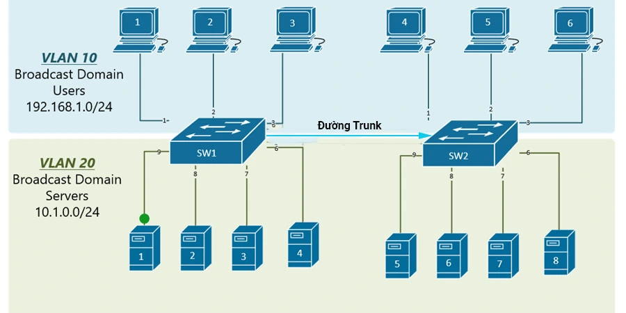
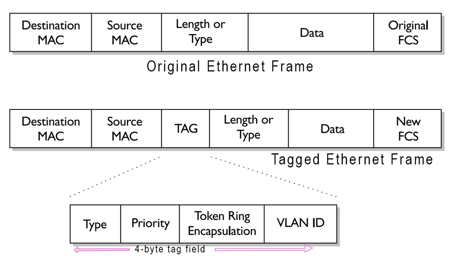

# TÌM HIỂU VỀ TRUNKING
## I. TRUNKING LÀ GÌ ?
**Khái niệm**
Đường Trunk hay Trunking là một kỹ thuật kết nối các thiết bị mạng với nhau để tạo thành một mạng lớn hơn, đặc biệt trong các mạng LAN (Local Area Network) hoặc các mạng VLAN (Virtual Local Area Network).

Đường trunk cho phép chuyển gói dữ liệu từ một VLAN này sang một VLAN khác trên cùng một đường truyền vật lý, điều này giúp tối ưu hóa việc sử dụng băng thông và giảm độ trễ trong mạng.

**Cách thức hoạt động**
Để phân biệt dữ liệu của VLAN này với VLAN khác khi chúng cùng chạy trên một sợi dây, Switch sử dụng một cơ chế gọi là VLAN Tagging.

+ Tiêu chuẩn IEEE 802.1Q: Đây là tiêu chuẩn phổ biến nhất hiện nay. Khi một khung dữ liệu (Frame) đi vào cổng Trunk, Switch sẽ chèn thêm một "nhãn" (Tag) chứa ID của VLAN vào bên trong Frame đó.
+ Tại đầu nhận: Switch nhận sẽ đọc nhãn này để biết gói tin thuộc VLAN nào, sau đó bóc nhãn ra và chuyển dữ liệu đến đúng đích.

**Các thành phần của Trunking**
+ Native VLAN: Là VLAN duy nhất mà dữ liệu đi qua đường Trunk không bị gắn thẻ. Theo mặc định trên thiết bị Cisco, đây thường là VLAN 1.
+ Allowed VLANs: Danh sách các VLAN cụ thể được phép đi qua đường Trunk. Bạn có thể cấu hình để chỉ cho phép một vài VLAN quan trọng đi qua nhằm tăng tính bảo mật.

## II. CHUẨN IEEE 802.1Q
### 1. KHÁI NIỆM
IEEE 802.1Q (thường được gọi tắt là Dot1q) là một tiêu chuẩn quốc tế quy định về việc gắn thẻ VLAN (VLAN Tagging) trên các khung dữ liệu Ethernet. Đây là giao thức quan trọng nhất để triển khai Trunking, cho phép nhiều VLAN cùng chạy trên một đường truyền vật lý duy nhất giữa các thiết bị mạng.

### 2. CÁCH HOẠT ĐỘNG
Khi một khung dữ liệu (Frame) đi vào cổng Trunk, Switch sẽ chèn một đoạn mã dài 4 byte vào giữa địa chỉ MAC nguồn và trường Type/Length của Frame gốc. Thẻ này bao gồm các thành phần:
- TPID (Tag Protocol Identifier): Dài 16 bit, thường có giá trị cố định là 0x8100 để báo hiệu đây là một Frame đã được gắn thẻ 802.1Q.
- TCI (Tag Control Information): Chứa các thông tin điều khiển quan trọng:
- PCP (Priority Code Point): 3 bit dùng để ưu tiên lưu lượng (QoS), giúp xác định gói tin nào quan trọng hơn (như Voice hay Video).
- DEI (Drop Eligible Indicator): 1 bit dùng để đánh dấu các gói tin có thể bị hủy bỏ nếu mạng bị tắc nghẽn.
- VLAN ID (VID): 12 bit quan trọng nhất, chứa mã số của VLAN (từ 1 đến 4094). Đây là cơ sở để Switch biết gói tin này thuộc về "nhà" nào.

### 3. CẤU TRÚC THẺ VLAN 802.1Q (4 BYTE)
|           Tên trường           | Độ dài | Giá trị/Phạm vi |                     Chức năng chính                    |
|:------------------------------:|:------:|:---------------:|:------------------------------------------------------:|
| TPID (Tag Protocol Identifier) | 16 bit | 0x8100          | Xác định đây là khung dữ liệu có gắn thẻ 802.1Q.       |
| PCP (Priority Code Point)      | 3 bit  | 0 - 7           | Quy định mức độ ưu tiên của gói tin (QoS).             |
| DEI (Drop Eligible Indicator)  | 1 bit  | 0 hoặc 1        | Đánh dấu gói tin có thể bị loại bỏ nếu mạng tắc nghẽn. |
| VID (VLAN Identifier)          | 12 bit | 1 - 4094        | ID của VLAN. Quyết định gói tin thuộc về mạng ảo nào.  |

## III. CHUẨN ISL (INTER SWITCH LINK)
### 1. KHÁI NIỆM
- ISL (Inter-Switch Link) là một giao thức độc quyền của Cisco (Cisco-proprietary) được sử dụng để duy trì thông tin VLAN khi lưu lượng di chuyển giữa các Switch hoặc giữa Switch và Router trên một đường truyền Trunk. Mặc dù hiện nay nó đã dần bị thay thế bởi tiêu chuẩn mở IEEE 802.1Q, ISL vẫn là một phần quan trọng trong lịch sử phát triển mạng của Cisco.
- Khác với 802.1Q sử dụng cơ chế "gắn thẻ" (tagging) vào bên trong khung dữ liệu, ISL sử dụng cơ chế bao bọc (Encapsulation). Nó bao bọc toàn bộ Ethernet Frame gốc bằng một Header và một Trailer mới. ISL hoạt động ở Lớp 2 (Data Link Layer) và hoàn toàn không thay đổi nội dung bên trong của Frame gốc.

### 2. CÁCH HOẠT ĐỘNG
Quy trình hoạt động của ISL diễn ra theo các bước sau:
- Tiếp nhận: Khi một Switch nhận được dữ liệu từ cổng Access và cần gửi qua đường Trunk cấu hình ISL, nó sẽ xác định VLAN ID của gói tin đó.
- Bao bọc (Encapsulation): Switch tạo ra một ISL Header (26 byte) gắn vào phía trước và một ISL CRC (4 byte) gắn vào phía sau Frame gốc. Toàn bộ Frame gốc được giữ nguyên vẹn bên trong "vỏ bọc" này.
- Truyền dẫn: Gói tin đã bao bọc được gửi qua đường Trunk.
- Xử lý tại đầu nhận: Switch nhận sẽ đọc thông tin VLAN ID trong ISL Header để biết gói tin thuộc về đâu, sau đó gỡ bỏ lớp vỏ ISL (Header và Trailer) để lấy lại Ethernet Frame ban đầu trước khi chuyển đến thiết bị đích.

### 3. CẤU TRÚC ISL HEADER
|      Thành phần     | Độ dài |                                                Chức năng chính                                                |
|:-------------------:|:------:|:-------------------------------------------------------------------------------------------------------------:|
| DA (Dest Address)   | 40 bit | Địa chỉ MAC Multicast đích đặc biệt (01-00-0C-00-00 hoặc 03-00-0C-00-00) để báo hiệu đây là gói ISL.          |
| TYPE                | 4 bit  | Xác định loại khung dữ liệu được bao bọc (Ethernet, Token Ring, FDDI, ATM).                                   |
| USER                | 4 bit  | Dùng để mở rộng hoặc thiết lập độ ưu tiên (thường để mặc định là 0000).                                       |
| SA (Source Address) | 48 bit | Địa chỉ MAC của cổng Switch gửi gói tin ISL.                                                                  |
| LEN (Length)        | 16 bit | Chứa độ dài của toàn bộ gói tin (tính bằng byte).                                                             |
| AAAA03 (SNAP)       | 24 bit | Một hằng số dùng để định dạng gói tin theo chuẩn SNAP.                                                        |
| HSA (High SA)       | 24 bit | Chứa 3 byte đầu tiên (OUI) của địa chỉ MAC nguồn.                                                             |
| VLAN (VLAN ID)      | 15 bit | Thành phần quan trọng nhất: Chứa mã định danh (ID) của VLAN để Switch nhận biết gói tin thuộc về mạng ảo nào. |
| BPDU                | 1 bit  | Đánh dấu nếu khung dữ liệu là một gói tin quản lý (như Spanning Tree BPDU hoặc CDP).                          |
| INDEX               | 16 bit | Chỉ số cổng vật lý của Switch gửi, dùng cho mục đích chẩn đoán lỗi.                                           |
| RES (Reserved)      | 16 bit | Trường dự phòng, thường dùng để chứa thêm thông tin khi bao bọc các loại khung không phải Ethernet.           |

## IV. CỔNG ACCESS VÀ CỔNG TRUNK
### 1. CỔNG ACCESS
Khái niệm: Là loại cổng được cấu hình để chỉ thuộc về một VLAN duy nhất.

Cách hoạt động: Khi một khung dữ liệu (Frame) đi ra khỏi Access Port để đến thiết bị đầu cuối, Switch sẽ bóc bỏ hoàn toàn nhãn VLAN (untagged). Thiết bị nhận sẽ nhận được một Frame Ethernet bình thường.

Đối tượng kết nối: Thường được dùng để kết nối với các thiết bị cuối như Máy tính (PC), Máy in, hoặc Server.
### 2. CỔNG TRUNK
Khái niệm: Là loại cổng cho phép truyền tải lưu lượng của nhiều VLAN khác nhau cùng lúc qua một sợi cáp vật lý duy nhất.

Cách hoạt động: Để phân biệt các VLAN trên cùng một đường truyền, Trunk Port sử dụng các giao thức gắn nhãn như IEEE 802.1Q hoặc ISL. Mỗi Frame khi đi qua đường Trunk sẽ được "dán nhãn" ID VLAN tương ứng (trừ Native VLAN trong chuẩn 802.1Q).

Đối tượng kết nối: Thường dùng để kết nối giữa Switch với Switch, hoặc giữa Switch với Router (mô hình Router-on-a-stick).
### 3. SO SÁNH CỔNG ACCESS VÀ CỔNG TRUNK
| Đặc điểm              | Access Port                                | Trunk Port                                                 |
|-----------------------|--------------------------------------------|------------------------------------------------------------|
| Số lượng VLAN         | Chỉ hỗ trợ 1 VLAN duy nhất.                | Hỗ trợ nhiều VLAN cùng lúc.                                |
| Gắn thẻ (Tagging)     | Không gắn thẻ (Untagged) khi gửi đi.       | Có gắn thẻ (Tagged) để định danh VLAN.                     |
| Thiết bị kết nối      | PC, Laptop, Máy in, Server.                | Switch, Router, Firewall.                                  |
| Mục đích sử dụng      | Kết nối thiết bị người dùng cuối vào mạng. | Kết nối các thiết bị hạ tầng mạng với nhau.                |
| Khái niệm Native VLAN | Không áp dụng.                             | Có áp dụng (VLAN duy nhất không gắn thẻ trên đường Trunk). |

## V. VTP, STP
### 1. VTP (VLAN TRUNKING PROTOCOL)
**Khái niệm**
VTP (Vlan Trunking Protocol) là giao thức hoạt động ở tầng liên kết dữ liệu trong mô hình OSI. VTP giúp cho việc cấu hình VLAN luôn đồng nhất khi thêm, xóa, sửa thông tin về VLAN trong hệ thống mạng.

**Chức năng chính**:
- Quản lý tập trung: Thay vì phải vào từng Switch để tạo VLAN, bạn chỉ cần cấu hình trên một Switch chính (Server), các Switch còn lại sẽ tự động cập nhật.
- Duy trì tính nhất quán: Đảm bảo tên và ID của các VLAN giống hệt nhau trên tất cả các thiết bị trong cùng một VTP Domain.

**Chế độ hoạt động**
Chế độ hoạt động (VTP Modes):
- VTP Server: Chế độ mặc định. Cho phép tạo, sửa, xóa VLAN. Thông tin này sẽ được quảng bá (advertise) tới các Switch khác.
- VTP Client: Không thể thay đổi cấu hình VLAN. Nó chỉ nhận và cập nhật thông tin từ Server.
- VTP Transparent: Switch ở chế độ này nhận gói tin VTP rồi chuyển tiếp đi nhưng không cập nhật vào cơ sở dữ liệu của chính nó. Bạn có thể tạo VLAN cục bộ trên Switch này mà không ảnh hưởng đến ai.
Lưu ý quan trọng: VTP sử dụng chỉ số Configuration Revision Number. Nếu bạn cắm một Switch cũ có số Revision cao hơn vào mạng, nó có thể ghi đè và xóa sạch các VLAN hiện có, gây mất mạng toàn hệ thống.

### 2. STP (SPANNING TREE PROTOCOL)
**Khái niệm**
- Spanning Tree Protocol (STP) là một giao thức quản lý lớp 2 (Data Link Layer) được chuẩn hóa theo tiêu chuẩn IEEE 802.1D.STP là giao thức ngăn chặn hiện tượng Lặp vòng (Loop) trong mạng Ethernet khi có các đường kết nối dự phòng giữa các Switch.

**Vai trò**
- Ngăn chặn Broadcast Storm: Nếu không có STP, các gói tin quảng bá sẽ chạy vòng quanh các Switch mãi mãi, làm cạn kiệt băng thông và treo hệ thống.
- Duy trì tính dự phòng: Cho phép thiết kế mạng có nhiều đường đi để khi một đường bị đứt, đường khác sẽ tự động được kích hoạt mà không gây ra vòng lặp.
- Ổn định bảng địa chỉ MAC: Ngăn chặn việc bảng MAC bị cập nhật liên tục do cùng một Frame đi đến từ nhiều cổng khác nhau.

**Nguyên lý hoạt động**
STP hoạt động bằng cách tính toán một cấu trúc hình cây (Tree) phủ khắp mạng, trong đó chỉ có một con đường duy nhất hoạt động giữa hai điểm bất kỳ. Quy trình diễn ra qua 3 bước chính:

_Bước 1: Bầu chọn Root Bridge (Switch gốc)_
- Tất cả các Switch trong mạng trao đổi các gói tin quản lý gọi là BPDU (Bridge Protocol Data Unit).
- Switch có chỉ số Bridge ID thấp nhất sẽ được chọn làm Root Bridge.
- Bridge ID bao gồm: Priority (mặc định 32768) + Địa chỉ MAC.

_Bước 2: Bầu chọn các vai trò cổng (Port Roles)_
- Sau khi có Root Bridge, các Switch còn lại sẽ xác định vai trò của từng cổng:
- Root Port (RP): Là cổng trên mỗi "Non-Root Switch" có đường đi về Root Bridge với "chi phí" (Cost) thấp nhất. Mỗi Switch chỉ có duy nhất 1 Root Port.
- Designated Port (DP): Là cổng chịu trách nhiệm gửi/nhận dữ liệu trên một phân đoạn mạng (segment). Tất cả các cổng trên Root Bridge đều là Designated Port.
- Alternate/Blocked Port: Những cổng còn lại không phải RP hay DP sẽ bị đưa vào trạng thái Block (Khóa) để ngắt vòng lặp.

_Bước 3: Chuyển đổi trạng thái cổng_
Để đảm bảo không có vòng lặp tạm thời khi mạng thay đổi, các cổng STP phải đi qua các trạng thái sau:
- Blocking: Chỉ nhận BPDU, không gửi dữ liệu (ngăn vòng lặp).
- Listening: Nghe và gửi BPDU để xác định vai trò cổng.
- Learning: Bắt đầu học địa chỉ MAC nhưng chưa truyền dữ liệu người dùng.
- Forwarding: Trạng thái hoạt động bình thường, truyền và nhận dữ liệu.