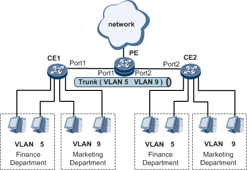
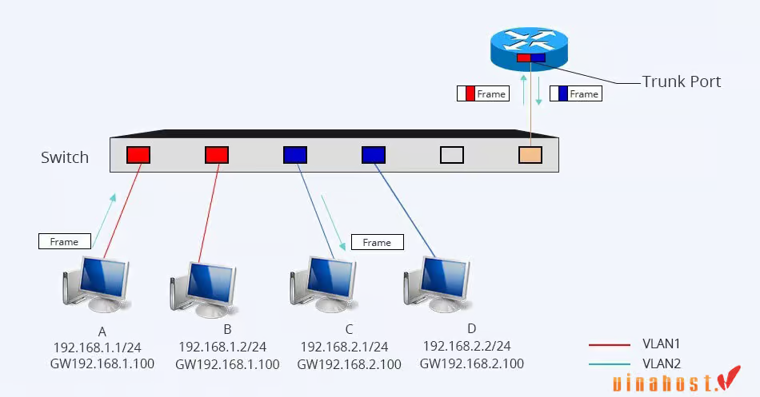

# TÌM HIỂU VỀ VLAN.
## GIỚI THIỆU TỔNG QUAN VỀ VLAN.
Trong thời đại công nghệ thông tin phát triển mạnh mẽ như hiện nay, việc xây dựng và quản lý mạng nội bộ (Local Area Network - LAN) ngày càng trở nên quan trọng đối với các doanh nghiệp. Một trong những công nghệ mạng được sử dụng rộng rãi để cải thiện hiệu quả và bảo mật của hệ thống mạng chính là VLAN (Virtual Local Area Network). VLAN là gì và liệu nó có thực sự cần thiết cho các doanh nghiệp? Bài viết này sẽ cung cấp cho bạn những thông tin cần thiết về VLAN, cách nó hoạt động và lý do tại sao nên sử dụng nó.
## MỤC ĐÍCH CỦA VLAN.
- Tăng cường Bảo mật (Security): Phân chia các thiết bị vào các VLAN khác nhau giúp hạn chế truy cập trái phép. Ví dụ, VLAN cho phòng kế toán sẽ tách biệt với VLAN của khách (Guest).
- Giảm lưu lượng Broadcast (Broadcast Control): VLAN tạo ra các miền quảng bá (broadcast domain) nhỏ hơn, giúp giảm tình trạng tắc nghẽn mạng do lưu lượng tin nhắn broadcast không cần thiết, từ đó tăng hiệu suất hoạt động của toàn hệ thống.
- Quản lý và tổ chức dễ dàng (Management & Flexibility): Người quản trị có thể dễ dàng di chuyển, thêm hoặc thay đổi vị trí của người dùng mà không cần thay đổi cấu hình dây vật lý hay switch, chỉ cần cấu hình lại VLAN trên cổng đó.
- Phân tách dịch vụ: Cho phép phân loại lưu lượng theo chức năng (như Voice VLAN cho VoIP, VLAN cho Camera, VLAN cho Server) để dễ dàng quản lý và ưu tiên băng thông.
- Mô phỏng mạng riêng biệt: Giúp các công ty khác nhau hoặc các phòng ban khác nhau sử dụng chung một cơ sở hạ tầng vật lý (switch) nhưng vẫn đảm bảo sự độc lập hoàn toàn về mạng
## I. TÌM HIỂU MẠNG VLAN LÀ GÌ ?
### 1. Mạng LAN là gì ?
Mạng LAN (Local Area Network) là hệ thống kết nối các thiết bị trong một khu vực giới hạn như nhà ở, văn phòng, trường học hoặc tòa nhà. Các thiết bị trong mạng LAN có thể chia sẻ dữ liệu, tài nguyên một cách nhanh chóng và hiệu quả. Ví dụ đơn giản, khi bạn sử dụng máy tính để in tài liệu trên máy in văn phòng hoặc chia sẻ file cho nhau trong cùng một phòng làm việc, tất cả đều đang sử dụng mạng LAN.
### 2. Mạng VLAN là gì ?
- **Khái niệm**
VLAN (Virtual Local Area Network) là một công nghệ ảo hóa cho phép chia một mạng vật lý thành nhiều phân đoạn mạng LAN ảo. Điều này giúp tăng tính linh hoạt và bảo mật của hạ tầng mạng, đồng thời cải thiện hiệu suất của hệ thống mạng. VLAN hoạt động bằng cách đóng gói các gói tin vào trong tiêu đề VLAN (VLAN tag) chứa VLAN ID. ID này xác định gói tin thuộc về VLAN nào và được sử dụng để điều phối dữ liệu trên mạng LAN ảo.

- **So sánh LAN và VLAN**
| Đặc điểm       | LAN (Local Area Network)                                                            | VLAN (Virtual Local Area Network)                                                             |
|----------------|-------------------------------------------------------------------------------------|-----------------------------------------------------------------------------------------------|
| Định nghĩa     | Mạng máy tính trong một khu vực hẹp như một tòa nhà, một văn phòng.                 | Phân chia một mạng LAN vật lý thành nhiều mạng LAN ảo dựa trên yêu cầu hoặc chức năng.        |
| Phạm vi        | Được sử dụng để kết nối các thiết bị trong cùng một khu vực địa lý nhỏ.             | Cho phép phân chia mạng LAN vật lý thành các nhóm logic độc lập.                              |
| Công nghệ      | Sử dụng các công nghệ kết nối như Ethernet, Wi-Fi, Token Ring.                      | Triển khai bằng cách đánh dấu các gói tin dữ liệu thuộc về các VLAN khác nhau.                |
| Tính linh hoạt | Thường không linh hoạt, các thiết bị phải ở cùng vị trí vật lý để kết nối với nhau. | Linh hoạt hơn với khả năng phân chia mạng vật lý thành các mạng logic độc lập.                |
| Quản lý        | Quản lý đơn giản hơn vì chỉ là một mạng đơn giản trong một khu vực nhỏ.             | Có thể quản lý hiệu quả hơn với khả năng chia nhỏ mạng thành các VLAN riêng biệt.             |
| Bảo mật        | Bảo mật thường dựa vào cấu hình thiết bị mạng như firewall, cấu hình switch.        | Cung cấp tính bảo mật cao hơn với khả năng ngăn chặn truy cập giữa các VLAN khác nhau.        |
| Ứng dụng       | Thường được sử dụng trong các văn phòng, doanh nghiệp nhỏ hoặc gia đình.            | Thích hợp cho các tổ chức lớn, có nhu cầu phân chia mạng theo các đơn vị chức năng khác nhau. |
## II. Cách thức hoạt động của VLAN.
Mạng VLAN hoạt động bằng cách chia một mạng vật lý thành các mạng con ảo độc lập, giúp tăng cường quản lý và an ninh, cũng như cải thiện hiệu suất mạng. Dưới đây là cách thức hoạt động cơ bản của mạng VLAN.

- Phân chia mạng vật lý
Mạng VLAN bắt đầu bằng việc phân chia mạng vật lý thành các phần nhỏ hơn gọi là VLANs. Mỗi VLAN tương ứng với một đơn vị tổ chức, bộ phận làm việc hoặc yêu cầu nào đó.

- Gán VLAN IDs
Mỗi VLAN được gán một VLAN ID, là một số nguyên dương đại diện cho mạng ảo đó. Các thiết bị mạng, như switch, sẽ sử dụng VLAN ID để xác định các VLAN.

- Gán cổng và cổng trừu tượng
Các cổng trên switch được gán cho từng mạng VLAN cụ thể. Cổng này có thể là cổng vật lý hoặc cổng trừu tượng (port-based VLANs). Các thiết bị trong cùng một VLAN có thể giao tiếp trực tiếp với nhau và hạn chế giao tiếp với các thiết bị ở các VLAN khác.

- Access Ports và Trunk Ports
Trong mạng VLAN, có hai loại cổng quan trọng: access ports và trunk ports. Cổng Access ports được gán cho một VLAN cụ thể, trong khi cổng trunk được sử dụng để chuyển dữ liệu giữa các switch và giữa các mạng VLAN.

- Tagging và Untagging
Khi dữ liệu đi qua cổng trunk, thông tin về VLAN ID thường được thêm vào gói tin (tagging). Ngược lại, khi dữ liệu rời khỏi mạng VLAN, thông tin này có thể được loại bỏ (untagging).

- Tạo Broadcast Domains
Mỗi VLAN tạo ra một broadcast domain độc lập, giảm thiểu lưu lượng broadcast trên mạng và cải thiện hiệu suất.

Nhìn chung, mạng VLAN giúp tạo ra các mạng con ảo, cải thiện an ninh và tăng linh hoạt trong việc sử dụng tài nguyên mạng.

- **Chi tiết cách VLAN hoạt động**
VLAN hoạt động bằng cách gắn các khung Ethernet với một mã VLAN (VLAN ID), xác định VLAN mà khung Ethernet thuộc về. Khi thiết bị gửi khung Ethernet, nó thêm mã VLAN vào khung. Khi khung Ethernet đến bộ chuyển mạch, bộ chuyển mạch đọc mã VLAN và chuyển khung đến cổng phù hợp với VLAN tương ứng.
## III. Phân loại VLAN.
- Port – based VLAN
+ Port-based VLAN, hay VLAN dựa trên cổng hoặc giao diện, là một phương pháp cấu hình VLAN đơn giản và phổ biến. Phương pháp này cho phép quản trị viên mạng thực hiện việc gắn VLAN theo cách thủ công, trong đó mỗi cổng trên Switch được liên kết với một VLAN cụ thể.
+ Port-based VLAN thích hợp cho các hệ thống mạng có quy mô nhỏ và không thường xuyên thay đổi cơ sở hạ tầng.

- MAC address based VLAN
+ MAC address-based VLAN là phương pháp gắn VLAN dựa trên địa chỉ MAC của thiết bị – mỗi địa chỉ MAC được liên kết với một VLAN cụ thể. Mặc dù cách cấu hình này không được ưa chuộng nhiều do đặc điểm hạn chế trong việc quản lý, nhưng cũng mang lại những ưu điểm quan trọng.
+ Phương pháp này nâng cao tính linh hoạt và an ninh mạng đáng kể. Ngay cả khi người dùng thay đổi vị trí thường xuyên, người quản trị mạng cũng không cần phải thực hiện lại cấu hình cho các VLAN, giảm bớt công đoạn quản lý khiến cho hệ thống trở nên linh hoạt hơn.

- Protocol – based VLAN
Protocol-based VLAN, hay VLAN dựa trên giao thức, có cách cấu hình tương tự như MAC address-based VLAN, nhưng thay vì sử dụng địa chỉ MAC, nó sử dụng duy nhất một địa chỉ IP hoặc địa chỉ logic như một phương tiện thay thế. Hiện nay, cách cấu hình này không còn phổ biến nhiều do sự phổ biến của giao thức DHCP.
## IV. Ứng dụng của VLAN.
- Phân chia phòng ban: Nhóm các máy tính theo chức năng (Kế toán, Kỹ thuật, Nhân sự) vào các mạng riêng biệt để dễ quản lý mà không cần quan tâm đến vị trí ngồi thực tế.
- Tăng cường bảo mật: Cách ly các luồng dữ liệu nhạy cảm (như dữ liệu tài chính) khỏi các phần còn lại của mạng, ngăn chặn truy cập trái phép nội bộ.
- Tạo mạng khách (Guest Wi-Fi): Cung cấp Internet cho khách hàng mà vẫn đảm bảo họ hoàn toàn không thể thâm nhập vào hệ thống dữ liệu nội bộ của công ty.
- Tối ưu lưu lượng thoại (Voice VLAN): Tách riêng dữ liệu từ điện thoại IP để ưu tiên băng thông, giúp cuộc gọi luôn rõ nét, không bị gián đoạn bởi các hoạt động tải file hay xem video của máy tính khác.
- Giảm nghẽn mạng: Chia nhỏ các miền quảng bá (Broadcast Domain), giúp giảm thiểu lượng tin nhắn rác không cần thiết gửi đến toàn bộ các máy tính, từ đó tăng tốc độ mạng tổng thể.
- Cô lập thiết bị IoT: Đưa các thiết bị như Camera, máy chấm công vào một VLAN riêng để nếu một thiết bị bị hack, mã độc cũng khó lây lan sang hệ thống máy chủ quan trị.
## V. Các câu hỏi thường gặp về VLAN.
### 1. Tại sao nên sử dụng VLAN thay vì bộ định tuyến (Router) ?
- Tốc độ xử lý: VLAN hoạt động ở Tầng 2 (Data Link) trên các Switch, dữ liệu được chuyển mạch bằng phần cứng (ASIC) nên nhanh hơn nhiều so với việc Router phải xử lý ở Tầng 3 (Network) bằng phần mềm.
- Tiết kiệm chi phí: Bạn có thể chia một Switch vật lý thành nhiều mạng logic cho từng phòng ban mà không cần mua thêm nhiều Router hoặc Switch riêng biệt cho mỗi nhóm.
- Giảm độ trễ: Dữ liệu giữa các thiết bị trong cùng VLAN không cần phải đi qua Router ("nút thắt cổ chai"), giúp giảm thiểu độ trễ cho các ứng dụng cần tốc độ cao.
- Quản lý linh hoạt: Dễ dàng di chuyển nhân viên giữa các phòng ban hoặc vị trí ngồi khác nhau chỉ bằng cách cấu hình lại cổng trên Switch thay vì phải đi lại dây cáp mạng vật lý.
- Giới hạn quảng bá (Broadcast): VLAN giúp chia nhỏ các miền quảng bá (Broadcast Domain) tương tự như Router, giúp mạng không bị nghẽn bởi các tin nhắn rác mà vẫn giữ được sự kết nối linh hoạt.
### 2. Ba lợi ích chính của việc sử dụng VLAN là gì ?
Ba lợi ích chính của việc sử dụng VLAN là nâng cao hiệu suất mạng thông qua việc giảm tắc nghẽn và xung đột dữ liệu, cải thiện bảo mật bằng cách cô lập dữ liệu nhạy cảm và kiểm soát quyền truy cập, đồng thời đơn giản hóa việc quản lý mạng, cho phép cập nhật và cấu hình dễ dàng hơn cho các phân đoạn mạng cụ thể.
### 3. VLAN có nằm trên bộ định tuyến hay bộ chuyển mạch không ?
VLAN (Virtual Local Area Network) chủ yếu được cấu hình và hoạt động trên Switch (Bộ chuyển mạch) để phân chia các cổng vật lý thành các miền broadcast logic riêng biệt. Router (Bộ định tuyến) chỉ tham gia khi cần định tuyến lưu lượng giữa các VLAN khác nhau (Inter-VLAN routing) thông qua các sub-interface hoặc switch Layer 3.
### 4. Mục đích của VLAN là gì ?
Mục đích của VLAN là phân chia mạng một cách logic thành các nhóm riêng biệt, tăng cường bảo mật dữ liệu, tối ưu hóa hiệu suất mạng và tạo điều kiện phân bổ tài nguyên hiệu quả. VLAN cho phép các thiết bị giao tiếp như thể chúng nằm trên cùng một mạng, ngay cả khi chúng được phân tán vật lý ở nhiều vị trí khác nhau.
### 5. Bạn có thể có bao nhiêu VLAN trên một bộ chuyển mạch (Switch) ?
Số lượng VLAN tối đa trên một bộ chuyển mạch (Switch) được quy định bởi tiêu chuẩn IEEE 802.1Q. 
+ Tổng số VLAN tối đa: Một bộ chuyển mạch có thể hỗ trợ tối đa 4094 VLAN.
+ Cơ sở kỹ thuật: Con số này xuất phát từ việc trường định danh VLAN (VLAN ID) trong tiêu đề gói tin có độ dài 12 bit. Theo lý thuyết toán học, $2^{12} = 4096 giá trị (từ 0 đến 4095).
### 6. Sự khác biệt giữa VLAN và mạng con là gì ?
VLAN hoạt động ở lớp liên kết dữ liệu (Lớp 2), phân đoạn lưu lượng mạng. Ngược lại, mạng con hoạt động ở lớp mạng (Lớp 3) và chia địa chỉ IP thành các nhóm logic cho mục đích định tuyến. VLAN cho phép cô lập thiết bị và kiểm soát lưu lượng, trong khi mạng con hỗ trợ quản lý và định tuyến địa chỉ IP.
### 7. Một cổng có thể có 2 VLAN không ?
Có, một cổng trên bộ chuyển mạch có thể được cấu hình để thuộc về nhiều VLAN. Cổng này được gọi là "cổng trunk" hoặc "cổng gắn thẻ". Cổng trunk mang lưu lượng cho nhiều VLAN, cho phép giao tiếp hiệu quả giữa các phân đoạn mạng
## VI. Ưu nhược điểm của VLAN.
- **Ưu điểm:**
+ Tăng tính bảo mật: VLAN cho phép tách biệt các nhóm người dùng khác nhau, ngăn chặn sự truy cập trái phép vào các tài nguyên mạng. Điều này giúp tăng tính bảo mật cho toàn bộ hệ thống mạng.
+ Cải thiện hiệu suất mạng: VLAN giúp giảm tải lưu lượng mạng bằng cách chỉ chuyển tiếp dữ liệu giữa các cổng thuộc cùng VLAN. Điều này giúp tăng băng thông khả dụng và cải thiện hiệu suất mạng.
+ Tăng khả năng quản lý: VLAN cho phép chia nhỏ mạng LAN thành các nhóm logic dựa trên các tiêu chí như phòng ban, chức năng hoặc vị trí địa lý. Điều này giúp quản trị viên dễ dàng quản lý và theo dõi các nhóm thiết bị riêng biệt.
+ Giảm chi phí: Với VLAN, các thiết bị có thể nằm ở các vị trí vật lý khác nhau nhưng vẫn có thể giao tiếp với nhau như thể chúng nằm trong cùng một mạng LAN. Điều này giúp giảm chi phí khi không cần tăng thêm số lượng thiết bị mạng trong hệ thống.
+ Tăng độ linh hoạt: VLAN cho phép người quản trị dễ dàng di chuyển, thêm hoặc loại bỏ các thiết bị mà không ảnh hưởng đến cấu trúc logic của mạng. Điều này giúp tăng độ linh hoạt và tính sẵn sàng của hệ thống mạng.

- **Nhược điểm:**
+ Packet có thể rò rỉ giữa các VLAN.
+ Packet được inject có thể tạo điều kiện cho các cuộc tấn công mạng.
+ Virus từ một hệ thống đơn lẻ có thể lan truyền trên toàn bộ mạng.
+ Yêu cầu sự hiện diện của một router bổ sung để kiểm soát công việc trong các mạng lớn.
+ Khả năng tương tác có thể gặp vấn đề.
+ Một VLAN không thể chuyển tiếp lưu lượng mạng sang các VLAN khác.
## VII. Cách chia mạng VLAN cụ thể trên cấu hình Cisco hoặc SecureCRT.
- **Đăng nhập vào giao diện quản trị của Switch:** Sử dụng trình duyệt web hoặc giao diện dòng lệnh (CLI) để truy cập vào switch.

- **Tạo VLAN:** Sử dụng lệnh vlan để tạo VLAN mới.
enable
configure terminal
vlan 10
name System_VLAN

- **Gán cổng vào VLAN:** Sử dụng lệnh interface và switchport access vlan để gán cổng vào VLAN.

interface FastEthernet 1/0/1
switchport mode access
switchport access vlan 10
end
- **Lưu cấu hình:** Sử dụng lệnh `write memory` để lưu cấu hình.

### 3. Cấu hình router (tùy chọn)

- **Cấu hình định tuyến giữa các VLAN:** Nếu cần thiết, bạn cần cấu hình router để định tuyến lưu lượng giữa các VLAN.

- **Cấu hình DHCP:** Nếu bạn muốn sử dụng DHCP để cấp **địa chỉ IP** cho các thiết bị trong VLAN, bạn cần cấu hình server DHCP trên router hoặc switch.

### 4. Kiểm tra

- Sử dụng lệnh `show vlan` để xem danh sách VLAN và các cổng được gán vào từng VLAN.

- Sử dụng lệnh `show ip address` để kiểm tra địa chỉ IP của các thiết bị trong VLAN.

- Ping các thiết bị trong cùng VLAN và giữa các VLAN khác nhau để đảm bảo rằng chúng có thể giao tiếp với nhau.