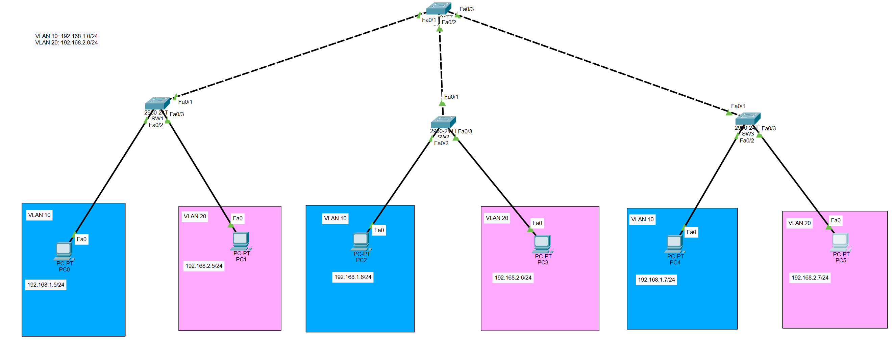
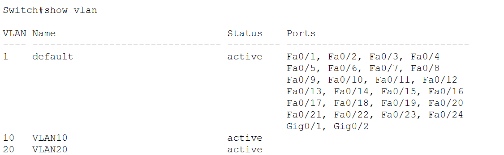
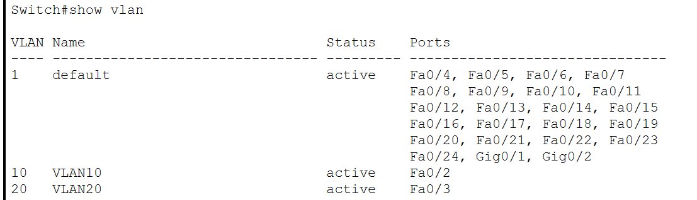
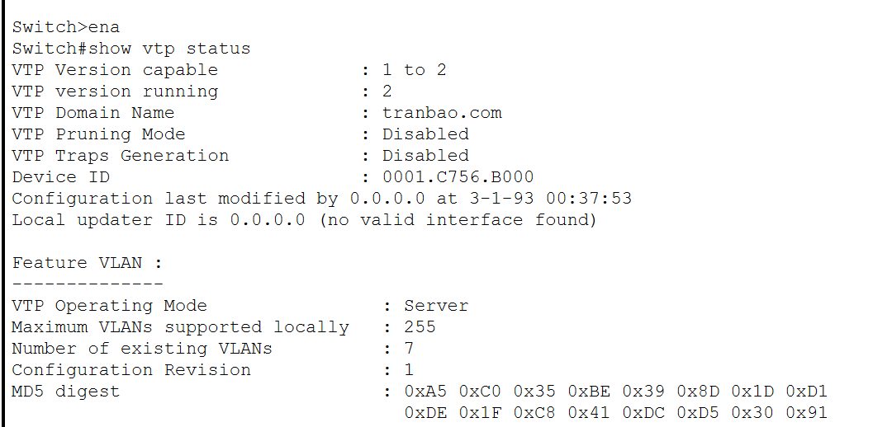
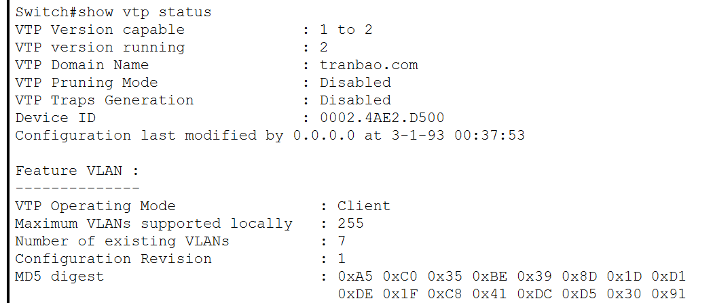
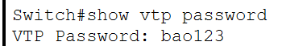
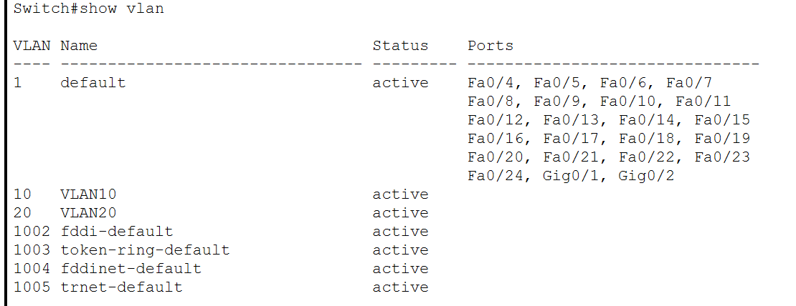
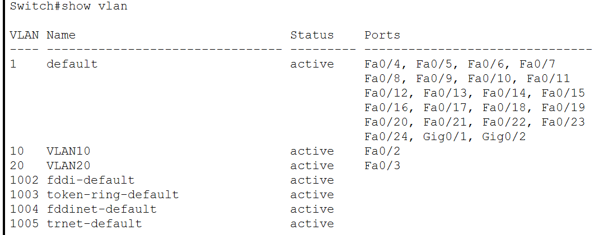
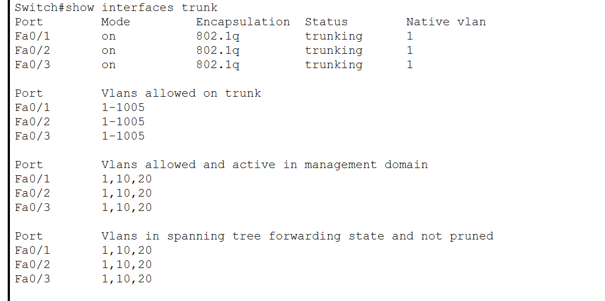
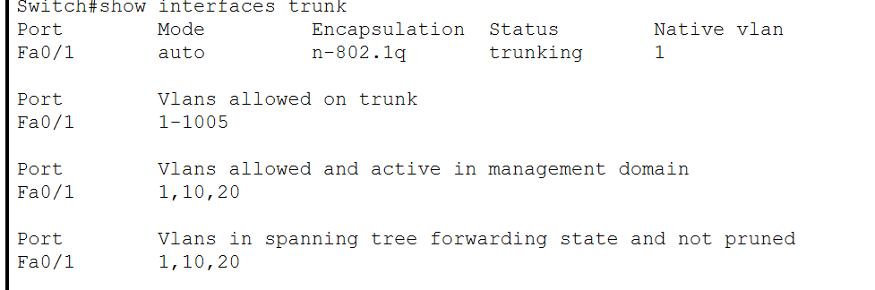

### Cấu hình VTP Domain
## Sơ đồ Lab

**Quy hoạch VLAN**
VLAN 10: 192.168.1.0/24
VLAN 20: 192.168.2.0/24
## Cấu hình VTP
### 1. Cấu hình IP cho PC
- PC0:
+ IP: 192.168.1.5
+ Subnet Mask: 255.255.255.0
+ Default Gateway: Bỏ trống nếu không có Router
- Các PC khác tương tự
### 2. Cấu hình VTP Server và VTP Client
- Switch 0: VTP Server
- Switch 1-2-3: VTP Client
- VTP Domain: tranbao.com
- VTP Password: bao123

**Trên SW0**
- Tạo VLAN 10 và VLAN 20

Switch>enable
Switch#configure terminal
Switch(config)#vlan 10
Switch(config-vlan)#name VLAN10
Switch(config-vlan)#exit
Switch(config)#vlan 20
Switch(config-vlan)#name VLAN20
Switch(config-vlan)#exit

- Khi tạo xong VLAN, ta cần kiểm tra xem đã tạo thành công VLAN hay chưa
Switch#show vlan

- Cấu hình trunk port

Switch#configure terminal 
Switch(config)#interface f0/1
Switch(config-if)#switchport mode trunk 
Switch(config-if)#exit

Switch(config)#interface f0/2
Switch(config-if)#switchport mode trunk 
Switch(config-if)#exit

Switch(config)#interface f0/3
Switch(config-if)#switchport mode trunk 
Switch(config-if)#exit
### 3. Cấu hình VTP
- Cấu hình VTP Server trên SW0
Switch(config)#vtp mode server `thiết lập switch hoạt động ở chế độ server`
Switch(config)#vtp domain tranbao.com `đặt tên vùng quản lý là tranbao.com. Các Switch chỉ có thể đồng bộ VLAN với nhau nếu chúng có cùng tên Domain`
Switch(config)#vtp password bao123 `Thiết lập mật khẩu xác thực cho VTP là bao123`

**Trên SW 1, 2, 3**
- Cấu hình SW1, 2, 3 thành VTP Client
Switch(config)#vtp mode client ` chuyển chế độ hoạt động sang client`
Switch(config)#vtp domain tranbao.com `tham gia vào domain tranbao.com`
Switch(config)#vtp password bao123 ` xác thực mật khẩu để vào domain`

Lúc này các VLAN được tạo ở VTP Client sẽ tự động cập nhật VLAN đã được tạo ở VTP Server, chúng ta có thể kiểm tra bằng câu lệnh:
Switch#show vlan

- Gán các cổng của SW cho các cổng
Switch(config)#interface f0/2
Switch(config-if)#switchport mode access 
Switch(config-if)#switchport access vlan 10
Switch(config-if)#exit

Switch(config)#interface f0/3
Switch(config-if)#switchport mode access 
Switch(config-if)#switchport access vlan 20
Switch(config-if)#exit

Sau đó dùng câu lệnh để kiểm tra xem các cổng đã được gán VLAN chưa

### 4. Các lệnh kiểm tra sau khi cấu hình.
`show vtp status`
**SW0**

**Sw1-2-3-**

`show vtp password`
**SW0**

**Sw1-2-3-**

`show vlan`
**SW0**

**Sw1-2-3-**

`show interface trunk`
**SW0**

**Sw1-2-3-**
