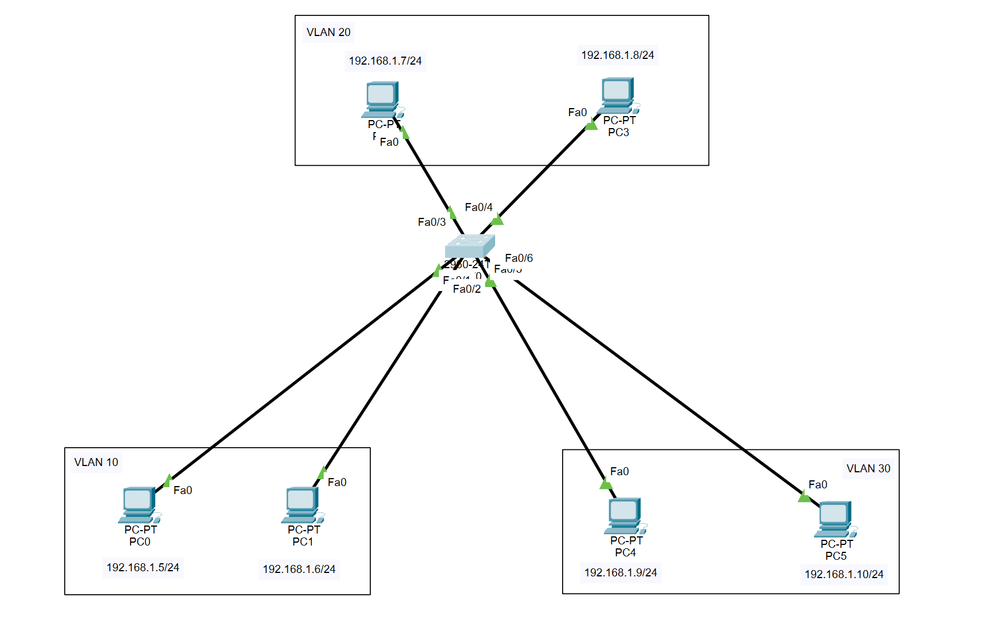
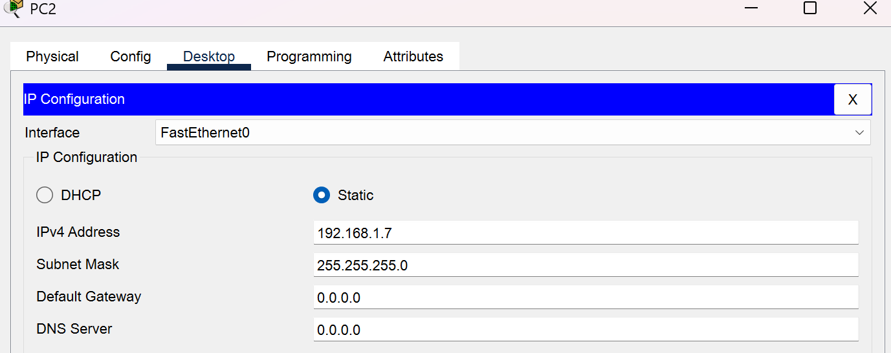
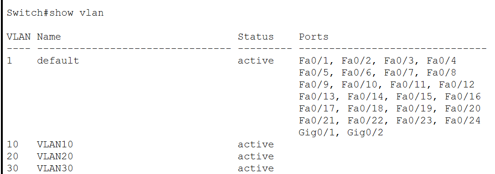
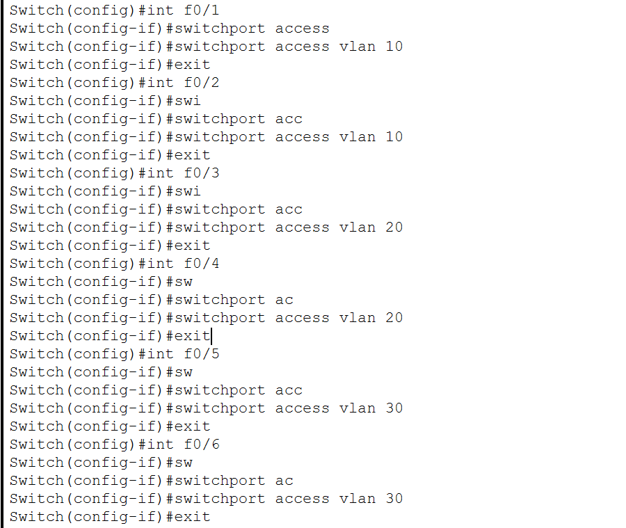
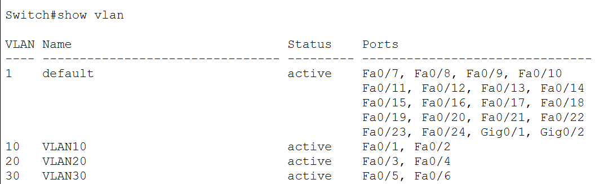
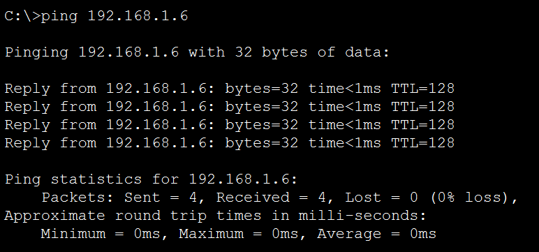
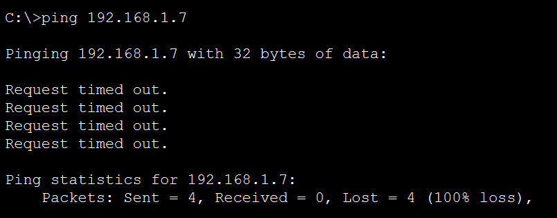

# CHIA VLAN
## Yêu cầu cấu hình VLAN như ảnh

## Các bước thực hiện
### Truy cập vào từng PC để cấu hình IP cho từng máy
- Có 6 PC và ta sẽ nhập địa chỉ IPv4 và Subnet Mask cho từng PC bằng cách nhấp vào PC => Desktop => IP Configuration => Chọn Satic => nhập IPv4 và Subnet Mask cho từng máy

- Ở đây, PC2 có địa chỉ IPv4 là 192.168.1.7 và Subnet Mask là 255.255.255.0

### Truy cập vào Switch
- Nhấn vào Switch cần cấu hình => Chọn tab CLI

### Vào config mode của switch
Switch>enable `Chuyển từ User EXEC Mode sang Privileged EXEC Mode (Chế độ đặc quyền)`
Switch#configure terminal `Chuyển từ Privileged EXEC Mode sang Global Configuration Mode (Chế độ cấu hình toàn cục)`

### Tạo các VLAN
- Ở đây ta cần tạo 3 VLAN là VLAN 10, VLAN 20, VLAN 30 cho 3 phòng ban

Switch(config)#vlan 10	`tạo VLAN với ID là 10` 
Switch(config-vlan)#name VLAN10 ` đặt tên cho VLAN vừa tạo là VLAN10`
Switch(config-vlan)#exit ` thoát khỏi chế độ cấu hình vlan và quay lại chế độ cấu hình toàn cục`

Switch(config)#vlan 20
Switch(config-vlan)#name VLAN20
Switch(config-vlan)#exit

Switch(config)#vlan 30
Switch(config-vlan)#name VLAN30
Switch(config-vlan)#exit

- Sau khi tạo xong, ta cần kiểm tra các vlan vừa tạo

Switch(config)#show vlan

### Gán các VLAN cho các cổng

- **Gán cổng F0/1 và F0/2 (PC0, PC1) cho VLAN 10**
Switch(config)#interface f0/1 `truy cập vào chế độ cấu hình của một cổng vật lý`
Switch(config-if)#switchport access vlan 10 `gán cổng f0/1 vào vlan có ID là 10`
Switch(config-if)#exit `thoát khỏi chế độ cấu hình cổng f0/1 để trở về chế độ cấu hình toàn cục`

Switch(config)#interface f0/2
Switch(config-if)#switchport access vlan 10
Switch(config-if)#exit

- **Gán cổng F0/3 và F0/4 (PC2, PC3) cho VLAN 10**
Switch(config)#interface f0/3
Switch(config-if)#switchport access vlan 20
Switch(config-if)#exit

Switch(config)#interface f0/4
Switch(config-if)#switchport access vlan 20
Switch(config-if)#exit

- **Gán cổng F0/5 và F0/6 (PC4, PC5) cho VLAN 10**
Switch(config)#interface f0/5
Switch(config-if)#switchport access vlan 30
Switch(config-if)#exit

Switch(config)#interface f0/6
Switch(config-if)#switchport access vlan 30
Switch(config-if)#exit

- Sau khi gán cổng xong, chúng ta cần kiểm tra xem VLAN đã được gán vào đúng cổng hay chưa
Switch(config)#show vlan

**Ping PC để kiểm tra kết nối**
- Chọn PC muốn kiểm tra kết nối 
- Chọn tab Desktop => Command Prompt
- Dùng câu lệnh ping _địa chỉ ip_
Nếu ping thành công, màn hình sẽ thông báo như hình dưới đây:

Nếu không thành công, màn hình sẽ hiển thị `Request time out`
