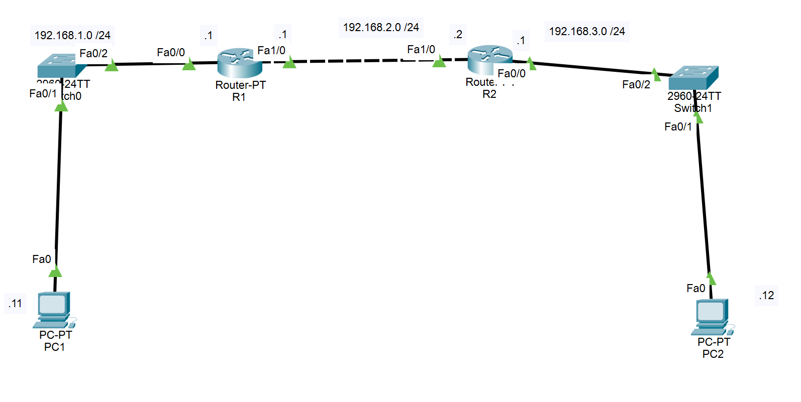
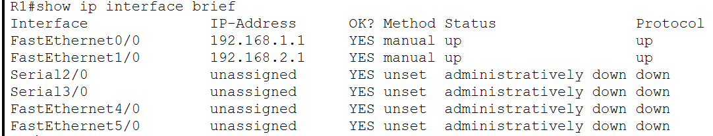
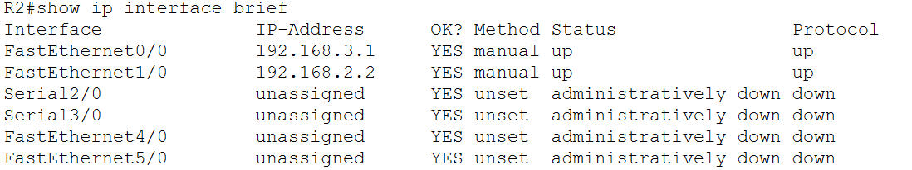
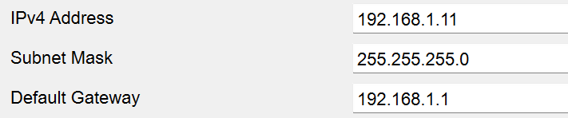
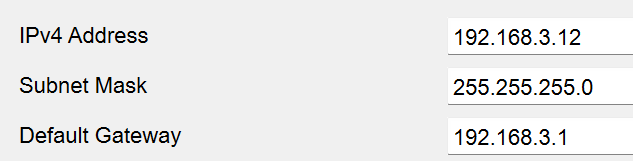
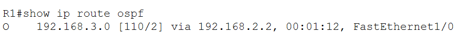
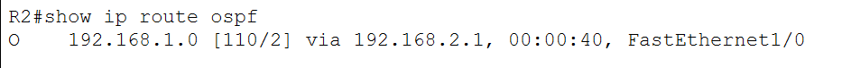
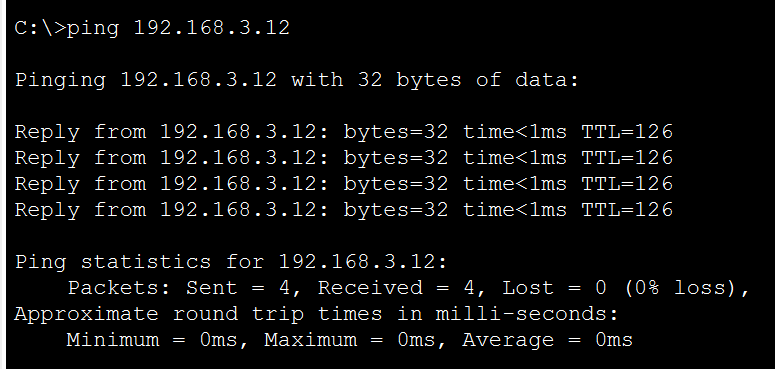

# CẤU HÌNH ROUTING

## Sơ đồ bài Lab

## Yêu cầu bài Lab
Cấu hình Router 1 và Router 2 sao cho dữ liệu có thể đi từ PC1 đến PC2.

### 1. Cấu hình IP trên Router
**Router 1**
R1(config)#interface f0/0
R1(config-if)#ip address 192.168.1.1 255.255.255.0
R1(config-if)#no shutdown 
R1(config-if)#exit
R1(config)#interface f1/0
R1(config-if)#ip address 192.168.2.1 255.255.255.0
R1(config-if)#no shutdown 
R1(config-if)#exit

- Kiểm tra các cổng đã cấu hình
R1#show ip interface brief 

**Router 2**
R1(config)#interface f0/0
R1(config-if)#ip address 192.168.3.1 255.255.255.0
R1(config-if)#no shutdown 
R1(config-if)#exit
R1(config)#interface f1/0
R1(config-if)#ip address 192.168.2.2 255.255.255.0
R1(config-if)#no shutdown 
R1(config-if)#exit

- Kiểm tra các cổng đã cấu hình
R2#show ip interface brief 

### 2. Cấu hình IP trên PC
**PC1**
IP address: 192.168.1.11
Subnet Mask: 255.255.255.0
Default Gateway: 192.168.1.1

**PC2**
IP address: 192.168.3.12
Subnet Mask: 255.255.255.0
Default Gateway: 192.168.3.1

### 3. Cấu hình định tuyến đường đi
**Router 1**
R1(config)#route ospf 2
R1(config-router)#network 192.168.1.0 0.0.0.255 area 0
R1(config-router)#network 192.168.2.0 0.0.0.255 area 0
R1(config-router)#exit
R1(config)#exit

- Kiểm tra đường mạng
R1#show ip route ospf

**Router 2**
R2(config)#route ospf 2
R2(config-router)#network 192.168.2.0 0.0.0.255 area 0
R2(config-router)#network 192.168.3.0 0.0.0.255 area 0
R2(config-router)#exit

- Kiểm tra đường mạng
R2#show ip route ospf

### 4. Gửi gói tin từ PC1 sang PC2

ping 192.168.3.12
- Sau khi cấu hình xong, gói tin đã có thể di chuyển từ PC1 sang PC2
