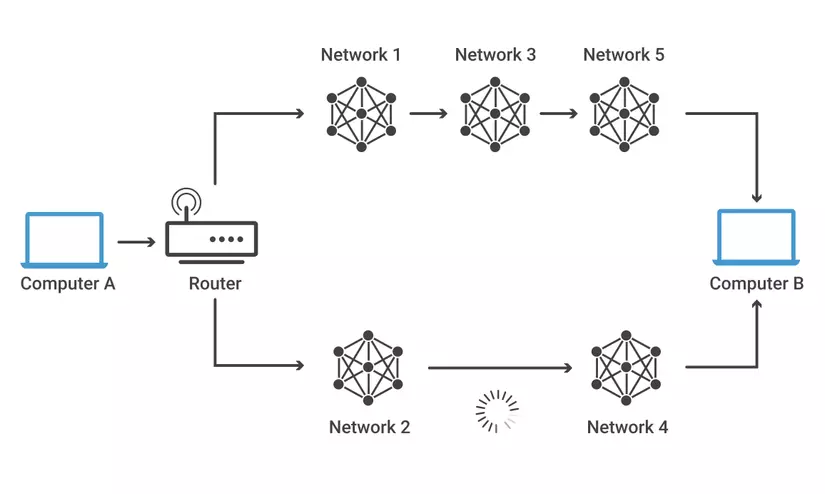
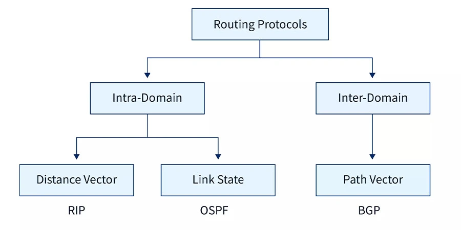

# ROUTING

## I. KHÁI NIỆM ROUTING
### 1.Khái niệm Routing
- Định tuyến là phương thức mà Router (Bộ định tuyến) hay PC (thiết bị mạng) dùng để chuyển các gói tin đến địa chỉ đích một cách tối ưu nhất, nghĩa là chỉ ra hướng và đường đi tốt nhất cho gói tin. 
- Router thu thập và duy trì các thông tin định tuyến để cho phép truyền và nhận các dữ liệu. Quá trình Routing dựa vào thông tin trên bảng định tuyến (Routing table), là bảng chứa các lộ trình nhanh và tốt nhất đến các mạng khác nhau trên mạng, để hướng các gói dữ liệu đi một cách hiệu quả nhất.

- Ở ví dụ trên, để PC A có thể truyền dữ liệu đến PC B thì có 2 con đường
    + 1: PC A -> Router -> N1 -> N3 -> N5 -> PC B
        Đặc điểm: Đây là một đường truyền dài hơn, đi qua chuỗi liên kết của 3 mạng trung gian trước khi đến đích.
    + 2: PC A -> Router -> N2 -> N4 -> PC B
        Đặc điểm: Đường này ngắn hơn (chỉ qua 2 mạng trung gian). Tuy nhiên, trên sơ đồ có biểu tượng loading/vòng xoay chờ giữa Network 2 và Network 4, biểu thị đường truyền này có thể đang bị nghẽn, bị chậm hoặc đang gặp sự cố.

### 2. Chỉ số và các giá trị Routing
- Metric là giá trị mà các giao thức định tuyến sử dụng để tính toán "chi phí" của một con đường. Đường nào có Metric thấp nhất sẽ là đường tối ưu nhất và được đưa vào bảng định tuyến (Routing Table).

Mỗi giao thức sẽ dựa vào các thông số vật lý khác nhau để tính Metric:
- **Hop Count (Số chặng):**
+ Khái niệm: Là số lượng Router mà gói tin phải đi qua để đến đích.
+ Giao thức sử dụng: RIP (Routing Information Protocol).

- **Bandwidth (Băng thông):**
+ Khái niệm: Tốc độ tối đa của đường truyền (ví dụ: 100 Mbps, 1 Gbps). Đường có băng thông lớn hơn sẽ được ưu tiên hơn.
+ Giao thức sử dụng: OSPF, EIGRP.

- **Delay (Độ trễ):**
+ Khái niệm: Thời gian cần thiết để một gói tin di chuyển từ nguồn đến đích (tính bằng mili-giây).
+ Giao thức sử dụng: EIGRP (kết hợp với Băng thông).

- **Cost (Chi phí):**
+ Khái niệm: Là giá trị nghịch đảo của băng thông ($Cost = \frac{10^8}{Bandwidth}$). Đường truyền càng nhanh thì Cost càng nhỏ.
+ Giao thức sử dụng: OSPF.

### 3. Các thành phần chính của routing
**Router**
- Thiết bị mạng chịu trách nhiệm chuyển tiếp gói dữ liệu giữa các mạng khác nhau
- Sử dụng bảng định tuyến (Routing Table) để quyết định đường đi cho gói dữ liệu

**Bảng định tuyến (Routing Table)**
- Bảng định tuyến (Routing Table) còn được gọi là Routing Information Base (RIB). Đây là bảng thông tin trong router, chứa các tuyến đường đến các điểm đến khác nhau.

- Ví dụ về bảng định tuyến:
| Destination | Subnet Mask   | Next Hop    | Interface | Metric |
|-------------|---------------|-------------|-----------|--------|
| 192.168.1.0 | 255.255.255.0 | 192.168.1.1 | eth0      | 1      |
| 10.0.0.0    | 255.0.0.0     | 10.0.0.1    | eth1      | 2      |
| 172.16.0.0  | 255.255.0.0   | 172.16.0.1  | eth2      | 3      |
| 0.0.0.0     | 0.0.0.0       | 192.168.0.1 | eth3      | 10     |

* Destination: Mạng đích
* Subnet Mask: Định nghĩa phần mạng và phần host của IP
* Next Hop: Địa chỉ IP của router kế tiếp để chuyển tiếp gói tin
* Interface: Cổng mạng mà router sẽ sử dụng
* Metric: Chỉ số ưu tiên (giá trị thấp hơn được ưu tiên hơn)

**Giao thức định tuyến (Routing Protocol)**
- IP: xác định nguồn và đích cho mỗi gói dữ liệu. Thiết bị định tuyến sẽ kiểm tra phần tiêu đề IP của mỗi gói dữ liệu để xác định đường đi cho chúng. IP không phải là một giao thức định tuyến chính thức, nhưng nó chịu trách nhiệm xác định đích của gói dữ liệu trong mạng.

- BGP : được sử dụng để thông báo về việc quản lý các mạng nào điều khiển các địa chỉ IP và các mạng nào kết nối với nhau. Các mạng lớn thực hiện các thông báo BGP này được gọi là hệ thống tự trị. BGP là một giao thức định tuyến động, và nó đóng vai trò quan trọng trong việc quản lý việc kết nối giữa các mạng lớn trên Internet.

- OSPF: thường được sử dụng bởi các thiết bị định tuyến để động cơ xác định các đường đi nhanh nhất và ngắn nhất để gửi các gói tin đến đích. OSPF được sử dụng trong các mạng lớn và có cấu trúc phức tạp hơn để đảm bảo việc định tuyến hiệu quả.

- RIP: sử dụng “hop count” để tìm đường đi ngắn nhất từ một mạng đến mạng khác, trong đó “hop count” đếm số lượng thiết bị định tuyến mà một gói tin cần đi qua trên đường đi. Khi một gói tin chuyển từ một mạng sang mạng khác, điều này được gọi là “hop.”

## II. CHỨC NĂNG ROUTING
Routing hoạt động dựa trên 2 mặt phẳng xử lý chính:
- Control Plane (Mặt phẳng điều khiển):
    + Tìm đường đi tối ưu (Path Determination): sử dụng các thuật toán và giao thức định tuyến (như OSPF, EIGRP, BGP) để tính toán con đường nào là nhanh nhất, ngắn nhất hoặc ít tắc nghẽn nhất dựa trên các chỉ số (Metric) như băng thông, độ trễ, số chặng (hop count).
    + Xây dựng bảng định tuyến (Routing Table Management): xây dựng bảng định tuyến để lựa chọn đường đi tối ưu

- Data Plane / Forwarding Plane (Mặt phẳng dữ liệu)
    + Chuyển tiếp gói tin (Packet Forwarding): chuyển tiếp gói dữ liệu đến các thiết bị trên đường đi

## III. PHÂN LOẠI ROUTING
Có hai loại định tuyến khác nhau, dựa trên cách bộ định tuyến tạo bảng định tuyến của mình:
### 1. Static routing (Định tuyến tĩnh)
Trong định tuyến tĩnh, quản trị viên mạng sử dụng bảng tĩnh để đặt cấu hình và chọn các tuyến mạng theo cách thủ công. Định tuyến tĩnh hữu ích trong các tình huống mà thiết kế mạng hoặc các thông số dự kiến sẽ không thay đổi.

- **Ưu điểm:**
+ Tối ưu hiệu năng thiết bị: Router không phải chạy các thuật toán tính toán đường đi phức tạp, giúp tiết kiệm tối đa CPU và bộ nhớ RAM.
+ Không tốn băng thông đường truyền: Các Router không cần gửi các gói tin cập nhật định tuyến qua lại cho nhau như định tuyến động.
+ Bảo mật cao: Người quản trị kiểm soát tuyệt đối gói tin sẽ đi qua những đâu. Không có nguy cơ bị kẻ gian gửi gói tin định tuyến giả mạo để hướng dữ liệu đi sai đường.
+ Dễ dự đoán: Đường đi là cố định nên việc theo dõi và xác định luồng dữ liệu khi xảy ra sự cố rất tường minh.

- **Nhược điểm:**
+ Tốn công sức cấu hình: Với mạng lớn có hàng chục Router, việc gõ thủ công từng dòng lệnh cho mọi kịch bản đường đi là một "cơn ác mộng".
+ Không có tính tự động ứng biến: Nếu một đường truyền bị đứt, Router không thể tự động tìm đường khác. Hệ thống sẽ mất kết nối cho đến khi người quản trị vào sửa lại cấu hình bằng tay.
+ Dễ sai sót: Chỉ cần gõ nhầm một địa chỉ IP Next-Hop hoặc Subnet Mask, mạng có thể bị lặp vòng (loop) hoặc mất kết nối ngay lập tức.

### 2. Dynamic routing (Định tuyến động)
Trong định tuyến động, các bộ định tuyến tạo và cập nhật bảng định tuyến trong thời gian chạy dựa trên điều kiện mạng thực tế. Bộ định tuyến cố gắng tìm đường dẫn nhanh nhất từ nguồn đến điểm đích bằng cách sử dụng một giao thức định tuyến động, đây là một tập hợp các quy tắc giúp tạo, duy trì và cập nhật bảng định tuyến động.

- **Ưu điểm:**
+ Tự động thích ứng (Khả năng hội tụ): Khi một đường truyền bị đứt hoặc có một mạng mới được thêm vào, các Router sẽ tự động thông báo cho nhau và tính toán lại con đường dự phòng chỉ trong vài giây.
+ Cấu hình đơn giản ở quy mô lớn: Người quản trị chỉ cần bật giao thức và khai báo các mạng kết nối trực tiếp (network ...). Dù mạng có mở rộng lên hàng trăm Router, chúng vẫn tự động tìm thấy nhau.
+ Giảm thiểu sai sót do con người: Thuật toán (như Dijkstra trong OSPF) sẽ tự tính toán đường đi tối ưu dựa trên trạng thái thực tế của đường truyền, tránh được các lỗi gõ nhầm của quản trị viên.

- **Nhược điểm:**
+ Tiêu tốn tài nguyên phần cứng: Router phải vận hành các thuật toán phức tạp theo thời gian thực để duy trì bản đồ mạng, đòi hỏi CPU và RAM phải đủ mạnh.
+ Hao phí băng thông: Các Router phải định kỳ hoặc liên tục gửi các gói tin cập nhật (Hello packet, Link State Advertisement...) cho nhau, chiếm dụng một phần băng thông của đường truyền.
+ Rủi ro bảo mật: Nếu không cấu hình xác thực (Authentication) cẩn thận, kẻ tấn công có thể giả mạo một Router để gửi thông tin định tuyến sai lệch vào hệ thống nhằm đánh cắp hoặc chặn đứng dữ liệu.

### 3. Default Routing
- Default Routing (Định tuyến mặc định) là một kỹ thuật định tuyến trong đó Router được cấu hình để gửi tất cả các gói tin có địa chỉ đích không nằm trong bảng định tuyến đến một cổng ra hoặc một Router chặng kế tiếp (Next-hop) cụ thể.

**Cách thức hoạt động**
- Trong bảng định tuyến (Routing Table), một Tuyến đường mặc định (Default Route) được đại diện bằng một địa chỉ IP và Subnet Mask vô cùng đặc biệt: 0.0.0.0 0.0.0.0 (hoặc viết gọn theo dạng CIDR là 0.0.0.0/0).

- Địa chỉ 0.0.0.0/0 mang ý nghĩa là "mọi điểm đến". Quy trình xử lý gói tin của Router sẽ diễn ra như sau:
    * Khi nhận được một gói tin, Router sẽ kiểm tra địa chỉ IP đích của gói tin đó.
    * Nó sẽ tra cứu trong bảng định tuyến xem có đường đi cụ thể nào khớp với IP đích này không (ví dụ: đường đi riêng tới mạng 192.168.10.0/24).
    * Nếu không tìm thấy bất kỳ đường đi cụ thể nào, Router sẽ sử dụng đến phương án cuối cùng là Default Route để đẩy gói tin đi ra ngoài.
    * Nếu bảng định tuyến không có cả đường đi cụ thể lẫn Default Route, gói tin sẽ bị hủy ngay lập tức (Drop) và gửi lại thông báo lỗi Destination host unreachable.
- **Ưu điểm**
+ Bảng định tuyến cực kỳ gọn nhẹ, giúp Router tiết kiệm tối đa bộ nhớ RAM và CPU khi tra cứu thông tin.
+ Cấu hình siêu đơn giản (chỉ cần đúng 1 dòng lệnh).

- **Nhược điểm**
+ Nếu cấu hình không cẩn thận giữa các Router, rất dễ gây ra hiện tượng Lặp vòng định tuyến (Routing Loop) (Router A ném gói tin lạ cho Router B, Router B không biết lại ném ngược về Router A, khiến gói tin chạy vòng quanh đến khi hết chỉ số TTL).

### 3. So sánh Static routing và Dynamic routing
|       Đặc điểm       |    Static Routing (Định tuyến tĩnh)    |       Dynamic Routing (Định tuyến động)      |
|:--------------------:|:--------------------------------------:|:--------------------------------------------:|
| Cấu hình             | Thủ công từng tuyến đường              | Tự động thông qua giao thức                  |
| Khả năng mở rộng     | Chỉ hợp với mạng nhỏ (Dưới 3-5 Router) | Rất tốt cho mạng từ vừa đến cực lớn          |
| Khi có sự cố link    | Đứng im (Phải sửa cấu hình bằng tay)   | Tự động chuyển hướng sang đường dự phòng     |
| Tài nguyên (CPU/RAM) | Tiêu thụ cực ít                        | Tiêu thụ nhiều hơn                           |
| Độ phức tạp          | Thấp ở mạng nhỏ, cực cao ở mạng lớn    | Phức tạp trong việc chọn và tối ưu giao thức |

## IV. CÁC THUẬT TOÁN ROUTING

**Trạng thái liên kết (Link-State / Thuật toán Dijkstra)**
+ Giao thức tiêu biểu: OSPF, IS-IS.
+ Cách hoạt động: "Tự xem bản đồ". Mỗi Router tự thu thập sơ đồ của toàn bộ mạng lưới để xây dựng một bản đồ hoàn chỉnh, sau đó tự tính toán ra con đường ngắn nhất (tốn ít "Cost" nhất) để đến đích.
+ Đặc điểm: Tìm đường cực nhanh và chính xác, nhưng rất tốn CPU/RAM của Router.

**Vectơ khoảng cách (Distance-Vector / Thuật toán Bellman-Ford)**
= Giao thức tiêu biểu: RIP.
+ Cách hoạt động: "Đi đường theo lời đồn". Router không có bản đồ mạng. Cứ định kỳ, các Router hàng xóm sẽ "kể" cho nó nghe về những con đường họ biết. Router sẽ chọn đường dựa trên số lượng trạm (Hop Count) ít nhất.
+ Đặc điểm: Nhẹ nhàng, tốn ít tài nguyên nhưng tính toán chậm và dễ bị lặp vòng (Loop).

**Vectơ nâng cao & Vectơ đường đi (DUAL & Path-Vector)**
+ Giao thức tiêu biểu: EIGRP, BGP (định tuyến Internet).
+ Cách hoạt động: "Kết hợp và giám sát".
    * EIGRP (Thuật toán DUAL): Lai giữa 2 loại trên, tính sẵn một đường chính và một đường dự phòng, hỏng đường chính là đổi sang đường dự phòng ngay lập tức.
    * BGP (Path-Vector): Không đếm số Router mà ghi lại danh sách các quốc gia/hệ thống mạng (Autonomous System) đi qua để tránh gói tin bị chạy vòng quanh thế giới.