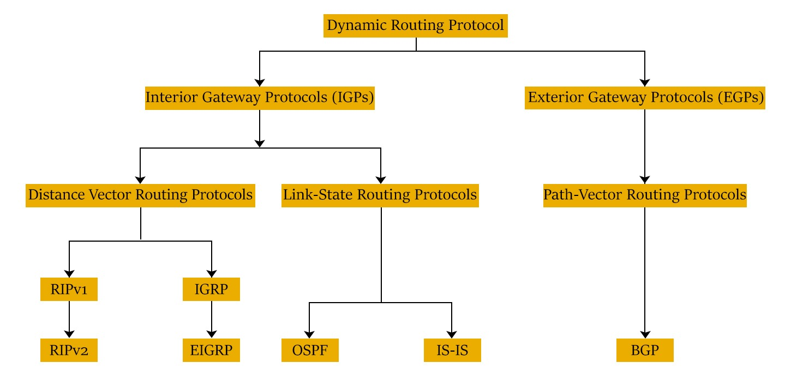
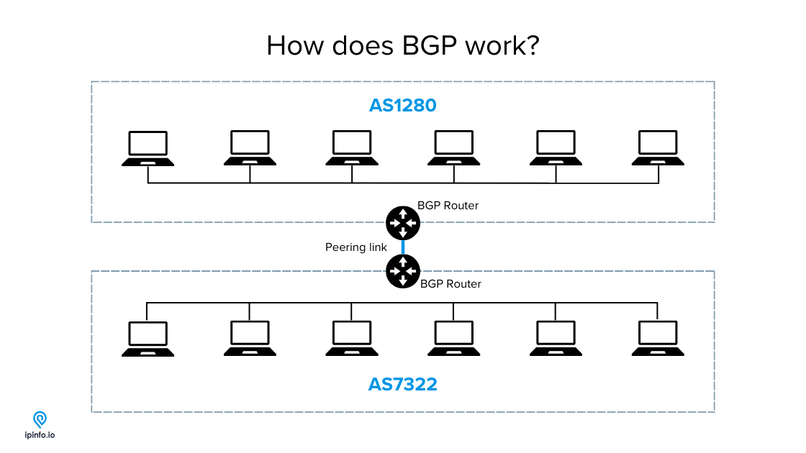
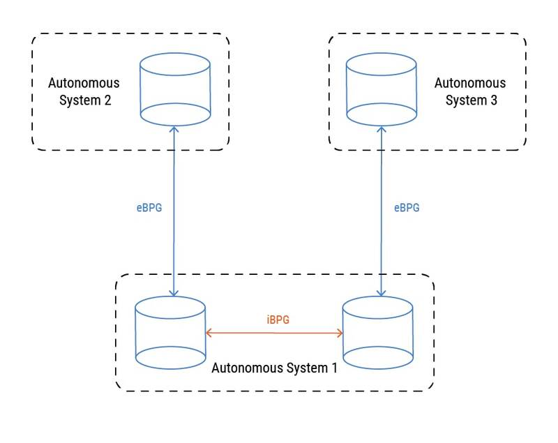
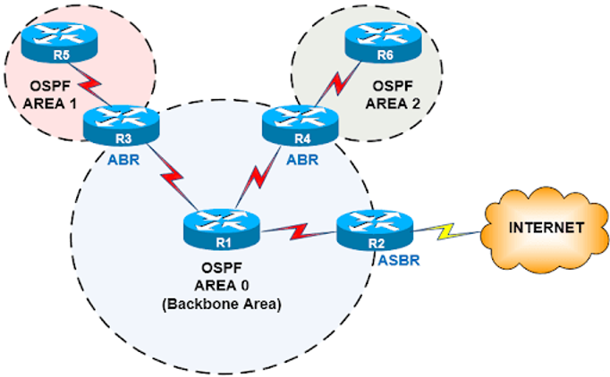
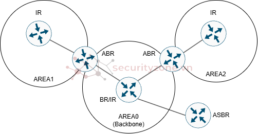
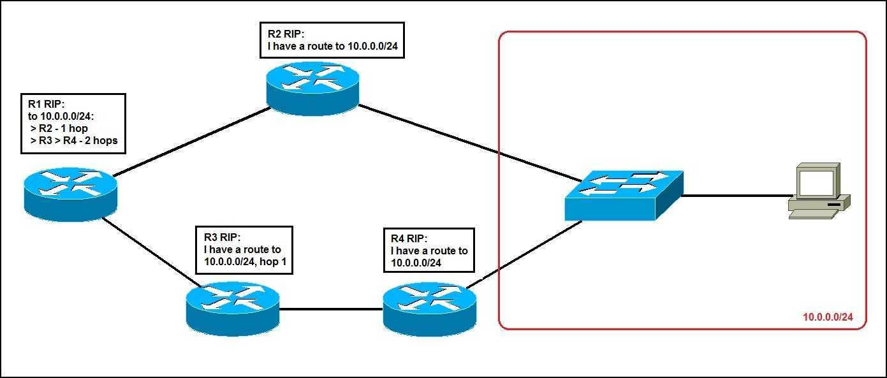

# ROUTING PROTOCOL

## BGP (Border Gateway Protocol)
### Khái niệm
- BGP (Border Gateway Protocol) là một giao thức định tuyến liên miền (Inter-Domain Routing Protocol), thuộc nhóm Path-Vector.  
- Nhiệm vụ chính của BGP là trao đổi thông tin định tuyến giữa các Hệ thống tự trị (Autonomous System - AS) trên mạng Internet.
- AS là gì? AS là một tập hợp các mạng máy tính thuộc sự quản lý của một tổ chức duy nhất (ví dụ: các nhà mạng ISP như Viettel, VNPT, FPT, hoặc các tập đoàn công nghệ lớn như Google, Microsoft, Facebook). Mỗi AS được cấp một mã số định danh duy nhất gọi là ASN (Autonomous System Number).
- BGP chính là "chất keo" kết dính hàng vạn hệ thống AS độc lập này lại để tạo nên mạng Internet toàn cầu, giúp một người dùng ở Việt Nam có thể truy cập vào máy chủ đặt tại Mỹ.

### Cách thức hoạt động
- BGP hoạt động không dựa trên việc đếm số lượng Router (Hop Count) hay tính toán băng thông (Bandwidth), mà nó hoạt động dựa trên cấu trúc đường đi qua các AS.
- Quá trình hoạt động diễn ra qua các bước chính sau:
**Bước 1: Thiết lập mối quan hệ láng giềng (BGP Neighbors/Peers)**
+ Không giống như OSPF tự động tìm hàng xóm qua gói tin Hello, các Router chạy BGP (gọi là BGP Speakers) bắt buộc phải được người quản trị cấu hình chỉ định địa chỉ IP của nhau bằng tay.

+ BGP sử dụng giao thức TCP tại cổng 179 để thiết lập kết nối. Việc dùng TCP giúp BGP truyền tải dữ liệu cực kỳ tin cậy, không lo bị mất gói tin cấu hình.

**Bước 2: Trao đổi thông tin và theo dõi đường đi (Path-Vector)**
+ Khi đã kết nối, các Router BGP trao đổi bảng định tuyến với nhau. Điểm đặc biệt là mỗi tuyến đường trong BGP sẽ đi kèm với một danh sách các ASN mà gói tin đã đi qua, gọi là thuộc tính AS-Path.
+ Ví dụ: Để đi từ AS 10 đến mạng X nằm trong AS 40, Router nhận được thông tin tuyến đường có dạng: Mạng X -> AS 30 -> AS 20 -> AS 40.

**Bước 3: Ngăn chặn vòng lặp (Loop Prevention)**
+ Dựa vào danh sách AS-Path, BGP ngăn chặn vòng lặp cực kỳ đơn giản: Nếu một Router nhận được một thông tin định tuyến mà trong danh sách AS-Path đã chứa sẵn số ASN của chính nó, nó sẽ hủy bỏ gói tin đó ngay lập tức vì biết rằng con đường này đang bị chạy vòng quanh.

### Đặc điểm của BGP
BGP sở hữu những đặc điểm hoàn toàn khác biệt so với các giao thức định tuyến nội bộ thông thường:
+ Định tuyến theo chính sách (Policy-Based Routing): Đây là đặc điểm quan trọng nhất. BGP không tự động chọn đường ngắn nhất về mặt vật lý. Nó chọn đường dựa trên luật lệ và lợi ích kinh tế do nhà mạng cấu hình. Ví dụ: ISP Việt Nam có thể cấu hình ưu tiên đẩy dữ liệu qua đường cáp biển của đối tác A vì giá thuê băng thông rẻ hơn đối tác B, dù đường B có thể nhanh hơn vài mili-giây.
+ Phân loại thành hai loại (iBGP và eBGP):
    * **eBGP (External BGP)**: Chạy giữa các Router thuộc các AS khác nhau (ví dụ nối giữa Viettel và VNPT).
    * **iBGP (Internal BGP)**: Chạy giữa các Router nằm bên trong cùng một AS để đồng bộ dữ liệu mạng quốc tế nhận được từ  bên ngoài.

+ Bảng định tuyến khổng lồ: Vì chứa thông tin của toàn bộ Internet, bảng định tuyến BGP toàn cầu (Global Routing Table) hiện nay đã lên tới gần 1 triệu tuyến đường (routes). Do đó, các Router chạy BGP Core phải có dung lượng bộ nhớ RAM cực khủng.
+ Cập nhật gia tăng (Incremental Updates): Sau khi trao đổi toàn bộ bảng định tuyến ở lần đầu tiên kết nối, BGP sẽ không gửi lại định kỳ nữa. Nó chỉ gửi cập nhật khi mạng có sự thay đổi (thêm mạng mới hoặc đứt đường truyền) để tiết kiệm băng thông tối đa.

## OSPF (Open Shortest Path First)
### Khái niệm
- OSPF (Open Shortest Path First) là một giao thức định tuyến động link-state sử dụng thuật toán Dijkstra để tìm đường đi ngắn nhất trong hệ thống mạng. Nó được sử dụng rộng rãi trong các mạng doanh nghiệp và ISP để tối ưu hóa quá trình định tuyến.

### Đặc điểm
+ Giao thức Link-State, sử dụng thuật toán Dijkstra để tìm đường đi ngắn nhất.
+ Không có giới hạn số lượng hop như RIP.
+ Hỗ trợ phân chia mạng thành nhiều khu vực (area) để tối ưu định tuyến.
+ Gửi cập nhật theo sự kiện thay đổi (event-driven) thay vì theo chu kỳ như RIP.
+ Sử dụng gói tin Hello để duy trì quan hệ láng giềng giữa các router.
+ Hỗ trợ cân bằng tải theo chi phí (cost) đường đi, thay vì chỉ dựa vào số lượng hop.
+ Hỗ trợ xác thực để đảm bảo an toàn định tuyến.

### Các thành phần chính của OSPF
- **Router ID**
Router ID là một giá trị định danh duy nhất của mỗi router trong hệ thống OSPF

- **Router trong Area:**
+ Internal Router (IR): Là router chỉ thuộc một Area duy nhất trong OSPF. Chỉ duy trì và quản lý thông tin định tuyến của Area đó.
+ Backbone Router (BR): Là router thuộc Backbone Area (Area 0). Có thể là Internal Router nếu chỉ thuộc Area 0, hoặc ABR nếu kết nối nhiều Area.
+ Area Border Router (ABR): Router kết nối hai hoặc nhiều Area, nằm ở ranh giới giữa các Area. Trao đổi thông tin định tuyến giữa các Area
+ Autonomous System Boundary Router (ASBR): Router nhập các tuyến từ ngoài vào OSPF hoặc xuất tuyến OSPF ra ngoài.

- **Link-State Database (LSDB)**
LSDB là cơ sở dữ liệu lưu trữ tất cả các LSA nhận được từ các router lân cận. Mỗi router sử dụng LSDB để tính toán đường đi ngắn nhất bằng thuật toán Dijkstra. LSDB đảm bảo rằng tất cả các router trong cùng một area có cùng bản đồ topology mạng.

- **Link-State Advertisement (LSA)**
LSA là gói tin OSPF chứa thông tin về trạng thái mạng và được trao đổi giữa các router để cập nhật định tuyến.
Các loại LSA quan trọng:
+ LSA 1 (Router LSA): Do mỗi router tạo ra, mô tả kết nối trong một area.
+ LSA 2 (Network LSA): Do DR tạo ra để mô tả mạng multi-access.
+ LSA 3 (Summary LSA): Do ABR tạo ra để quảng bá route giữa các area.
+ LSA 4 (ASBR Summary LSA): Xác định vị trí của ASBR trong mạng.
+ LSA 5 (External LSA): Chứa thông tin route bên ngoài OSPF.
+ LSA 7 (NSSA LSA): Dùng để nhập route ngoài vào NSSA.

- **Area (Khu vực trong OSPF)**
Area là một tập hợp logic của các mạng OSPF, router và liên kết có cùng ID Area. Router trong một Area chỉ cần duy trì cơ sở dữ liệu topo của Area đó, giúp giảm kích thước cơ sở dữ liệu.
+ Backbone Area (Area 0): Đây là khu vực trung tâm của OSPF, tất cả các khu vực khác phải kết nối trực tiếp hoặc qua virtual link với Area 0.
+ Standard Area (Normal Area): Khu vực tiêu chuẩn, có thể chứa tất cả loại LSA.
Đảm bảo tối ưu trong quá trình định tuyến vì tất cả các router đều nắm được thông tin chi tiết về toàn bộ topology của Area .
+ Stub Area: Loại bỏ LSA loại 5 hoặc LSA loại 4 để giảm kích thước bảng định tuyến.
+ Totally Stubby Area: Giống Stub nhưng chặn cả LSA loại 3 (Summary Routes), chỉ giữ lại default route từ ABR.
+ NSSA (Not-So-Stubby Area): Giống Stub nhưng vẫn có chứa LSA loại 7 từ ASBR. Trong NSSA, các router sử dụng LSA loại 7 để quảng bá các tuyến ngoại vi. Sau đó, Area Border Router (ABR) chuyển đổi LSA loại 7 sang LSA loại 5 trước khi phân phối đến toàn bộ OSPF.
+ NSSA Totally Stub Area: Kết hợp các đặc điểm của NSSA và Totally Stub Area.

- **Gói tin OSPF**
OSPF sử dụng 5 loại gói tin chính:
+ Hello Packet: Dùng để phát hiện và duy trì quan hệ láng giềng.
+ Database Description (DBD) Packet: Tóm tắt nội dung LSDB của router.
+ Link-State Request (LSR) Packet: Yêu cầu thông tin chi tiết về một LSA cụ thể.
+ Link-State Update (LSU) Packet: Cập nhật LSA mới cho router lân cận.
+ Link-State Acknowledgment (LSAck) Packet: Xác nhận đã nhận LSU

### Cách thức hoạt động
Quá trình hình thành quan hệ láng giềng:
+ Gửi Hello Packet để phát hiện router lân cận.
+ So sánh tham số OSPF (area, subnet mask, authentication...).
+ Đồng bộ hóa LSDB bằng cách trao đổi LSA.
+ Chạy thuật toán Dijkstra để cập nhật bảng định tuyến.
+ Đồng bộ LSDB và tính toán đường đi:
+ Mỗi router xây dựng LSDB dựa trên LSA nhận được.
+ Áp dụng thuật toán Dijkstra để tìm đường đi ngắn nhất.
+ Cập nhật bảng định tuyến và gửi thông tin khi có thay đổi.

## RIP (Routing Infomation Protocol)
### Khái niệm
Routing Information Protocol (RIP) là một trong những giao thức định tuyến động đời đầu thuộc nhóm Distance-Vector (Vectơ khoảng cách). Được phát triển từ những năm 1980, RIP hoạt động ở tầng Application (Lớp 7) và sử dụng giao thức UDP (cổng 520) để trao đổi dữ liệu.

### Cách thức hoạt động
Khác với OSPF (tự vẽ bản đồ mạng), một Router chạy RIP hoàn toàn "mù quáng" về sơ đồ tổng thể. Nó tìm đường đi dựa trên nguyên lý:
+ Trao đổi định kỳ: Cứ mỗi 30 giây, Router sẽ copy toàn bộ bảng định tuyến của mình và gửi cho các Router hàng xóm kết nối trực tiếp.
+ Cập nhật bảng: Khi Router hàng xóm nhận được, nó sẽ xem có mạng nào mới không. Nếu có, nó sẽ cộng thêm 1 chặng (Hop) vào tuyến đường đó rồi lưu vào bảng định tuyến của mình.

**Chỉ số Metric của RIP: Hop Count**
RIP chỉ sử dụng duy nhất một chỉ số để đánh giá đường đi tốt hay xấu, đó là Hop Count (Số lượng Router phải đi qua).
+ Đường đi qua ít Router nhất sẽ được chọn, bất chấp tốc độ đường truyền.
+ Ví dụ: Nhánh trên qua 1 Router nhưng có tốc độ 1 Gbps, nhánh dưới qua 2 Router nhưng tốc độ chỉ có 10 Mbps. RIP sẽ chọn nhánh trên vì chỉ mất 1 Hop, dù đường đó chậm hơn rất nhiều.

### Cấu trúc gói tin RIP Packet
- Command (Opcode) Field (2 byte): Trường này chứa mã xác định loại gói tin RIP. Ví dụ, gói tin “Request” có mã là 1, và gói tin “Response” có mã là 2.
- Version Number Field (2 byte): Mô tả phiên bản của giao thức RIP được sử dụng. Trong nhiều trường hợp, giá trị của trường này là 1 để đại diện cho RIP version 1.
- Zero (2 byte): Trường này có giá trị là 0 và không có ý nghĩa cụ thể. Nó thường được sử dụng để đảm bảo độ dài của gói tin là chẵn, giúp đồng bộ hóa dữ liệu.
- Entry (20 byte): Mỗi gói tin RIP có thể chứa nhiều bản ghi (entry) liên quan đến các mạng và đường đi. Mỗi entry gồm:
    + Address Family Identifier (2 byte): Mô tả loại địa chỉ, ví dụ, IPv4 hay IPv6.
    + Route Tag (2 byte): Dùng để đánh dấu đường đi hoặc có thể có giá trị 0 nếu không sử dụng.
    + IP Address (4 byte): Địa chỉ IP của mạng đích.
    + Subnet Mask (4 byte): Mặt nạ mạng cho mạng đích.
    + Next Hop (4 byte): Địa chỉ IP của thiết bị định tuyến tiếp theo.
    + Metric (4 byte): Số “hop count” đến mạng đích.

### Ưu và nhược điểm
- **Ưu điểm:**
+ Cấu hình siêu dễ: Rất thích hợp cho các mạng nhỏ, ít thiết bị.
+ Tiết kiệm phần cứng: Thuật toán Bellman-Ford của RIP cực kỳ nhẹ, không đòi hỏi Router phải có CPU mạnh hay RAM lớn như OSPF.

- **Nhược điểm** (Lý do RIP bị thay thế):
+ Giới hạn quy mô (Max 15 Hops): RIP quy định đường đi có 16 Hops là vô cực (Unreachable - không thể đến được). Vì vậy, nếu mạng của bạn có từ 16 Router nối tiếp nhau trở lên, RIP sẽ bất lực.
+ Hội tụ chậm (Slow Convergence): Khi một đường truyền bị đứt, có thể mất từ 3 đến 5 phút để toàn bộ hệ thống mạng nhận biết và cập nhật xong đường đi mới. Trong thời gian này rất dễ xảy ra hiện tượng lặp vòng mạng (Routing Loop).
+ Lãng phí băng thông: Cứ 30 giây lại "ném" cả bảng định tuyến ra ngoài một lần, khiến đường truyền tốn một lượng băng thông vô ích dù mạng không có bất kỳ thay đổi nào.

## CÁC ĐỊA CHỈ MULTICAST CHO TỪNG GIAO THỨC RIÊNG
|  Giao thức định tuyến  | Địa chỉ Multicast IPv4 | Địa chỉ Multicast IPv6 |                                          Ý nghĩa / Thiết bị lắng nghe                                          |
|:----------------------:|:----------------------:|:----------------------:|:--------------------------------------------------------------------------------------------------------------:|
| RIPv2 / RIPng          | 224.0.0.9              | FF02::9                | Tất cả các Router đang chạy giao thức RIP.                                                                     |
| OSPF (Mặc định)        | 224.0.0.5              | FF02::5                | All OSPF Routers: Tất cả các Router tham gia chạy OSPF trong mạng đều lắng nghe địa chỉ này.                   |
| OSPF (Dành cho DR/BDR) | 224.0.0.6              | FF02::6                | All DRouters: Chỉ có Router chính (DR) và Router dự phòng (BDR) lắng nghe để nhận cập nhật từ các Router khác. |
| EIGRP                  | 224.0.0.10             | FF02::A                | Tất cả các Router đang chạy giao thức EIGRP.                                                                   |