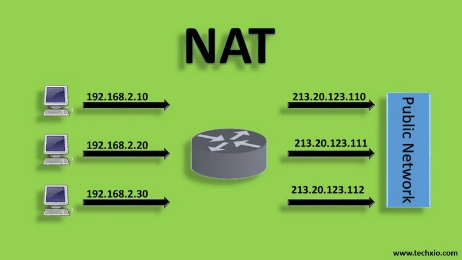
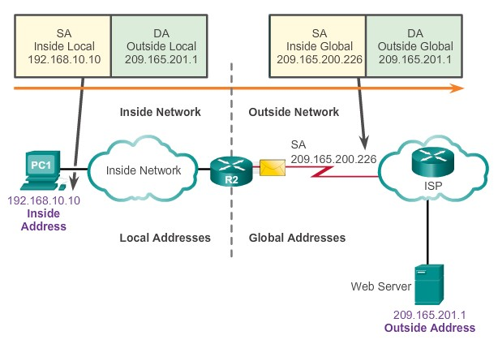
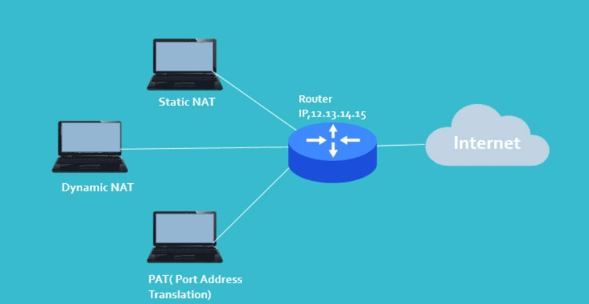

# TÌM HIỂU VỀ NAT
**IP Public**
- IP Public chính là IP ngoại miền. Thực chất, đây là dạng địa chỉ cung cấp bởi tổ chức nắm quyền điều phối mạng internet. Chẳng hạn như phía nhà mạng cung cấp dịch vụ internet.
- Mỗi IP Public luôn mang tính duy nhất, cung cấp bởi phía nhà mạng internet. Điều này đồng nghĩa người dùng không thể tự động thay đổi IP.

**IP Private**
Từng thiết bị hoạt động trong hệ thống mạng nội bộ LAN đều có một địa chỉ IP Private riêng. Mỗi IP Private đều có khả năng liên kết với nhau hình thành mạng router. Tuy nhiên, chúng không kết nối trực tiếp với hệ thống internet bên ngoài.

## I. NAT LÀ GÌ ?
**Khái niệm**
- NAT (Network Address Translation) là một công nghệ kết nối mạng được sử dụng để chuyển đổi địa chỉ IP giữa những mạng khác nhau. Khi một thiết bị trong một mạng cục bộ muốn truy cập Internet hoặc những mạng khác, NAT sẽ thực hiện chuyển đổi địa chỉ IP của thiết bị này từ địa chỉ IP tại mạng cục bộ sang địa chỉ IP công cộng để có thể kết nối với Internet hoặc những mạng khác.
- Ngoài ra, NAT còn cho phép nhiều thiết bị trong một mạng cục bộ có thể chia sẻ cùng một địa chỉ IP công cộng để truy cập Internet hoặc những mạng khác. Việc này giúp tiết kiệm địa chỉ IP công cộng và giúp tăng cường bảo mật của mạng cục bộ.

**Chức năng**
NAT đóng vai trò cực kỳ quan trọng trong hạ tầng mạng Internet với 3 chức năng cốt lõi:
- Giải quyết sự khan hiếm địa chỉ IPv4: Địa chỉ IPv4 chỉ có khoảng 4,3 tỷ địa chỉ và đã cạn kiệt. NAT cho phép hàng nghìn máy tính trong cùng một công ty hoặc hộ gia đình dùng chung duy nhất một địa chỉ Public IP để ra Internet.
- Tăng cường tính bảo mật (Security): Vì NAT ẩn toàn bộ địa chỉ Private IP nội bộ bên trong, các hacker từ Internet bên ngoài sẽ không thể nhìn thấy cấu trúc mạng hay "nhìn thẳng" vào máy tính của bạn, giúp giảm thiểu nguy cơ bị tấn công trực diện.
- Tránh xung đột địa chỉ: Khi sát nhập hai công ty hoặc cấu hình hai hệ thống mạng có dải IP trùng nhau (ví dụ cả hai đều dùng dải 192.168.1.0/24), NAT giúp dịch chuyển một bên sang dải IP khác mà không cần phải cài đặt lại IP cho từng máy tính.

**Thuật ngữ trong NAT**
+ **Địa chỉ inside local**: Đây là địa chỉ IP được đặt cho 1 thiết bị ở mạng nội bộ bên trong. Nó không được cung cấp bởi NIC (Network Information Center).
+ **Địa chỉ inside global**: Đây là địa chỉ IP đã được đăng ký tại NIC. Địa chỉ inside global thường được dùng để thay thế cho địa chỉ IP inside local.
+ **Địa chỉ outside local**: Đây là địa chỉ IP của một thiết bị nằm ở mạng bên ngoài. Các thiết bị thuộc mạng bên trong sẽ tìm thấy thiết bị thuộc mạng bên ngoài thông qua địa chỉ IP này. Địa chỉ outside local không nhất thiết phải được đăng ký với NIC. Nó hoàn toàn có thể là một địa chỉ Private.
+ **Địa chỉ outside global**: Đây là địa chỉ IP được đặt cho một thiết bị nằm ở mạng bên ngoài. Địa chỉ này là một IP hợp lệ trên mạng internet.

## II. PHÂN LOẠI NAT
NAT (Network Address Translation) trong mạng có thể được phân loại thành 3 loại chính dựa trên cách thức thực hiện chuyển đổi địa chỉ IP:

- **Static NAT (NAT tĩnh)**
- Đặc điểm: Ánh xạ cố định 1-1 giữa một địa chỉ Private IP và một địa chỉ Public IP.
- Ứng dụng: Thường dùng cho các máy chủ nội bộ cần mở ra cho bên ngoài truy cập liên tục như Web Server, Mail Server.
- Ví dụ: Máy Server có IP 192.168.1.100 luôn được dịch thành Public IP 203.0.113.5.

**Cách cấu hình Static NAT như sau:**
- Thiết lập mối quan hệ chuyển đổi giữa địa chỉ IP cục bộ và Public bên ngoài:
_Router (config) # ip nat inside source static [local ip] [global ip]_
- Xác định cổng kết nối với mạng nội bộ:
_Router (config-if) # ip nat inside_
- Xác định cổng kết nối với mạng bên ngoài:
_Router (config-if) # ip nat outside_

**Dynamic NAT (NAT động)**
- Đặc điểm: Ánh xạ theo kiểu mượn tạm. Doanh nghiệp sẽ thuê một nhóm (Pool) gồm vài địa chỉ Public IP. Khi một máy nội bộ ra Internet, Router sẽ bốc đại một Public IP còn trống trong nhóm để gán cho máy đó. Khi máy dùng xong, IP đó sẽ được trả lại nhóm.
- Ứng dụng: Hiện nay ít dùng vì nếu số máy tính muốn ra ngoài nhiều hơn số Public IP sẵn có trong nhóm, các máy đến sau sẽ bị chặn kết nối.

**Cách cấu hình Dynamic NAT như sau:**
- Xác định địa chỉ IP của mạng bên ngoài:
_Router (config) # ip nat pool [name start ip] [name end ip] netmask [netmask]/prefix-lenght [prefix-lenght]_
- Thiết lập ACL để tạo danh sách các địa chỉ mạng cục bộ được phép chuyển đổi IP:
_Router (config) # access-list [access-list-number-permit] source [source-wildcard]_
- Thiết lập mối quan hệ giữa địa chỉ nguồn (được thiết lập trong ACL) và địa chỉ IP hợp lệ bên ngoài:
_Router (config) # ip nat inside source list <acl-number> pool <name>_
- Xác định cổng kết nối với mạng nội bộ:
_Router (config-if) # ip nat inside_
- Xác định cổng kết nối với mạng bên ngoài:
_Router (config-if) # ip nat outside_

**PAT (Port Address Translation / NAT Overload)**
- Đặc điểm: Đây là loại NAT phổ biến nhất (đang chạy trên Modem Wi-Fi ở nhà bạn). Nó cho phép tất cả các máy Private IP dùng chung 1 Public IP duy nhất, nhưng phân biệt nhau bằng số cổng (Port Number)
- Ví dụ: PC0 dùng Public_IP:port 5001, PC1 dùng Public_IP:port 5002 để ra ngoài.

**Cách cấu hình NAT Overload như sau:**
- Xác định các địa chỉ IP mạng nội bộ cần ánh xạ ra bên ngoài:
_Router (config) # access-list <ACL-number> permit <source> <wildcard>_
- Cấu hình để chuyển địa chỉ IP đến cổng kết nối với mạng bên ngoài:
_Router (config) # ip nat inside source list <ACL-number> interface <interface> overload_
- Xác định các cổng kết nối với mạng bên trong:
_Router (config-if) # ip nat inside_
- Xác định các cổng kết nối với mạng bên ngoài:
_Router (config-if) # ip nat outside_

## III. CƠ CHẾ HOẠT ĐỘNG CỦA NAT
Để hiểu cách NAT vận hành, hãy xem dòng chảy của một gói tin đi từ PC0 (trong nhà) ra Web Server (Internet) và quay trở lại:

**Lượt đi: Từ trong nhà ra Internet**
+ PC0 (192.168.1.11) gửi yêu cầu lướt web đến Server (8.8.8.8) với Port nguồn là 1025.
+ Gói tin đi đến Router chạy NAT. Router thấy gói tin muốn đi ra ngoài, nó sẽ thực hiện thao tác:
+ Giữ nguyên IP đích (8.8.8.8).
+ Bóc IP nguồn (192.168.1.11) ra, thay thế bằng Public IP của nhà mạng cấp (203.0.113.1).
+ Cấp cho gói tin một Port nguồn mới (ví dụ: 4500).
+ Router ghi chép giao dịch này vào một cuốn sổ gọi là Bảng biên dịch NAT (NAT Translation Table): 192.168.1.11:1025 <---> 203.0.113.1:4500.
+ Router phóng gói tin đã được "đổi vỏ" ra Internet.
**Lượt về: Từ Internet phản hồi lại trong nhà**
+ Web Server nhận được gói tin, xử lý và gửi gói tin phản hồi quay lại. Lúc này, IP đích của gói phản hồi chính là 203.0.113.1 (Public IP của Router) và Port đích là 4500.
+ Gói tin về đến Router. Router mở bảng NAT Translation Table ra tra cứu: "Cổng 4500 đang dẫn về ông nào bên trong mạng nhỉ?".
+ Bảng NAT báo kết quả: Cổng 4500 thuộc về máy 192.168.1.11:1025.
+ Router lập tức thay IP đích thành 192.168.1.11, đổi Port đích thành 1025 rồi đẩy gói tin xuống Switch để trả về cho PC0.

## IV. ĐẶC ĐIỂM CỦA NAT
### 1. ƯU ĐIỂM
- **Kéo dài tuổi thọ cho giao thức IPv4**: Đây là lợi ích lớn nhất. Thay vì mỗi thiết bị trên thế giới (điện thoại, laptop, tivi...) cần một IP Public riêng, NAT cho phép hàng trăm, hàng nghìn thiết bị trong cùng một mạng nội bộ dùng chung một địa chỉ IP Public duy nhất để ra Internet. Nếu không có NAT, kho địa chỉ IPv4 đã hoàn toàn sập từ nhiều năm trước.
- **Tiết kiệm chi phí thuê IP**: Địa chỉ IP Public là tài nguyên phải thuê từ các nhà mạng (ISP) với chi phí không hề rẻ. Nhờ có NAT (đặc biệt là cơ chế PAT/NAT Overload), doanh nghiệp chỉ cần thuê 1 hoặc một vài IP Public là đủ cho toàn bộ nhân viên lướt web.
- **Tăng cường tính bảo mật nội bộ**: NAT che giấu toàn bộ sơ đồ địa chỉ IP Private bên trong mạng LAN. Đối với thế giới Internet bên ngoài, họ chỉ nhìn thấy địa chỉ IP Public của Router. Hacker không thể quét (scan) hoặc tấn công trực diện vào các máy tính nội bộ nếu không có sự cho phép trước.
- **Linh hoạt trong quản trị mạng**: Khi doanh nghiệp thay đổi nhà mạng ISP hoặc thay đổi sơ đồ IP nội bộ, người quản trị không cần phải đi cấu hình lại IP cho từng máy tính. NAT sẽ tự động xử lý việc dịch chuyển ở cửa ngõ, giúp hệ thống hoạt động liên tục không bị gián đoạn.

### 2. NHƯỢC ĐIỂM
- **Giới hạn số lượng kết nối**: NAT giới hạn số lượng kết nối mà một địa chỉ IP có thể mở đồng thời. Điều này có thể gây ra những vấn đề cho những ứng dụng đòi hỏi số lượng kết nối lớn như những ứng dụng P2P, game trực tuyến hay những trang web phục vụ nhiều người dùng cùng lúc.
- **Hạn chế về độ trễ và tốc độ**: NAT có thể làm giảm tốc độ mạng do các gói tin phải trải qua quá trình chuyển đổi địa chỉ IP. Việc này có thể gây ra độ trễ cao và giảm hiệu suất mạng.
Khó khăn trong việc xác định kết nối: NAT khiến cho việc xác định kết nối trở nên khó khăn, đặc biệt là khi kết nối được thiết lập thông qua nhiều tường lửa và router. Điều này có thể gây ra những vấn đề khi gỡ lỗi mạng hay khi cấu hình những thiết bị mạng.
- **Vấn đề liên quan đến bảo mật**: Một số cuộc tấn công từ bên trong mạng có thể vượt qua NAT và gây ra những vấn đề bảo mật cho nhiều thiết bị trong mạng.
- **Vấn đề tương thích**: NAT có thể gây ra những vấn đề về tương thích khi kết nối những thiết bị trong mạng cục bộ đến những dịch vụ trực tuyến hoặc khi sử dụng những ứng dụng đòi hỏi địa chỉ IP duy nhất như VoIP hay game trực tuyến. Khi NAT được sử dụng, nhiều thiết bị trong mạng cục bộ sẽ sử dụng cùng một địa chỉ IP công cộng. Điều này có thể gây ra sự cố khi những thiết bị này đang cố gắng truy cập cùng một dịch vụ trực tuyến đòi hỏi địa chỉ IP riêng.
s
## V. SO SÁNH SOURCE NAT VÀ DESTINATION NAT
|            Tiêu chí so sánh           |                                                   Source NAT (SNAT)                                                  |                                                      Destination NAT (DNAT)                                                      |
|:-------------------------------------:|:--------------------------------------------------------------------------------------------------------------------:|:--------------------------------------------------------------------------------------------------------------------------------:|
| Bản chất định nghĩa                   | Là kỹ thuật thay đổi địa chỉ IP Nguồn (Source IP) của gói tin khi đi qua Router.                                     | Là kỹ thuật thay đổi địa chỉ IP Đích (Destination IP) của gói tin khi đi qua Router.                                             |
| Trường bị chỉnh sửa trong IP Header   | Source IP Address                                                                                                    | Destination IP Address                                                                                                           |
| Bắt đầu luồng dữ liệu                 | Thiết bị bên trong mạng nội bộ (LAN) chủ động gửi gói tin ra ngoài Internet.                                         | Thiết bị bên ngoài Internet (WAN) chủ động gửi gói tin vào hệ thống bên trong.                                                   |
| Mục đích sử dụng cốt lõi              | * Giúp các máy tính dùng IP Private nội bộ có thể truy cập Internet. * Tiết kiệm số lượng địa chỉ IP Public.         | * Công khai các dịch vụ nội bộ (Web, Mail, Camera) ra ngoài Internet để người dùng từ xa truy cập vào.                           |
| Dạng cấu hình thường gặp trên Router  | * PAT (Port Address Translation) * NAT Overload * Dynamic NAT                                                        | * Static NAT (Ánh xạ 1-1 cố định) * Port Forwarding (Mở cổng dịch vụ) * Virtual Server                                           |
| Trạng thái bảng biên dịch (NAT Table) | Được tạo động (Dynamic) khi máy nội bộ có nhu cầu ra ngoài, và tự xóa sau một khoảng thời gian không dùng (Timeout). | Thường được người quản trị cấu hình tĩnh (Static) cố định, luôn luôn tồn tại trên Router.                                        |
| Góc nhìn Bảo mật (Security)           | Ẩn giấu cấu hình bên trong: Internet không thể chủ động nhìn thấy hay tấn công trực tiếp vào IP Private của PC.      | Mở đường có kiểm soát: Chỉ mở đúng cổng dịch vụ cần thiết (ví dụ cổng 80/443 của Web Server), các cổng khác vẫn đóng để an toàn. |
| Ví dụ                                 | Bạn ngồi ở nhà (IP: 192.168.1.11) mở trình duyệt để đọc báo trên trang VnExpress.                                    | Bạn đứng ở quán cà phê, dùng 4G để truy cập vào hệ thống Camera giám sát đặt ở nhà bạn.                                          |
