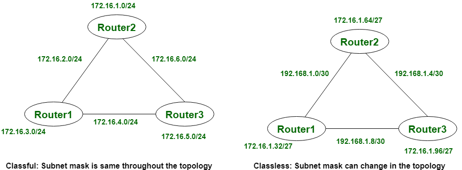

# TỔNG QUAN VỀ CLASSFUL VÀ CLASSLESS
- Định tuyến theo lớp và định tuyến không theo lớp là hai cách khác nhau để quản lý và cấu trúc địa chỉ IP trong mạng. Định tuyến theo lớp là một phương pháp cũ hơn, trong đó các địa chỉ IP được chia thành các lớp cố định như A, B, C và các lớp còn lại, mỗi lớp đều có mặt nạ mạng được thiết lập sẵn. Bằng cách này, thông tin về mặt nạ mạng con không được truyền tải trong các bản cập nhật định tuyến và đây là một hệ thống đơn giản với ít tính linh hoạt hơn.

- Tuy nhiên, định tuyến không phân lớp hỗ trợ VLSM và do đó cho phép mặt nạ mạng con có độ dài thay đổi. Điều này đảm bảo rằng nhiều địa chỉ IP được sử dụng hiệu quả bằng cách mang thông tin mặt nạ mạng con trong các bản cập nhật định tuyến. Điều này mang lại tính linh hoạt và khả năng mở rộng cao hơn, do đó phù hợp hơn với các mạng hiện đại.

## CLASSFUL
- **Khái niệm** 
Định tuyến theo lớp (Classful Routing) không nhập mặt nạ mạng con. Trong trường hợp này, mặt nạ mạng con cũng được cung cấp sau khi cập nhật tuyến đường. Trong định tuyến theo lớp, mặt nạ mạng con là như nhau trên toàn mạng và không thay đổi đối với tất cả các thiết bị, như hình ảnh minh họa. Định tuyến theo lớp không hỗ trợ VLSM (Variable Length Subnet Mask) và CIDR (Classless Inter-Domain Routing). 

- **Ưu điểm**
+ _Tính đơn giản_: Định tuyến theo lớp rất đơn giản và dễ hiểu; do đó, nó tương đối dễ triển khai và quản lý.
+ _Khả năng tương thích_: Hầu hết các giao thức định tuyến và thiết bị cũ chỉ hỗ trợ định tuyến theo lớp; do đó, nó vẫn là một tiêu chuẩn trong các hệ thống cũ.
+ _Gán mặt nạ mạng con tự động_: Mỗi lớp đều có một mặt nạ mạng con mặc định, giúp giảm thiểu nhu cầu cấu hình thủ công.

- **Nhược điểm**
+ _Sử dụng địa chỉ IP không hiệu quả_: Kỹ thuật định tuyến này sử dụng khái niệm về khối địa chỉ IP có kích thước cố định, điều này lại gây lãng phí không gian địa chỉ.
+ _Thiếu tính linh hoạt_: Nó không hỗ trợ VLSM—Mặt nạ mạng con có độ dài thay đổi . Việc tạo mạng con được thực hiện trên các khối có kích thước cố định, đôi khi rất lớn so với yêu cầu cụ thể.
+ _Khả năng mở rộng hạn chế_: Do cấu trúc cứng nhắc của định tuyến theo lớp, nó có thể trở nên kém hiệu quả về mặt sử dụng địa chỉ IP và quản lý mạng lưới lớn hơn khi mạng lưới bắt đầu phát triển.

## CLASSLESS
- **Khái niệm**
Định tuyến không phân lớp (Classless Routing) nhập mặt nạ mạng con và sử dụng các bản cập nhật được kích hoạt. Trong định tuyến không phân lớp, VLSM (Mặt nạ mạng con có độ dài thay đổi) và CIDR (Định tuyến liên miền không phân lớp) được hỗ trợ. Trong định tuyến không phân lớp, các thông báo "hello" được sử dụng để kiểm tra trạng thái. Trong định tuyến không phân lớp, mặt nạ mạng con không giống nhau trên toàn hệ thống, nó có thể khác nhau đối với tất cả các thiết bị, như hình ảnh minh họa. 

- **Ưu điểm**
+ _Tối ưu hóa việc sử dụng địa chỉ IP_: Hỗ trợ VLSM, cho phép phân bổ địa chỉ IP hiệu quả hơn, chi tiết hơn mà không lãng phí không gian địa chỉ.
+ _Khả năng mở rộng_: Tăng cường tính linh hoạt trong việc phát triển mạng lưới vì các mạng con được tạo ra phù hợp chính xác với số lượng địa chỉ cần thiết, do đó rất hữu ích trong các mạng lưới lớn và phức tạp.
+ _Hỗ trợ các giao thức định tuyến hiện đại_: Định tuyến không phân lớp này hoạt động tốt với các giao thức hiện đại như OSPF và EIGRP , được thiết kế để định tuyến hiệu quả và linh hoạt.

- **Nhược điểm**
+ _Độ phức tạp_: Định tuyến không phân lớp yêu cầu nhiều thông tin chi tiết hơn về phân chia mạng con và phân bổ địa chỉ IP. Do đó, việc cấu hình và quản lý nó chỉ có thể thực hiện với độ phức tạp cao hơn.
+ _Cần nhiều sức mạnh xử lý hơn_: Việc xử lý thêm thông tin định tuyến chi tiết hơn, chẳng hạn như mặt nạ mạng con, có thể tiêu tốn nhiều tài nguyên của bộ định tuyến.
+ _Không tương thích với các hệ thống cũ hơn_: Khả năng định tuyến không phân lớp có thể không được hỗ trợ bởi các thiết bị và giao thức cũ hơn; do đó, có khả năng xảy ra sự không tương thích trong môi trường hỗn hợp.

**Sự khác biệt giữa 2 giao thức**
|                                          Classful                                          |                                                  Classless                                                 |
|:------------------------------------------------------------------------------------------:|:----------------------------------------------------------------------------------------------------------:|
|   Trong định tuyến theo lớp, VLSM (Mặt nạ mạng con có độ dài thay đổi) không được hỗ trợ.  |       Trong chế độ định tuyến không phân lớp, VLSM (Mặt nạ mạng con có độ dài thay đổi) được hỗ trợ.       |
|                      Định tuyến theo lớp yêu cầu nhiều băng thông hơn.                     |                                 Trong khi đó, nó yêu cầu ít băng thông hơn.                                |
|            Trong định tuyến theo lớp, các thông báo "hello" không được sử dụng.            |                    Trong định tuyến không phân lớp, các thông báo "hello" được sử dụng.                    |
|                       Định tuyến theo lớp không nhập mặt nạ mạng con.                      |                                Trong khi đó, nó nhập khẩu mặt nạ mạng con .                                |
|  Trong định tuyến theo lớp, địa chỉ được chia thành ba phần: Mạng , Mạng con và Máy chủ .  |           Trong định tuyến không phân lớp, địa chỉ được chia thành hai phần: Mạng con và Máy chủ.          |
|     Trong định tuyến theo lớp, các bản cập nhật thường xuyên hoặc định kỳ được sử dụng.    |                   Trong trường hợp này, các bản cập nhật được kích hoạt sẽ được sử dụng.                   |
|  Trong định tuyến theo lớp, CIDR (Định tuyến liên miền không theo lớp) không được hỗ trợ.  | Trong khi đó, định tuyến không phân lớp (classless routing ) hỗ trợ CIDR (Classless Inter-Domain Routing). |
| Trong định tuyến theo lớp, các mạng con không được hiển thị trong các mạng con chính khác. |         Trong định tuyến không phân lớp, các mạng con được hiển thị trong các mạng con chính khác.         |
|                Trong định tuyến theo lớp, lỗi có thể được phát hiện dễ dàng.               |                      Trong định tuyến không phân lớp, việc phát hiện lỗi khá khó khăn.                     |

## Cách đánh địa chỉ IP theo kiểu Classful và Classless
- Đánh địa chỉ IP theo kiểu classful là cách đặt địa chỉ sử dụng luật phân lớp A,B,C. Một địa chỉ sẽ được chia thành hai phần là network và host, đi kèm theo đó là một subnet mask để xác định phần mạng trong một địa chỉ IP.
- Cách địa chỉ IP theo kiểu classless bỏ qua luật phân lớp A,B,C. Các địa chỉ IP sẽ không được xem xét theo lớp, không sử dụng subnet mask. Kiểu đánh địa chỉ Classless xem một địa chỉ IP gồm hai phần là phần prefix và phần host. Các địa chỉ có cùng phần prefix có thể được xem như cùng một nhóm.

Ví dụ:
- Địa chỉ mạng 192.168.1.0 được biểu diễn dưới dạng Classful sẽ là 192.168.1.0 255.255.255.0 và biểu diễn dưới dạng Classless sẽ là 192.168.1.0/24.
- Khác với địa chỉ IPv4, IPv6 chỉ sử dụng cách đánh địa chỉ Classless và không sử dụng cách đánh địa chỉ Classful.

## Tra cứu bảng định tuyến theo kiểu Classful và Classless
- Classless: Khi tồn tại default route trong bảng định tuyến, nếu không có route nào cụ thể match với đích đến của gói tin, default route sẽ được sử dụng.
- Classful: Khi tồn tại default route trong bảng định tuyến, nếu không có route nào cụ thể match với đích đến của gói tin và không có bất kỳ route cụ thể nào trong bảng định tuyến cùng major network với đích đến của gói tin thì default route sẽ được sử dụng.

## Các giao thức định tuyến thuộc trường phái Classful và các giao thức định tuyến thuộc trường phái Classless
- Các giao thức classful: không gửi kèm theo subnet mask trong các bản tin định tuyến từ đó không hỗ trợ VLSM và không hỗ trợ mạng gián đoạn. Các giao thức điển hình là RIPv1 và IGRP.
- Các giao thức classless: có gửi kèm theo subnet mask trong các bản tin định tuyến nên có hỗ trợ VLSM và hỗ trợ mạng gián đoạn. Hầu hết các giao thức hiện nay đều thuộc trường phái classless như RIPv2, OSPF và EIGRP.