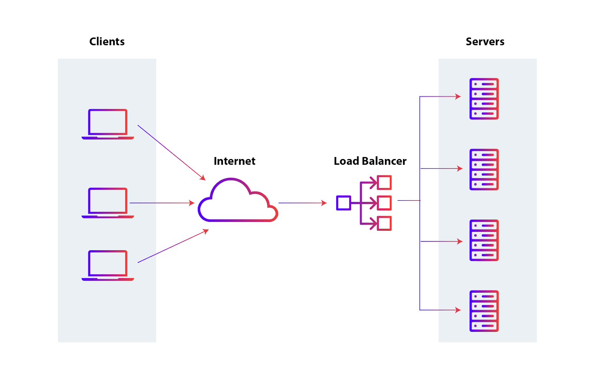
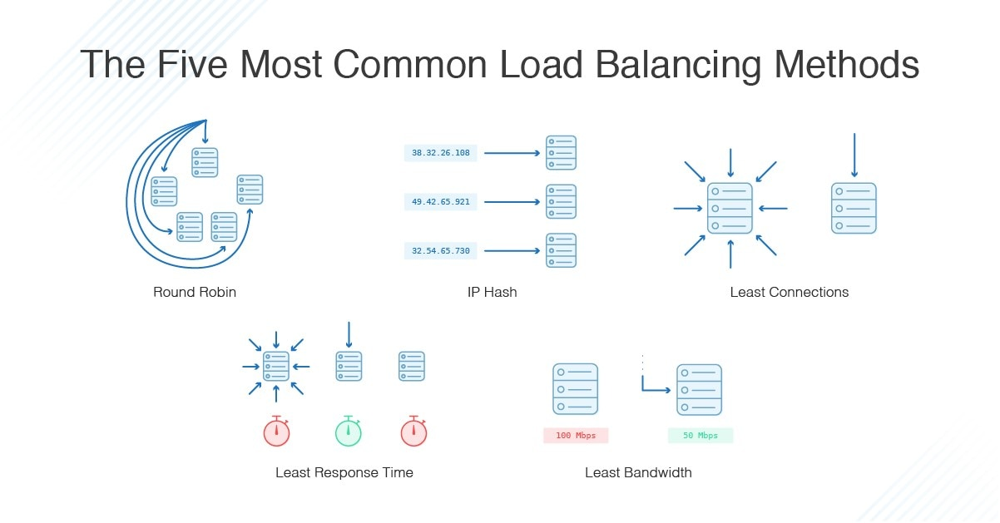

# TÌM HIỂU VỀ LOAD BALANCING
## KHÁI NIỆM
- Load Balancing là kỹ thuật phân phối đồng đều lưu lượng truy cập hoặc tác vụ đến nhiều máy chủ hoặc tài nguyên trong hệ thống nhằm đảm bảo hoạt động ổn định, tối ưu hiệu suất và tránh tình trạng quá tải trên một máy chủ duy nhất. Nhờ áp dụng Load Balancing, các dịch vụ và ứng dụng web có thể phục vụ số lượng lớn người dùng một cách mượt mà, giảm nguy cơ ngừng hoạt động khi có lượng truy cập tăng đột biến hoặc một máy chủ gặp sự cố.

- Load Balancing đóng vai trò quan trọng trong hệ thống công nghệ thông tin hiện đại, đặc biệt đối với các website, dịch vụ cloud và ứng dụng quy mô lớn. Khi có nhiều máy chủ cùng vận hành, Load Balancer sẽ ghi nhận các yêu cầu từ phía người dùng và đưa ra quyết định phân phối đến máy chủ phù hợp, dựa vào thuật toán xác định như Round Robin, Least Connection hoặc IP Hash. Từ đó, khả năng đáp ứng của hệ thống được nâng cao, mức độ bảo mật cũng được cải thiện và dịch vụ luôn duy trì tính sẵn sàng cao.

## CÁCH THỨC HOẠT ĐỘNG CỦA LOAD BALANCING
- Quy trình hoạt động của Load Balancing trải qua 4 bước gồm:

+ _Website tiếp nhận lượng truy cập từ người dùng_: Khi người dùng truy cập vào website, hệ thống phải tiếp nhận đồng thời một lượng lớn các yêu cầu truy vấn, bao gồm các hoạt động như tải trang web, hình ảnh, video hoặc yêu cầu dữ liệu ứng dụng. Trong môi trường hiện đại, lưu lượng này có thể rất lớn và phát sinh liên tục, đặt ra áp lực xử lý đáng kể cho hệ thống máy chủ.
+ _Load balancer xử lý và phân phối yêu cầu đến nhiều máy chủ_: Tất cả các request được hệ thống load balancer tiếp nhận, phân tích và điều hướng đến các máy chủ phù hợp trong nhóm tài nguyên. Bộ cân bằng tải sẽ lựa chọn máy chủ dựa trên trạng thái hoạt động hiện tại nhằm đảm bảo không máy chủ nào bị quá tải, từ đó nâng cao tốc độ xử lý và tối ưu hiệu suất cho toàn hệ thống web/app.
+ _Máy chủ tiếp nhận, xử lý và gửi phản hồi hoặc chuyển yêu cầu lại cho load balancer_: Sau khi nhận được yêu cầu, mỗi máy chủ thực hiện các tác vụ xử lý, truy xuất dữ liệu hoặc thực hiện chức năng mà người dùng mong muốn. Nếu máy chủ không thể tiếp nhận thêm yêu cầu do quá tải, nó sẽ phản hồi cho load balancer để bộ cân bằng tải tiếp tục phân phối các yêu cầu mới đến các nút máy chủ còn lại.
+ _Máy chủ gửi phản hồi trở lại người dùng_: Khi quá trình xử lý được hoàn tất, các máy chủ sẽ gửi kết quả hoặc dữ liệu phản hồi về cho load balancer, từ đó chuyển tiếp đáp án cuối cùng đến người dùng truy cập. Quá trình này giúp đảm bảo tất cả lưu lượng truy cập được xử lý đồng đều, không gây nghẽn hay ngừng hoạt động cho website, kể cả trong các thời điểm cao điểm truy cập.

## LỢI ÍCH CỦA LOAD BALANCING
Load Balancing mang lại nhiều lợi ích vượt trội trong quản trị hệ thống và tối ưu trải nghiệm cho người dùng truy cập website hoặc dịch vụ trực tuyến:
+ _Đảm bảo tính sẵn sàng và tăng uptime cho hệ thống_: Khi một máy chủ gặp sự cố hoặc offline, Load Balancer sẽ tự động điều hướng lưu lượng truy cập sang các máy chủ còn lại đang hoạt động. Việc này giúp hệ thống luôn duy trì sự ổn định, đảm bảo tiêu chí sẵn sàng liên tục với uptime có thể đạt tới 99.99%. Với các dịch vụ được cung cấp bởi Vietnix, bạn sẽ luôn được đảm bảo cam kết uptime ở mức 99.9%.
+ _Tăng khả năng mở rộng linh hoạt_: Doanh nghiệp có thể bổ sung thêm nhiều máy chủ mới vào hệ thống mà không cần dừng hoạt động dịch vụ. Lưu lượng truy cập sẽ được phân phối đều, giúp website dễ dàng đáp ứng nhu cầu tăng trưởng truy cập vào các thời điểm cao điểm hay khi tăng quy mô hoạt động.
+ _Nâng cao hiệu quả xử lý và tốc độ truy cập_: Việc kết hợp sức mạnh của nhiều máy chủ trong cùng hệ thống giúp tối đa hóa khả năng chịu tải, cải thiện thời gian phản hồi và mang lại trải nghiệm mượt mà cho khách truy cập. Mọi request được phân phối hợp lý nên không máy chủ nào bị quá tải, tránh tình trạng mạng nghẽn hoặc chậm.
+ _Giảm thời gian chết, duy trì dịch vụ liên tục_: Load Balancing cho phép các đơn vị tổ chức bảo trì, nâng cấp máy chủ mà vẫn đảm bảo dịch vụ không bị gián đoạn. Khi một máy chủ cần bảo trì, lưu lượng truy cập sẽ được chuyển sang máy chủ khác trong hệ thống.
+ _Nâng cao bảo mật hệ thống_: Người dùng khi kết nối chỉ tiếp xúc với Load Balancer, không truy cập trực tiếp vào backend, giúp hạn chế các nguy cơ tấn công hoặc truy cập trái phép vào tài nguyên. Load Balancer còn có thể bổ sung thêm tính năng bảo mật như chống DDoS, giảm tải mã hóa, bảo vệ toàn diện cho các ứng dụng và dữ liệu của doanh nghiệp.
+ _Dự đoán và quản lý lỗi hiệu quả_: Hệ thống có thể tự động phát hiện sớm các lỗi, tắc nghẽn hoặc sự cố trong mạng lưới máy chủ và thực hiện chuyển hướng hoặc phân phối lại lưu lượng truy cập đến các tài nguyên khác mà không ảnh hưởng tới quá trình sử dụng dịch vụ.

## PHÂN LOẠI LOAD BALANCER
### Load Balancer L4 (Layer 4)
Load balancer L4 hoạt động tại tầng truyền tải (Transport) trong mô hình OSI, chủ yếu dựa vào thông tin địa chỉ IP và port (TCP/UDP) để phân phối lưu lượng truy cập tới các máy chủ trong hệ thống. Loại này không phân tích nội dung của gói tin, mà chỉ xử lý yêu cầu về mặt kết nối, giúp tối ưu tốc độ phân phối và giảm độ trễ. L4 phù hợp cho các dịch vụ yêu cầu tốc độ xử lý cao mà không cần kiểm tra nội dung chi tiết như truyền tải file, ứng dụng đơn giản.

### Load Balancer L7 (Layer 7)
Load balancer L7 hoạt động ở tầng ứng dụng (Application Layer), phân phối lưu lượng dựa trên nội dung HTTP/HTTPS hoặc các thông tin ở mức ứng dụng như URL, cookie, header, host,…. Loại này có khả năng phân tích sâu nội dung mỗi request, hỗ trợ các kỹ thuật như cân bằng qua đường dẫn URL hoặc chuyển hướng theo loại tài nguyên truy cập. L7 giúp tối ưu việc chia tải cho các ứng dụng web động, cho phép kiểm soát chi tiết quá trình định tuyến và nâng cao bảo mật hệ thống.

### GSLB (Global Server Load Balancer)
GSLB là giải pháp cân bằng tải ở cấp độ toàn cầu, giúp phân phối truy cập từ người dùng đến các máy chủ đặt tại các vị trí địa lý khác nhau trên thế giới. GSLB dựa vào các thuật toán phân tích như DNS, hiệu suất máy chủ, vị trí địa lý hoặc trạng thái hiện tại để định tuyến lưu lượng đến máy chủ gần nhất hoặc hiệu quả nhất. Nhờ GSLB, hệ thống web hoặc ứng dụng có thể duy trì hiệu suất truy cập cao, giảm độ trễ và đảm bảo trải nghiệm tốt nhất cho người dùng ở mọi khu vực.

## CÁC GIAO THỨC MÀ LOAD BALANCER CÓ THỂ XỬ LÝ
Quản trị Load Balancer có thể tạo quy định chuyển tiếp để xử lý bốn loại giao thức chính:
+ *HTTP*: Load Balancer thực hiện cân bằng tải theo chuẩn HTTP, điều hướng các yêu cầu dựa trên cơ chế HTTP. Lúc này, Load Balancer sẽ thêm các tiêu đề như X-Forwarded-For, X-Forwarded-Proto và X-Forwarded-Port, giúp các backend nhận biết chính xác thông tin yêu cầu ban đầu từ client.
+ *HTTPS*: Tương tự HTTP nhưng bổ sung mã hóa dữ liệu. Việc xử lý mã hóa có thể được thực hiện theo hai cách: passthrough SSL duy trì đường truyền dữ liệu được mã hóa đến backend hoặc chấm dứt SSL tại Load Balancer, khi đó giải mã diễn ra ở Load Balancer trước khi gửi lưu lượng dữ liệu không mã hóa đến backend.
+ *TCP*: Được sử dụng cho các ứng dụng không chạy trên HTTP hoặc HTTPS, ví dụ như cân bằng tải cho các đóng góp dữ liệu từ cụm cơ sở dữ liệu. Load Balancer điều phối lưu lượng TCP đến các máy chủ backend tương ứng.
+ *UDP*: Một số Load Balancer hiện đại cũng đã hỗ trợ cân bằng tải cho các giao thức sử dụng UDP như DNS, syslogd, giúp cân bằng tải cho các dịch vụ mạng lõi này.

## CÁC THUẬT TOÁN LOAD BALANCER
- Các thuật toán load balancer được sử dụng xác định của máy chủ lành mạnh trên backend sẽ được lựa chọn. Một số các thuật toán thường được sử dụng là:

+ Round Robin - Round Robin có nghĩa là các máy chủ sẽ được lựa chọn theo tuần tự. Bộ load balancer sẽ chọn máy chủ đầu tiên trong danh sách của mình đối với yêu cầu đầu tiên, sau đó di chuyển xuống trong danh sách theo thứ tự, bắt đầu lại ở đầu trang khi đi đến cuối cùng.
+ Least Connections - load balancer sẽ chọn máy chủ với các kết nối ít nhất.
+ Source - Với các thuật toán mã nguồn, load balancer sẽ chọn máy chủ để sử dụng dựa trên một hash của IP nguồn của yêu cầu, chẳng hạn như địa chỉ IP của người truy cập. Phương pháp này đảm bảo rằng một người dùng cụ thể sẽ luôn kết nối với cùng một máy chủ.
Các thuật toán có người quản lý khác nhau tùy thuộc vào công nghệ load balancer sử dụng.

## SO SÁNH LOAD BALANCER Ở PHẦN CỨNG - PHẦN MỀM
Load Balancer có thể được triển khai dưới dạng phần cứng hoặc phần mềm, mỗi loại đều có những ưu điểm và hạn chế riêng phù hợp với từng nhu cầu hệ thống. Load Balancer phần cứng thường mang lại hiệu suất cao và độ tin cậy tốt nhưng chi phí đầu tư và bảo trì lớn, đồng thời tính linh hoạt không cao. Ngược lại, Load Balancer phần mềm linh hoạt hơn, dễ dàng mở rộng, tùy biến và triển khai trên phần cứng phổ thông với chi phí thấp, nhưng hiệu suất có thể không bằng các thiết bị chuyên dụng.
| Tiêu chí          | Load Balancer phần cứng                | Load Balancer phần mềm                                 |
|-------------------|----------------------------------------|--------------------------------------------------------|
| Hiệu năng         | Cao, sử dụng thiết bị chuyên dụng      | Thấp hơn, phụ thuộc tài nguyên phần cứng               |
| Tính linh hoạt    | Kém linh hoạt, khó mở rộng             | Linh hoạt, dễ dàng mở rộng và tùy chỉnh                |
| Khả năng ảo hóa   | Thường tích hợp sẵn                    | Không tích hợp sẵn hoặc có hạn chế                     |
| Kiến trúc         | Yêu cầu dung lượng vật lý lớn          | Dung lượng vật lý thấp, chạy trên hạ tầng phổ thông    |
| Giá thành         | Cao, bao gồm chi phí đầu tư và bảo trì | Thấp hơn, tiết kiệm chi phí triển khai và vận hành     |
| Khả năng cấu hình | Hạn chế, khó thay đổi cấu hình nhanh   | Cao, dễ dàng điều chỉnh và cập nhật thông qua phần mềm |