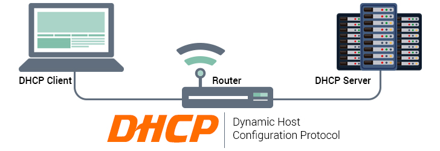
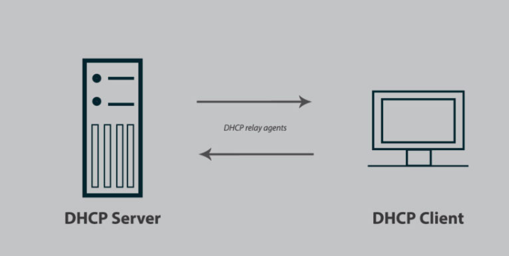
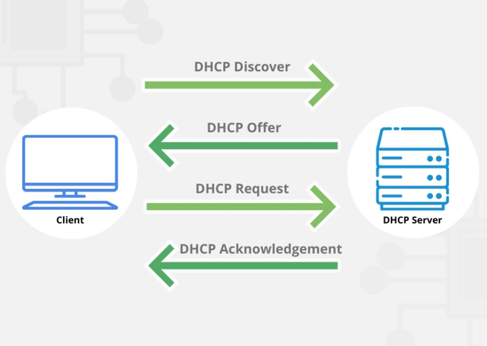

# TÌM HIỂU DHCP
## I. DHCP LÀ GÌ ?
### 1. KHÁI NIỆM DHCP
- DHCP được viết tắt từ cụm từ Dynamic Host Configuration Protocol (có nghĩa là Giao thức cấu hình máy chủ). DHCP có nhiệm vụ giúp quản lý nhanh, tự động và tập trung việc phân phối địa chỉ IP bên trong một mạng. Ngoài ra DHCP còn giúp đưa thông tin đến các thiết bị hợp lý hơn cũng như việc cấu hình subnet mask hay cổng mặc định.

### 2. CHỨC NĂNG CỦA DHCP

### 3. DHCP GỒM NHỮNG THÀNH PHẦN NÀO

- **DHCP Client**
DHCP Client là thiết bị yêu cầu và nhận thông tin cấu hình mạng từ DHCP Server. Các thiết bị như máy tính, điện thoại, hoặc máy in đóng vai trò làm DHCP Client khi cần kết nối mạng. Chúng gửi yêu cầu để nhận địa chỉ IP và các thông số mạng như Subnet Mask, Gateway, và DNS Server. Sau khi nhận được thông tin từ DHCP Server, DHCP Client sử dụng các thông số này để kết nối và giao tiếp trong mạng.

- **DHCP Server**
DHCP Server là máy chủ hoặc thiết bị chịu trách nhiệm cấp phát địa chỉ IP và thông số mạng cho các DHCP Client. Nó lưu trữ một dải địa chỉ IP để phân phối, đồng thời quản lý thông tin thuê địa chỉ IP (DHCP Lease). Ngoài ra, DHCP Server cung cấp các thông tin mạng quan trọng như Subnet Mask, Gateway, và DNS Server, đảm bảo các thiết bị trong mạng có thể kết nối và giao tiếp một cách hiệu quả.

- **DHCP Relay agents**
DHCP Relay Agents là các thiết bị trung gian, đảm nhiệm vai trò chuyển tiếp gói tin DHCP giữa Client và Server khi chúng không nằm trong cùng một mạng (khác Subnet). Relay Agent nhận các gói tin từ DHCP Client trong mạng con và chuyển tiếp chúng đến DHCP Server. Sau khi Server phản hồi, Relay Agent gửi lại thông tin cho Client. Thành phần này rất hữu ích trong các hệ thống mạng lớn, nơi DHCP Server không được triển khai trong từng mạng con.

- **DHCP Lease**
DHCP Lease là khoảng thời gian mà DHCP Server cấp phát địa chỉ IP cho một thiết bị cụ thể. Thời gian thuê này được quản lý để tối ưu hóa việc sử dụng tài nguyên địa chỉ IP trong mạng. Khi thời gian thuê sắp hết, DHCP Client có thể yêu cầu gia hạn để tiếp tục sử dụng địa chỉ IP đó. Nếu không có yêu cầu gia hạn, địa chỉ IP sẽ được giải phóng và tái sử dụng cho thiết bị khác, giúp đảm bảo việc quản lý IP hiệu quả.

- **DHCP Binding**
DHCP Binding là bản ghi lưu trữ trong DHCP Server, chứa thông tin ánh xạ giữa địa chỉ IP được cấp và địa chỉ MAC của thiết bị nhận. Đây là cơ chế giúp DHCP Server ghi lại các thông tin cấp phát, đảm bảo tính nhất quán và minh bạch trong quản lý mạng. Ngoài ra, DHCP Binding cũng hỗ trợ cấp phát địa chỉ IP cố định (Reservation) dựa trên địa chỉ MAC của thiết bị, rất hữu ích cho các thiết bị cần sử dụng một IP cụ thể, chẳng hạn như máy in hoặc máy chủ trong mạng.

### 4. CÁC THÔNG ĐIỆP CỦA DHCP.

- **DHCP Discover**
DHCP Discover là thông điệp đầu tiên do DHCP Client gửi đi dưới dạng broadcast để tìm kiếm DHCP Server khả dụng trong mạng. Đây là tín hiệu “xin chào” từ Client để yêu cầu Server cung cấp địa chỉ IP và các thông số mạng khác. Do Client chưa có địa chỉ IP, gói tin được gửi đến địa chỉ broadcast (255.255.255.255). Thông điệp này khởi đầu quá trình cấp phát IP trong giao thức DHCP.

- **DHCP Offer**
DHCP Offer là thông điệp phản hồi từ DHCP Server gửi đến Client sau khi nhận được gói DHCP Discover. Thông điệp này chứa một địa chỉ IP khả dụng cùng các thông số mạng như Subnet Mask, Gateway, và DNS Server. Đây là bước “đề nghị” của Server để Client lựa chọn. Nếu trong mạng có nhiều DHCP Server, Client có thể nhận được nhiều gói DHCP Offer từ các Server khác nhau.

- **DHCP Request**
DHCP Request là thông điệp Client gửi đến Server để xác nhận việc chấp nhận địa chỉ IP được cung cấp trong DHCP Offer. Thông điệp này thể hiện ý định của Client muốn sử dụng địa chỉ IP cụ thể từ một Server. Nếu Client nhận được nhiều gói DHCP Offer, nó sẽ chỉ chọn một và gửi DHCP Request đến Server đã cung cấp địa chỉ được chọn.

- **DHCP Acknowledge**
DHCP Acknowledge là thông điệp từ DHCP Server xác nhận việc cấp phát địa chỉ IP và hoàn tất quá trình cấu hình mạng. Khi nhận được gói tin này, Client chính thức sở hữu địa chỉ IP cùng các thông số mạng. Server cũng cung cấp thêm thông tin như thời gian thuê địa chỉ IP (Lease Time) để Client sử dụng.

- **DHCP Nak (Negative Acknowledge)**
DHCP Nak là thông điệp từ DHCP Server gửi đến Client để từ chối yêu cầu cấp phát địa chỉ IP. Điều này xảy ra khi yêu cầu của Client không hợp lệ, như khi Client yêu cầu một địa chỉ IP đã hết hạn hoặc không thuộc phạm vi cấp phát của Server. Thông điệp này buộc Client phải bắt đầu lại quá trình cấp phát bằng việc gửi gói DHCP Discover mới.

- **DHCP Decline**
DHCP Decline là thông điệp từ Client gửi đến Server để từ chối sử dụng địa chỉ IP mà Server đã cấp phát. Thông điệp này được gửi đi khi Client phát hiện địa chỉ IP không hợp lệ, ví dụ như xảy ra xung đột địa chỉ IP trong mạng. Sau khi từ chối, Client sẽ gửi lại gói DHCP Discover để yêu cầu một địa chỉ IP khác.

- **DHCP Release**
DHCP Release là thông điệp từ Client gửi đến Server để thông báo rằng địa chỉ IP không còn được sử dụng. Thông điệp này giúp giải phóng địa chỉ IP, cho phép DHCP Server tái sử dụng nó cho các thiết bị khác. Thông điệp này thường được gửi khi Client ngắt kết nối khỏi mạng hoặc tắt thiết bị.

### 5. SƠ ĐỒ HOẠT ĐỘNG DHCP

## II. ĐẶC ĐIỂM DHCP

### 1. ƯU ĐIỂM

### 2. NHƯỢC ĐIỂM

### 3. LỖI CẤU HÌNH DHCP THƯỜNG GẶP
