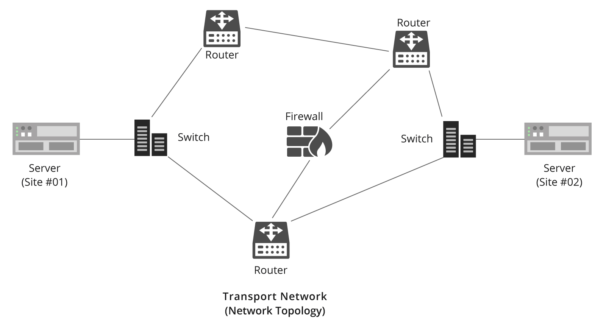
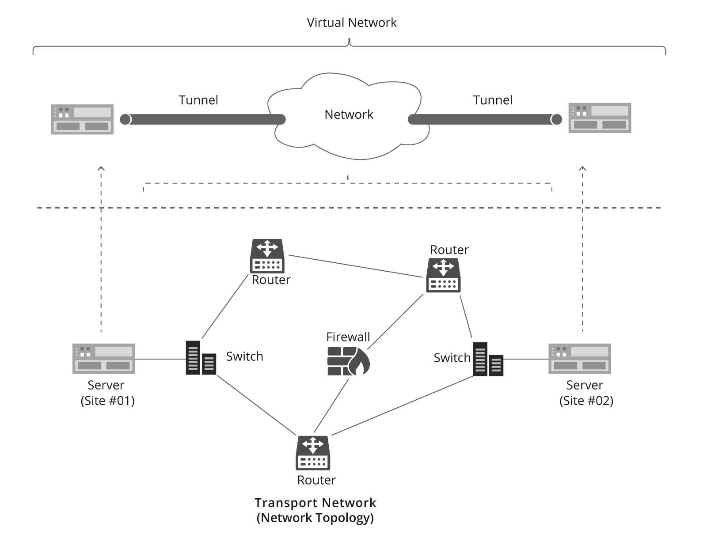

# TÌM HIỂU VỀ OVERLAY VÀ UNDERLAY, PHÂN BIỆT OVERLAY VÀ UNDERLAY NETWORK
## KHÁI NIỆM
### UNDERLAY
- Underlay Network là hạ tầng mạng vật lý nền tảng. Nó bao gồm tất cả các thiết bị phần cứng thực tế và các giao thức định tuyến cơ bản để đảm bảo các thiết bị này có thể nhìn thấy và truyền dữ liệu cho nhau.
+ Thành phần: cáp quang, Switch vật lý, Router vật lý, Tường lửa phần cứng, Máy chủ...
+ Giao thức hoạt động: Các giao thức định tuyến Layer 3 truyền thống như OSPF, IS-IS, BGP hoặc định tuyến tĩnh (Static Route).
+ Nhiệm vụ cốt lõi: Đảm bảo tính thông suốt về mặt IP (IP Reachability). Nhiệm vụ duy nhất của Underlay là chuyển gói tin từ điểm vật lý A đến điểm vật lý B nhanh nhất, ổn định nhất có thể mà không cần quan tâm gói tin đó chứa nội dung gì hay thuộc về khách hàng nào.

### OVERLAY
- Overlay Network là một mạng ảo (mạng logic) được xây dựng và chạy "bọc" ngay phía trên hạ tầng mạng Underlay.
+ Cơ chế hoạt động: Nó sử dụng các công nghệ Đóng gói (Encapsulation) để tạo ra các đường hầm ảo (Tunnels) xuyên qua mạng vật lý. Thiết bị đầu cuối chỉ nhìn thấy mạng Overlay và nghĩ rằng chúng đang cắm chung một sợi dây mạng với nhau.
+ Công nghệ tiêu biểu: VXLAN, GRE, NVGRE, IPsec, hoặc mạng SD-WAN.
+ Nhiệm vụ cốt lõi: Phục vụ các dịch vụ nâng cao như phân tách mạng cho nhiều khách hàng (Multi-tenancy), bảo mật mã hóa dữ liệu, hoặc di chuyển máy ảo xuyên quốc gia mà không cần cấu hình lại phần cứng bên dưới.

### SỰ KHÁC BIỆT GIỮA UNDERLAY VÀ OVERLAY
|              Tiêu chí             |                                            Underlay Network                                           |                                                         Overlay Network                                                         |
|:---------------------------------:|:-----------------------------------------------------------------------------------------------------:|:-------------------------------------------------------------------------------------------------------------------------------:|
| Bản chất                          | Là mạng Vật lý (Physical).                                                                            | Là mạng Ảo / Logic (Virtual).                                                                                                   |
| Vị trí trong kiến trúc            | Nằm ở tầng dưới, làm nền móng cho toàn bộ hệ thống.                                                   | Nằm ở tầng trên, dựa vào Underlay để truyền dẫn dữ liệu.                                                                        |
| Thành phần cấu thành              | Phần cứng thực tế (Cáp quang, Switch, Router, Port vật lý).                                           | Phần mềm, các cổng ảo (vPort) và các đường hầm ảo (Tunnels).                                                                    |
| Địa chỉ định tuyến                | Dùng IP vật lý của các thiết bị mạng (Outer IP/Mạng ngoài).                                           | Dùng IP/MAC ảo của máy ảo, container (Inner IP/Mạng trong).                                                                     |
| Độ linh hoạt                      | Thấp. Muốn thay đổi phải cấu hình lại thiết bị vật lý, bấm lại dây mạng.                              | Cực kỳ cao. Tạo, xóa, sửa cấu hình bằng phần mềm chỉ trong vài giây (SDN).                                                      |
| Khả năng mở rộng                  | Bị giới hạn bởi năng lực phần cứng và số lượng cổng vật lý.                                           | Gần như vô hạn (Ví dụ: VXLAN mở rộng tới 16 triệu mạng ảo).                                                                     |
| Các giao thức sử dụng             | Chuyển mạch Ethernet, VLAN, và các giao thức định tuyến (OSPF, IS-IS, BGP).                           | VXLAN, NVGRE, STT, GRE, NVO3, và EVPN.                                                                                          |
| Tính độc lập ứng dụng             | Phụ thuộc chặt chẽ vào vị trí địa lý của thiết bị phần cứng.                                          | Hoàn toàn độc lập với phần cứng; ứng dụng dịch chuyển đi đâu cũng không đổi cấu hình mạng.                                      |
| Cơ chế chống Loop                 | Phức tạp, phụ thuộc vào STP (Spanning Tree) dễ gây nghẽn hoặc lãng phí đường truyền dự phòng.         | Dễ dàng, tận dụng thuật toán định tuyến Layer 3 (như ECMP) để chạy đa đường song song mà không sợ bị lặp.                       |
| Khắc phục sự cố (Troubleshooting) | Dễ dàng đo đạc vật lý (Kiểm tra tín hiệu cáp, ping IP phần cứng, check cổng quang).                   | Phức tạp hơn (Phải dùng các công cụ bóc tách gói tin sâu như Wireshark để xem luồng dữ liệu đóng gói bên trong đường hầm).      |
| Mô hình bảo mật cốt lõi           | Bảo mật dựa trên Vật lý & Cổng (Khóa cổng Switch, ACL trên Router phần cứng, đặt Firewall vùng cứng). | Bảo mật dựa trên Chính sách phần mềm (Micro-segmentation), cô lập dữ liệu bằng mã hóa đường hầm (IPsec, VXLAN VNI).             |
| Mức độ chịu lỗi (Resilience)      | Khi một Switch vật lý sập, toàn bộ các cổng cắm trên đó sẽ mất kết nối ngay lập tức.                  | Khi một đường hầm ảo bị đứt, phần mềm tự động tìm đường hầm khác chạy vòng qua trên hạ tầng Underlay mà user không hề hay biết. |

