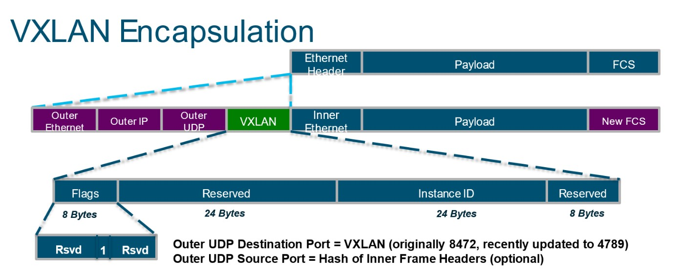

# TÌM HIỂU CHI TIẾT VỀ VXLAN
## KHÁI NIỆM
- VXLAN (Virtual Extensible LAN) là một công nghệ mạng ảo hóa (Network Virtualization) thuộc nhóm Overlay Network.
- Nhiệm vụ cốt lõi của VXLAN là: Giả lập một mạng Layer 2 (Switch ảo) chạy đè lên trên hạ tầng mạng Layer 3 (Router/Internet) sẵn có.

## TẠI SAO PHẢI CẦN VXLAN
VLAN đã làm rất tốt nhiệm vụ của nó trong hàng chục năm qua, nhưng khi kỷ nguyên Cloud và Data Center bùng nổ, VLAN lộ rõ 2 điểm yếu chí mạng:

| Đặc điểm                 | VLAN                                                                                                                                        | VXLAN                                                                                                                                                        |
|--------------------------|---------------------------------------------------------------------------------------------------------------------------------------------|--------------------------------------------------------------------------------------------------------------------------------------------------------------|
| Giới hạn số lượng mạng   | Chỉ hỗ trợ tối đa 4,096 mạng (do ID dài 12-bit). Với các ông lớn như AWS hay Azure có hàng triệu khách hàng, con số này hoàn toàn không đủ. | Hỗ trợ lên tới 16 triệu mạng ảo độc lập (ID dài 24-bit, gọi là VNI - VXLAN Network Identifier).                                                              |
| Khả năng xuyên biên giới | Không thể. VLAN chỉ chạy được trong phạm vi nội bộ (phạm vi của Switch L2). Không thể cấu hình VLAN đi qua các Router Layer 3.              | Hoàn toàn có thể. VXLAN đóng gói dữ liệu thành gói tin UDP thông thường, cho phép nó thoải mái đi qua bất kỳ Router hay nhà mạng Internet nào trên thế giới. |
| Cơ chế chống vòng lặp    | Dùng STP (Spanning Tree Protocol) -> Phải khóa bớt một số đường truyền dự phòng để tránh Loop (gây lãng phí băng thông).                    | Tận dụng định tuyến L3 thông minh (ECMP - Equal-Cost Multi-Path) để chạy cùng lúc trên tất cả các đường truyền, tăng tối đa băng thông.                      |

## KIẾN TRÚC VÀ THÀNH PHẦN CỦA VXLAN
1. VTEP (VXLAN Tunnel Endpoint)
+ Đây là thiết bị chịu trách nhiệm đóng gói và xé gói dữ liệu. VTEP có thể là một thiết bị cứng (Switch vật lý hỗ trợ VXLAN) hoặc thiết bị mềm (như Switch ảo Open vSwitch, hoặc chính Nhân Kernel Linux của máy chủ ảo hóa).
+ Khi máy ảo gửi gói tin đi: VTEP nguồn sẽ nhận lấy gói tin L2, bọc thêm tiêu đề (Header) VXLAN, bọc tiếp IP của VTEP đích rồi ném ra mạng L3.
+ Khi nhận gói tin đến: VTEP đích sẽ gỡ bỏ các lớp vỏ bọc bên ngoài, trả lại gói tin L2 nguyên bản cho máy ảo đích.

2. VNI (VXLAN Network Identifier)
Đây chính là "ID thẻ căn cước" của mạng VXLAN, tương tự như VLAN ID nhưng dài tới 24-bit. Chỉ các máy ảo cấu hình chung một mã VNI mới có thể nói chuyện trực tiếp được với nhau.

3. VXLAN Tunnel (Đường hầm ảo)
Mặc dù gói tin phải đi qua rất nhiều Router trung gian phức tạp ở giữa, nhưng đứng ở góc độ 2 máy ảo, chúng nhìn nhận đường truyền này giống như một sợi dây cáp mạng ảo (Tunnel) nối trực tiếp giữa hai đầu VTEP.

## CẤU TRÚC CỦA MỘT GÓI TIN VXLAN

+ Inner L2 Frame: Gói tin gốc mà máy ảo của bạn gửi đi (chứa IP nguồn 192.168.100.10 và IP đích 192.168.100.20).
+ VXLAN Header: Chứa mã định danh VNI để phân biệt mạng của khách hàng nào.
+ UDP Header: VXLAN sử dụng cổng dịch vụ mặc định là UDP Port 4789 để truyền tải dữ liệu.
+ Outer IP Header: Chứa IP vật lý của 2 đầu VTEP (giúp các Router trung gian biết đường định tuyến để gửi gói tin đi).
+ Outer MAC Header: thực chất là một tiêu đề Ethernet chuẩn (gồm MAC nguồn, MAC đích và EtherType), giúp các thiết bị phần cứng dọc đường (như Switch, Router vật lý) biết phải đẩy gói tin VXLAN này ra cổng mạng nào tiếp theo để đến được đích.

## VXLAN HOẠT ĐỘNG NHƯ THẾ NÀO
- VxLAN cũng cố gắng thực hiện cùng một công việc như VLAN đã làm. Nghĩa là nó cũng cố gắng phân chia mạng thành các mạng ảo riêng biệt. Đầu tiên VxLAN cũng cần một VxLAN header để chỉ ra chỉ số mạng ảo (Virtual Network Identifier – VNI). Tuy nhiên cách đóng gói của VxLAN hơi khác. Thay vì chèn VxLAN header vào giữa frame nguyên thủy ban đầu, switch sẽ chọn cách bao bọc, đóng gói toàn bộ frame bên trong VxLAN header.
- Để có thể truyền phần dữ liệu đã đóng gói VxLAN header này trên một hạ tầng mạng IP Layer 3, thiết bị VxLAN gateway (VTEP) sẽ thêm vào một UDP header. Việc dùng UDP header để đóng gói là một chọn lựa xuất sắc vì UDP sẽ giúp gói tin có thể tận dụng được các cơ chế định tuyến cân bằng tải có sẵn trên mạng truyền dẫn IP (mạng underlay).

- Sau khi đã được đóng gói bởi UDP header, phần địa chỉ IP header ngoài cùng là phần header do mạng truyền dẫn IP thực hiện đóng gói. Trong IP header ngoài cùng này, địa chỉ nguồn là địa chỉ IP của vật lý của router/switch đầu vào, địa chỉ đích là địa chỉ của router/switch/VTEP đầu cuối.
- Trường quan trọng nhất trong VxLAN header chính là mã định danh mạng ảo Virtual Network ID – VNID. Trong hình nó được mô tả bằng Instance-ID. Trường VNID giúp định nghĩa phân đoạn mạng của bạn, ý nghĩa tương tự như VLAN. VNID có chiều dài 24 bit, tương ứng với con số 16 triệu phân đoạn mạng có thể định danh.
- Trường VNID có thể dùng để chỉ ra thông tin lớp 2, ví dụ như vlan. Lúc này chúng ta gọi nó là Layer 2 VNID. Virtual Network-ID cũng có thể dùng để mô tả một dịch vụ ở lớp 3, ví dụ như routing, lúc này chúng ta gọi nó là VN-ID ở Layer 3.
- Các thiết bị thiết lập giữa 2 đầu tunnel gọi là VTEPs hay VXLAN tunnel. Những thiết bị này có thể là máy vật lý, máy ảo, thiết bị mạng như Router và Switch. Đây là nơi tiến trình đóng gói VxLAN và mở gói diễn ra.
- Một thiết bị VTEP có thể đóng vai trò như một VxLAN L2 gateway hoặc VxLAN L3 gateway. Các VTEP sẽ thực hiện chức năng “Bridge” đối với L2 VNID. Với các frame muốn đi qua các VN-ID khác (giống như chức năng routing giữa các vlan truyền thống), lúc này VTEP sẽ “route” frame đến L3 VN-ID để thực hiện chức năng route.
- Do VxLAN có thể mang một layer 2 frame từ nơi này đến một nơi khác thông qua một hạ tầng mạng lớp 3, người ta nói VxLAN hỗ trợ L2 tunneling.

**Tóm tắt**: VXLAN là công nghệ cho phép bạn mở rộng mạng L2 trên bất kỳ mạng L3 nào. Một VxLAN header được dùng để bao bọc L2 frame, sau đó được đóng gói trong UDP để sau cùng chuyến đến cho mạng truyền dẫn vật lý IP. VXLAN có thể cung cấp hàng triệu Vlan mà vẫn đảm bảo tính riêng tư trên mỗi phân đoạn mạng. Đây là điều tuyệt vời đối với  những doanh nghiệp có nhu cầu cung cấp dịch vụ lớn như Cloud.  Mặt khác, VxLAN hỗ trợ cả môi trường ảo hóa.