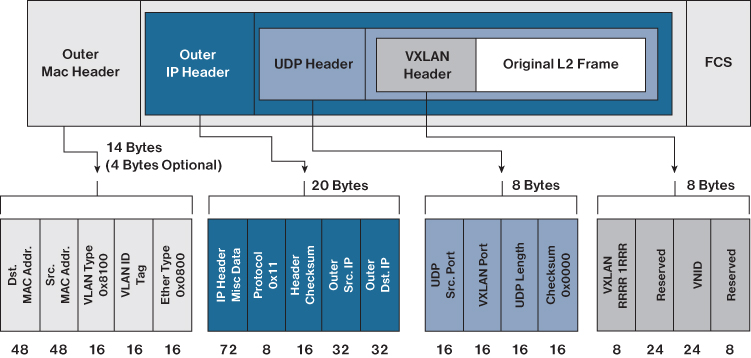

# TÌM HIỂU CHI TIẾT VỀ VXLAN
## KHÁI NIỆM
- VXLAN (Virtual Extensible LAN) là một công nghệ mạng ảo hóa (Network Virtualization) thuộc nhóm Overlay Network.
- Nhiệm vụ cốt lõi của VXLAN là: Giả lập một mạng Layer 2 (Switch ảo) chạy đè lên trên hạ tầng mạng Layer 3 (Router/Internet) sẵn có.

## TẠI SAO PHẢI CẦN VXLAN
VLAN đã làm rất tốt nhiệm vụ của nó trong hàng chục năm qua, nhưng khi kỷ nguyên Cloud và Data Center bùng nổ, VLAN lộ rõ 2 điểm yếu chí mạng:

| Đặc điểm                 | VLAN                                                                                                                                        | VXLAN                                                                                                                                                        |
|--------------------------|---------------------------------------------------------------------------------------------------------------------------------------------|--------------------------------------------------------------------------------------------------------------------------------------------------------------|
| Giới hạn số lượng mạng   | Chỉ hỗ trợ tối đa 4,096 mạng (do ID dài 12-bit). Với các ông lớn như AWS hay Azure có hàng triệu khách hàng, con số này hoàn toàn không đủ. | Hỗ trợ lên tới 16 triệu mạng ảo độc lập (ID dài 24-bit, gọi là VNI - VXLAN Network Identifier).                                                              |
| Khả năng xuyên biên giới | Không thể. VLAN chỉ chạy được trong phạm vi nội bộ (phạm vi của Switch L2). Không thể cấu hình VLAN đi qua các Router Layer 3.              | Hoàn toàn có thể. VXLAN đóng gói dữ liệu thành gói tin UDP thông thường, cho phép nó thoải mái đi qua bất kỳ Router hay nhà mạng Internet nào trên thế giới. |
| Cơ chế chống vòng lặp    | Dùng STP (Spanning Tree Protocol) -> Phải khóa bớt một số đường truyền dự phòng để tránh Loop (gây lãng phí băng thông).                    | Tận dụng định tuyến L3 thông minh (ECMP - Equal-Cost Multi-Path) để chạy cùng lúc trên tất cả các đường truyền, tăng tối đa băng thông.                      |

## KIẾN TRÚC VÀ THÀNH PHẦN CỦA VXLAN
1. VTEP (VXLAN Tunnel Endpoint)
Đây là thiết bị chịu trách nhiệm đóng gói và xé gói dữ liệu. VTEP có thể là một thiết bị cứng (Switch vật lý hỗ trợ VXLAN) hoặc thiết bị mềm (như Switch ảo Open vSwitch, hoặc chính Nhân Kernel Linux của máy chủ ảo hóa).

Khi máy ảo gửi gói tin đi: VTEP nguồn sẽ nhận lấy gói tin L2, bọc thêm tiêu đề (Header) VXLAN, bọc tiếp IP của VTEP đích rồi ném ra mạng L3.

Khi nhận gói tin đến: VTEP đích sẽ gỡ bỏ các lớp vỏ bọc bên ngoài, trả lại gói tin L2 nguyên bản cho máy ảo đích.

2. VNI (VXLAN Network Identifier)
Đây chính là "ID thẻ căn cước" của mạng VXLAN, tương tự như VLAN ID nhưng dài tới 24-bit. Chỉ các máy ảo cấu hình chung một mã VNI mới có thể nói chuyện trực tiếp được với nhau.

3. VXLAN Tunnel (Đường hầm ảo)
Mặc dù gói tin phải đi qua rất nhiều Router trung gian phức tạp ở giữa, nhưng đứng ở góc độ 2 máy ảo, chúng nhìn nhận đường truyền này giống như một sợi dây cáp mạng ảo (Tunnel) nối trực tiếp giữa hai đầu VTEP.

## CẤU TRÚC CỦA MỘT GÓI TIN VXLAN

Inner L2 Frame: Gói tin gốc mà máy ảo của bạn gửi đi (chứa IP nguồn 192.168.100.10 và IP đích 192.168.100.20).

VXLAN Header: Chứa mã định danh VNI để phân biệt mạng của khách hàng nào.

UDP Header: VXLAN sử dụng cổng dịch vụ mặc định là UDP Port 4789 để truyền tải dữ liệu.

Outer IP Header: Chứa IP vật lý của 2 đầu VTEP (giúp các Router trung gian biết đường định tuyến để gửi gói tin đi).
Outer MAC Header: thực chất là một tiêu đề Ethernet chuẩn (gồm MAC nguồn, MAC đích và EtherType), giúp các thiết bị phần cứng dọc đường (như Switch, Router vật lý) biết phải đẩy gói tin VXLAN này ra cổng mạng nào tiếp theo để đến được đích.

┌────────────────────────────────────────────────────────────────────────┐
│  Lớp 1: Outer MAC Header (Thay đổi qua mỗi Router - Hop-by-Hop)         │
├────────────────────────────────────────────────────────────────────────┤
│  Lớp 2: Outer IP Header (IP của 2 đầu VTEP - Giữ nguyên suốt hành trình)│
├────────────────────────────────────────────────────────────────────────┤
│  Lớp 3: UDP Header (Luôn dùng Port đích là 4789)                       │
├────────────────────────────────────────────────────────────────────────┤
│  Lớp 4: VXLAN Header (Chứa mã số VNI, ví dụ: VNI 100)                  │
├────────────────────────────────────────────────────────────────────────┤
│  Lớp 5: Inner L2 Frame (Gói tin gốc nguyên bản của máy ảo bên trong)   │
└────────────────────────────────────────────────────────────────────────┘