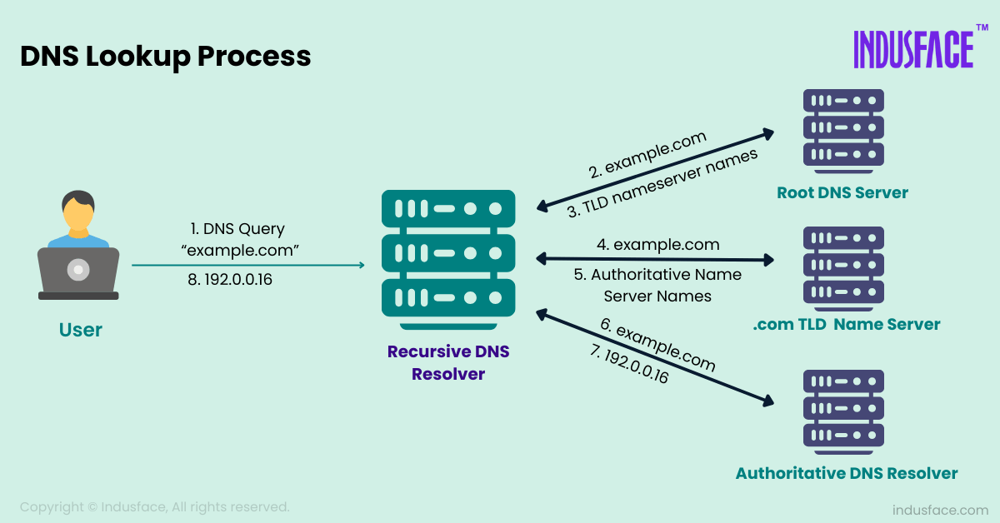
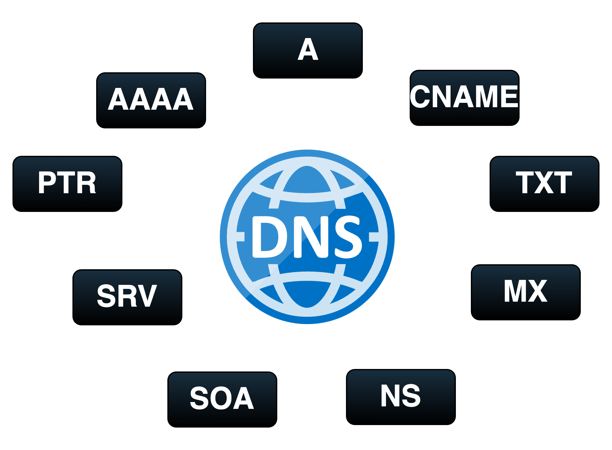

# TÌM HIỂU VỀ DNS
## KHÁI NIỆM
- DNS (Domain Name System) là hệ thống phân giải tên miền trên Internet, có chức năng chính là chuyển đổi các tên miền dễ nhớ như www.example.com thành địa chỉ IP dạng số (ví dụ 192.0.2.1) hoặc ngược lại, mà máy tính dùng để kết nối và trao đổi dữ liệu trên mạng. DNS hoạt động giống như một danh bạ hoặc bộ phiên dịch giữa tên miền và địa chỉ IP, giúp người dùng truy cập website, email và các dịch vụ Internet một cách thuận tiện mà không phải nhớ các dãy số khó nhớ.

## CHỨC NĂNG CỦA DNS
### Chuyển đổi tên miền thành địa chỉ IP
- DNS (Domain Name System) là giao thức phân giải tên miền giúp chuyển đổi tên miền thân thiện (như google.com, vietnix.vn) thành địa chỉ IP mà máy tính hiểu được (ví dụ: 172.217.160.142). Nói cách khác, DNS hoạt động như một “phiên dịch viên” của Internet, giúp trình duyệt tìm đúng máy chủ chứa website bạn muốn truy cập.
- Nhờ hệ thống phân giải tên miền DNS, người dùng không cần ghi nhớ các dãy số phức tạp mà chỉ cần nhập tên miền để truy cập nhanh chóng. Đây là vai trò quan trọng của giao thức DNS trong việc đảm bảo Internet hoạt động trơn tru, ổn định và dễ sử dụng.

### Quản lý tên miền và bản ghi DNS
- DNS không chỉ phân giải tên miền mà còn lưu trữ và quản lý thông tin cấu hình domain thông qua nhiều loại bản ghi DNS khác nhau:
+ *A record (Address):* Liên kết tên miền với địa chỉ IPv4 thật.
+ *MX (Mail Exchange):* Xác định máy chủ nhận email.
+ *CNAME (Canonical Name):* Tạo bí danh, giúp chuyển hướng từ subdomain sang domain chính.
+ *TXT record:* Lưu thông tin xác thực như SPF, DKIM, bảo mật email và chống giả mạo.
Nhờ các bản ghi này, giao thức DNS đảm bảo tên miền hoạt động chính xác cho website, email và các dịch vụ liên quan. Để đảm bảo các cấu hình này không có sai sót, quản trị viên thường sử dụng các công cụ check domain info online để xác minh xem hệ thống đã cập nhật chính xác các bản ghi hay chưa

### Phân giải ngược (Reverse DNS)
- Phân giải ngược là quá trình chuyển đổi địa chỉ IP sang tên miền tương ứng, trái ngược với phân giải xuôi (tên miền sang IP), là tính năng quan trọng trong quản trị mạng, thường dựa trên các bản ghi PTR (Pointer Records) trong hệ thống DNS nhằm mục đích:

+ *Kiểm tra máy chủ email:* Các máy chủ mail sử dụng reverse DNS để xác minh nguồn gửi thư, giúp giảm thiểu thư rác và ngăn chặn giả mạo địa chỉ email.
+ *Xác thực và chống spam:* Doanh nghiệp hoặc nhà cung cấp dịch vụ email sẽ kiểm tra reverse DNS để đảm bảo rằng IP gửi mail có tên miền hợp lệ, tăng độ tin cậy khi giao tiếp email.
+ *Quản lý hệ thống mạng:* Giúp quản trị viên xác định tên miền gắn với một địa chỉ IP, thuận tiện cho việc giám sát, xử lý sự cố hoặc phân tích bảo mật.

### Giúp truy cập website, email và dịch vụ Internet dễ dàng hơn
- Chức năng của DNS không chỉ giới hạn ở việc truy cập website mà còn là nền tảng cho nhiều dịch vụ Internet thiết yếu khác:
+ *Truy cập website:* Khi bạn gõ `youtube.com` vào thanh địa chỉ, DNS giúp trình duyệt của bạn tìm ra địa chỉ IP của máy chủ web nơi website Vietnix được lưu trữ, từ đó tải nội dung website về cho bạn.
+ *Gửi và nhận email:* DNS đóng vai trò quan trọng trong việc định tuyến email. Thông qua các bản ghi đặc biệt như bản ghi MX, DNS giúp xác định máy chủ nào chịu trách nhiệm xử lý và nhận email cho một tên miền cụ thể. Điều này đảm bảo rằng email của bạn được gửi đến đúng hòm thư người nhận.
+ *Hỗ trợ các dịch vụ trực tuyến khác:* Rất nhiều ứng dụng, game online, dịch vụ streaming video và các nền tảng trực tuyến khác cũng dựa vào DNS để thiết lập kết nối đến các máy chủ dịch vụ của chúng một cách chính xác và hiệu quả.

## NGUYÊN LÝ HOẠT ĐỘNG

- *Bước 1:* Bạn gõ google.com. Trình duyệt sẽ hỏi hệ điều hành (máy của bạn), nếu máy bạn chưa từng lưu IP này, nó sẽ gửi yêu cầu tới DNS Resolver của nhà mạng.
- *Bước 2:*DNS Resolver đi hỏi Root Name Server: "Ông có biết IP của google.com không?"
- *Bước 3:*Root Server trả lời: "Tôi không biết, nhưng tôi biết máy chủ quản lý đuôi .com (TLD). Hãy đến địa chỉ IP này mà hỏi."
- *Bước 4:*DNS Resolver tìm đến TLD Server (.com): "Ông có biết IP của google.com không?"
- *Bước 5:*TLD Server trả lời: "Tôi cũng không biết chính xác, nhưng tôi biết máy chủ có thẩm quyền quản lý tên miền google.com (Authoritative). Qua đó mà hỏi."
- *Bước 6:*DNS Resolver tìm đến Authoritative Server: "Tôi muốn xin IP của google.com."
- *Bước 7:*Authoritative Server tra cứu danh sách lưu trữ của nó và trả lời: "Đây rồi! IP của nó là 142.250.190.46."
- *Bước 8:*DNS Resolver cầm IP này quay về trả cho máy của bạn -> Máy bạn lưu vào bộ nhớ tạm (Cache) để lần sau dùng ngay -> Trình duyệt thiết lập kết nối TCP/IP tới IP đó để tải trang web.

## CÁC THÀNH PHẦN CỦA DNS
### DNS RECORD
- Bản ghi DNS là những mẩu thông tin cấu hình được lưu trữ trên các máy chủ DNS có thẩm quyền. Chúng cung cấp chỉ dẫn cụ thể về cách xử lý một yêu cầu DNS cho một tên miền nhất định, ví dụ như trỏ tên miền đến địa chỉ IP nào hoặc máy chủ email nào sẽ nhận thư. Dưới đây là một số loại bản ghi DNS phổ biến và thường được sử dụng:

+ *A Record (Address Record):* Liên kết tên miền với địa chỉ IPv4 của máy chủ. Ví dụ: example.com A 101.105.104.101
+ *Bản ghi CNAME (Canonical Name):* Tạo bí danh cho một tên miền khác, giúp quản lý dễ dàng hơn. Ví dụ: www.example.com CNAME example.com
+ *MX Record (Mail Exchange):* Chỉ định máy chủ xử lý email cho tên miền và hỗ trợ thiết lập thứ tự ưu tiên giữa các máy chủ. Ví dụ: example.com MX mail.example.com
+ *TXT Record (Text Record):* Lưu trữ thông tin dạng văn bản, thường dùng để xác minh quyền sở hữu tên miền (Google Search Console) hoặc thiết lập chính sách bảo mật email như SPF, DKIM, DMARC.
+ *NS Record (Name Server):* Chỉ định máy chủ DNS có thẩm quyền quản lý toàn bộ các bản ghi của tên miền hoặc subdomain.
+ *SRV Record (Service Record):* Xác định vị trí của các dịch vụ cụ thể trên mạng, chẳng hạn như dịch vụ thoại qua IP (VoIP) hay tin nhắn tức thời (IM).

### DNS SERVER
- Máy chủ DNS là các máy chủ chuyên dụng có nhiệm vụ lưu trữ các bản ghi DNS và phản hồi các yêu cầu phân giải tên miền từ người dùng hoặc các máy chủ DNS khác. Có nhiều loại máy chủ DNS tham gia vào quá trình phân giải, mỗi loại đóng một vai trò cụ thể:
+ *DNS Resolver:* Là máy chủ DNS mà thiết bị của bạn trực tiếp gửi yêu cầu phân giải đến đầu tiên, có nhiệm vụ truy lùng và tìm ra địa chỉ IP cho yêu cầu đó. DNS Resolver thường được cung cấp bởi Nhà cung cấp Dịch vụ Internet (ISP) hoặc là các máy chủ DNS công cộng (như Google DNS, Cloudflare DNS). Chúng sẽ kiểm tra bộ nhớ đệm của mình trước, nếu không có sẽ thực hiện truy vấn đệ quy đến các máy chủ DNS khác.
+ *Root Name Servers:* Là thành phần cao nhất trong hệ thống phân cấp của DNS. Có một số lượng giới hạn các cụm máy chủ DNS gốc trên toàn thế giới. Khi một DNS Resolver không tìm thấy thông tin trong cache thì sẽ hỏi Root Name Server để biết máy chủ TLD nào quản lý phần đuôi tên miền được yêu cầu (ví dụ: .com, .vn).
+ *TLD Name Servers:* Các máy chủ này quản lý thông tin cho các tên miền cấp cao nhất cụ thể (Ví dụ: máy chủ cho .com, máy chủ cho .org, máy chủ cho .vn). Sau khi nhận được thông tin từ Root Name Server, DNS Resolver sẽ hỏi TLD Name Server để biết Authoritative Name Server nào quản lý tên miền cụ thể đang được truy vấn.
+ *Authoritative Name Server:* Là điểm cuối cùng trong chuỗi truy vấn DNS, nơi lưu trữ thông tin chính xác và đầy đủ về các bản ghi DNS của một tên miền cụ thể. Khi DNS Resolver hỏi Authoritative Name Server, sẽ nhận được câu trả lời cuối cùng để trả về cho thiết bị của người dùng.