## THỰC HÀNH LAB
## MÔ TẢ
- Lab: tạo 1 cái L2 network, cấu hình subnet 192.168.100.0/24, join 2 máy, ping thông nhau, ping gateway (static IP)

## THỰC HIỆN
- **Bước 1:** Đầu tiên ta sẽ cần tạo một Switch ảo trên VMware để làm cầu nối cho các máy ảo có thể cắm vào đó
+ Ở phần mềm VMware, ta vào mục Edit, sau đó chọn mục Virtual Network Editor. Ở đây ta sẽ cần chọn quyền Admin để có thể chỉnh sửa
+ Sau đó click vào "Add network" và tick vào option Host-only, đặt IP cho dải mạng là 192.168.100.0/24
+ Nhấn Apply và OK để áp dụng cấu hình
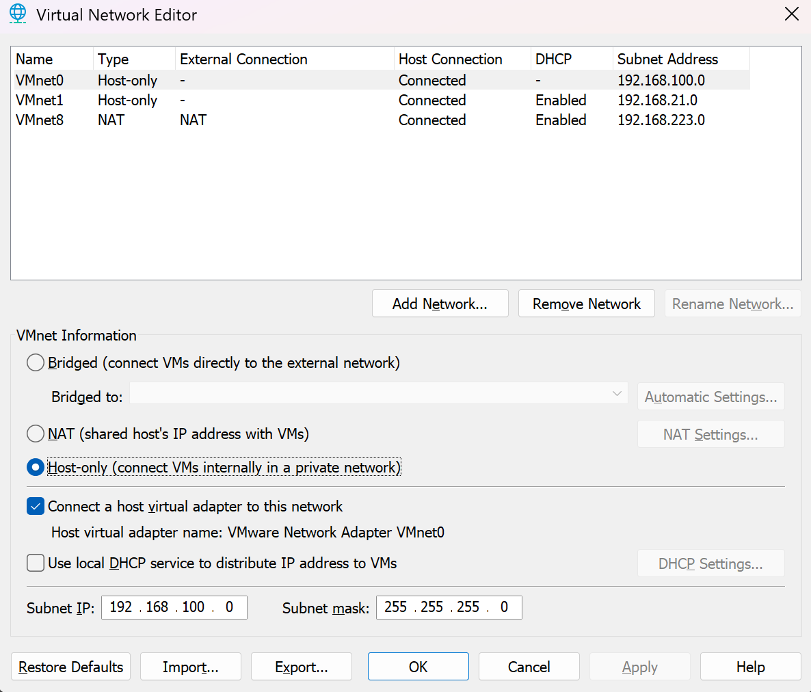

- **Bước 2:** Sau khi đã có dải mạng xong, nhiệm vụ tiếp theo là join 2 máy ảo Ubuntu và CentOS vào trong dải mạng này
+ Ta sẽ vào phần Setting của từng máy ảo để "cắm dây" vào Switch ảo mà ta đã tạo ở Bước 1
+ Tại từng máy ảo, ta sẽ click vào mục Network Adapter, tick vào mục Custom và chọn Switch ảo VMnet0 mà ta đã tạo ở bước 1
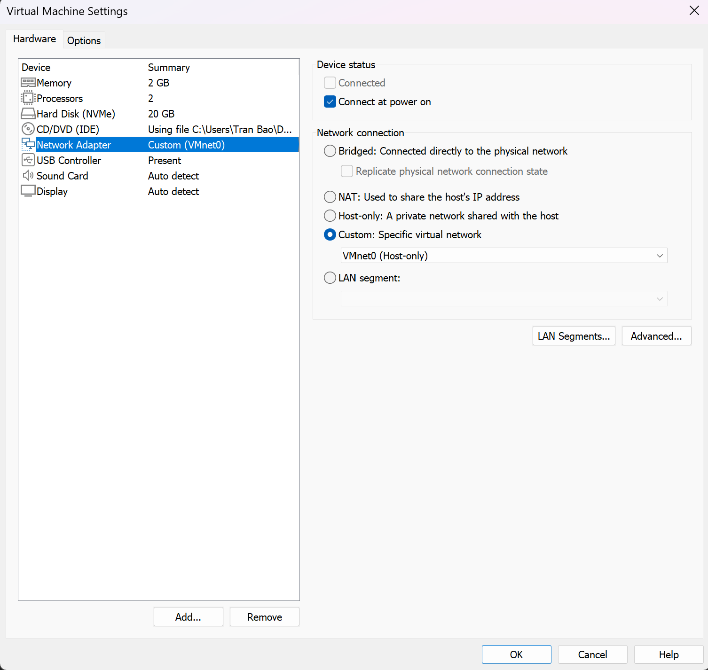

- **Bước 3:** Cấu hình IP tĩnh cho từng máy ảo 
**Ubuntu Server**
+ Khi khởi động máy ảo, máy sẽ không có IP, để cấu hình IP thì ta sẽ cần chỉnh sửa file cấu hình Netplan
+ Mở file cấu hình bằng lệnh `sudo nano /etc/netplan/50-cloud-init.yaml`
+ Xóa sạch nội dung trong file và thêm vào nội dung dưới (lưu ý: cần căn chỉnh thụt lề đúng thì lệnh mới chạy, nếu không sẽ lỗi). Do dải mạng ảo mà ta đặt lúc đầu là 192.168.100.0/24, nên ở máy ảo Ubuntu, ta sẽ đặt địa chỉ IP là 192.168.100.10, Gateway là 192.168.100.1

network:
  version: 2
  renderer: networkd
  ethernets:
    ens33:
      dhcp4: no
      addresses:
        - 192.168.100.10/24
      routes:
        - to: default
          via: 192.168.100.1
      nameservers:
        addresses: [8.8.8.8, 1.1.1.1]

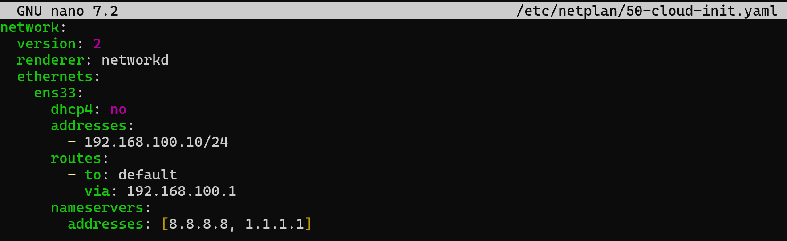
+ Sau khi cấu hình xong, ta sẽ sử dụng câu lệnh `sudo netplan apply` để thực thi cấu hình
+ Để kiểm tra thì sử dụng câu lệnh `ip a` để xem máy ảo đã nhận IP được cấu hình hay chưa
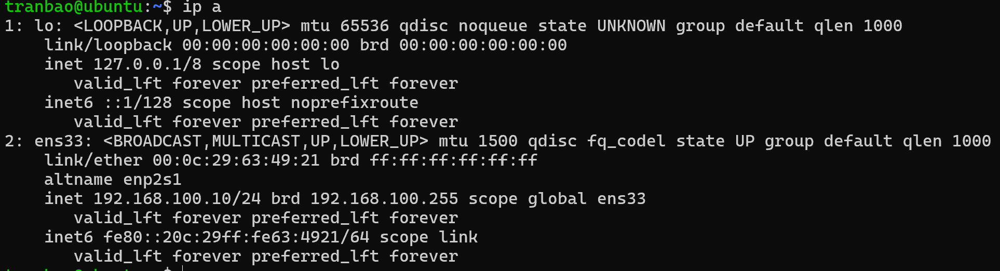
+ Như vậy ta có thể thấy đã cấu hình IP thành công cho máy ảo Ubuntu

**CentOS**
+ Trên máy ảo CentOS, có nhiều cách để cấu hình IP, bạn có thể tham khảo tại:
[Cấu hình IP cho CentOS](/BaoTG/03.Linux/ip_static_config.md)

+ Ở đây, ta sẽ sử dụng cấu hình IP trên Terminal và nhập các dòng lệnh sau đây
`sudo nmcli connection modify ens160 ipv4.method manual`
`sudo nmcli connection modify ens160 ipv4.addresses 192.168.100.20/24`
`sudo nmcli connection modify ens160 ipv4.gateway 192.168.223.2`
`sudo nmcli connection modify ens160 ipv4.dns "8.8.8.8"`

+ Gõ câu lệnh sau để card mạng nhận cấu hình IP tĩnh mới
`sudo nmcli connection up ens160`
+ Tiến hành kiểm tra bằng câu lệnh `ip a`
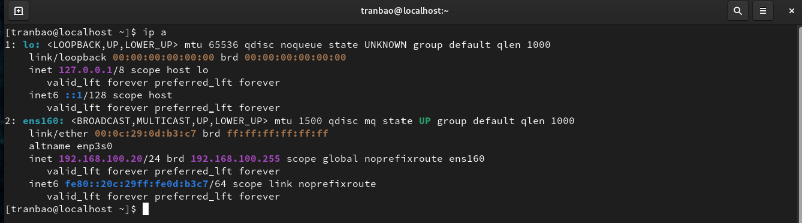
+ Vậy là đã cấu hình IP thành công cho máy ảo CentOS

**Windows**
+ Vì đây chỉ là L2 Network do ta tự tạo nên nó sẽ không có Router thật đứng ra làm Gateway, nên ta sẽ cấu hình cho máy chính Windows thành một Gateway giả lập, mục đích chính đóng vai trò là Gateway cho 2 máy ảo ping thử
+ Ta sẽ tìm `Network Connection` trên Windows, tìm đến switch ảo VMnet0 mà ta đã tạo ở Bước 1
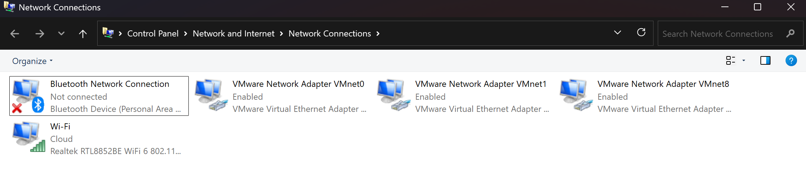
+ Sau đó click chuột phải và chọn Properties ở VMnet0
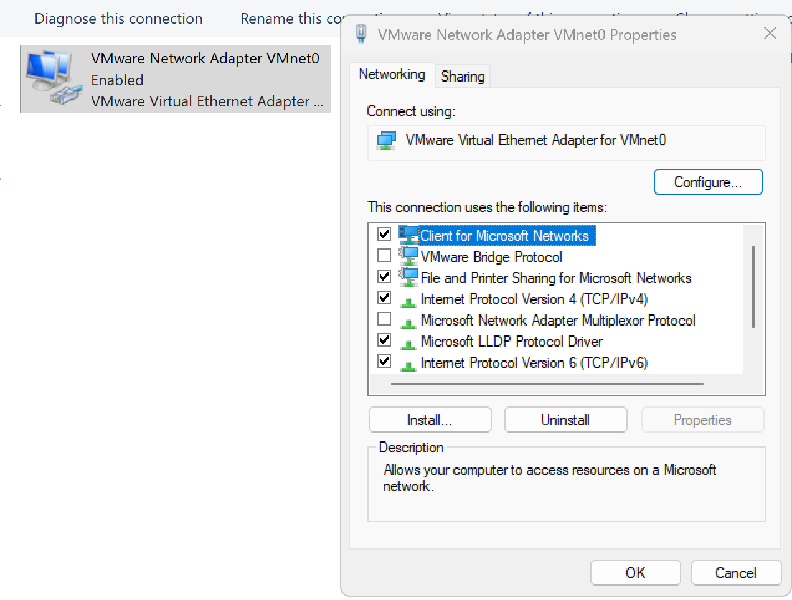
+ Double click vào mục Internet Protocol Version 4 và cấu hình địa chỉ IP là 192.168.100.1
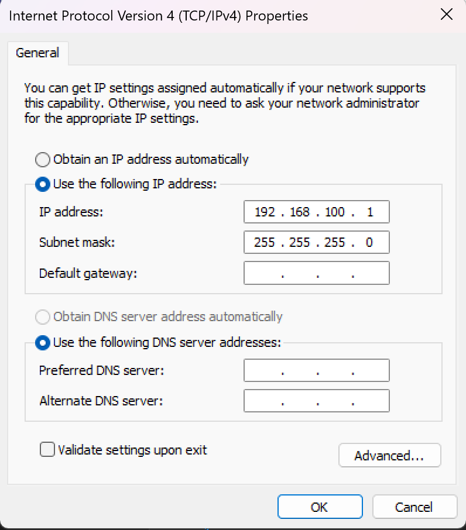
+ Nhấn OK để lưu lại

- **Bước :** Kiểm tra kết quả, tiến hành ping giữa các máy
+ Từ VM Ubuntu, ta sẽ tiến hành ping đến VM CentOS, ta gõ lệnh sau `ping 192.168.100.20`
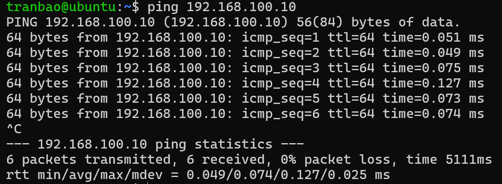
Vậy là đã ping thành công từ Ubuntu -> CentOS
+ Tiếp theo, ta sẽ ping từ Ubuntu đến Gateway
`ping 192.168.100.1`
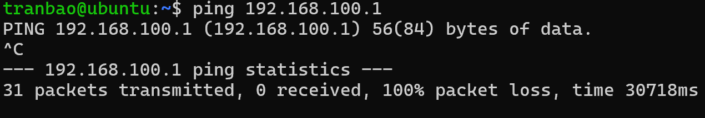
+ Ta sẽ thấy gói tin sẽ không đi đến được Gateway, nguyên nhân là do Firewall trên Windows đã chặn các gói tin ICMP Request
+ Giải thích:
Bản chất của lệnh ping là sử dụng một giao thức mạng có tên là ICMP (Internet Control Message Protocol). Khi máy ảo ping đến 192.168.100.1, nó sẽ gửi đi một gói tin gọi là Echo Request (Lời yêu cầu phản hồi) với thông điệp: "Alo máy thật ơi, bạn có đó không?".Theo quy tắc mạng thông thường, máy thật nhận được thì phải gửi lại một gói tin Echo Reply ("Có, tôi đây!"). Nhưng vì lý do bảo mật, Windows Firewall mặc định sẽ:Đứng chặn ngay ở cửa ngõ card mạng.Thấy gói tin Echo Request đi vào $\rightarrow$ Lập tức vứt bỏ (Drop) gói tin này vào sọt rác mà không phản hồi lại bất kỳ điều gì.Do đó, máy ảo đứng đợi mãi không thấy ai trả lời thì sẽ báo lỗi Destination Host Unreachable hoặc Request timed out.
+ Bây giờ ta sẽ mở PowerShell chạy quyền Admin trên Windows lên và gõ lệnh sau:
`netsh advfirewall firewall set rule name="File and Printer Sharing (Echo Request - ICMPv4-In)" new enable=Yes`
+ Giải thích sơ qua về lệnh:
    * netsh advfirewall firewall: Gọi công cụ cấu hình Tường lửa nâng cao qua dòng lệnh của Windows.
    * set rule: Ra lệnh chỉnh sửa một quy tắc (luật) đang có sẵn trong hệ thống.
    * name="File and Printer Sharing (Echo Request - ICMPv4-In)": Đây là cái tên định danh của một luật được Microsoft làm sẵn trong Windows. Luật này quản lý việc: Cho phép các gói tin Ping (Echo Request) thuộc giao thức IPv4 đi từ bên ngoài VÀO (In) máy tính này.
    * new enable=Yes: Chuyển trạng thái của luật này từ No (Đang chặn/Tắt) thành Yes (Cho phép/Bật).

+ Thực hiện ping lại từ Ubuntu đến Gateway
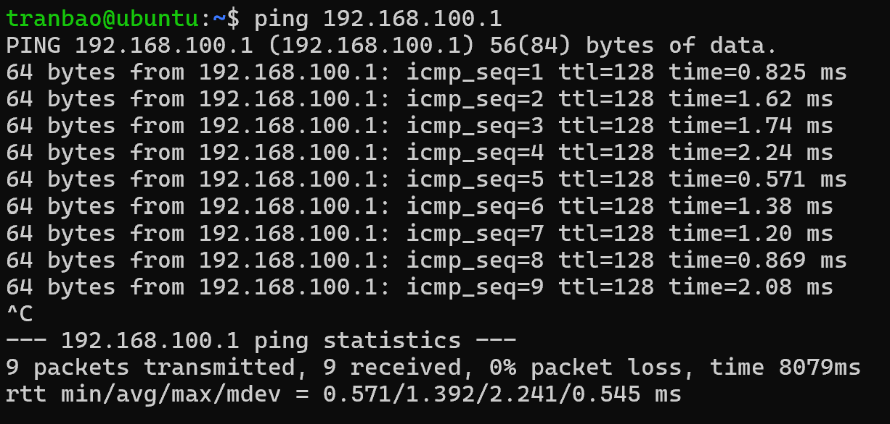
+ Ta có thể thấy đã ping thành công
+ Thực hiện tương tự với VM CentOS -> Ubuntu + Gateway và trên máy Windows -> Ubuntu + CentOS