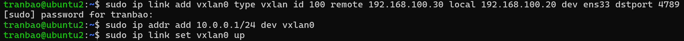
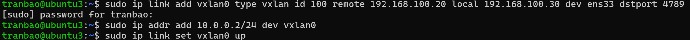
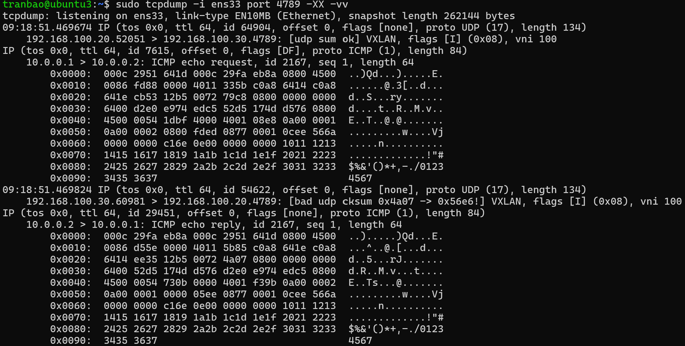

# THỰC HÀNH LAB
## MÔ TẢ
- Lab: tạo tunnel vxlan giữa 2 máy (IP vxlan tùy chọn), ping thông nhau, bắt và phân tích gói trên interface underlay

## THỰC HÀNH
**Giai đoạn 1: Phân tích**
Phân tích sơ đồ lab như sau:
VM 1 : Ip underlay 192.168.100.20, IP VXLAN 10.0.0.1/24
VM2 : Ip underlay 1921.68.100.30, IP VXLAn 10.0.0.2/24
VNI (virtual network identifier) : 100 (đây là ID của tunnel giữa 2 máy)
Port service : 4789

**Giai đoạn 2: Tạo interface vxlan0 nối từ máy 1 sang máy 2**
- Ở màn hình terminal ta sẽ sử dụng câu lệnh
`sudo ip link add vxlan0 type vxlan id 100 remote 192.168.100.30 local 192.168.100.20 dev ens33 dstport 4789`
+ tạo card mạng ảo có tên là `vxlan0`
+ loại vxlan
+ id tunnel: 100
+ trỏ sang máy 2 có địa chỉ IP là 192.168.100.30
+ chạy trên card vật lý ens33
+ cổng dịch vụ tiêu chuẩn của vxlan 4789
- Sau khi nối từ máy 1 sang máy 2 xong, ta sẽ tiến hành đặt IP Overlay cho máy 1:
`sudo ip addr add 10.0.0.1/24 dev vxlan0`
- Bật interface vxlan0 đã khởi tạo
`sudo ip link set vxlan0 up`

**Giai đoạn 3: Tạo interface vxlan0 nối từ máy 2 sang máy 1**
- Ở màn hình terminal ta sẽ sử dụng câu lệnh
`sudo ip link add vxlan0 type vxlan id 100 remote 192.168.100.30 local 192.168.100.20 dev ens33 dstport 4789`
+ tạo card mạng ảo có tên là `vxlan0`
+ loại vxlan
+ id tunnel: 100
+ trỏ sang máy 1 có địa chỉ IP là 192.168.100.20
+ chạy trên card vật lý ens33
+ cổng dịch vụ tiêu chuẩn của vxlan 4789
- Sau khi nối từ máy 2 sang máy 1 xong, ta sẽ tiến hành đặt IP Overlay cho máy 2:
`sudo ip addr add 10.0.0.2/24 dev vxlan0`
- Bật interface vxlan0 đã khởi tạo
`sudo ip link set vxlan0 up`

**Giai đoạn 4: Mở firewall trên cả 2 máy ảo**
- Vì khi bật tường lửa, mặc định firewall sẽ chặn các gói tin đi đến cổng UDP 4789. Cho nên ta cần phải cập nhật rule trên cả 2 máy để cho phép 2 máy có thể gửi gói tin đến nhau
`sudo ufw allow 4789/udp`
`sudo ufw reload`

**Giai đoạn 5: tiến hành ping từ máy 1 -> 2, 2 -> 1 và bắt gói tin để kiểm tra**
- Để phân tích được quá trình đóng gói (encapsulation) của vxlan, ta sẽ phải bắt gói tin trên card vật lý (underlay) là ens33. Trên VM2, ta sẽ sử dụng câu lệnh sau để bắt gói tin khi đi qua cổng 4789
`sudo tcpdump -i ens33 port 4789 -vv -XX`
+ ở đây ta sẽ sử dụng công cụ tcpdump để bắt gói tin
+ card mạng ens33
+ cổng 4789
+ `vv`: hiển thị thông tin chi tiết của gói tin
+ `XX`: hiển thị toàn bộ thông tin dưới dạng mã hex và ascii để xem dữ liệu thô

- Bây giờ cùng phân tích các thành phần có trong gói tin này
**Outer Header (Underlay network)**
- Lớp IP ngoài (Outer IP Header)
+ 192.168.100.20 -> 192.168.100.30: Điểm xuất phát vật lý là Máy 1 (IP 192.168.100.20) gửi tới đích vật lý là Máy 2 (IP 192.168.100.30).
+ proto UDP (17): Sử dụng giao thức tầng vận chuyển là UDP (mã giao thức là 17) để bọc gói VXLAN.
+ length 134: Tổng chiều dài của gói tin thô ngoài cùng là 134 bytes.
+ ttl 64: Time to Live (số hop tối đa qua router) được đặt là 64.

- Lớp UDP ngoài (Outer UDP Header):
+ 52051 > 4789: Cổng nguồn ngẫu nhiên là 52051 kết nối tới cổng đích chuẩn của VXLAN là 4789.
+ [udp sum ok]: Checksum của gói UDP ngoài hoàn toàn chính xác, gói tin không bị lỗi trong quá trình truyền dẫn.

- VXLAN Header
+ flags [I] (0x08): Cờ hiệu (flag) I được bật (bằng 1). Điều này xác nhận rằng trường VNI (VXLAN Network Identifier) đi kèm trong gói tin này là hợp lệ.
+ vni 100: Đây là ID của đường hầm VXLAN mà ta đã thiết lập bằng lệnh id 100. Chỉ các máy ảo cấu hình chung VNI này mới có thể nhận và giải mã được gói tin của nhau.

**Inner Header (Overlay)**
- Lớp IP trong (Inner IP Header):
+ 10.0.0.1 > 10.0.0.2: Gói tin ảo đi từ IP nguồn của Máy 1 (10.0.0.1) sang IP đích của Máy 2 (10.0.0.2).
+ proto ICMP (1): Giao thức bên trong là ICMP (mã giao thức là 1 - dùng cho lệnh Ping).
+ length 84: Chiều dài của gói IP bên trong là 84 bytes.
+ flags [DF]: Cờ Don't Fragment được bật, yêu cầu không phân mảnh gói tin này.

- Lớp ICMP (Dữ liệu Ping thực tế):
+ ICMP echo request: Đây là gói tin yêu cầu phản hồi (Ping đi).
+ id 2167, seq 1: Mã định danh gói ping là 2167, gói tin thứ nhất.