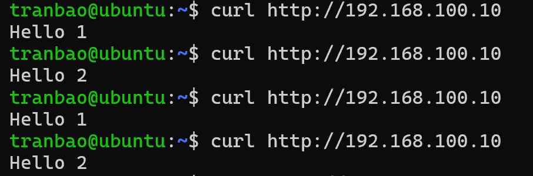

# THỰC HÀNH LAB
## MÔ TẢ
- Lab: 3 máy chủ, 1 máy chạy nginx (coi như là LB), 2 máy chạy backend (Hello1, Hello2). Cấu hình nginx thành LB với các mode Round Robin

## THỰC HÀNH
**Phân tích**
- Ở đây ta sẽ có 3 máy ảo VM1. VM2. VM3 nằm trên cùng một dải mạng 192.168.100.0/24
+ VM1
    IP : 192.168.100.10/24
    Vai trò : Load balancer 
+ VM2:
    IP : 192.168.100.20/24
    Vai trò : Back-end 1, chạy một dịch vụ web in ra màn hình `Hello 1`
+ VM3:
    IP : 192.168.100.30/24
    Vai trò : back-end 2, chạy một dịch vụ in ra màn hình `Hello 2`
+ Thuật toán load balancing: Round Robin

**Máy Back-end**
- Đầu tiên ta sẽ cần cài đặt Nginx ở trên VM2 và VM3
`sudo apt install nginx -y`

- Sau khi cài đặt xong, ta sẽ kiểm tra trạng thái của Nginx bằng lệnh `systemctl status nginx`, nếu thấy trạng thái `inactive` thì sử dụng câu lệnh `sudo systemctl enable ngĩnx` để bật service này lên

- Bây giờ ta sẽ cần tạo ra trang chủ hiển thị `Hello 1` và `Hello 2` trên từng máy
> VM2: Trên máy back-end VM1 ta gõ câu lệnh sau để tạo folder chứa file HTML
+ `sudo mkdir -p /var/www/web-1`
+ Tạo file HTML và thêm nội dụng `Hello 1`
`sudo nano /var/www/web-1/index.html`
Thêm nội dung `Hello 1` rồi Ctrl + O -> Ctrl + X
+ Chỉnh sửa file cấu hình mặc định của Nginx
`sudo nano /etc/nginx/sites-available/default`, tìm đến dòng `root /var/www/html` và sửa thành `root /var/www/web-1`, Ctrl + O -> Ctrl + X để lưu và thoát
**Giải thích**: mặc định Nginx trên Ubuntu sẽ tìm kiếm file ở thư mục /var/www/html, nhưng do ta tạo file trong /var/www/web-1 nên nó sẽ không tìm thấy file -> báo lỗi
+ Khởi động lại service nginx để áp dụng cấu hình `sudo systemctl restart nginx`

> VM3: Làm tương tự như máy VM1

> VM1: Cấu hình làm Load Balancer
+ Cài đặt Nginx trên máy VM1 `sudo apt install nginx -y`
+ Tạo file cấu hình Load Balancer cho `sudo nano /etc/nginx/sites-available/loadbalancer`
+ Thêm nội dung sau vào file cấu hình rồi Ctrl + O -> Ctrl + X

upstream backend_servers {
    server 192.168.100.20:80;
    server 192.168.100.30:80;
}
+ định nghĩa một nhóm các máy chủ vật lý và đặt tên nhóm là backend-servers (tên này đặt tùy ý)
+ khai báo IP server và port của server

server {
    listen 80;
    server_name 192.168.100.10;
+ Nginx trên máy LB sẽ mở và lắng nghe ở cổng 80
+ Chỉ định rằng khối cấu hình này sẽ áp dụng khi người dùng truy cập trực tiếp vào IP 192.168.100.10

    location / {
        proxy_pass http://backend_servers;
        proxy_set_header Host $host;
        proxy_set_header X-Real-IP $remote_addr;
        proxy_set_header X-Forwarded-For $proxy_add_x_forwarded_for;
    }
}
+ Kích hoạt file cấu hình load balancer mới và loại bỏ cấu hình mặc định
`sudo ln -s /etc/nginx/sites-available/loadbalancer /etc/nginx/sites-enabled/`
`sudo rm /etc/nginx/sites-available/default`

+ Kiểm tra cấu hình Nginx có lỗi gì không
`sudo nginx -t`

+ Nếu không có lỗi gì `sudo systemctl restart nginx`

## Tiến hành kiểm tra**
*Cách 1:*
- Trên màn hình terminal của máy thật hoặc máy ảo, gõ câu lệnh `curl http://192.168.100.10`

Ta có thể thấy đã cấu hình thành công

*Cách 2:*
- Trên trình duyệt web ở máy thật, truy cập vào địa chỉ IP `192.168.100.10`, bạn sẽ thấy trang web hiển thị `Hello 1` rồi lại `Hello 2`

