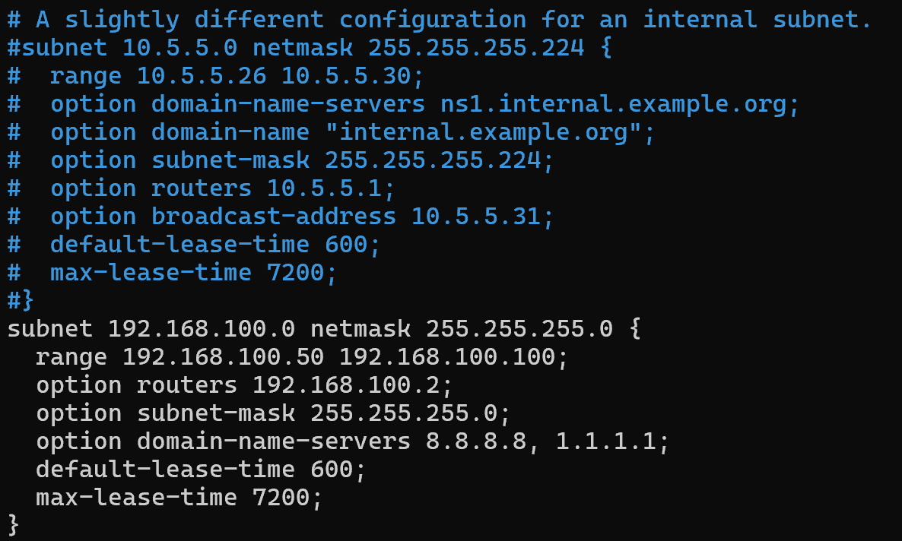
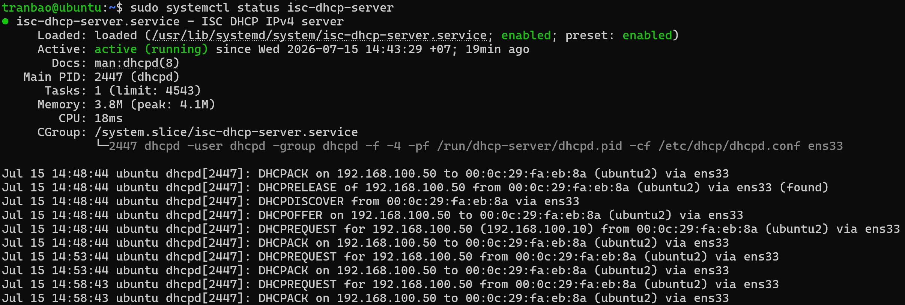
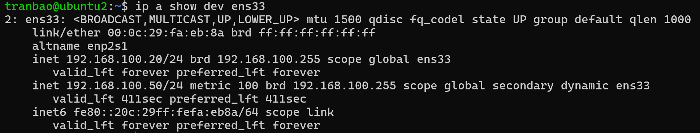

# THỰC HÀNH LAB
## MÔ TẢ
lab: cài dhcp trên dải 192.168.100.0/24, cấu hình dhcp cơ bản
## THỰC HÀNH
### PHÂN TÍCH
- Ở đây ta có 2 máy ảo, VM1 và VM2. VM1 sẽ là DHCP Server, VM2 là DHCP Client
- Dải IP cấp phát từ 192.168.100.50 -> 192.168.100.100 
- Default gateway 192.168.100.2
- DNS server 8.8.8.8, 1.1.1.1
- Thời gian thuê IP : 600s (10m), max 7200s (2h)

### GIAI ĐOẠN 1: DHCP Server
- Tiến hành cài đặt DHCP Server trên VM1
`sudo apt update && sudo apt install -y isc-dhcp-server`

- Tiến hành khai báo card mạng chạy dịch vụ dhcp, tìm đến dòng `INTERFACESv4 = ""` và điền tên card mạng vào trong ""
`sudo nano /etc/default/isc-dhcp-server`

- Tiến hành cấu hình DHCP cấp phát IP cho dải 192.168.100.0/24. Mở file cấu hình chính của DHCP
`sudo nano /etc/dhcp/dhcpd.conf`

- Di chuyển vào cuối file và thêm các dòng cấu hình sau
subnet 192.168.100.0 netmask 255.255.255.0 {
  range 192.168.100.50 192.168.100.100;
  option routers 192.168.100.2;
  option subnet-mask 255.255.255.0;
  option domain-name-servers 8.8.8.8, 1.1.1.1;
  default-lease-time 600;
  max-lease-time 7200;
}

- Tiến hành lưu file cấu hình và khởi động lại dịch vụ để áp dụng cấu hình mới
`sudo systemctl restart isc-dhcp-server`
`sudo systemctl status isc-dhcp-server`

Như hình ta có thể thấy đã cấu hình DHCP Server thành công

### GIAI ĐOẠN 2: DHCP Client
- Bây giờ ta sẽ cấu hình cho máy ảo VM2 tự động nhận IP
- Tạo file cấu hình và thêm nội dung vào file
`sudo nano /etc/netplan/51-netcfg.yaml`
network:
  version: 2
  ethernets:
    ens33:
      dhcp4: true

- Lưu file và áp dụng cấu hình mới
`sudo netplan apply`

- Bây giờ ta sẽ kiểm tra xem máy VM2 đã tự động nhận IP chưa

- Như hình ta có thể thấy là VM2 đã nhận IP là 192.168.100.50

