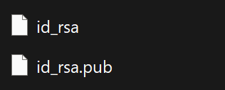

# TÌM HIỂU VỀ SSH KEY PAIR (CẶP KHÓA SSH)
## 1. KHÁI NIỆM
- SSH Key Pair (Cặp khóa SSH) là một phương thức xác thực nâng cao, cực kỳ an toàn được sử dụng để thiết lập kết nối bảo mật giữa máy tính của bạn (Client) và máy chủ từ xa (Server) thông qua giao thức SSH.
- Thay vì sử dụng mật khẩu truyền thống dễ bị bẻ khóa (Brute Force), SSH Key Pair sử dụng nền tảng của mã hóa bất đối xứng (Asymmetric Cryptography).

## 2. CÁC THÀNH PHẦN CỦA MỘT SSH KEY PAIR
Một cặp khóa luôn bao gồm hai file văn bản chứa chuỗi ký tự mã hóa đi liền với nhau:

- Khóa công khai (Public Key): Bạn có thể công khai file này và tải nó lên bất kỳ máy chủ nào mà bạn muốn kết nối. Khóa này đóng vai trò như một "ổ khóa".
- Khóa bí mật (Private Key): File này phải được lưu trữ tuyệt đối an toàn trên máy tính cá nhân của bạn và không được chia sẻ cho bất kỳ ai. Khóa này đóng vai trò như chiếc "chìa khóa cơ duyên" duy nhất để mở ổ khóa trên.
- Sau khi tạo một cặp khóa trên máy tính (Windows 10 hoặc 11), bạn có thể tìm thấy chúng trong đường dẫn `C:\Users\User Name\.ssh`. File sẽ có tên dạng `id_rsa`, trong đó RSA là thuật toán được dùng để tạo ra 2 Key

## 3. MỤC ĐÍCH SỬ DỤNG
- Tăng cường bảo mật tối đa: Mật khẩu thông thường có thể bị đoán, bị lộ hoặc bị tấn công dò mật khẩu. SSH Key có độ dài mặc định lên tới 2048 hoặc 4096 bit, khiến việc bẻ khóa bằng máy tính hiện nay là không khả thi.
- Đăng nhập tự động không cần mật khẩu (Passwordless): Giúp các kỹ sư hệ sinh thái mạng, DevOps hoặc Software Tester tự động hóa các kịch bản kiểm thử, chạy script và quản trị hệ thống mà không cần tương tác nhập mật khẩu thủ công.
- Chống tấn công Man-in-the-Middle: Ngăn chặn tin tặc đánh cắp thông tin xác thực ngay cả khi luồng dữ liệu đi qua một mạng công cộng không an toàn.

## 4. CÁCH THỨC HOẠT ĐỘNG.
- Gửi yêu cầu: Client gửi yêu cầu đăng nhập kèm theo ID của cặp khóa muốn sử dụng.
- Thử thách từ Server: Server kiểm tra file cấu hình (thường là authorized_keys) xem có giữ Khóa công khai (Public Key) tương ứng không. Nếu có, Server tạo ra một thông điệp ngẫu nhiên (Challenge) rồi dùng Khóa công khai đó để mã hóa lại và gửi ngược về cho Client.
- Giải mã từ Client: Lúc này, thông điệp đã bị khóa chặt. Chỉ có duy nhất Khóa bí mật (Private Key) nằm trên máy của Client mới có khả năng giải mã được thông điệp này. Client tiến hành giải mã để lấy lại thông điệp gốc.
- Phản hồi xác nhận: Client kết hợp thông điệp gốc với Khóa phiên (Session Key) tạo ra một chữ ký điện tử và gửi lại cho Server.
- Cho phép truy cập: Server dùng Khóa công khai để xác minh chữ ký đó. Nếu chính xác, Server xác nhận Client là chủ sở hữu hợp pháp của tài khoản và cho phép thiết lập phiên làm việc trực tuyến.