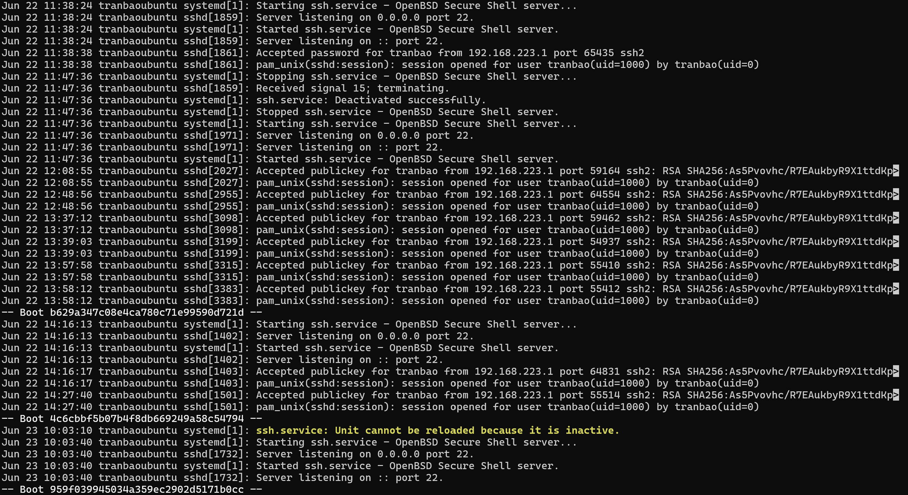
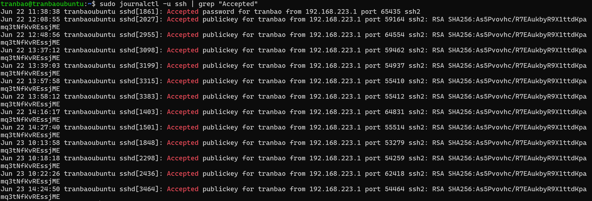
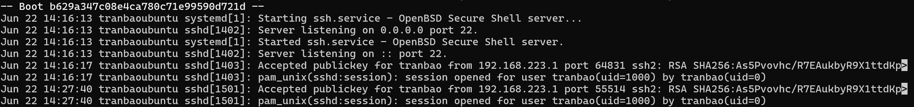

# TÌM HIỂU VỀ FILE LOG CỦA SSH
## 1. KHÁI NIỆM
- File log của SSH là một tệp văn bản ghi lại toàn bộ lịch sử hoạt động, các sự kiện và trạng thái của dịch vụ SSH Server (sshd) diễn ra trên máy chủ. Mỗi khi có một yêu cầu kết nối, đăng nhập thành công, đăng nhập thất bại, hoặc các lỗi hệ thống liên quan đến SSH, dịch vụ sshd sẽ gửi thông tin này đến hệ thống quản lý log của hệ điều hành để ghi lại.

## 2. MỤC ĐÍCH CỦA FILE LOG LÀ GÌ
- Kiểm toán và Giám sát (Auditing): Biết được chính xác ai (user nào), khi nào (thời gian cụ thể), và từ đâu (địa chỉ IP nào) đã truy cập vào hệ thống.
- Xử lý sự cố (Troubleshooting): Khi bạn hoặc người dùng không thể kết nối SSH vào server (ví dụ: lỗi phân quyền SSH Key, sai cấu hình), file log sẽ chỉ rõ nguyên nhân chính xác gây ra lỗi.
- Bảo mật và Phát hiện xâm nhập: Giúp phát hiện sớm các cuộc tấn công dò mật khẩu (Brute Force). Nếu thấy hàng trăm lượt đăng nhập thất bại liên tiếp từ một IP lạ, đó là dấu hiệu hệ thống đang bị tấn công.

## 3. VỊ TRÍ CỦA FILE LOG TRÊN UBUNTU SERVER 24.04
- Hệ thống Log hiện đại (Mặc định): Ubuntu 24.04 sử dụng systemd-journald làm trình quản lý log chính. Log SSH không còn được ghi ra một file văn bản tĩnh riêng biệt nữa mà được lưu trữ dưới dạng mã hóa nhị phân trong hệ thống của Journald.

## 4. CÁCH ĐỌC FILE LOG
- Để xem toàn bộ file log liên quan đến SSH từ trước đến nay, ta sẽ sử dụng câu lệnh `sudo journalctl -u ssh` (trong đó `-u` có nghĩa là unit liên quan đến ssh)

- Nếu chỉ cần lọc ra các log đăng nhập thất bại/thành công thì ta sẽ sử dụng câu lệnh `sudo journal -u ssh | grep "Failed (Accepted)"`

- Bây giờ, hãy cùng phân tích một file log sẽ bao gồm những cái gì

**Giai đoạn 1**
+ Ở đây, vào lúc 14:16:13 thì systemd kích hoạt dịch vụ SSH (dòng 1 và 3)
+ Tiến trình sshd với PID là 1402 bắt đầu mở cổng 22 để lắng nghe kết nối với tất cả IPv4 (dòng 2 và 4)

**Giai đoạn 2**
+ Server chấp nhận một kết nối hợp lệ với các thông tin sau (dòng 5): 
User đăng nhập: tranbao
Phương thức: sử dụng Private key với mã hóa định dạng RSA
Địa chỉ IP: 192.168.223.1
Cổng ngẫu nhiên: 64831
+ Server mở một phiên làm việc cho người dùng `tranbao` với uid = 1000