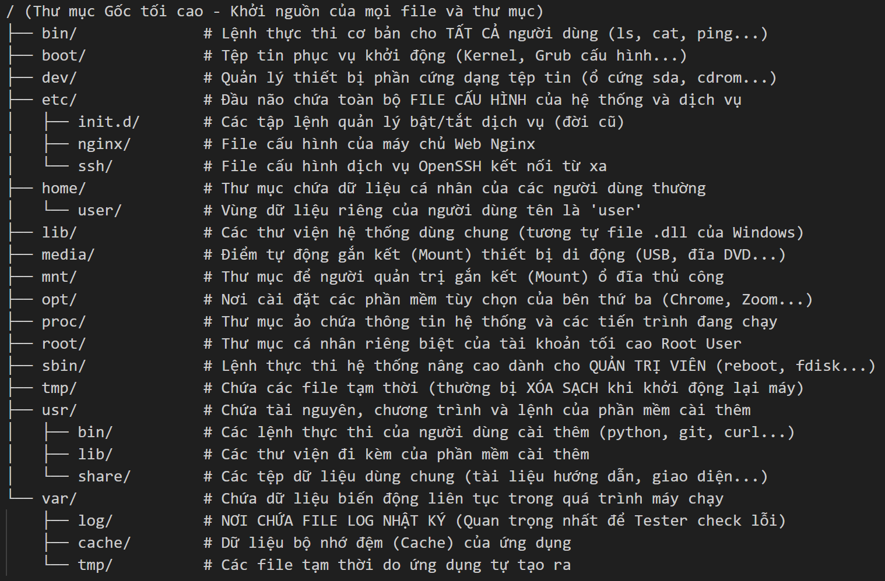
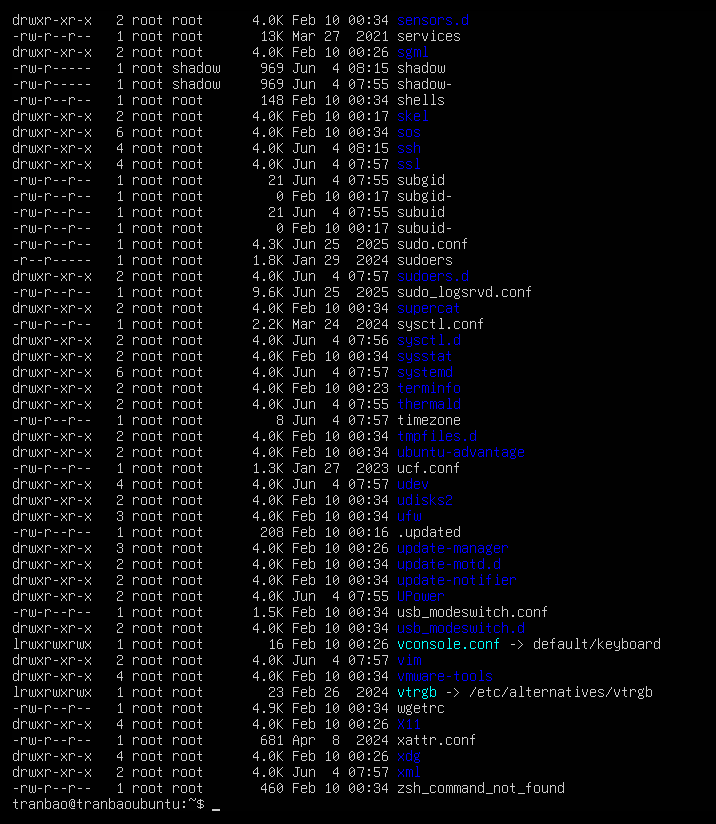
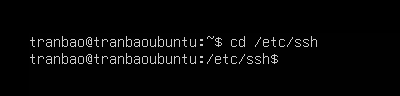
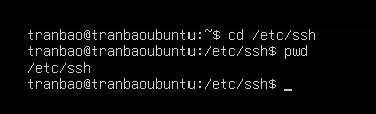
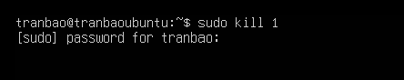
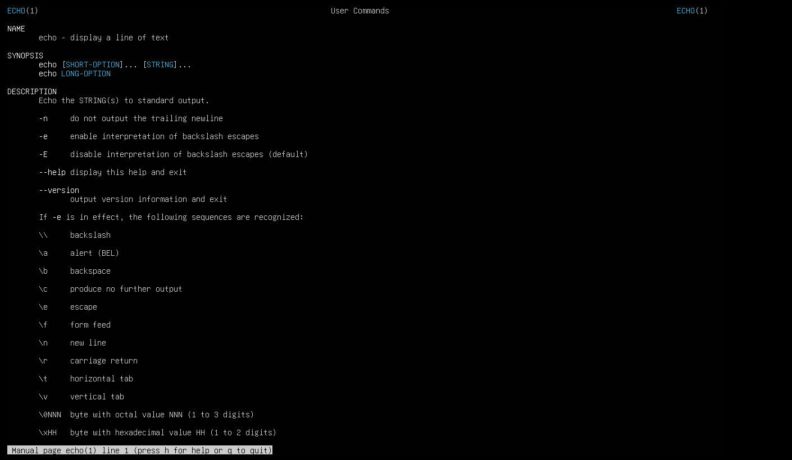
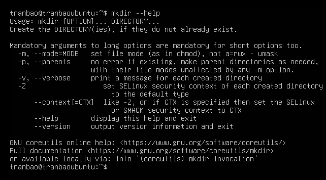
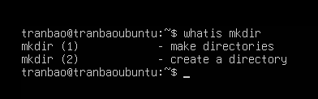
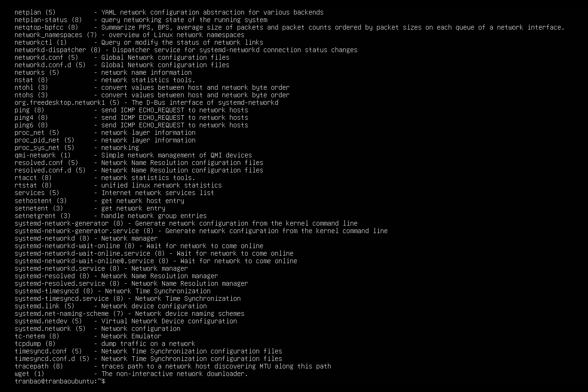

# COMMAND LINUX
**Cấu trúc thư mục của Linux**

## I. LINUX COMMAND LÀ GÌ ?
- Linux Command (Lệnh Linux) hiểu một cách đơn giản nhất chính là các câu lệnh bằng chữ mà bạn gõ vào màn hình Terminal để ra lệnh cho hệ điều hành Linux thực hiện một yêu cầu nào đó (như tạo thư mục, cấu hình mạng, tắt máy, hay kiểm tra file log)
## II. CÁC NHÓM LỆNH PHỔ BIẾN TRONG LINUX.
### 1. Lệnh cơ bản của hệ thống.
|      Tên lệnh     |             Chức năng            |          Ví dụ         |
|:-----------------:|:--------------------------------:|:----------------------:|
| `whoami`          | Xem tên tài khoản hiện tại       | `whoami`               |
| `df -h`           | Kiểm tra dung lượng ổ cứng       | `df -h`                |
| `free -m`         | Kiểm tra dung lượng RAM          | `free -m`              |
| `top`             | Xem các ứng dụng đang chạy       | `top`                  |
| `uname -a`        | Xem thông tin hệ điều hành`      | `uname -a`             |
| `sudo`            | Mượn quyền tối cao (Root)        | `sudo apt update`      |
| `shutdown -h now` | Tắt máy ngay lập tức             | `sudo shutdown -h now` |
| `reboot`          | Khởi động lại máy                | `sudo reboot`          |
| `id`              | Hiển thị tên người dùng và nhóm  | `id`                   |
| `history`         | Hiển thị tất cả các lệnh đã dùng | `history`              |
| `echo`            | In ra ký tự trên terminal        | `echo`                 |

### 2. Lệnh quản lý thư mục và tệp tin.
| Tên lệnh | Chức năng                           | Ví dụ                                                                       |
|----------|-------------------------------------|-----------------------------------------------------------------------------|
| pwd      | Xem đường dẫn thư mục đang đứng     | pwd                                                                         |
| ls       | Liệt kê các file/thư mục con        | ls -la                                                                      |
| cd       | Chuyển đổi qua lại giữa các thư mục | cd /var/log/nginx                                                           |
| mkdir    | Tạo thư mục mới                     | mkdir ccna                                                                  |
| touch    | Tạo một file rỗng mới               | touch tranbao.txt                                                           |
| cp       | Sao chép (Copy) file hoặc thư mục   | cp test1.txt test2.txt                                                      |
| mv       | Di chuyển file hoặc Đổi tên file    | mv test1.txt test2.txt (đổi tên) mv test.txt /tmp/ (di chuyển đến thư mục)  |
| rm       | Xóa file hoặc thư mục               | rm -f log_cu.txt                                                            |

### 3. Lệnh xem nội dung tệp tin.
| Tên lệnh |                 Chức năng                |               Ví dụ               |
|:--------:|:----------------------------------------:|:---------------------------------:|
| cat      | In toàn bộ nội dung file ra màn hình     | cat /etc/hostname                 |
| tac      | Hiển thị nội dung file theo thứ tự ngược | tac /etc/hostname                 |
| less     | Xem file dài theo từng trang             | less /var/log/dpkg.log            |
| head     | Xem các dòng đầu tiên của file           | head -n 5 /etc/passwd             |
| tail     | Xem các dòng cuối cùng của file          | tail -n 20 /var/log/auth.log      |
| tail -f  | Theo dõi file thời gian thực             | tail -f /var/log/nginx/access.log |
| grep     | Lọc nội dung theo từ khóa                | grep "ERROR" /var/log/syslog      |

### 4. Lệnh quản lý tiến trình.
| Tên lệnh |                    Chức năng                   |        Ví dụ       |
|:--------:|:----------------------------------------------:|:------------------:|
| ps       | Xem các tiến trình đang chạy tại thời điểm gõ  | ps -ef hoặc ps aux |
| top      | Xem tiến trình theo thời gian thực (real-time) | top                |
| htop     | Bản nâng cấp giao diện màu của top             | htop               |
| kill     | Tắt (khai tử) một tiến trình bằng mã PID       | sudo kill 1234     |
| kill -9  | Ép buộc tắt ngay lập tức                       | sudo kill -9 1234  |
| pkill    | Tắt tiến trình bằng tên ứng dụng               | sudo pkill nginx   |
| bg       | Đẩy tiến trình xuống chạy ngầm (Background)    | bg %1              |
| fg       | Đưa tiến trình ngầm lên chạy nổi (Foreground)  | fg %1              |

### 5. Lệnh quản lý người dùng và quyền.
| Lệnh    | Chức năng                               | Ví dụ                 |
|---------|-----------------------------------------|-----------------------|
| who     | Xem danh sách người dùng đang đăng nhập | who                   |
| adduser | Tạo người dùng mới                      | sudo adduser new_user |
| deluser | Xóa người dùng                          | sudo deluser old_user |
| passwd  | Thay đổi mật khẩu người dùng            | passwd user1          |
| chmod   | Thay đổi quyền tệp/thư mục              | chmod 755 script.sh   |
| chown   | Thay đổi chủ sở hữu tệp/thư mục         | chown user1 file.txt  |
| chgrp   | Thay đổi nhóm của tệp/thư mục           | chgrp group1 file.txt |

### 6. Lệnh quản lý phần mềm.
| Lệnh            | Chức năng                           | Ví dụ                                 |
|-----------------|-------------------------------------|---------------------------------------|
| apt install     | Cài đặt phần mềm trên Ubuntu/Debian | sudo apt install vim                  |
| yum install     | Cài đặt phần mềm trên CentOS/RHEL   | sudo yum install nano                 |
| dnf install     | Cài đặt phần mềm trên Fedora        | sudo dnf install tree                 |
| pacman -S       | Cài đặt phần mềm trên Arch Linux    | sudo pacman -S htop                   |
| snap install    | Cài đặt ứng dụng từ Snap            | sudo snap install vlc                 |
| flatpak install | Cài đặt ứng dụng từ Flatpak         | flatpak install flathub org.gimp.GIMP |

### 7. Lệnh quản lý mạng.
| Lệnh                          | Chức năng                    | Ví dụ                                         |
|-------------------------------|------------------------------|-----------------------------------------------|
| ifconfig                      | Hiển thị thông tin mạng      | ifconfig                                      |
| ip a                          | Hiển thị địa chỉ IP          | ip a                                          |
| ping                          | Kiểm tra kết nối đến máy chủ | ping google.com                               |
| netstat -tulnp hoặc ss -tulnp | Hiển thị cổng mạng đang mở   | ss -tulnp                                     |
| curl                          | Lấy dữ liệu từ URL           | curl https://example.com                      |
| wget                          | Tải tệp từ URL               | wget https://example.com/file.zip             |
| scp                           | Sao chép tệp qua SSH         | scp file.txt user@remote:/home/user/          |
| rsync                         | Đồng bộ tệp giữa hai máy     | rsync -avz /source/ user@remote:/destination/ |

## III. THỰC HIỆN MỘT SỐ THAO TÁC LỆNH CƠ BẢN.
### 1. `ls` - hiển thị danh sách tệp và thư mục
Một số tùy chọn phổ biến:
- `l` (long) : hiển thị danh sách dưới dạng dài
- `h` (human-readable) : đổi dung lượng file dưới dạng dễ đọc (kb, mb, gb)
- `a` (all) : hiển thị tất cả file kể cả file ẩn
- `t` (time) : sắp xếp file theo thời gian 
- `s` (size) : sắp xếp file theo kích thước
- `r` (reverse) : đảo ngược thứ tự sắp xếp

**Ví dụ**

### 2. `cd` - di chuyển đến thư mục
- `cd ..` : lùi lại 1 cấp thư mục cha
- `cd ~` : quay về thư mục cá nhân (home)
- `cd -` : quay lại thư mục trước đó
- `cd /` : quay về thư mục gốc tối cao

**Ví dụ**

### 3. `mkdir` - tạo thư mục 
- `-p` : tạo thư mục phân cấp
- `-v` : hiển thị lời nhắc xác nhận sau khi tạo xong

### 4. `pwd` - tạo thêm người dùng mới
- sử dụng để biết thư mục hiện tại đang đứng có đường dẫn như nào

**Ví dụ**
- ta sẽ sử dụng `cd` để di chuyển đến một thư mục
- sau đó dùng lệnh `pwd` để biết thông tin đường dẫn của thư mục

### 5. `kill` - tắt một tiến trình
- sử dụng để dừng một tiến trình

**Ví dụ**

## IV. MẸO
1. Lệnh `man` 
- Đây là lệnh quyền lực và chi tiết nhất. Nó sẽ mở ra một cuốn sách hướng dẫn chính thức từ nhà phát triển của câu lệnh đó, giải thích tường tận từ chức năng, cú pháp cho đến ý nghĩa của từng tham số (options).
- Cú pháp: man <tên_lệnh_cần_tra>

**Ví dụ**

2. Tham số `--help` hoặc `-h`
- Nếu bạn không muốn đọc cả một cuốn sách dài dòng của lệnh man mà chỉ muốn coi nhanh cú pháp và các tham số cơ bản để gõ luôn, hãy thêm đuôi --help hoặc -h ngay sau lệnh đó.
- Cú pháp: <tên_lệnh> --help hoặc <tên_lệnh> -h

**Ví dụ**

3. Lệnh `whatis`
- Nếu bạn vô tình đọc một tài liệu trên mạng và thấy họ dùng một lệnh lạ hoắc (ví dụ tar, chmod, grep) và bạn chỉ muốn biết "Lệnh này sinh ra để làm cái gì?" trong vòng 3 giây:
- Cú pháp: whatis <tên_lệnh>

**Ví dụ**

4. Lệnh `apropos`
- Giả sử bạn không nhớ tên lệnh là gì, bạn chỉ biết mình đang cần tìm một lệnh nào đó liên quan đến việc "đổi mật khẩu" (password) hoặc "mạng" (network):
- Cú pháp: apropos <từ_khóa_tiếng_anh>

**Ví dụ**
`apropos network` tìm kiếm câu lệnh liên quan đến network
