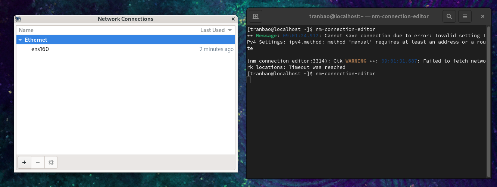
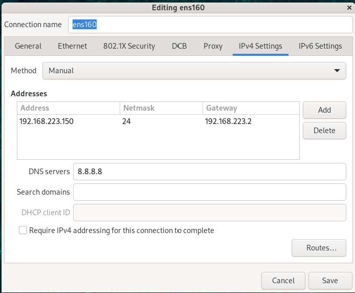
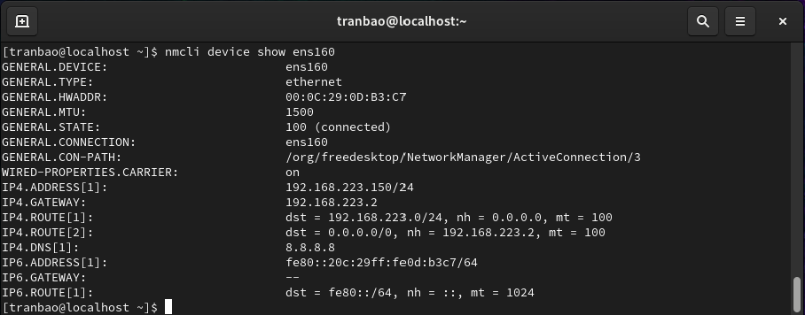
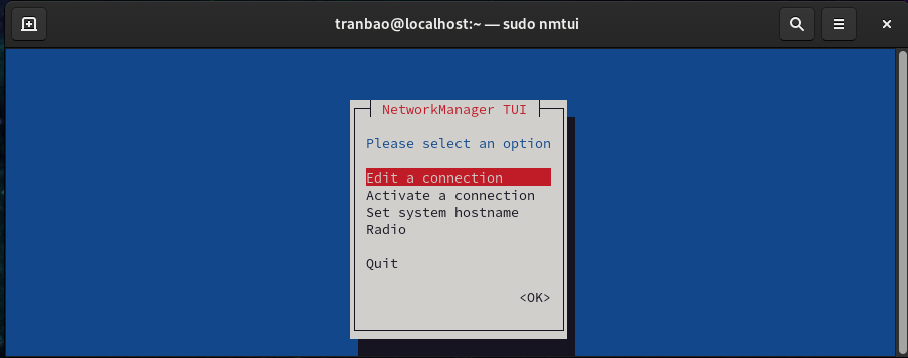
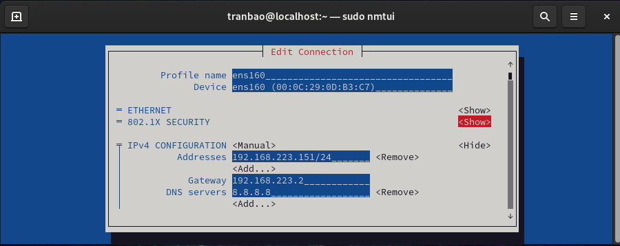
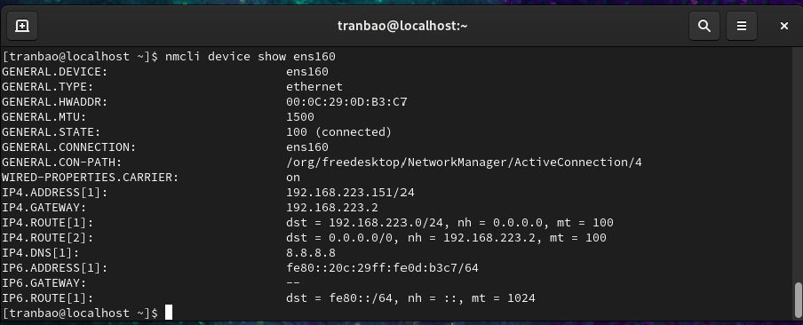
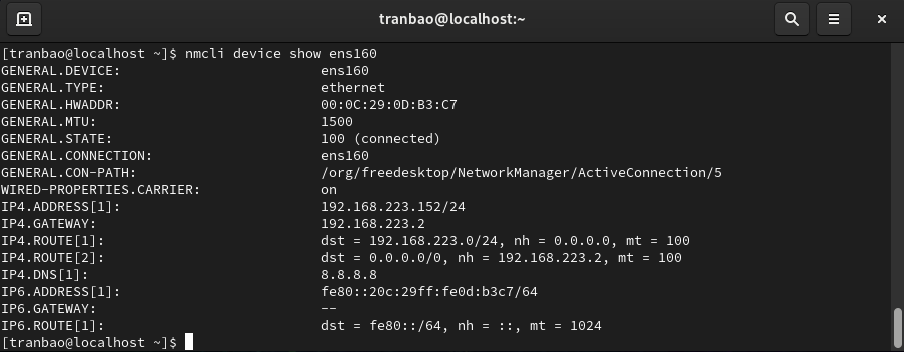
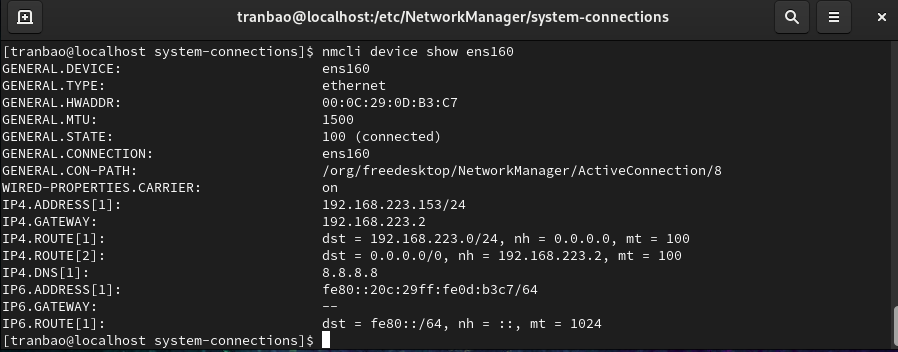

# CÀI ĐẶT IP TĨNH TRÊN LINUX.

## CENTOS 9
### CÁCH 1: Cấu hình trên *nm-connection-editor*
- Ở màn hình terminal gõ câu lệnh sau
`nm-connection-editor`
- Một cửa sổ giao diện sẽ hiển thị ra như sau

- Double click vào tên card mạng, sau đó chọn vào tab IPv4 Setting
- Đổi method thành Manual, bấm nút Add rồi thêm *IP Address, Subnet Mask, Default Gateway* rồi nhấn Save

- Nhấn Save
- Quay lại terminal và gõ câu lệnh dưới để card mạng nhận IP tĩnh mới
`nmcli connection up ens160`
- Kiểm tra xem đã cấu hình IP tĩnh thành công hay chưa bằng câu lệnh
`nmcli device show ens160`

### CÁCH 2: Cấu hình trên *nmtui* 
- Ở màn hình terminal, gõ câu lệnh sau
`sudo nmtui`

- Sau đó sử dụng các phím di chuyển chọn tab *Edit a connection*, rồi chọn card mạng và cấu hình *IPv4, Subnet Mask, Default Gateway* rồi kéo xuống cuối nhấn OK ()

- Nhập câu lệnh để card mạng nhận IP tĩnh mới
`sudo nmcli connection up ens160`
- Kiểm tra cấu hình bằng lệnh 
`nmcli device show ens160`

### CÁCH 3: Cấu hình trực tiếp bằng câu lệnh
- Gõ các câu lệnh trực tiếp trên terminal để cấu hình IPv4
`sudo nmcli connection modify ens160 ipv4.method manual`
`sudo nmcli connection modify ens160 ipv4.addresses 192.168.233.152/24`
`sudo nmcli connection modify ens160 ipv4.gateway 192.168.223.2`
`sudo nmcli connection modify ens160 ipv4.dns "8.8.8.8"`
- Gõ câu lệnh sau để card mạng nhận cấu hình IP tĩnh mới
`sudo nmcli connection up ens160`
- Kiểm tra xem card mạng đã nhận cấu hình IP mới chưa

### CÁCH 4: Cấu hình trong file
- Di chuyển vào thư mục /etc/NetworkManager/system-connections/ bằng câu lệnh
`ls /etc/NetworkManager/system-connections/`
- Trên màn hình terminal sẽ hiển thị ra tên file cấu hình của card mạng
- Gõ câu lệnh để sửa nội dung trong file cấu hình
`sudo vi /etc/NetworkManager/system-connections/ens160.nmconnection`
- Tìm đến đoạn cấu hình Ipv4 và chỉnh sửa
- Sử dụng các câu lệnh để lưu cấu hình
`sudo nmcli connection reload`
`sudo nmcli connection up ens160`
- Kiểm tra cấu hình thành công chưa
`nmcli device show ens160`

## UBUNTU 24.04 SERVER
- B1: Tìm card mạng bằng câu lệnh `ip a` (ví dụ `ens33`)
- B2: Tìm tên file cấu hình Netplan có sẵn
`ls /etc/netplan/`
Hệ thống sẽ hiển thị tên file có dạng 50-cloud-init.yaml
- Chỉnh sửa cấu hình trong file
`sudo vi /etc/netplan/50-cloud-init.yaml`
- Nhập nội dung sau:
dhcp4: no
addresses: 
   - 192.168.223.30/24
routes:
   - to: default
     via: 192.168.223.2
servers:
   addresses:
      - 8.8.8.8
- Nhấn Esc và gõ `:wq` để lưu file
- Nạp cấu hình vào card mạng
`sudo netplan apply`
- Kiểm tra xem đã nhận IP mới chưa
`ip a`
