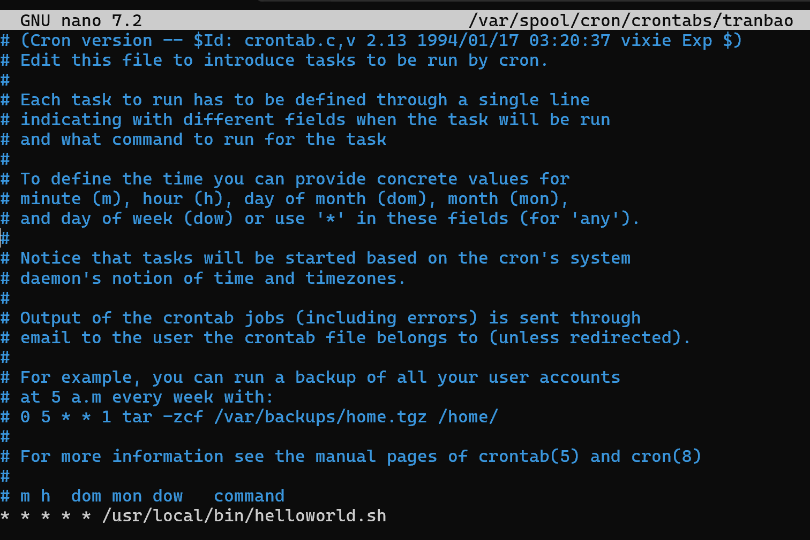
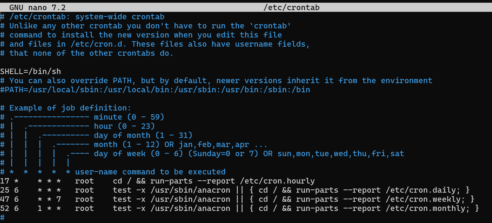
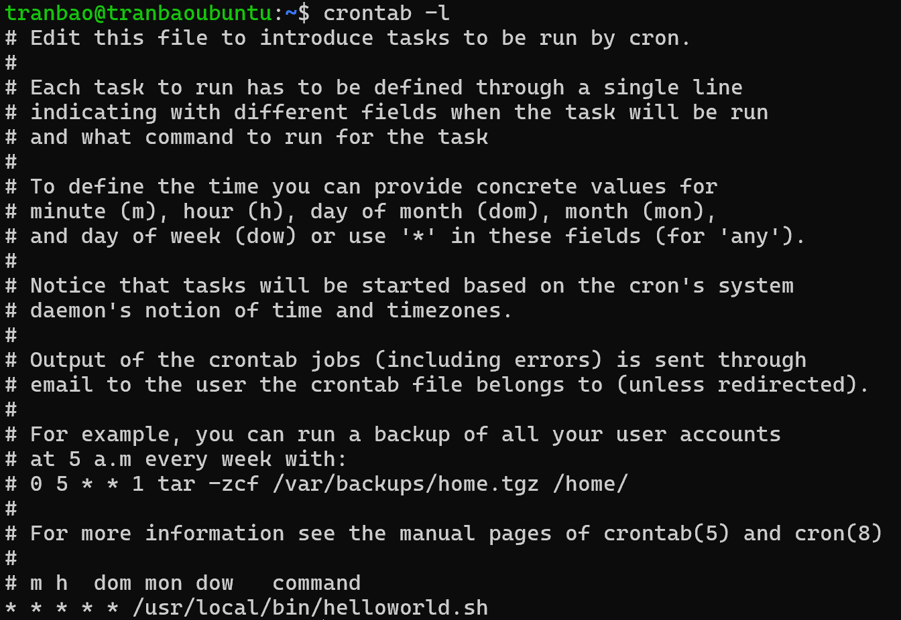

# TÌM HIỂU VỀ CRONTAB
## 1. KHÁI NIỆM
- Crontab (CRON TABLE) là công cụ quản lý lịch trình tự động trên hệ điều hành Linux, cho phép người dùng lên lịch các tác vụ định kỳ và thực hiện chúng tự động mà không cần sự can thiệp thủ công. Crontab giúp bạn tạo và quản lý các tác vụ, như chạy các script, backup dữ liệu hay thực hiện các nhiệm vụ hệ thống vào những thời điểm xác định trước, như hàng ngày, hàng tuần hoặc vào một thời gian cụ thể trong ngày, giúp giảm bớt công việc thủ công và tăng hiệu suất làm việc.

## 2. CẤU TRÚC CỦA CRONTAB
- Crontab bao gồm 5 trường thời gian và 1 trường lệnh cần thực thi. Các trường này được phân cách bằng khoảng trắng hoặc tab, tạo nên cấu trúc để xác định lịch trình thực hiện tác vụ định kỳ.

- Bên cạnh đó, một số lưu ý đặc biệt khi sử dụng:
+ Bạn có thể sử dụng dấu “,” để đặt lịch cho nhiều thời điểm khác nhau
+ Dấu “/” dùng để đặt lịch chạy sau mỗi khoảng thời gian chỉ định.
+ Dấu “–” được sử dụng để đặt lịch chạy trong một khoảng thời gian nhất định.
+ @yearly: Chạy mỗi năm (ví dụ: @yearly /script/script.sh)
+ @monthly: Chạy mỗi tháng (ví dụ: @monthly /script/script.sh)
+ @weekly: Chạy mỗi tuần (ví dụ: @weekly /script/script.sh)
+ @daily: Chạy mỗi ngày (ví dụ: @daily /script/script.sh)
+ @hourly: Chạy mỗi giờ (ví dụ: @hourly /script/script.sh)
+ @reboot: Chạy sau khi khởi động lại hệ thống (ví dụ: @reboot /script/script.sh)

## 3. CRONTAB HOẠT ĐỘNG NHƯ THẾ NÀO
- Crontab hoạt động thông qua các file cấu hình (cron schedule) để quản lý các tác vụ tự động trên hệ thống Linux. Mỗi người dùng có một file Crontab riêng, được lưu trữ trong thư mục /var/spool/cron. Người dùng không thể chỉnh sửa file này trực tiếp mà phải sử dụng lệnh crontab -e để mở tệp trong trình soạn thảo, thêm hoặc sửa các lệnh cần thực thi theo lịch trình và lưu lại.
+ `crontab -e`: Tùy chọn cho phép tạo hoặc chỉnh sửa file Crontab
+ `crontab -l`: Giúp hiển thị file crontab
+ `crontab -r`: Cho phép xóa file crontab

## 4. MỘT SỐ ỨNG DỤNG CỦA CRONTAB
- _Lên task công việc:_ Crontab giúp người dùng lên lịch tự động các tác vụ như sao lưu dữ liệu, quét virus hay thực hiện quy trình định kỳ vào thời gian cụ thể trong ngày, tuần, tháng hoặc năm.
- _Sao lưu dữ liệu:_ Cron thường tự động tạo bản sao lưu cơ sở dữ liệu, các file cấu hình quan trọng hoặc toàn bộ hệ thống hàng ngày, hàng tuần, hoặc hàng tháng, giúp đảm bảo an toàn cho dữ liệu.
- _Quản lý Logs:_ Các tác vụ cron được thiết lập để tự động xóa các file log cũ, giúp tiết kiệm không gian lưu trữ và duy trì hiệu suất hệ thống.
- _Cập nhật hệ thống:_ Cron tự động hóa cập nhật phần mềm, hệ điều hành và các bản vá bảo mật, giúp hệ thống luôn được bảo mật và tối ưu hóa.
- _Gửi Email thông báo tự động:_ Cron được sử dụng để gửi báo cáo, thông báo hoặc email nhắc nhở vào những thời điểm cụ thể, như gửi báo cáo hiệu suất hàng tuần cho quản lý.
- _Tự động hóa công việc lập trình:_ Cron sẽ thực hiện các tác vụ liên quan đến lập trình, chẳng hạn như xây dựng mã nguồn, chạy các bài kiểm thử tự động và triển khai ứng dụng.
- _Quản lý dữ liệu:_ Cron thực hiện các tác vụ như tối ưu hóa cơ sở dữ liệu, tái lập chỉ mục, hoặc chạy các truy vấn SQL định kỳ.

## 5. PHÂN LOẠI CRONTAB TRONG HỆ THỐNG LINUX
Crontab được chia làm hai cấp độ quản lý khác nhau:
### 5.1. Crontab của người dùng (User Crontab)
+ Nằm tại thư mục: /var/spool/cron/crontabs/<username>
+ Mỗi user (bao gồm cả root) có một file riêng. Các câu lệnh trong này sẽ chạy với quyền của chính user đó.
- Ví dụ:

### 5.2. Crontab của hệ thống (System Crontab)
+ Dành cho quản trị viên hệ thống để cấu hình các tác vụ sâu của hệ điều hành.
+ File cấu hình chính: /etc/crontab (File này có cú pháp khác một chút: có thêm trường chỉ định User chạy lệnh trước trường câu lệnh).
+ Các thư mục cấu hình sẵn: /etc/cron.hourly/ (chạy mỗi giờ), /etc/cron.daily/ (mỗi ngày), /etc/cron.weekly/, /etc/cron.monthly/. Bạn chỉ cần ném file script vào các thư mục này, hệ thống sẽ tự động chạy theo chu kỳ tương ứng.
- Ví dụ:

## 6. QUẢN LÝ CÔNG VIỆC CỦA CRONTAB
**Thêm công việc mới**
- Đầu tiên, bạn mở terminal và chạy lệnh: `crontab -e`
- Sau đó, thêm dòng mới vào file Crontab theo cú pháp: `m h dom mon dow command`
_Lưu ý_
* m: Phút (0-59).
* h: Giờ (0-23).
* dom: Ngày trong tháng (1-31).
* mon: Tháng (1-12).
* dow: Ngày trong tuần (0-7, với 0 và 7 là Chủ nhật).

**Sửa đổi công việc**
Để chỉnh sửa dòng công việc cần thay đổi bạn chạy lệnh bên dưới, sau đó lưu và đóng file: `crontab -e`

**Xóa công việc**
Để xóa công việc, bạn chạy lệnh, sau đó lưu và đóng file: `crontab -e`

**Xem các công việc đã đặt lịch**
Để liệt kê các công việc đã lên lịch, bạn sử dụng lệnh sau: `crontab -l`

**Kiểm tra log crontab**
Bạn có thể sử dụng lênh sau để xem log và kiểm tra kết quả công việc: `grep CRON /var/log/syslog`

**Kiểm tra lịch hiện tại**
Việc kiểm tra lịch bạn cần sử dụng quyền quản trị: `sudo crontab -u <username>`
**Gỡ bỏ toàn bộ crontab**
Bạn muốn xóa tất cả công việc, sử dụng lệnh sau: `crontab -r`

## 7. NHỮNG CÚ PHÁP ĐẶC BIỆT TRONG CRONTAB
| Lệnh viết tắt | Viết tắt của lệnh |                        Mô tả                       |
|:-------------:|:-----------------:|:--------------------------------------------------:|
| @hourly       | 0****             | Chạy công việc tự động mỗi giờ.                    |
| @daily        | 00***             | Chạy tự động vào lúc 00:00 mỗi ngày.               |
| @weekly       | 00**0             | Chạy tự động vào lúc 00:00 mỗi Chủ Nhật hàng tuần. |
| @monthly      | 001**             | Chạy tự động vào lúc 00:00 ngày đầu tháng.         |
| @yearly       | 0011*             | Chạy tự động vào lúc 00:00 ngày đầu năm.           |
| @reboot       | –                 | Chạy tự động mỗi khi hệ thống khởi động lại.       |

## 8. CÁC LỖI THƯỜNG GẶP VÀ CÁCH XỬ LÝ
### Thiếu biến môi trường (Environment Path)
- Khi Cron hoạt động, nó chạy trong một môi trường tối giản và không có đầy đủ danh sách đường dẫn PATH như khi bạn đăng nhập trực tiếp.
- Giải pháp: Luôn sử dụng đường dẫn tuyệt đối cho cả câu lệnh hệ thống lẫn file script.
+ Sai: `0 2 * * * python3 test.py`
+ Đúng: `0 2 * * * /usr/bin/python3 /home/tranbao/test.py`

### Lỗi bị nuốt mất (Không biết tại sao script hỏng)
- Mặc định, Cron sẽ gửi kết quả đầu ra (output) hoặc báo lỗi của lệnh vào hòm thư nội bộ của user. Nếu bạn không cấu hình nhận mail, bạn sẽ không biết script chạy lỗi gì.
- Giải pháp: Xuất toàn bộ dữ liệu log ra một file văn bản bên ngoài để tiện kiểm tra:
`0 2 * * * /usr/bin/python3 /home/tranbao/test.py >> /home/tranbao/cron_output.log 2>&1`

### Thời gian trên Server bị sai
- Cron hoạt động dựa trên đồng hồ của hệ thống. Nếu Server của bạn không được đồng bộ NTP và bị lệch múi giờ (ví dụ: hệ thống dùng giờ UTC nhưng bạn lại tính theo giờ Việt Nam GMT+7), các cron job sẽ chạy sai giờ hoàn toàn.
- Kiểm tra: Hãy gõ lệnh date trên server để xem giờ hệ thống trước khi lên lịch cron.

