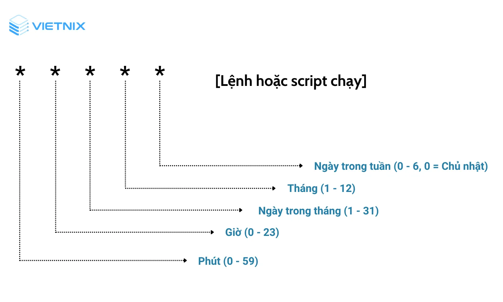

# TÌM HIỂU VỀ CRONTAB
## 1. KHÁI NIỆM
- Crontab (CRON TABLE) là công cụ quản lý lịch trình tự động trên hệ điều hành Linux, cho phép người dùng lên lịch các tác vụ định kỳ và thực hiện chúng tự động mà không cần sự can thiệp thủ công. Crontab giúp bạn tạo và quản lý các tác vụ, như chạy các script, backup dữ liệu hay thực hiện các nhiệm vụ hệ thống vào những thời điểm xác định trước, như hàng ngày, hàng tuần hoặc vào một thời gian cụ thể trong ngày, giúp giảm bớt công việc thủ công và tăng hiệu suất làm việc.

## 2. CẤU TRÚC CỦA CRONTAB
- Crontab bao gồm 5 trường thời gian và 1 trường lệnh cần thực thi. Các trường này được phân cách bằng khoảng trắng hoặc tab, tạo nên cấu trúc để xác định lịch trình thực hiện tác vụ định kỳ.

- Bên cạnh đó, một số lưu ý đặc biệt khi sử dụng:
+ Bạn có thể sử dụng dấu “,” để đặt lịch cho nhiều thời điểm khác nhau
+ Dấu “/” dùng để đặt lịch chạy sau mỗi khoảng thời gian chỉ định.
+ Dấu “–” được sử dụng để đặt lịch chạy trong một khoảng thời gian nhất định.
+ @yearly: Chạy mỗi năm (ví dụ: @yearly /script/script.sh)
+ @monthly: Chạy mỗi tháng (ví dụ: @monthly /script/script.sh)
+ @weekly: Chạy mỗi tuần (ví dụ: @weekly /script/script.sh)
+ @daily: Chạy mỗi ngày (ví dụ: @daily /script/script.sh)
+ @hourly: Chạy mỗi giờ (ví dụ: @hourly /script/script.sh)
+ @reboot: Chạy sau khi khởi động lại hệ thống (ví dụ: @reboot /script/script.sh)

## 3. CRONTAB HOẠT ĐỘNG NHƯ THẾ NÀO
- Crontab hoạt động thông qua các file cấu hình (cron schedule) để quản lý các tác vụ tự động trên hệ thống Linux. Mỗi người dùng có một file Crontab riêng, được lưu trữ trong thư mục /var/spool/cron. Người dùng không thể chỉnh sửa file này trực tiếp mà phải sử dụng lệnh crontab -e để mở tệp trong trình soạn thảo, thêm hoặc sửa các lệnh cần thực thi theo lịch trình và lưu lại.
+ `crontab -e`: Tùy chọn cho phép tạo hoặc chỉnh sửa file Crontab
+ `crontab -l`: Giúp hiển thị file crontab
+ `crontab -r`: Cho phép xóa file crontab

# THỰC HÀNH CẤU HÌNH CRONTAB CHO FILE HELLOWORL.SH ĐƯỢC THỰC THI TỰ ĐỘNG
- Đầu tiên ta sẽ sử dụng câu lệnh `crontab -e` (tham số `-e` có nghĩa là edit) để cấu hình cho file helloworld.sh sẽ được thực thi mỗi phút

+ ở đây 5 trường thời gian được để là *, có nghĩa là cứ sau mỗi phút, file `helloworld.sh` sẽ được thực thi một lần
+ trong trường hợp ta cần cấu hình theo ngày tháng cụ thể, thì ta sẽ chỉnh sửa trong `crontab -e`

- Ctrl + O -> Ctrl + X để tiến hành lưu file cấu hình
- Bây giờ cứ mỗi phút, file `helloworld.sh` sẽ được thực thi tự động. Vậy làm sao để ta kiểm tra xem file đã được thực thi hay chưa. Để kiểm tra ta có thể gõ 2 câu lệnh sau
`sudo systemctl status cron`

Ở đây ta có thể thấy cứ mỗi phút `helloworld.sh` sẽ được gọi đến một lần

`sudo tail -f var/log/syslog | grep -i cron`

