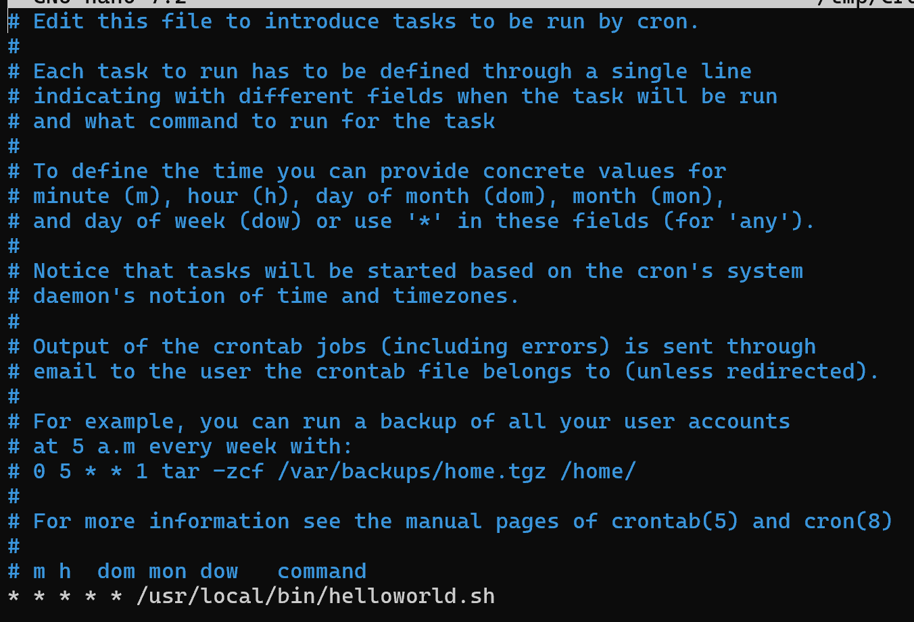
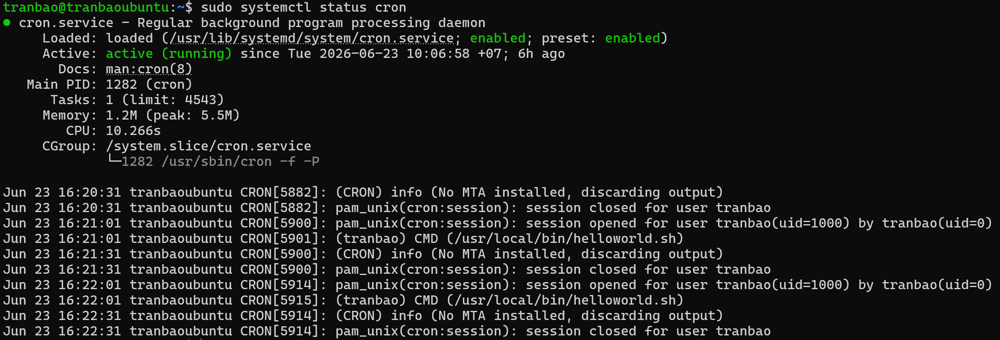
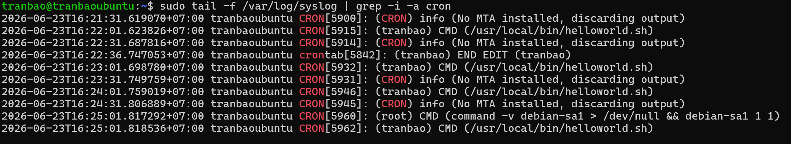

# THỰC HÀNH CẤU HÌNH CRONTAB CHO FILE HELLOWORL.SH ĐƯỢC THỰC THI TỰ ĐỘNG
- Đầu tiên ta sẽ sử dụng câu lệnh `crontab -e` (tham số `-e` có nghĩa là edit) để cấu hình cho file helloworld.sh sẽ được thực thi mỗi phút

+ ở đây 5 trường thời gian được để là *, có nghĩa là cứ sau mỗi phút, file `helloworld.sh` sẽ được thực thi một lần
+ trong trường hợp ta cần cấu hình theo ngày tháng cụ thể, thì ta sẽ chỉnh sửa trong `crontab -e`

- Ctrl + O -> Ctrl + X để tiến hành lưu file cấu hình
- Bây giờ cứ mỗi phút, file `helloworld.sh` sẽ được thực thi tự động. Vậy làm sao để ta kiểm tra xem file đã được thực thi hay chưa. Để kiểm tra ta có thể gõ 2 câu lệnh sau
`sudo systemctl status cron`

Ở đây ta có thể thấy cứ mỗi phút `helloworld.sh` sẽ được gọi đến một lần

`sudo tail -f var/log/syslog | grep -i cron`

