# CÁCH MỞ RỘNG DISK TRONG UBUNTU (CÓ THỂ ĐỌC/GHI ĐƯỢC)

## STANDARD PARTITIONING
### GIAI ĐOẠN 1
- Đầu tiên, chúng ta sẽ kiểm tra cấu trúc ổ đĩa bằng lệnh `lsblk`
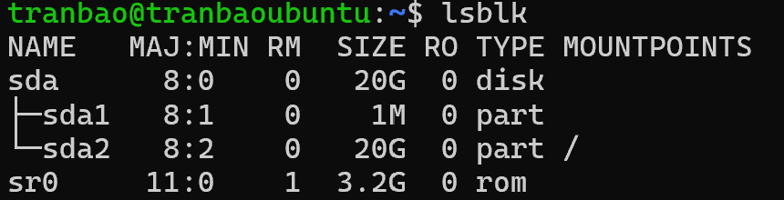
- Có thể thấy, ổ đĩa `sda` đang có dung lượng hiện tại là 20GB, cơ chế phân vùng đang được sử dụng là Standard Partitioning. Bây giờ sẽ đến bước tiếp theo là nới rộng dung lượng ổ đĩa lên 22GB
### GIAI ĐOẠN 2
- Đầu tiên, chúng ta sẽ tắt máy ảo đi và vào phần Setting của máy ảo
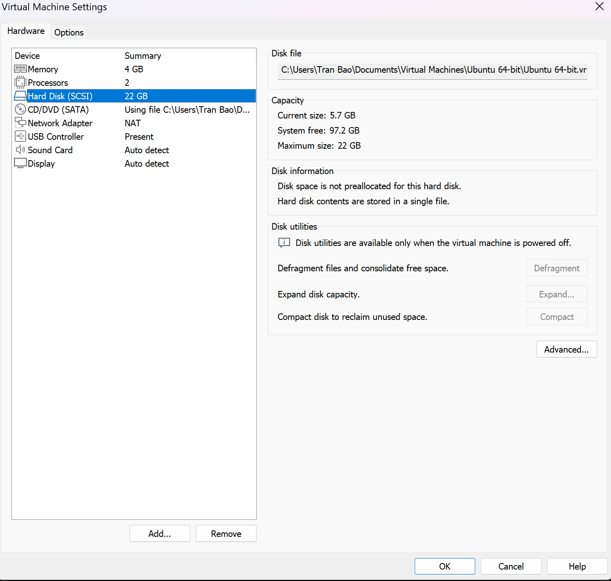
- Nhấn vào nút Expand và tăng dung lượng máy ảo lên 22GB
- Nhấn OK và tiến hành bật máy ảo Ubuntu
- Lúc này sử dụng câu lệnh `lsblk` để kiểm tra lại cấu trúc ổ đĩa, ta có thể thấy dung lượng ổ đĩa đã tăng lên từ 20GB->22GB, tuy nhiên phân vùng của hệ điều hành vẫn đang kẹt ở 20GB
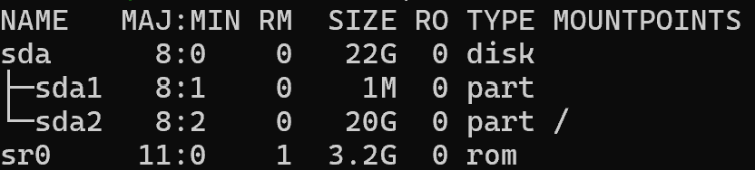

- Bây giờ ta sẽ sử dụng công cụ `growpart` để phân vùng `sda2` chiếm hết dung lượng của ổ đĩa sda:
`sudo growpart /dev/sda 2`
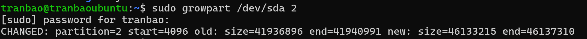
+ Lưu ý quan trọng khi gõ lệnh: Phải có một khoảng trắng giữa /dev/sda và số 2. Số 2 ở đây đại diện cho phân vùng sda2.
+ Sau khi chạy xong, gõ lệnh lsblk để kiểm tra. Ta sẽ thấy dòng sda2 lập tức chuyển từ 20G lên 22G.
- Dù phân vùng `sda2` đã to ra, nhưng hệ thống quản lý file bên trong (thường là ext4) vẫn chưa nhận biết được không gian mới. Ta cần chạy lệnh `resize2fs` để nó tràn ra hết phân vùng:
`sudo resize2fs /dev/sda2`
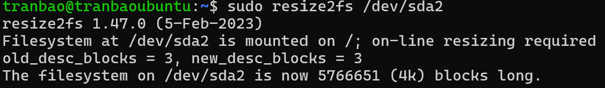

- Cuối cùng ta sẽ kiểm tra, để chắc chắn dung lượng mới đã sẵn sàng cho việc đọc ghi dữ liệu, ta chạy lệnh:
`df -hT /` *df-disk free, -h (human-readable), -T (type), / (root)
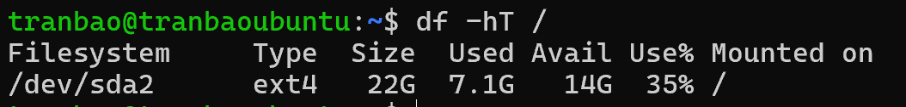
- Vậy là ta đã thành công mở rộng ổ đĩa từ 20GB -> 22GB trên Ubuntu sử dụng cơ chế quản lý lưu trữ Standard Partitioning

## LVM
## Mô tả
Mở rộng ổ đĩa thêm 4GB và gán 4GB đó vào thư mục /home để lưu trữ dữ liệu
## Các bước thực hiện
- Đầu tiên ta cần mở rộng ổ đĩa ở trên VMware, click chuột phải vào máy ảo Ubuntu Server, chọn mục Hard Disk, click vào Expand và chọn dung lượng muốn mở rộng
- Ở đây, ta sẽ mở rộng thêm 4GB cho máy ảo
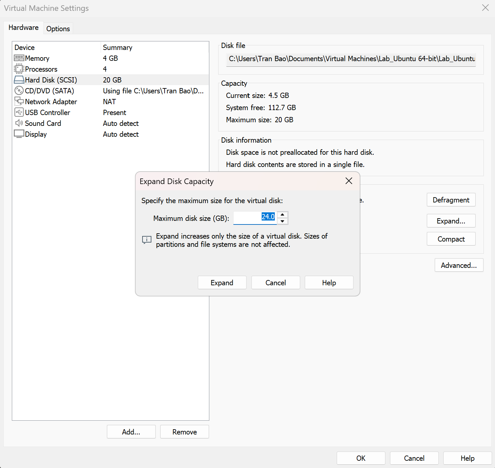

- Lúc này ta gõ lệnh `lsblk` để kiểm tra thì Ubuntu đã nhận ổ 24GB, tuy nhiên phân vùng `sda3` vẫn chỉ nhận 18.2GB
- Bây giờ ta sẽ sử dụng công cụ `growpart` để yêu cầu phân vùng sda3 quét lại và nhận thêm 4GB mới được thêm
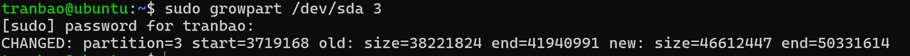

- Bây giờ ta cần thông báo cho phân vùng sda3 rằng dung lượng đã phình to ra
`sudo pvresize /dev/sda3`
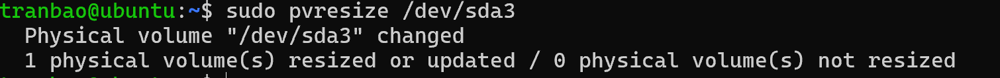

- Bây giờ ta sẽ cần tạo một phân vùng /home ảo và định dạng phân vùng đó theo định dạng ext4 (một kiểu định dạng thường thấy cũng như là ổn định nhất)
`sudo lvcreate -L 4G -n home-lv ubuntu-vg` _option -L là dung lượng của phân vùng, -n là tên phân vùng_
`sudo mkfs.ext4 /dev/ubuntu-vg/home-lv` 
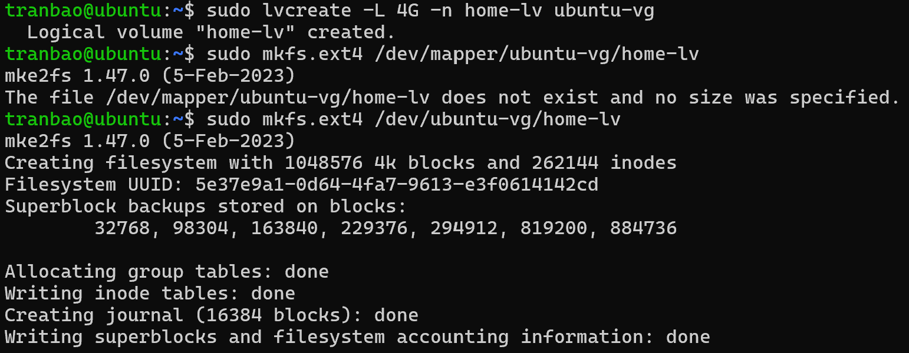

- Tại thư mục /home của người dùng có thể sẽ chứa các file cấu hình của người dùng, nên điều đầu tiên ta cần làm là back-up lại dữ liệu của thư mục /home sang phân vùng mới trước khi mount đè lên
`sudo mkdir /mnt/home_temp`
`sudo mount /dev/ubuntu-vg/home-lv /mnt/home_temp`
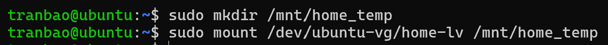

- bây giờ ta cần copy toàn bộ dữ liệu từ thư mục /home cũ sang phân vùng lvm mới được tạo
`sudo cp -a /home/* /mnt/home_temp/`
- Sau khi backup dữ liệu trong thư mục /home xong, ta sẽ mount phân vùng lvm mới vào trực tiếp thư mục /home
`sudo mount /dev/ubuntu-vg/home-lv /home`
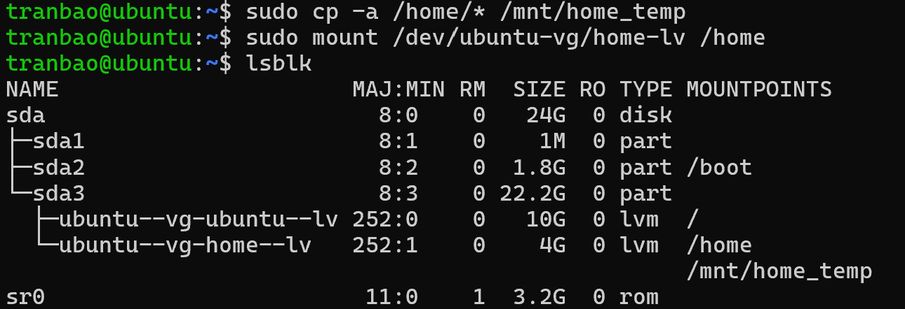

- Sau khi thực hiện mount phân vùng home-lv vào thư mục /home xong, ta có thể unmount phân vùng home-lv với thư mục backup và xóa thư mục backup đi
`sudo umount /mnt/home_temp`
`sudo rmdir /mnt/home_temp`

- Để hệ thống luôn tự mount phân vùng 4GB này vào thư mục /home khi bật máy. ta sẽ thực hiện cấu hình tự động gắn ổ đĩa khi khởi động máy. Vào file cấu hình bằng câu lệnh
`sudo nano /etc/fstab`
- Sau đó thêm dòng này vào cuối file. Sau đó Ctrl + O và Ctrl +X để lưu file và thoát 
`/dev/ubuntu-vg/home-lv  /home  ext4  defaults  0  2`
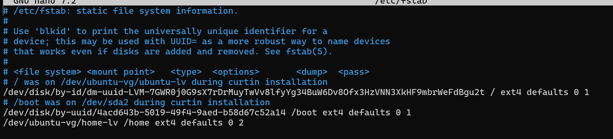

**Lưu ý:**
- /dev/ubuntu-vg/home-lv: là đường dẫn đến phân vùng ảo 4GB mà ta đã khởi tạo lúc đầu

- /home: là mount point, khi ta truy cập vào thư mục /home và đọc ghi dữ liệu, hệ điều hành sẽ hiểu là ta đang đọc ghi trên phân vùng home-lv

- ext4: là định dạng phân vùng

- defaults : tùy chọn mount, dùng để khai báo quyền hạn và hành vi của ổ đĩa khi hoạt động. Ngoài ra thì có các mount options khác như
+ noatime (No Access Time): Không cập nhật thời gian truy cập file. Đây là option kinh điển giúp tăng tốc độ đọc/ghi dữ liệu và tiết kiệm tuổi thọ cho ổ đĩa SSD hoặc máy ảo một cách đáng kể, vì hệ thống bớt được một công đoạn ghi đĩa thừa thãi.
+ nodiratime (No Directory Access Time): Tương tự như noatime nhưng áp dụng riêng cho các thư mục (Directories).
+ relatime (Relative Access Time): Chỉ cập nhật thời gian truy cập nếu file đó thực sự bị sửa đổi (đây là cơ chế mặc định của đa số bản Linux hiện nay nếu dùng defaults).
+ nofail: Bỏ qua lỗi nếu không tìm thấy ổ đĩa. Mặc định, nếu một phân vùng khai báo trong fstab bị rút ra (hoặc ổ đĩa ảo bị xóa trên VMware), Ubuntu khi khởi động không tìm thấy ổ đĩa đó sẽ bị treo ngay ở màn hình boot (Emergency Mode). Nếu bạn thêm nofail, hệ thống sẽ bỏ qua ổ đĩa lỗi đó và tiếp tục boot vào Ubuntu như bình thường. (Rất nên dùng cho ổ cứng cắm ngoài, USB hoặc các ổ đĩa data phụ).
+ noauto: Không tự động mount ổ đĩa này khi bật máy. Ổ đĩa sẽ chỉ được gắn khi nào bạn chủ động gõ lệnh sudo mount /home bằng tay.
+ ro (Read-Only): Gắn ổ đĩa ở chế độ Chỉ đọc. Bạn hoàn toàn không thể ghi, xóa hay sửa file trên phân vùng này (Rất tốt cho các phân vùng chứa dữ liệu backup hoặc dữ liệu lưu trữ lịch sử để tránh bị virus xóa sạch).
+ rw (Read-Write): Gắn ổ đĩa ở chế độ Đọc và Ghi (Được gộp sẵn trong defaults).
+ noexec (No Execute): Cấm thực thi bất kỳ file chạy, file nhị phân (.bin, script .sh) nào trên phân vùng này. Nếu hacker có tải được mã độc về thư mục này cũng không thể chạy được.
+ nosuid (No Set-User-Identifier): Không cho phép các chương trình chạy với quyền của chủ sở hữu file (ví dụ quyền root). Đây là tính năng ngăn chặn việc lợi dụng các file hệ thống để chiếm quyền điều khiển máy chủ.
+ nodev (No Device): Không cho phép hệ thống hiểu các file thiết bị ký tự hoặc khối (character/block special devices) trên phân vùng này (ngăn chặn việc tạo ra các ổ đĩa ảo giả mạo).

- O: tùy chọn sao lưu. Đây là tính năng cũ dùng để xác định xem phân vùng này có cần được sao lưu tự động bằng công cụ dump hay không. 0 có nghĩa là bỏ qua vì công cụ `dump` hiện nay rất ít được sử dụng

- 2: kiểm tra ổ đĩa. Thiết lập thứ tự ưu tiên cho công cụ fsck (File System Check) tiến hành quét và tự động sửa lỗi ổ đĩa khi máy ảo bị tắt đột ngột (mất điện, sập nguồn)
+ Số 0: Không bao giờ kiểm tra lỗi (Dành cho ổ đĩa mạng hoặc phân vùng Swap).
+ Số 1: Thứ tự ưu tiên cao nhất (Chỉ dành riêng cho phân vùng gốc / để nó được quét đầu tiên).
+ Số 2: Thứ tự ưu tiên tiếp theo (Dành cho tất cả các phân vùng còn lại như /home, /data của bạn). Phân vùng này sẽ được quét sau khi phân vùng gốc / đã khởi động an toàn.