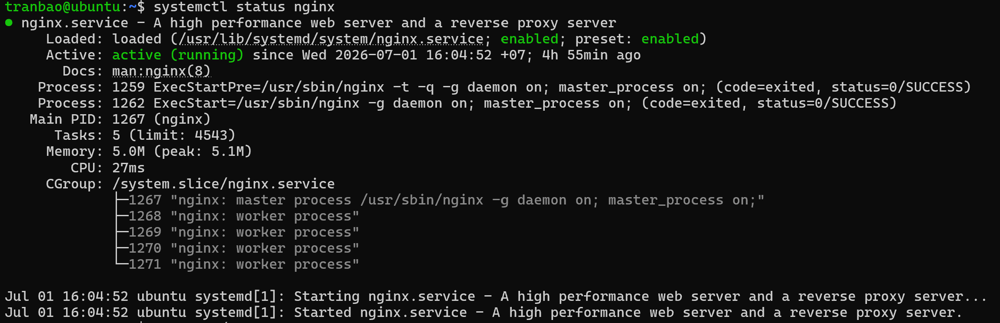
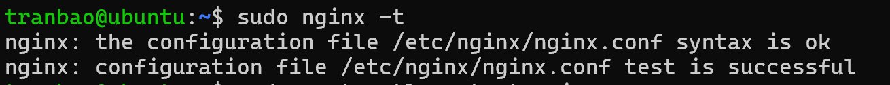
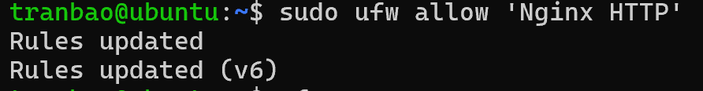
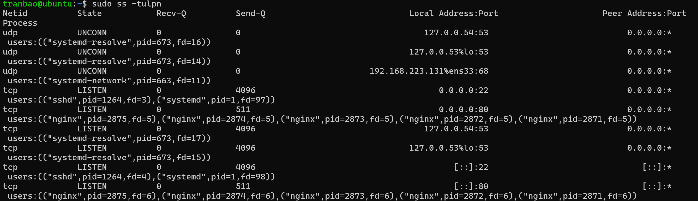
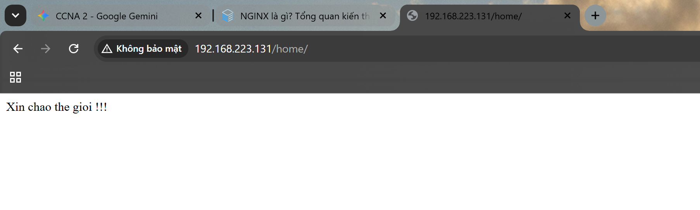

# THỰC HÀNH CẤU HÌNH NGINX ĐƠN GIẢN
## MÔ TẢ
- Cấu hình nginx server trên máy ảo Ubuntu Server 24.04, khi người dùng truy cập đến địa chỉ http://<IP_MÁY_ẢO_UBUNTU>/home trên máy thật Windows thì màn hình sẽ hiển thị ra nội dung `Hello`
- Ở phần thực hành này ta sẽ sử dụng những kiến thức đã học liên quan đến phân quyền file cũng như là cấu hình filewall, cũng như systemd

## THỰC HÀNH
### Bước 1: Cài đặt Nginx Server
- Đầu tiên ta sẽ tiến hành cài đặt Nginx từ package của Ubuntu
`sudo apt update`
`sudo apt install nginx -y` (-y ở đây là option đồng ý xác nhận cài đặt)

- Sau khi cài đặt xong, ta sẽ tiến hành kiểm tra xem dịch vụ này đã được khởi chạy hay chưa
`systemctl status nginx`

- Nếu nhìn thấy chữ màu xanh running thì có nghĩa là dịch vụ đã được khởi chạy thành công, nếu không thấy dịch vụ khởi chạy, ta sẽ sử dụng 1 trong 2 câu lệnh
`systemctl start nginx`
`systemctl enable nginx` (dịch vụ sẽ được khởi chạy cùng với hệ thống)

### Bước 2: Tạo giao diện web có chứa chữ "Xin chao the gioi"
- Vì Nginx sẽ đọc các file html để hiển thị lên màn hình cho người dùng, nên ta sẽ tiến hành tạo một file html đơn giản
- Đầu tiên ta sẽ tạo một thư mục để chứa web
`sudo mkdir -p /var/www/hello-web` (trong trường hợp trong thư mục /var không có thư mục www, ta sẽ sử dụng option -p để tạo luôn thư mục cha của hello-web là /www)

- Tiếp theo, ta sẽ tạo một file giao diện html đơn giản với nội dung là `Xin chao the gioi`
`sudo nano /var/www/hello-web/home.html`
Sau khi gõ câu lệnh xong ta sẽ nhập dòng chữ vào và Ctrl + O và Ctrl + X để lưu file và thoát

- Bây giờ, ta sẽ cần cấu hình phân quyền cho home.html để đảm bảo Nginx có quyền đọc nội dung của file
`sudo chmod 644 /var/www/hello-web/home.html` (644: owner wrx, group wr-, others wr-)

### Bước 3: Cấu hình Nginx điều hướng đường dẫn /home
- Ta sẽ tiến hành mở file cấu hình mặc định của nginx để chỉnh sửa:
`sudo nano /etc/nginx/sites-avaiable/default`

- Tìm đến block location / {............} và tiến hành thêm nội dung như sau, sau đó Ctrl + O và Ctrl + X để lưu và thoát
location /home {
    alias /var/www/myweb/;
    index home.html;
}
- Tiến hành kiểm tra cấu hình Nginx có đúng hay không
`sudo nginx -t`

Nếu màn hình hiển thị syntax is ok và test is successful nhwu trong hình thì có nghĩa là đúng rồi

### Bước 4: Ra lệnh systemd nạp lại nginx
- Bây giờ ta sẽ tiến hành ra lệnh cho nginx nạp lại cấu hình thông qua systemd bằng câu lệnh
`systemctl restart nginx`

### Bước 5: Cấu hình Firewall
- Để máy thật có thể truy cập vào trang web chạy trên port 80 (port mặc định của nginx), ta cần phải cấu hình tường lửa
`sudo ufw allow 'Nginx HTTP'`

Ta có thể thấy luật mới đã được áp dụng vào tường lửa

- Để kiểm tra tường lửa đã mở cổng 80 hay chưa, ta sẽ tiến hành kiểm tra
`ufw status` (kiểm tra xem đã bật tường lửa hay chưa, nếu chưa bật thì sử dụng câu lệnh `sudo ufw enable`)
`sudo ss -tulnp`
Hệ thống sẽ hiển thị ra màn hình như sau:

Ta có thể thấy cổng 80 của dịch vụ nginx đã được mở. Ta sẽ tiến hành đi đến bước cuối

### Bước 6: Kiểm tra
- Trên máy ảo Ubuntu, ta sẽ sử dụng câu lệnh `ip a` để kiểm tra địa chỉ ip của máy ảo
- Sau đó, ta sẽ sử dụng máy thật (ở đây là Windows 11) và mở một trình duyệt web, ta sẽ gõ đường dẫn http://<IP_MÁY_ẢO_UBUNTU>/home vào thanh địa chỉ
- Ta có thể thấy như hình dưới đây thì màn hình trình duyệt đã hiển thị nội dung như ta đã ghi trong file home.html, vậy là ta đã thành công
