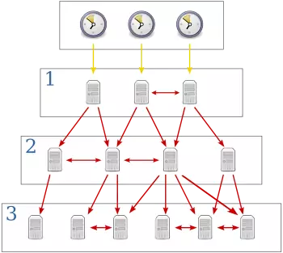
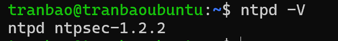
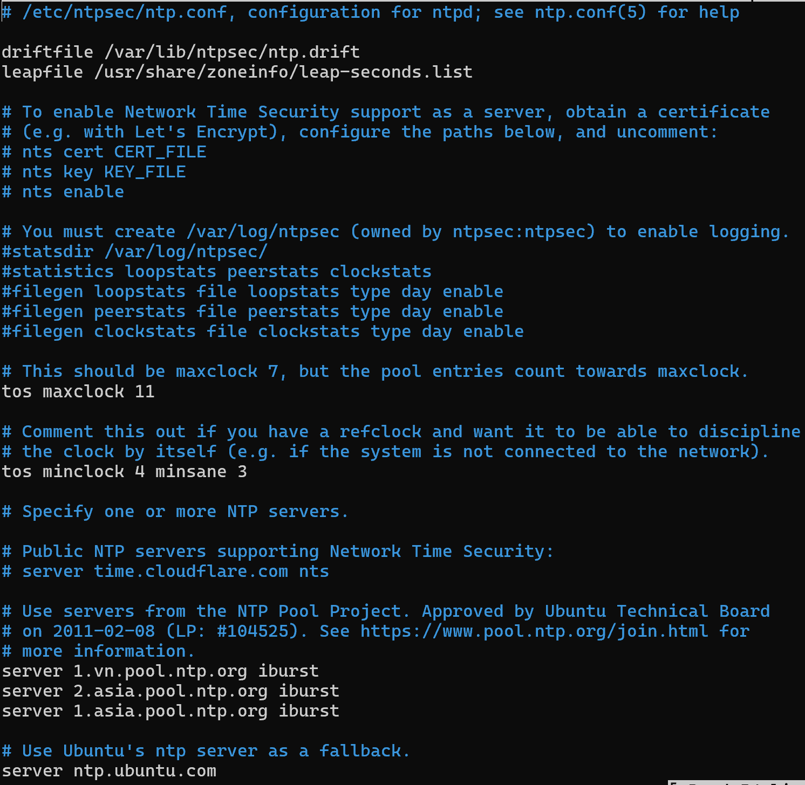
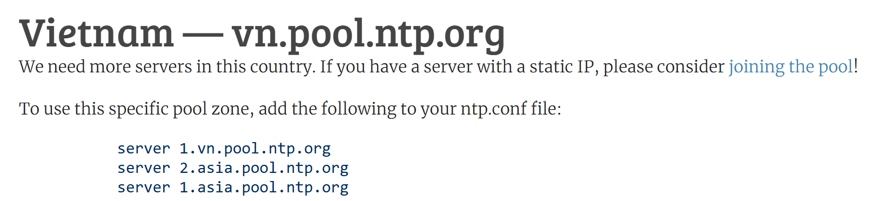
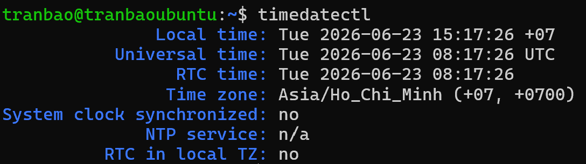
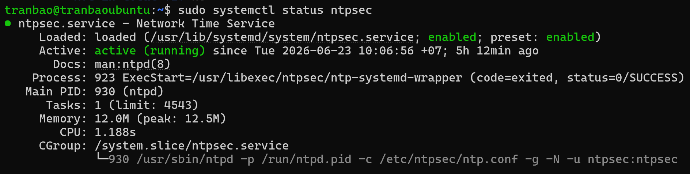

# TÌM HIỂU VỀ NTP VÀ CÁCH CẤU HÌNH NTP TRÊN UBUNTU SERVER 24.04

## 1. KHÁI NIỆM
- NTP (Network Time Protocol) là giao thức hoạt động ở tầng Ứng dụng (Application Layer) trong mô hình TCP/IP (sử dụng cổng UDP 123), được thiết kế để đồng bộ hóa đồng hồ của các máy tính trong mạng theo một nguồn thời gian chuẩn xác.

- NTP hoạt động theo mô hình Phân cấp (Stratum) dạng cây:
+ Stratum 0: Là các thiết bị phần cứng đo thời gian tuyệt đối và chính xác nhất như đồng hồ nguyên tử (Atomic Clock), đồng hồ GPS, hoặc đồng hồ vô tuyến. Các thiết bị này không kết nối trực tiếp qua mạng.
+ Stratum 1: Là các máy chủ kết nối trực tiếp với thiết bị Stratum 0. Đây là những cỗ máy cung cấp thời gian trực tiếp cho mạng Internet.
+ Stratum 2: Là các máy chủ đồng bộ thời gian từ máy chủ Stratum 1 qua kết nối mạng (Hầu hết các máy chủ Ubuntu sẽ đồng bộ từ các pool ở cấp độ Stratum 2 này).
+ Stratum 3, 4...: Cấp độ càng xa Stratum 0 thì độ trễ mạng tích lũy càng lớn, nhưng độ lệch thường chỉ tính bằng mili-giây.

## 2. MỤC ĐÍCH CỦA NTP
Trong môi trường máy tính cá nhân, thời gian lệch vài phút có thể không sao. Nhưng đối với một máy chủ (Server), đặc biệt là với công việc của một Software Tester hay quản trị hệ thống, thời gian bị lệch dù chỉ vài giây cũng có thể gây ra những thảm họa sau:
- **Đảm bảo tính chính xác của file log (Liên quan đến hệ thống)**

- **Xác thực và bảo mật**
Các chứng chỉ bảo mật HTTPS (SSL/TLS) luôn có thời hạn kích hoạt và hết hạn cụ thể. Nếu đồng hồ trên Ubuntu Server bị sai lệch (ví dụ: lùi về quá khứ hoặc chạy trước tương lai), trình duyệt sẽ báo lỗi kết nối không an toàn, hoặc các phiên thiết lập SSH Key/Token Token sẽ bị từ chối do hết hạn (Expired).

- **Đồng bộ hóa Cơ sở dữ liệu**
Khi chạy các hệ thống dữ liệu lớn cần phân tán (Replication) hoặc đồng bộ giữa nhiều máy chủ, Database dựa vào mốc thời gian chính xác từng mili-giây để quyết định xem dữ liệu nào được ghi trước, dữ liệu nào ghi sau. Lệch thời gian sẽ làm hỏng tính toàn vẹn của dữ liệu (Data Integrity).

- **Chạy các tác vụ tự động**
Các kịch bản kiểm thử tự động (Automation Test scripts), tác vụ sao lưu dữ liệu (Backup) thường được lên lịch chạy vào lúc thấp điểm (ví dụ: 2 giờ sáng). Nếu không có NTP, các tác vụ này có thể chạy sai giờ, gây ảnh hưởng đến hiệu năng của hệ thống lúc người dùng đang truy cập đông.

## 3. PHƯƠNG THỨC HOẠT ĐỘNG

- NTP client gửi một gói tin, trong đó chứa một thẻ thời gian tới cho NTP server.
- NTP server nhận được gói tin, gửi trả lại NTP client một gói tin khác, có thẻ thời gian là thời điểm nó gửi gói tin đó đi.
- NTP client nhận được gói tin đó, tính toán độ trễ, dựa và thẻ thời gian mà nó nhận được cùng với độ trễ đường truyền, NTP client sẽ set lại thời gian của nó.

## 4. CÁCH CẤU HÌNH NTP TRÊN UBUNTU SERVER 24.04
- Đầu tiên ta cần cập nhật package và tiến hành cài đặt NTP

- sử dụng câu lệnh
`sudo apt update`
`sudo apt install ntp`

- Sau khi cài đặt xong, ta sẽ tiến hành xác nhận xem NTP đã được cài đặt chưa bằng câu lệnh `ntpd -V` (lưu ý option `-V` phải viết hoa)

Ta có thể thấy đã cài đặt thành công NTP phiên bản 1.2.2
**Lưu ý**: tại sao lại là ntpsec, hiện nay `ntpsec` (NTP Security) đã thay thế hoàn toàn `ntp` ngày xưa vì `ntpsec` là phiên bản bảo trì nâng cấp, loại bỏ các dòng code thừa thãi cũng như vá lại toàn bộ lỗ hổng bảo mật và tối ưu hóa lại tốc độ xử lý

- Tiếp theo, ta sẽ cần cấu hình lại nguồn lấy giờ trong file cấu hình, để làm được điều này ta sử dụng câu lệnh
`sudo nano /etc/ntpsec/ntp_conf`

+ Ta cần chỉnh sửa lại server khu vực Việt Nam/Asia để lấy giờ nhanh và chính xác. Truy cập `https://www.ntppool.org/zone/vn` để lấy được thông tin server của Server Việt Nam

- Tiến hành copy và dán vào file `ntp.conf`

- Chọn múi giờ chuẩn khu vực TP.Hồ Chí Minh/khu vực Asia
`sudo timedatectl set-timezone Asia/Ho_Chi_Minh`

- Mở tường lửa cho phép giao thức NTP hoạt động
`sudo ufw allow 123/udp`

- Khởi động lại dịch vụ `ntpsec` để áp dụng cấu hình
`sudo systemctl restart ntpsec`

- CHo phép dịch vụ NTP tự động khởi chạy cùng hệ thống
`sudo systemctl enable ntpsec`

- Kiểm tra dịch vụ NTP đã hoạt động hay chưa và các cấu hình khác
+ `sudo systemctl status ntpsec`
+ `timedatectl`

