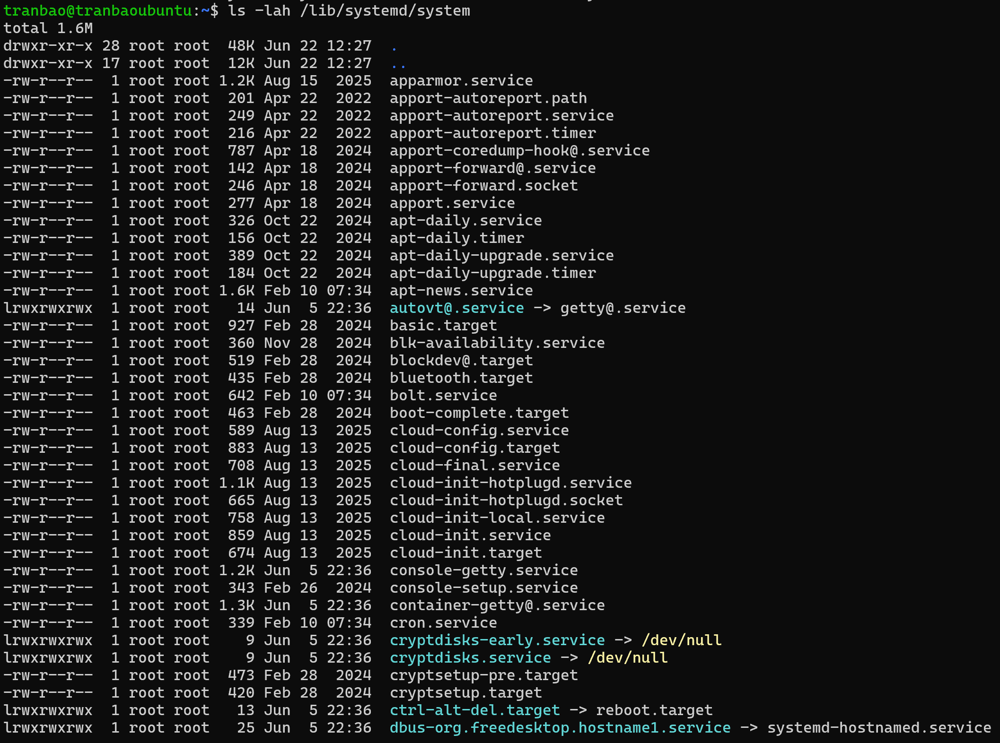
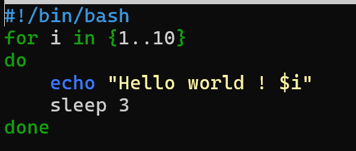
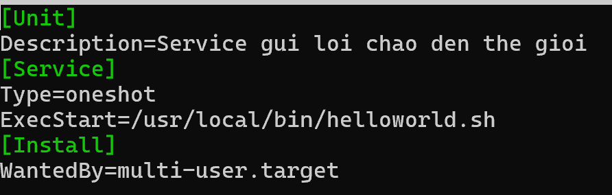
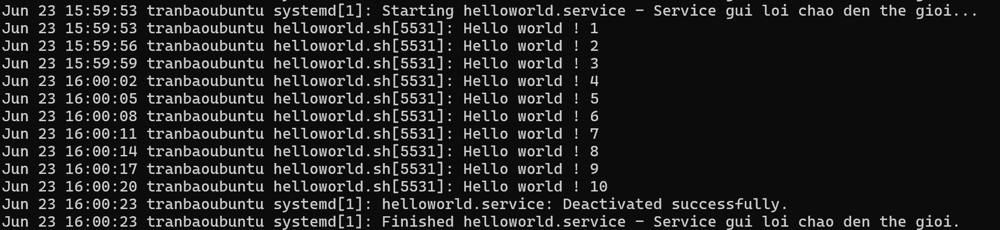

# TÌM HIỂU VỀ SYSTEMD VÀ CÁCH CHẠY MỘT SCRIPT ĐƯỢC QUẢN LÝ BỞI SYSTEMD
## 1. KHÁI NIỆM VỀ SYSTEMD
- systemd (viết tắt của System Daemon) là một nền tảng quản trị hệ thống và là hệ thống khởi tạo (Init System) mặc định trên hầu hết các bản phân phối Linux hiện đại ngày nay (Ubuntu, Debian, CentOS, RedHat, Fedora, SUSE...).
- Được giới thiệu lần đầu vào năm 2010 bởi Lennart Poettering (kỹ sư của Red Hat) để thay thế hệ thống SysV init cũ kỹ, systemd đã nhanh chóng trở thành "trái tim" điều hành mọi dịch vụ, tiến trình và phần cứng trên Linux.

## 2. KIẾN TRÚC VÀ VỊ TRÍ CỦA SYSTEMD TRONG HỆ THỐNG
- Khi bật một máy tính, quy trình khởi động sẽ diễn ra như sau
BIOS/UEFI -> BootLoader (GRUB) -> Kernel (Linux) -> systemd (pid = 1)
- Khi nhân Linux khởi động xong, nó sẽ gọi tiến trình đầu tiên là `systemd`. Tiến trình này mang PID = 1 (Process ID bằng 1) - tức là "tiến trình mẹ" của tất cả các tiến trình khác trên hệ điều hành. Nếu systemd bị sập hoặc bị tắt, hệ thống Linux sẽ lập tức rơi vào trạng thái Kernel Panic (~ BSOD của Windows)

## 3. CÁC THÀNH PHẦN CỦA SYSTEMD
- systemd không quản lý hệ thống bằng các đoạn script rời rạc mà đóng gói mọi thực thể thành các Unit (Đơn vị cấu hình) được định nghĩa qua các file text (thường nằm ở `/lib/systemd/system/` hoặc `/etc/systemd/system/`).

| Loại Unit | Đuôi mở rộng | Chức năng chính                                                                         | Ví dụ thực tế                                                                |
|-----------|--------------|-----------------------------------------------------------------------------------------|------------------------------------------------------------------------------|
| Service   | .service     | Quản lý các dịch vụ/phần mềm chạy ngầm (Daemons).                                       | ssh.service, nginx.service                                                   |
| Target    | .target      | Nhóm các Unit lại với nhau để đưa máy về một trạng thái (Runlevel) nhất định.           | multi-user.target (giao diện dòng lệnh), graphical.target (giao diện đồ họa) |
| Timer     | .timer       | Lên lịch kích hoạt các tác vụ khác dựa trên thời gian (thay thế cho cron).              | systemd-tmpfiles-clean.timer                                                 |
| Mount     | .mount       | Quản lý việc gắn (mount) các ổ đĩa vào hệ thống thư mục.                                | proc-sys-fs-binfmt_misc.mount                                                |
| Socket    | .socket      | Khởi tạo cổng mạng/file socket trước, khi có kết nối đến mới gọi dịch vụ tương ứng dậy. | ssh.socket                                                                   |

## 4. ĐẶC ĐIỂM CỦA SYSTEMD
- **Khởi động song song**
+ Ngày xưa, SysV init bật các dịch vụ theo kiểu xếp hàng (tuần tự): Dịch vụ mạng phải bật xong thì Web Server mới được bật. Điều này gây lãng phí tài nguyên CPU và làm máy khởi động rất chậm.
+ systemd sử dụng cơ chế thiết lập Socket độc lập, cho phép kích hoạt toàn bộ các dịch vụ cùng một lúc. Dịch vụ nào nạp xong trước sẽ chạy trước, giúp tốc độ boot máy giảm từ vài phút xuống vài giây.

- **Quản lý vòng đời service nghiêm ngặt bằng cgroups**
+ systemd tận dụng tính năng cgroups (Control Groups) của nhân Linux để gom tất cả các tiến trình con do một dịch vụ sinh ra vào một nhóm.
+ Ưu điểm: Ngày xưa, nếu một dịch vụ (như Apache) bị lỗi hoành hành sinh ra các tiến trình "ma" (zombie), khi bạn bấm dừng dịch vụ, các tiến trình ma đó vẫn sống sót ăn bám tài nguyên. Với systemd, khi bạn ra lệnh stop, nó sẽ quét sạch toàn bộ cgroups đó, không để sót bất kỳ tiến trình con nào.

- **Theo dõi nhật ký tập trung với journald**
- systemd tích hợp sẵn một dịch vụ ghi log cực mạnh là systemd-journald. Nó thu thập toàn bộ log từ nhân Kernel, log hệ thống, cho đến log của từng dịch vụ cụ thể và lưu dưới dạng nhị phân bảo mật, giúp việc tìm kiếm, lọc lỗi bằng lệnh journalctl nhanh hơn gấp hàng chục lần so với việc đọc file text truyền thống.

## 5. CÁC CÂU LỆNH LÀM VIỆC VỚI SYSTEMD
**Công cụ 1: systemctl (Quản lý dịch vụ và hệ thống)**
+ systemctl start <tên_service>: Khởi chạy dịch vụ ngay lập tức.
+ systemctl stop <tên_service>: Dừng dịch vụ.
+ systemctl restart <tên_service>: Khởi động lại dịch vụ.
+ systemctl status <tên_service>: Xem trạng thái chi tiết (đang chạy, đã tắt, hoặc bị lỗi ở dòng nào).
+ systemctl enable <tên_service>: Đặt lịch cho dịch vụ tự động chạy cùng hệ thống khi bật máy.
+ systemctl disable <tên_service>: Tắt tính năng tự khởi động cùng máy.
+ systemctl daemon-reload: Ép systemd quét lại toàn bộ thư mục cấu hình (bắt buộc phải chạy lệnh này khi bạn vừa sửa file .service).

**Công cụ 2: journalctl (Truy xuất nhật ký hệ thống)**
+ journalctl: Xem toàn bộ log của hệ điều hành từ trước đến nay.
+ journalctl -u <tên_service>: Lọc xem riêng log của một dịch vụ nhất định.
+ journalctl -f: Xem log trực tiếp theo thời gian thực (giống tail -f).
+ journalctl -p err: Chỉ hiển thị các log thông báo lỗi (Error).

## 6. CẤU TRÚC CƠ BẢN CỦA MỘT FILE SERVICE
[Unit]
Description=_Tên mô tả dịch vụ_
After=network.target _Dịch vụ này chỉ được bật sau khi mạng đã sẵn sàng_

[Service]
Type=simple _Các loại: simple, oneshot, forking, notify..._
ExecStart=/đường_dẫn/đến/file_chạy.sh _Lệnh thực thi khi start_
Restart=on-failure _Tự động hồi sinh dịch vụ nếu nó bị sập bất ngờ_

[Install]
WantedBy=multi-user.target _Đăng ký dịch vụ này vào trạng thái khởi động nào_

# THỰC HÀNH CÀI MỘT SCRIPT ĐƯỢC QUẢN LÝ BẰNG SYSTEMD
- Đầu tiên tạo một Script đơn giản in ra lời chào 10 lần, sử dụng câu lệnh để tạo một file script
`sudo nano /usr/local/bin/helloworld.sh`

- Lúc này ta sẽ thêm câu lệnh vào trong file để in ra lời chào 10 lần

#!/bin/bash
for i in {1..10}
do
    echo "Hello world ! $i"
    sleep 3
done
+ Câu lệnh đầu tiên dùng để khai báo cho hệ thống biết sẽ sử dụng phần mềm nào để chạy các câu lệnh ở dưới
+ vòng lặp sẽ in ra `Hello world !` 10 lần và mỗi lần in ra sẽ cách nhau 3 giây
+ sau khi thực hiện xong thì sẽ dừng lại

- Nhấn Ctrl + O để lưu file, và Ctrl + X để thoát cấu hình

- Bây giờ ta cần cấp quyền thực thi để systemd có quyền gọi đến file này
`sudo chmod +x /usr/local/bin/helloworld.sh`
+ chmod (chang mode) dùng để thêm quyền thực thi (`+x`, dấu cộng ở đây có nghĩa là thêm vào, x - execute - thực thi) cho file helloworld.sh

- Việc cần làm bây giờ là thêm một service nằm dưới quyền quản lý của `systemd`, ta sẽ sử dụng câu lệnh
`sudo nano /etc/systemd/system/helloworld.service`

Trong file này ta sẽ cấu hình một vài thông tin quan trọng như sau:
+ Mô tả để khi đọc log ta biết service này sẽ làm gì (dòng 2)
+ thể loại `oneshot` chỉ chạy một lần rồi ngắt (dòng 4)
+ đường dẫn đến file script để thực thi (dòng 4)

- Bây giờ ta cần lưu file cấu hình, Ctrl + O để lưu file và Ctrl + X để thoát

- Cuối cùng, ta sẽ cho systemd nạp cấu hình mới bằng câu lệnh
`sudo systemctl daemon-reload`
Việc này là cần thiết vì khi bạn thêm một file mới trong thư mục /etc/systemd/system thì systemd sẽ không biết đến sự tồn tại của file đó, lúc này ta phải sử dụng câu lệnh trên để systemd quét lại thư mục

- Để có thể chạy được script, ta sẽ sử dụng câu lệnh sau `sudo systemctl start helloworld.service`, lúc này màn hình sẽ không hiển thị gì và con trỏ sẽ đứng im một lúc. Sau khi hoàn thành ta sẽ có thể gõ được những câu lệnh khác. Vậy làm sao để kiểm tra script đã thực hiện thành công hay chưa ?

- Bây giờ ta sẽ sử dụng câu lệnh `sudo journalctl -u helloworld` để kiểm tra log của hệ thống

- Vậy là script đã chạy thành công