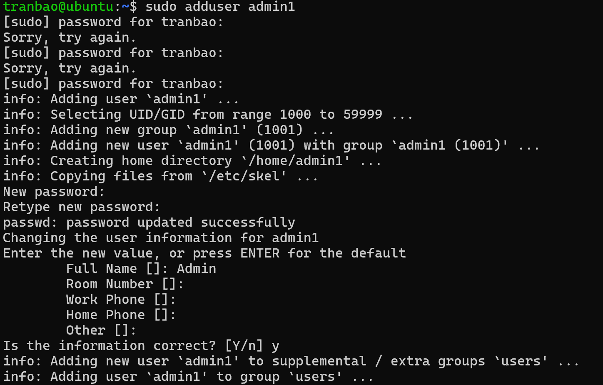
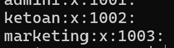
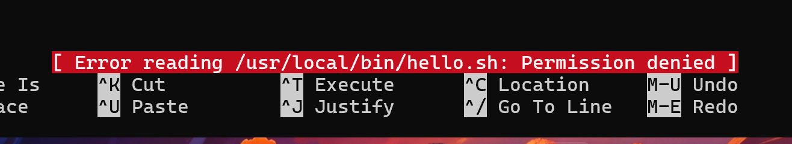
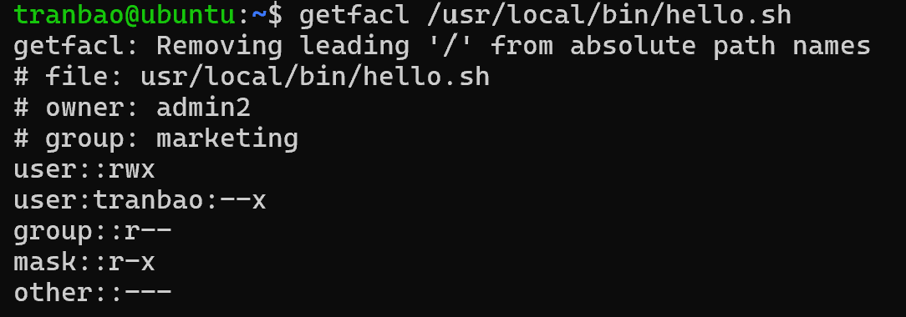

# THỰC HÀNH LAB VỀ USER VÀ GROUP
## TẠO MỘT USER CÓ QUYỀN ROOT
- Đàu tiên chúng ta sẽ thêm một user vào trong hệ thống với câu lệnh
`sudo adduser admin1`
- Lúc này hệ thống sẽ khởi tạo một user mới và ta sẽ nhập mật khẩu cũng như thông tin của user

- Sau khi khởi tạo xong, user này chỉ có quyền của một user bình thường, để user admin1 có quyền root thì ta thêm user admin1 vào group sudo bằng câu lệnh sau
`sudo usermod -aG sudo admin1`
- Để kiểm tra xem user này thực sự có quyền root hay chưa, ta có thực hiện một trong những cách sau:
+ Gõ câu lệnh `sudo -l`, nếu hệ thống hiển thị nội dung như sau (ALL : ALL) ALL thì có nghĩa là user này có toàn quyền của root
+ Gõ câu lệnh `id`, nếu ta thấy hệ thống hiển thị ra dòng `uid=1001(admin1) gid=1001(admin1) groups=1001(admin1),27(sudo),100(users)` thì ta có thể thấy user này đang nằm trong group sudo có id là 27
+ Gõ câu lệnh `sudo -i`, nếu hệ thống hiển thị root@ubuntu:~# thì có nghĩa là user này có quyền của root
## THÊM GROUP VÀ THÊM USER VÀO GROUP
- Để thêm một group vào trong hệ thống, ta có thể sử dụng câu lệnh `addgroup` hoặc `groupadd`
- Bây giờ ta sẽ tiến hành thêm 2 group Marketing và KeToan vào trong hệ thống, ta sẽ gõ câu lệnh 
`sudo addgroup ketoan`
`sudo addgroup marketing`
- Để kiểm tra group này đã tồn tại trong hệ thống hay chưa, ta sẽ kiểm tra trong /etc/group
`cat /etc/group`

Ta có thể thấy 2 group đã được thêm vào trong hệ thống thành công, bên cạnh tên sẽ là group id
- Bây giờ ta sẽ tiến hành thêm user admin1 vào trong group KeToan, để làm được điều này thì ta sẽ sử dụng câu lệnh
`sudo usermod -aG ketoan admin1`
- Để xóa một user ra khỏi 1 group, ta sẽ sử dụng câu lệnh
`sudo gpasswd -d admin1 ketoan`
## CẤU HÌNH QUYỀN CHO FILE
**Cách 1**
- Trong hệ thống sẽ có 2 user là admin1 (nằm trong group KeToan) và admin2 nằm trong group Marketing
- Ta sẽ tạo ra một file trong hệ thống bằng câu lệnh
`sudo nano /usr/local/bin/hello.sh`
- Bây giờ ta sẽ cần cấu hình sao cho admin2 có toàn quyền `wrx` đối với file hello.sh, còn admin1 chỉ có quyền `w--`

- Để làm được điều này, ta sẽ thực hiện một số câu lệnh sau đây
`sudo chown admin2:marketing /usr/local/bin/hello.sh` _Câu lệnh này sẽ thay đổi quyền sở hữu của file hello.sh từ root sang admin2 và group marketing_
`sudo chmod 740 /usr/local/bin/hello.sh` _Câu lệnh này sẽ thay đổi quyền đọc, ghi, thực thi của các đối tượng đối với file hello.sh. Ở đây chủ sở hữu có toàn quyền wrx, còn các user trong cùng group marketing sẽ chỉ có quyền w--, còn các user khác sẽ không có quyền gì cả_

Như trên hình ta có thể thấy khi user admin1 dùng nano để xem file hello.sh thì lập tức bị từ chối vì không có quyền

**Cách 2**
- Ngoài cách trên là sử dụng 2 câu lệnh `chown, chmod` ra, ta có thể sử dụng cơ chế phân quyền nâng cao ACL (Access Control List) để thực hiện cấp quyền cho từng user mà không cần phải dùng đến nhóm
- Ví dụ ta muốn cấp quyền chỉ được thực thi file hello.sh cho user tranbao thì ta sẽ gõ câu lệnh sau
`sudo setfacl -m u:tranbao:--x /usr/local/bin/hello.sh`
- Giải thích về các tham số có trong câu lệnh
+ setfacl: set file access control list, dùng để thêm sửa xóa các phân quyền cho một file or dir
+ `-m`: tham số modify, ra lệnh cho hệ thống bổ sung hoặc sửa đổi các quyền
+ u:tranbao:--r : xác định đối tượng user là tranbao chỉ có quyền được thực thi file
+ /usr/local/bin/hello.sh: đường dẫn tuyệt đối dẫn đến file hoặc dir mà ta muốn áp dụng quy tắc phân quyền trên

Nhìn vào hình thì ta có thể thấy ở phần user thì có hiển thị rằng user tranbao chỉ có quyền thực thi file hello.sh
- Nếu cần cấu hình phân quyền cụ thể cho từng user đối với một file hoặc dir, ta có thể sử dụng ACL để dễ dàng quản lý