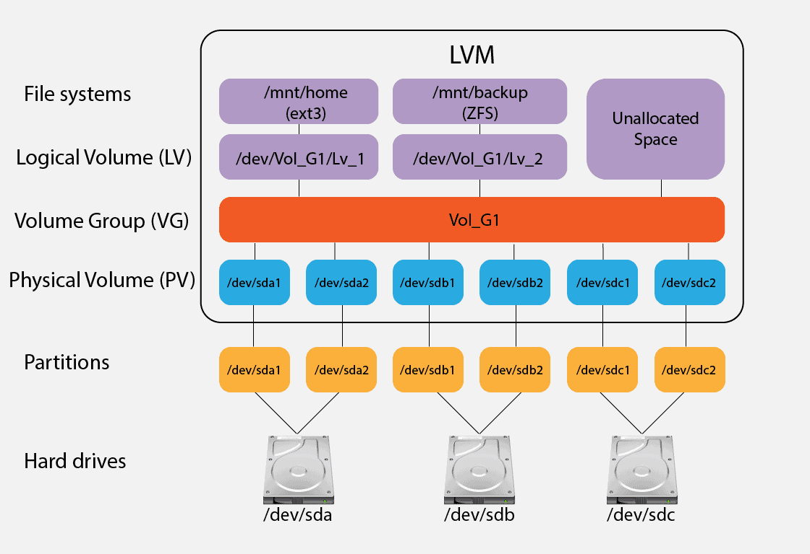

# TÌM HIỂU VỀ LVM
## 1. KHÁI NIỆM
- Logical Volume Management(LVM) dùng quản lí các thiết bị lưu trữ. LVM là một tiện ích cho phép chia không gian đĩa cứng thành những Logical Volume từ đó giúp cho việc thay đổi kích thước trở nên dễ dàng.
## 2. KIẾN TRÚC CỦA LVM
Kiến trúc cốt lõi của LVM hoạt động dựa trên sự phối hợp chặt chẽ của 3 tầng quản lý, từ phần cứng thô đến phân vùng ảo:

- Tầng 1: Physical Volume (PV - Khối vật lý)
Bản chất: Là các thiết bị lưu trữ phần cứng thực tế hoặc các phân vùng truyền thống hiện diện trên máy chủ (ví dụ: toàn bộ ổ cứng /dev/sda, ổ SSD /dev/sdb, hoặc một phân vùng /dev/sdc1).
+ Nhiệm vụ: Để đưa một ổ cứng thô vào hệ thống LVM, bạn phải "đóng nhãn" biến nó thành một PV. Lúc này, LVM sẽ ghi đè cấu hình metadata lên đầu đĩa để sẵn sàng quản lý.

- Tầng 2: Volume Group (VG - Nhóm khối)
Bản chất: Là một "bể chứa" (Pool) dung lượng khổng lồ được tạo ra bằng cách gộp một hoặc nhiều Physical Volume (PV) lại với nhau.
+ Nhiệm vụ: VG xóa nhòa ranh giới vật lý giữa các ổ đĩa. Ví dụ, bạn có 3 ổ cứng độc lập, mỗi ổ dung lượng 100GB. Khi gộp chúng vào một VG, hệ thống sẽ sở hữu một không gian lưu trữ tập trung duy nhất rộng 300GB.

- Tầng 3: Logical Volume (LV - Khối logic)
Bản chất: Là các phân vùng ảo được cắt ra từ "bể chứa" Volume Group (VG).
+ Nhiệm vụ: Đây là sản phẩm cuối cùng mà người dùng và hệ điều hành trực tiếp tương tác. Linux sẽ nhận diện các LV này giống hệt như một phân vùng ổ cứng thông thường. Bạn có thể định dạng hệ thống file (ext4, xfs) cho nó và gắn kết (mount) vào các thư mục gốc /, /home, /var để đọc ghi file dữ liệu.

**Cơ chế hoạt động của LVM**
- _Chia nhỏ ổ cứng:_ Dữ liệu trong LVM không bị ghi trực tiếp lên ổ cứng mà được chia thành các khối nhỏ đồng nhất gọi là PE (Physical Extent) ở cấp độ PV và LE (Logical Extent) ở cấp độ LV.
- _Ánh xạ linh hoạt:_ LVM hoạt động như một tầng trung gian. Khi bạn ghi dữ liệu vào Logical Volume, LVM sẽ tự động ánh xạ các LE tới các PE tương ứng nằm rải rác trên các ổ cứng vật lý.
- _Thay đổi kích thước:_ Khi cần mở rộng dung lượng, hệ thống chỉ cần cấp phát thêm các PE trống từ Volume Group vào Logical Volume. Việc này diễn ra trong tích tắc mà không cần phân vùng lại ổ cứng vật lý.
## 3. CÁC ĐƠN VỊ ĐO LƯỜNG TRONG LVM: PE VÀ LE
Để phân chia và di chuyển dữ liệu một cách mượt mà, LVM chia nhỏ dung lượng bên trong đĩa thành các khối có kích thước bằng nhau:
+ PE (Physical Extent): Khi một ổ đĩa biến thành PV, toàn bộ không gian của nó được chia nhỏ thành hàng triệu khối PE bằng nhau (Mặc định kích thước mỗi khối PE là 4MB). PE là đơn vị nhỏ nhất mà một Volume Group sở hữu.
+ LE (Logical Extent): Tương tự như PE, nhưng LE là các khối cấu thành nên phân vùng ảo Logical Volume (LV).
+ Cơ chế liên kết: Bản chất việc tạo ra một LV 40MB là LVM đang cấp phát 10 khối LE để ánh xạ tương ứng với 10 khối PE nằm ở ổ đĩa vật lý bên dưới.

## 4. CÁC TÍNH NĂNG NÂNG CAO CỦA LVM
### 4.1 LVM SNAPSHOT (ẢNH CHỤP TRẠNG THÁI TỨC THỜI)
- Cho phép tạo ra một bản sao lưu "đóng băng" trạng thái dữ liệu của một Logical Volume tại một thời điểm chính xác theo cơ chế Copy-on-Write (CoW) trong vòng 1 giây.
- Tính năng này cực kỳ hữu ích cho việc Backup dữ liệu lớn mà không làm gián đoạn (treo) cơ sở dữ liệu, hoặc giúp các Software Tester tạo một điểm khôi phục (Restore point) trước khi thực hiện các bài test có tính chất phá hủy hệ thống.
### 4.2 LVM STRIPPING (TĂNG TỐC ĐỘC ĐỌC GHI)
- Dữ liệu ghi vào Logical Volume sẽ được LVM tự động băm nhỏ và ghi đồng thời lên nhiều ổ đĩa vật lý (PV) khác nhau.
- Cơ chế này giúp tốc độ đọc/ghi (I/O performance) của phân vùng tăng lên gấp nhiều lần do tận dụng được băng thông phần cứng của nhiều ổ đĩa cùng lúc.
### 4.3 LVM MIRRORING (BẢO VỆ DỮ LIỆU)
- LVM tự động sao chép y hệt dữ liệu từ một LV sang hai hoặc nhiều ổ đĩa vật lý khác nhau một cách đồng bộ. Nếu một ổ cứng vật lý bị cháy/hỏng, hệ thống vẫn duy trì hoạt động bình thường trên ổ đĩa còn lại mà không mất một byte dữ liệu nào.

## 5. ƯU/NHƯỢC ĐIỂM CỦA LVM
**ƯU ĐIỂM :**
- _Linh hoạt tuyệt đối:_ Nới rộng dung lượng (lvextend) trực tuyến mà không cần restart máy, không cần unmount ổ đĩa (Không gây downtime cho hệ thống).
- _Vượt giới hạn phần cứng:_ Một phân vùng logic (LV) có thể lớn hơn dung lượng của chiếc ổ cứng lớn nhất mà bạn có (nhờ tính năng gộp nhiều ổ đĩa vào VG).
- _Quản lý thông minh:_ Dễ dàng đặt tên phân vùng có ý nghĩa văn bản dễ nhớ thay vì các ký hiệu phần cứng khô khan (Ví dụ: /dev/mapper/vg_data-lv_mysql thay vì /dev/sda3).

**NHƯỢC ĐIỂM:**
- _Rủi ro mất dữ liệu diện rộng:_ Nếu gộp 2 ổ cứng vào chung một VG không có cơ chế bảo vệ (Mirroring) mà 1 trong 2 ổ cứng bị hỏng vật lý, toàn bộ cấu trúc file nằm trải dài trên cả 2 ổ có nguy cơ cao bị lỗi và mất dữ liệu.
- _Tầng trung gian làm giảm hiệu năng nhẹ:_ Vì phải đi qua một tầng ảo hóa trung gian xử lý ánh xạ PE-LE, hiệu năng đọc/ghi thô của LVM sẽ thấp hơn một chút (khoảng 1-3%) so với việc ghi trực tiếp vào Standard Partition.
- _Phức tạp khi cứu hộ:_ Khi hệ thống bị lỗi boot do hỏng phần cứng, việc cứu dữ liệu bên trong một cấu trúc LVM đòi hỏi kỹ năng xử lý dòng lệnh phức tạp hơn nhiều so với phân vùng truyền thống.

## 6. CÁC CÂU LỆNH LIÊN QUAN ĐẾN QUẢN LÝ LVM
| Thao tác cần thực hiện | Tầng Physical Volume (PV) |  Tầng Volume Group (VG) |        Tầng Logical Volume (LV)        |
|:----------------------:|:-------------------------:|:-----------------------:|:--------------------------------------:|
| Xem trạng thái tóm tắt | pvs                       | vgs                     | lvs                                    |
| Xem thông tin chi tiết | pvdisplay                 | vgdisplay               | lvdisplay                              |
| Khởi tạo / Tạo mới     | pvcreate /dev/sdb         | vgcreate my_vg /dev/sdb | lvcreate -L 10G -n my_lv my_vg         |
| Nới rộng dung lượng    | pvresize /dev/sdb         | vgextend my_vg /dev/sdc | lvextend -l +100%FREE /dev/my_vg/my_lv |
| Thu hẹp dung lượng     | Không khuyến khích        | vgreduce my_vg /dev/sdc | lvreduce -L -2G /dev/my_vg/my_lv       |
| Xóa hoàn toàn khỏi máy | pvremove /dev/sdb         | vgremove my_vg          | lvremove /dev/my_vg/my_lv              |

## 7. LUỒNG HOẠT ĐỘNG CỦA LVM
Ổ đĩa thô (/dev/sdb) 
   │
   ▼ (Bước 1: Khởi tạo PV bằng lệnh pvcreate)
Physical Volume (/dev/sdb)
   │
   ▼ (Bước 2: Gom vào Pool bằng lệnh vgcreate)
Volume Group (tên: data_vg)
   │
   ▼ (Bước 3: Cắt phân vùng ảo bằng lệnh lvcreate)
Logical Volume (tên: data_lv nằm trong /dev/mapper/data_vg-data_lv)
   │
   ▼ (Bước 4: Định dạng hệ thống file bằng lệnh mkfs.ext4)
Định dạng File System (Ext4/XFS)
   │
   ▼ (Bước 5: Gắn vào cây thư mục bằng lệnh mount)
Sử dụng thực tế (Ví dụ: Mount vào thư mục /data để chứa file)