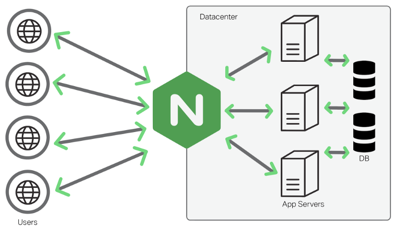
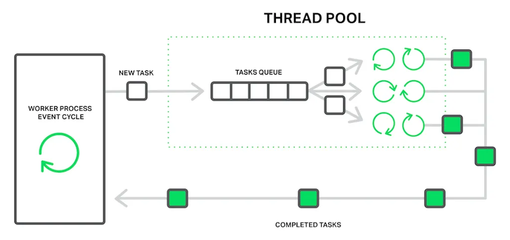
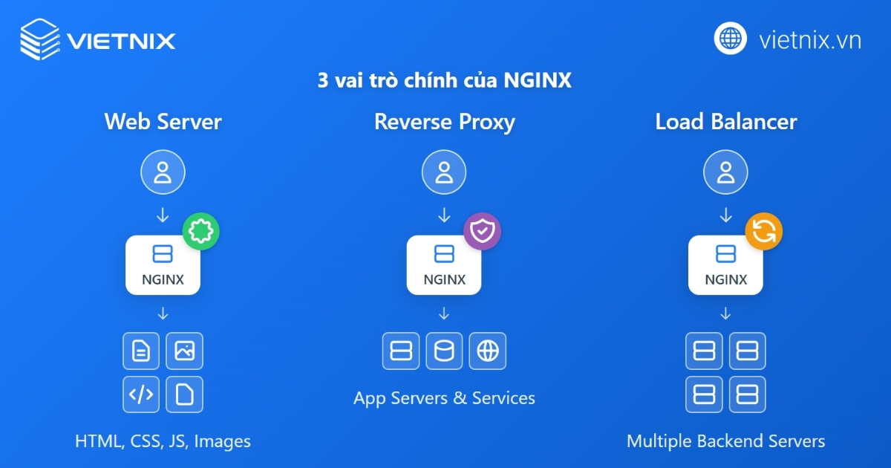

# TÌM HIỂU VỀ NGINX
## KHÁI NIỆM
- NGINX là một web server mã nguồn mở hiệu suất cao, được xây dựng với kiến trúc đơn luồng và hướng sự kiện (event-driven, asynchronous) giúp xử lý hàng nghìn kết nối đồng thời mà vẫn tiết kiệm tài nguyên hệ thống. Không chỉ đóng vai trò là web server, NGINX còn đảm nhiệm các chức năng quan trọng khác như reverse proxy, HTTP caching, load balancing, media streaming và proxy cho các giao thức email như IMAP, POP3 và SMTP.

## CÁCH THỨC HOẠT ĐỘNG CỦA NGINX
- NGINX nổi bật nhờ kiến trúc xử lý hướng sự kiện khác biệt so với các web server truyền thống dựa trên process hoặc thread. Thay vì tạo một process hoặc thread riêng cho từng request, NGINX chỉ sử dụng một số lượng ít tiến trình worker, mỗi worker có khả năng xử lý đồng thời hàng ngàn kết nối nhờ vào cơ chế bất đồng bộ.

-Cụ thể, NGINX vận hành như sau:

+ Khi người dùng gửi yêu cầu truy cập website, NGINX nhận thông tin và đưa vào hàng đợi.
Worker process của NGINX sẽ quản lý và xử lý nhiều kết nối đồng thời trên cùng một tiến trình nhờ kiến trúc bất đồng bộ.
+ Mỗi kết nối sẽ được quản lý bởi worker connection, đảm bảo tối ưu hóa hiệu suất và tiêu thụ ít tài nguyên hệ thống.
+ Các request được worker process gửi đến master process để xác nhận, sau đó phản hồi lại người dùng.
Nhờ cơ chế này, NGINX dễ dàng phục vụ hàng ngàn truy vấn cùng lúc, đặc biệt hiệu quả cho nội dung tĩnh như file hình ảnh, CSS, JS,… Đây là lý do NGINX giải quyết thành công bài toán C10K – xử lý 10.000 kết nối đồng thời mà vẫn đảm bảo hiệu suất và độ ổn định.

## KIẾN TRÚC HƯỚNG SỰ KIỆN (EVENT-DRIVEN) VÀ BẤT ĐỒNG BỘ (ASYNCHRONUS)
- Đây chính là "vũ khí bí mật" giúp Nginx đạt hiệu năng cực cao với lượng tài nguyên (CPU/RAM) cực thấp. Để thấy sự vượt trội, chúng ta hãy so sánh nó với mô hình truyền thống (Process-driven của Apache):
+ Mô hình Process-driven (Một tiến trình cho một kết nối): Mỗi khi có một user truy cập, máy chủ sẽ sinh ra một tiến trình (Process) hoặc luồng (Thread) riêng để phục vụ user đó. Khi user đó đang tải ảnh hoặc lướt chậm, Thread đó phải ngồi im "chờ đợi" (Blocking). Nếu có 10.000 user, máy chủ sẽ cần 10.000 Thread $\rightarrow$ RAM bị ngốn sạch, CPU kiệt quệ vì phải liên tục chuyển đổi qua lại giữa các Thread (Context Switching).
+ Mô hình Event-Driven của Nginx: Nginx sử dụng một cơ chế vòng lặp sự kiện (Event Loop). Thay vì tạo Thread mới cho mỗi user, Nginx gom tất cả các kết nối vào một luồng duy nhất. Khi một kết nối có "sự kiện" xảy ra (ví dụ: dữ liệu đã truyền xong, file đã đọc xong), Nginx mới thò tay vào xử lý (Non-blocking).

## MÔ HÌNH TIẾN TRÌNH CỦA NGINX (MASTER-WORKER)
Khi Nginx khởi động dưới quyền của systemd, nó không chạy dưới dạng một tiến trình đơn lẻ mà chia thành hai loại tiến trình có tính phân cấp cao:
- **Tiến trình Master Process (Cha)**
+ Số lượng: Luôn luôn chỉ có 1 tiến trình duy nhất chạy dưới quyền root.
+ Nhiệm vụ: Không trực tiếp xử lý các yêu cầu (Request) từ người dùng. Nhiệm vụ của nó là làm "tổng chỉ huy": đọc và kiểm tra các file cấu hình, quản lý vòng đời của các tiến trình con (Worker), và thực hiện các tác vụ đặc quyền như mở cổng mạng (80, 443).
- **Các tiến trình Worker Processes (Con)**
+ Số lượng: Thường được cấu hình bằng chính xác số lượng nhân (Core) CPU của máy tính (cấu hình worker_processes auto;).
+ Nhiệm vụ: Đây là những "công nhân" thực sự làm việc. Các Worker chạy dưới quyền của một user thường (như www-data) để đảm bảo an toàn bảo mật. Chúng trực tiếp chấp nhận các kết nối mạng từ Client, đọc file trên đĩa cứng, và gửi dữ liệu về cho trình duyệt của user.
+ Nhờ kiến trúc Event-driven, mỗi Worker có thể xử lý hàng chục ngàn kết nối đồng thời mà không gặp áp lực về bộ nhớ.

## VAI TRÒ CHÍNH CỦA NGINX
- NGINX rất linh hoạt và có thể đảm nhận nhiều vai trò quan trọng trong hạ tầng website:

+ _Web server_: NGINX phục vụ trực tiếp các nội dung tĩnh của website như tệp HTML, CSS, JavaScript và hình ảnh đến trình duyệt của người dùng một cách nhanh chóng.
+ _Reverse proxy:_ NGINX có thể đứng giữa người dùng Internet và các máy chủ ứng dụng (backend server), nhận yêu cầu từ người dùng, chuyển tiếp đến máy chủ phù hợp, sau đó nhận phản hồi và gửi lại cho người dùng, giúp tăng cường bảo mật, cân bằng tải và thực hiện nhiều tác vụ tối ưu hóa khác.
+ _Load balancer (cân bằng tải):_ Khi website của bạn có nhiều máy chủ backend, NGINX có thể phân phối lưu lượng truy cập một cách thông minh đến các máy chủ này. Việc này giúp tránh tình trạng quá tải cho bất kỳ máy chủ đơn lẻ nào và tăng tính sẵn sàng cho toàn hệ thống.
+ _Các vai trò khác:_ Ngoài ra, NGINX còn có thể hoạt động như một HTTP cache (bộ đệm HTTP) để tăng tốc độ phản hồi, hoặc làm Mail proxy (proxy cho email).

## CÁC TÍNH NĂNG NỔI BẬT CỦA MÁY CHỦ HTTP NGINX
- Tính năng của máy chủ HTTP Nginx như sau:
+ Xử lý hiệu quả trên 10.000 kết nối đồng thời tại mọi thời điểm với bộ nhớ sử dụng cực thấp, tối ưu cho hệ thống có traffic lớn.
+ Phục vụ các tập tin tĩnh (static files) nhanh chóng, hỗ trợ lập chỉ mục file giúp website tải nhanh và vận hành ổn định.
+ Tăng tốc reverse proxy nhờ tích hợp bộ nhớ đệm (cache), vừa cân bằng tải vừa đảm bảo khả năng chịu lỗi tốt.
+ Hỗ trợ bộ nhớ đệm cho FastCGI, uwsgi, SCGI và memcached, giúp nâng cao hiệu suất xử lý ứng dụng động.
+ Kiến trúc modular giúp tùy biến hệ thống linh hoạt; tăng tốc độ tải trang với nén gzip tự động.
+ Đáp ứng đầy đủ nhu cầu mã hoá bảo mật với SSL/TLS, dễ dàng cấu hình và bảo trì.
+ Cấu hình linh hoạt, dễ lưu nhật ký truy vấn (access log, error log) phục vụ giám sát và phân tích vận hành.
+ Chuyển hướng lỗi HTTP 3XX-5XX, rewrite URL bằng regular expressions linh hoạt cho SEO và chuyển cấu trúc link.
+ Có thể kiểm soát tỷ lệ đáp ứng truy vấn, giới hạn số kết nối và truy vấn từ từng địa chỉ IP (chống DDoS/bảo mật).
+ Hỗ trợ nhúng mã PERL cho các tác vụ đặc biệt, mở rộng khả năng xử lý theo nhu cầu.
+ Tương thích hoàn toàn với IPv6, hỗ trợ giao tiếp WebSockets cho ứng dụng thời gian thực.
+ Truyền tải mượt mà các tệp media FLV, MP4, phù hợp với streaming video.

## CÁC TÍNH NĂNG NỔI BẬT CỦA MÁY CHỦ MAIL PROXY NGINX
- Hỗ trợ xác thực đa dạng cho các giao thức:
+ POP3: USER/PASS, APOP, AUTH LOGIN/PLAIN/CRAM-MD5
+ IMAP: LOGIN, AUTH LOGIN/PLAIN/CRAM-MD5
+ SMTP: AUTH LOGIN/PLAIN/CRAM-MD5
+ Hỗ trợ mã hóa và truyền dữ liệu an toàn qua SSL, STARTTLS, STLS.

## ƯU NHƯỢC ĐIỂM CỦA NGINX
### ƯU ĐIỂM
+ Hiệu suất và tốc độ xử lý cao: Nhờ kiến trúc bất đồng bộ (asynchronous) và không chặn (non-blocking), NGINX có thể xử lý hàng nghìn kết nối đồng thời mà vẫn đảm bảo hiệu suất ổn định, đặc biệt với các tệp tĩnh như HTML, CSS, JS, hình ảnh,…
+ Tiêu thụ tài nguyên thấp: NGINX sử dụng ít RAM và CPU, cải thiện hiệu suất ngay cả trên máy chủ cấu hình thấp.
+ Cân bằng tải (Load Balancing): Tính năng cân bằng tải tích hợp giúp phân phối lưu lượng đều đến các máy chủ backend, tăng khả năng sẵn sàng và giảm tải cho từng máy chủ.
+ Reverse Proxy: NGINX là một reverse proxy hiệu quả, ẩn máy chủ backend, tăng cường bảo mật và hiệu suất.
+ Hỗ trợ SSL/TLS mạnh mẽ: Hỗ trợ HTTP/2 và TLS 1.3, đảm bảo tốc độ và bảo mật truyền tải dữ liệu.
+ Khả năng mở rộng linh hoạt: Dễ dàng cấu hình để mở rộng hệ thống từ đơn giản đến phức tạp.
+ Caching hiệu quả: Bộ nhớ đệm (cache) tích hợp giúp tăng tốc tải trang và giảm tải cho backend.
+ Hỗ trợ giao thức hiện đại: Hỗ trợ WebSocket, HTTP/2, gRPC và nhiều giao thức hiện đại khác.
+ Cộng đồng lớn và tài liệu phong phú: Dễ dàng tìm kiếm hỗ trợ và giải quyết vấn đề.

### NHƯỢC ĐIỂM
+ Cấu hình phức tạp: Cấu hình ban đầu có thể khó khăn cho người mới do cú pháp riêng và yêu cầu hiểu biết về các directive.
+ Khả năng mở rộng tính năng hạn chế: So với Apache, NGINX có ít module tích hợp và không hỗ trợ trực tiếp tải thêm module, có thể gây hạn chế trong một số trường hợp.
+ Ghi log và xử lý lỗi: Quản lý log và xử lý lỗi chưa trực quan như Apache, gây khó khăn khi debug và phân tích sự cố.
+ Hỗ trợ PHP qua FastCGI: Yêu cầu cấu hình PHP thông qua FastCGI (thường là PHP-FPM), thêm bước cấu hình và có thể khó khăn cho người mới.
+ Thiếu tính tương thích với một số ứng dụng cũ: Một số ứng dụng cũ hoặc ứng dụng thiết kế cho Apache (sử dụng .htaccess) có thể không tương thích, cần chuyển đổi hoặc cấu hình lại.
+ Quản lý và giám sát phức tạp trong môi trường lớn: Giám sát hiệu suất và kết nối trong hệ thống lớn phức tạp hơn do hạn chế trong việc cung cấp thông tin chi tiết.

## SO SÁNH NGINX VÀ APACHE
|                Tiêu chí                |                                                             NGINX                                                            |                                         Apache                                         |
|:--------------------------------------:|:----------------------------------------------------------------------------------------------------------------------------:|:--------------------------------------------------------------------------------------:|
| Phương thức xử lý kết nối              | Sử dụng kiến trúc hướng sự kiện, không đồng bộ (event-driven, asynchronous) giúp xử lý đồng thời lượng lớn kết nối hiệu quả. | Sử dụng kiến trúc phân luồng (threading) hoặc keep-alive.                              |
| Hiệu năng                              | Vượt trội hơn Apache trong việc phục vụ nội dung tĩnh và xử lý số lượng lớn kết nối đồng thời.                               | Xử lý đồng thời ít kết nối hơn và tốc độ phục vụ nội dung tĩnh không nhanh bằng NGINX. |
| Hệ điều hành hỗ trợ                    | Chạy tốt trên Linux/Unix, có hỗ trợ Windows nhưng hiệu suất không cao.                                                       | Chạy tốt trên cả Linux/Unix và Windows.                                                |
| Khả năng tương thích và tính linh hoạt | NGINX bắt đầu hỗ trợ Dynamic Module từ năm 2016.                                                                             | Apache có lợi thế hơn về khả năng mở rộng với Dynamic Module, đã được hỗ trợ từ lâu.   |
| Tài nguyên tiêu thụ                    | NGINX tiêu thụ ít tài nguyên (CPU, RAM) hơn Apache, đặc biệt khi xử lý nhiều kết nối đồng thời.                              | Tốn nhiều tài nguyên hơn khi có nhiều request.                                         |