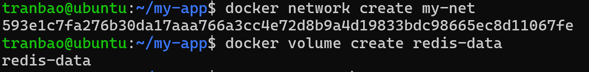
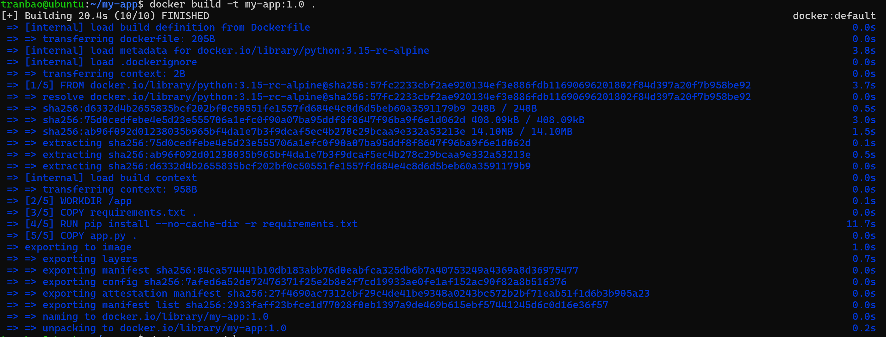
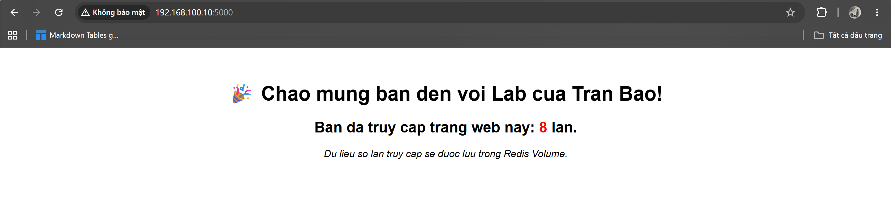
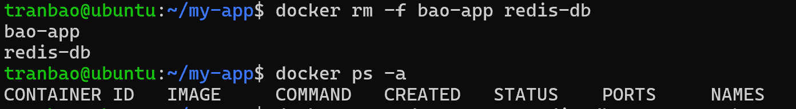
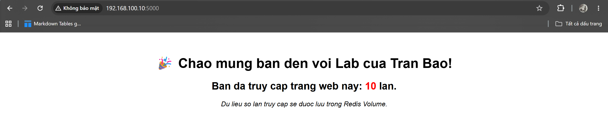

# THỰC HÀNH LAB VỚI DOCKER
## Mô tả**
- Bài lab sẽ triển khai website đếm số lượt truy cập vào trang web sử dụng Python Flask + Redis. Dữ liệu về số lần truy cập sẽ được lưu lại trong Volume `redis-data` do Docker quản lý để tránh bị mất dữ liệu
## Thực hành
- Đầu tiên ta sẽ khởi tạo một thư mục để thực hành bài lab trên
`mkdir -p my-app && cd my-app`

- Tạo file mã nguồn app.py và thêm vào dữ liệu như dưới đây:
`sudo nano app.py`
```bash
from flask import Flask
import redis
import os

app = Flask(__name__)

# Kết nối tới Redis Container thông qua Tên Container (redis-db)
r = redis.Redis(host='redis-db', port=6379, decode_responses=True)

@app.route('/')
def index():
    try:
        # Tăng giá trị của key 'page_views' thêm 1 đơn vị
        views = r.incr('page_views')
        return f'''
        <div style="text-align: center; margin-top: 50px; font-family: Arial;">
            <h1>🎉 Chào mừng bạn đến với Web Lab 2!</h1>
            <h2>Trang web này đã được truy cập: <span style="color: red;">{views}</span> lần.</h2>
            <p><i>Lưu ý: Dữ liệu này được lưu an toàn trong Redis Volume.</i></p>
        </div>
        '''
    except Exception as e:
        return f"Lỗi kết nối Database: {str(e)}"

if __name__ == '__main__':
    app.run(host='0.0.0.0', port=5000)
```

- Tạo file requirement.txt để khai báo các thư viện sẽ cần cài đặt trong container
`sudo nano requirement.txt`
Thêm `flask redis` vào trong nội dung file và Ctrl O , Ctrl X
- Tạo Dockerfile cho ứng dụng Flask
```bash
FROM python:3.9-alpine
WORKDIR /app
COPY requirements.txt .
RUN pip install --no-cache-dir -r requirements.txt
COPY app.py .
EXPOSE 5000
CMD ["python", "app.py"]
```

- Bây giờ ta sẽ tạo một Docker Network để cho 2 container có thể giao tiếp với nhau và 1 Volume để back-up dữ liệu


- Khởi chạy container Redis trước 
```bash
docker run -d --name redis-db --network my-net -v redis-data:/data redis:8-alpine redis-server --appendonly yes
```
- Tiến hành build Image my-app version 1
```bash
docker build -t myapp:1.0
```

- Khởi chạy container my-app gán port 5000 của container -> port 5000 của máy host
```bash
docker run -d --name bao-app --network my-net -p 5000:5000 my-app:1.0
```
- Bây giờ, mở 1 trình duyệt và truy cập vào [ip_máy_host]:5000, ta sẽ thấy được trang web
- Như vậy ta có thể thấy đã có thể truy cập vào được trang web, mỗi lần F5 load lại trang web, số lần truy cập sẽ được cập nhật

- Bây giờ ta sẽ tiến hành xóa cả 2 container đi và kiểm tra xem liệu dữ liệu có thực sự được lưu lại dù cả 2 container đã xóa đi hay không

- Sau đó, khởi động lại 2 container và truy cập vào trang web để kiểm tra xem dữ liệu có thực sự được lưu lại trong Volume hay không
```bash
docker run -d --name redis-db --network my-net -v redis-data:/data redis:8-alpine redis-server --appendonly yes
docker run -d --name bao-app --network my-net -p 5000:5000 my-app:1.0
```

Vậy là dữ liệu đã thực sự được lưu lại trong Volum do Docker quản lý

