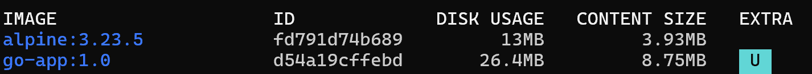
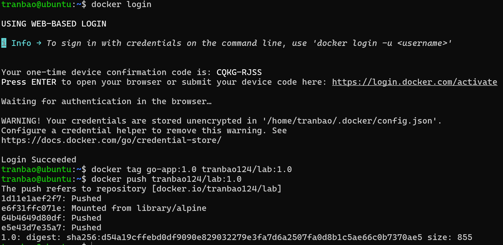
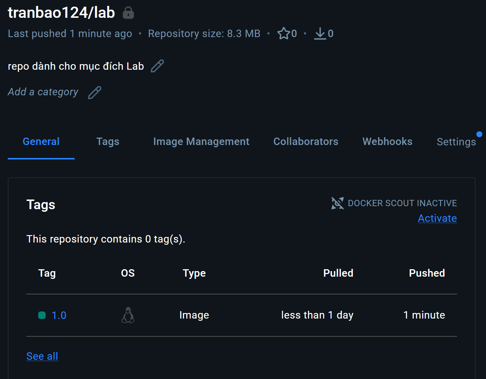

# Sử dụng Multi-Stage Build để tối ưu Image
## Thực hiện
- Đầu tiên ta sẽ tạo một website đơn giản bằng Go
- Tạo thư mục chứa dự án
`sudo mkdir my-multi-stage`

- Thêm file main.go và thêm vào nội dung sau
```bash
package main

import (
	"fmt"
	"net/http"
)

func main() {
	http.HandleFunc("/", func(w http.ResponseWriter, r *http.Request) {
		fmt.Fprintf(w, "🚀 Chao mung ban den voi Multi-stage Build Lab!")
	})

	fmt.Println("Server is running on port 8080...")
	http.ListenAndServe(":8080", nil)
}
```
- Thêm Dockerfile 
```bash
FROM golang:1.27-rc-alpine AS builder

WORKDIR /app
COPY main.go .

RUN CGO_ENABLED=0 GOOS=linux go build -o main main.go

FROM alpine:3.23.5

WORKDIR /app

COPY --from=builder /app/main .

EXPOSE 8080
CMD ["./main"]
```
- Tiến hành build image và kiểm tra dung lượng
```bash
docker build -t go-app:1.0`
docker images
```

- Ta có thể thấy images chỉ nặng có 8.75MB

# Push một Image lên Registry
## Thực hiện
- Đầu tiên ta sẽ cần đăng nhập vào Docker Hub bằng lệnh `docker login`
- Màn hình sẽ hiển thị link đăng nhập và mã code dùng 1 lần
- Để push một image lên Docker Hub ta sẽ thực hiện từng bước sau đây
```bash
docker tag [tên_image] [username]/[tên_repo]:[version] #version mặc định sẽ là latest nếu không để gì
docker push [username]/[tên_repo]:[version]
```

- Để kiểm tra đã push thành công hay chưa, truy cập vào Docker Hub và đăng nhập tài khoản, kiểm tra tại My Hub
