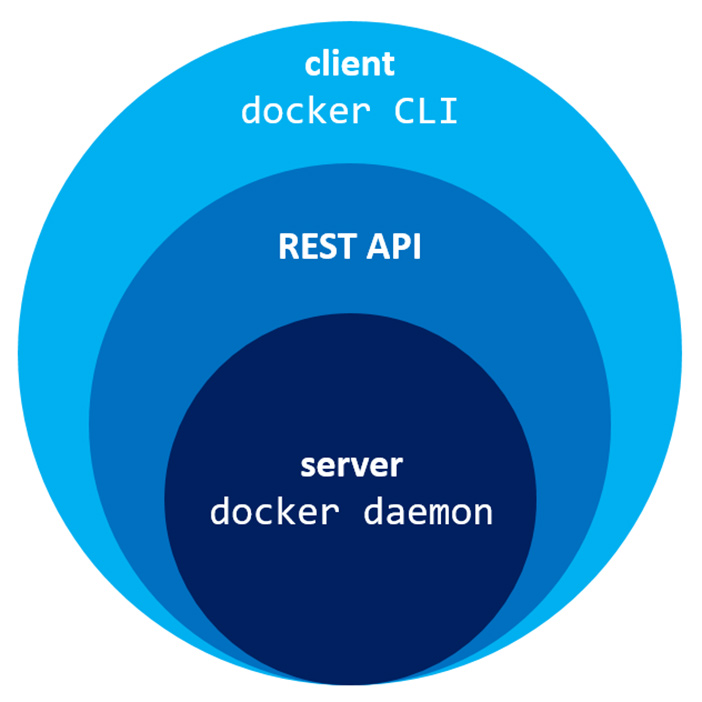

# TÌM HIỂU VỀ DOCKER
## KHÁI NIỆM
- Docker là một công cụ giúp tạo, triển khai và quản lý các container. Container là một instance môi trường thực thi (runtime environment) cô lập, khởi chạy từ Image - chứa tất cả các thành phần cần thiết để chạy ứng dụng, bao gồm code, thư viện, và các dependencies.
- Khác với các công nghệ ảo hóa truyền thống như VMware hay VirtualBox (sử dụng Hypervisor để tạo ra một hệ điều hành ảo hoàn chỉnh gồm cả Kernel riêng), Docker không ảo hóa phần cứng.
Docker chạy trực tiếp trên Kernel của máy host Linux và tận dụng 3 tính năng cốt lõi của Linux Kernel để tạo ra Container:
- **Namespaces** (Tính năng phân vùng/cách ly):
    + PID Namespace: Giúp Container chỉ nhìn thấy các tiến trình (process) bên trong nó, cách ly hoàn toàn với các tiến trình của máy host.
    + NET Namespace: Cấp cho Container một stack mạng riêng (card mạng ảo, bảng định tuyến, địa chỉ IP riêng).
    + MNT Namespace: Cách ly cây thư mục (File System). Container chỉ thấy thư mục được cấp phát cho nó.
    + IPC, UTS, USER Namespaces: Cách ly bộ nhớ chia sẻ, hostname và hệ thống người dùng/quyền hạn.
- **Control Groups - cgroups** (Tính năng giới hạn tài nguyên):
    + Giới hạn xem Container được dùng tối đa bao nhiêu % CPU, bao nhiêu MB RAM, tốc độ đọc/ghi ổ đĩa (I/O). Nhờ đó, một Container bị tràn RAM sẽ không làm treo toàn bộ máy chủ thật.
- **Union File Systems - UnionFS** (Hệ thống tập tin phân lớp): 
    + Cho phép gộp nhiều thư mục (layers) lại thành một hệ thống tập tin duy nhất. Đây là nền tảng giúp Docker Image cực kỳ nhẹ và tái sử dụng các layer chung một cách tối ưu.
    
## TẠI SAO CẦN PHẢI SỬ DỤNG DOCKER
- **Tính nhất quán:** Ứng dụng chạy giống nhau trên mọi môi trường.
- **Hiệu suất cao:** Container nhẹ hơn so với máy ảo (VM).
- **Dễ dàng triển khai:** Tạo và chạy container chỉ với một vài lệnh.
- **Hỗ trợ CI/CD:** Tích hợp dễ dàng với các công cụ DevOps như Jenkins, Kubernetes.

## CÁC THÀNH PHẦN CHÍNH TRONG KIẾN TRÚC DOCKER (DOCKER ARCHITECTURE)
**Các thành phần chính của Docker**
+ *Docker Engine*: Lõi của Docker, bao gồm Docker Daemon và Docker CLI.
+ *Docker Image*: Bản template để tạo container.
+ *Docker Container*: Phiên bản chạy của Docker Image.
+ *Docker Registry*: Nơi lưu trữ và chia sẻ Docker Images (ví dụ: Docker Hub).

- Docker hoạt động theo mô hình *Client - Server*, trong đó các thành phần của Docker được phân tách thành các module có nhiệm vụ riêng và giao tiếp với nhau thông qua REST API.
    + Docker Client (docker CLI): Công cụ dòng lệnh bạn gõ thao tác. Khi bạn gõ docker run, client sẽ chuyển yêu cầu này thành một REST API request gửi tới Docker Daemon.
    + Docker Daemon (dockerd): Dịch vụ chạy ngầm trên máy host. Nó trực tiếp quản lý các đối tượng: Images, Containers, Networks, Volumes.
    + Docker Registries: Kho chứa Images (như Docker Hub, Amazon ECR, GitLab Container Registry).

### DOCKER CLIENT
- Docker Client (thường là lệnh docker trong terminal) là giao diện chính để người dùng tương tác với hệ sinh thái Docker.
- Nhiệm vụ: Tiếp nhận lệnh từ người dùng (ví dụ: docker run, docker build, docker ps), đóng gói lệnh đó thành định dạng chuẩn rồi gửi tới Docker Daemon.
- Đặc điểm: Bản thân Docker Client rất nhẹ và không hề thực thi hay quản lý Container/Image nào cả. Nơi bạn chạy câu lệnh docker không nhất thiết phải là nơi Container đang chạy.

### DOCKER DAEMON (DOCKERD)
- Docker Daemon (tên tiến trình là dockerd) là dịch vụ chạy ngầm (background service) trên máy chủ host, đóng vai trò "trái tim" của Docker.
- Nhiệm vụ:
    + Lắng nghe các yêu cầu (API requests) gửi từ Docker Client.
    + Trực tiếp quản lý và thao tác với các đối tượng Docker: Images, Containers, Networks, Volumes.
    + Tương tác với Linux Kernel (qua containerd và runC) để gọi các tính năng cgroups, namespaces nhằm tạo môi trường cách ly cho Container.
- Đặc điểm: Hoạt động liên tục 24/7. Nếu Docker Daemon bị tắt, toàn bộ Container đang chạy (nếu không có cơ chế live-restore) hoặc việc quản lý Container sẽ bị ảnh hưởng.

### CÁCH DOCKER CLIENT VÀ DOCKERD GIAO TIẾP VỚI NHAU
- Docker Client và Docker Daemon không nói chuyện với nhau bằng "tiếng nói riêng", mà thông qua một REST API chuẩn (Docker Engine REST API).
- Bất kể lệnh bạn gõ là gì, Docker Client chỉ làm một việc đơn giản: chuyển lệnh đó thành một HTTP REST API Call và gửi sang cho Daemon.

Tùy vào môi trường triển khai, hai thành phần này giao tiếp qua 3 loại Socket (đường truyền) chính:
1. UNIX Domain Socket (unix:///var/run/docker.sock) — Mặc định
Bối cảnh: Dùng khi Docker Client và Docker Daemon nằm trên cùng một máy.
Cơ chế: Dữ liệu truyền qua một file Socket đặc biệt trên hệ thống file Linux (/var/run/docker.sock).
Ưu điểm: Tốc độ cực nhanh, không tốn tài nguyên mạng và bảo mật vì quản lý bằng quyền truy cập file (File Permissions).
2. TCP Socket (tcp://host:port) — Giao tiếp từ xa (Remote)
Bối cảnh: Dùng khi bạn muốn đứng ở máy Client A (máy laptop của bạn) để điều khiển Docker Daemon ở Server B (ví dụ: Server Ubuntu chạy trên cloud).
Cơ chế: Daemon sẽ mở một cổng TCP (thường là cổng 2375 cho kết nối thường hoặc 2376 cho kết nối bảo mật TLS). Client gửi các API Request qua mạng LAN hoặc Internet tới cổng này.
3. Named Pipe (npipe:////./pipe/docker_engine)
Bối cảnh: Dành riêng cho môi trường hệ điều hành Windows.
Cơ chế: Hoạt động tương tự Unix Socket nhưng sử dụng cơ chế IPC (Inter-Process Communication) đặc thù của Windows.

**Sự khác biệt giữa TCP Socket và Unix Socker**
|       Đặc tính      |                        TCP/IP Socket                        |                     Unix Domain Socket (UDS)                    |
|:-------------------:|:-----------------------------------------------------------:|:---------------------------------------------------------------:|
| Phạm vi             | Giữa các máy qua mạng (hoặc Local via Loopback)             | Chỉ trong nội bộ một máy (Inter-Process Communication - IPC)    |
| Địa chỉ định danh   | IP Address + Port (VD: 127.0.0.1:8080)                      | File path trên filesystem (VD: /run/containerd/containerd.sock) |
| Tầng Network Stack  | Đi qua toàn bộ TCP/IP stack (Checksum, Routing, Framing...) | Bỏ qua hoàn toàn Network Stack                                  |
| Hiệu năng & Latency | Thấp hơn (Tốn CPU checksum, đóng gói packet)                | Cực cao (Gần như chỉ truyền/chép bộ nhớ trong Kernel)           |
| Bảo mật             | Dựa vào Firewall, Bind IP, Authentication                   | Dựa vào File Permissions (chmod, chown) của file .sock          |

*Hiệu năng và luồng dữ liệu*
- *TCP Socket* (127.0.0.1 / Loopback):
    + Dù bạn gửi dữ liệu tới chính máy mình via 127.0.0.1, hệ điều hành vẫn phải giả lập như đang truyền qua mạng:
    $$Data \rightarrow TCP\ Segment \rightarrow IP\ Packet \rightarrow Loopback\ Interface \rightarrow Unpack \rightarrow Process$$
    + Quá trình này tốn CPU cho việc tính toán checksum, phân đoạn packet (segmentation), quản lý window size và ACK.Unix
- *Domain Socket*:Unix Socket truyền dữ liệu trực tiếp bằng cách copy dữ liệu từ buffer của tiến trình A sang buffer của tiến trình B trong RAM thông qua Kernel:
    $$Data \rightarrow Kernel\ Buffer \rightarrow Process$$
    + Bỏ qua mọi overhead của giao thức mạng, giúp giảm latency và tăng throughput gấp 1.5 - 2 lần so với TCP Loopback.
*Mô hình bảo mật*
- TCP Socket:
    + Bất kỳ tiến trình nào (hoặc máy khác trong mạng) biết IP:Port đều có thể gửi request đến.
    + Việc phân quyền phụ thuộc vào ứng dụng tự xử lý (TLS/SSL, Token, Auth).
- Unix Socket:
    + Socket xuất hiện dưới dạng một file đặc biệt (socket file) trên ổ đĩa.
    + Áp dụng trực tiếp cơ chế phân quyền tập tin chuẩn của POSIX (rwxrwxrwx). Bạn có thể giới hạn user/group nào được phép kết nối vào socket đó bằng chown và chmod.
    
## QUY TRÌNH HOẠT ĐỘNG CỦA DOCKER
- Tạo Docker Image: Đóng gói ứng dụng và các dependencies vào một Docker Image.
- Lưu trữ Image: Đẩy Image lên Docker Registry (như Docker Hub).
- Chạy Container: Tải Image từ Registry và chạy nó dưới dạng Container.

## DOCKER OBJECT
### DOCKER IMAGE (Khuôn mẫu)
Image là một tập tin tĩnh (read-only), chứa toàn bộ những gì cần thiết để một ứng dụng có thể chạy: mã nguồn, thư viện, biến môi trường, file cấu hình và hệ điều hành nền (OS base).
- Bản chất kiến trúc (Phân lớp - Read-Only Layers): Image không phải là một file đơn lẻ monolithic mà được cấu tạo từ nhiều lớp xếp chồng lên nhau (Image Layers).
    * Mỗi dòng lệnh trong Dockerfile (như RUN, COPY) sẽ tạo ra một Layer mới.
    * Các Layer này có tính chất chỉ đọc (Read-Only) và được chia sẻ giữa các Image. Nếu 10 Image cùng dùng chung nền ubuntu:22.04, dung lượng đĩa thực tế chỉ tốn 1 lần cho lớp nền đó.
- Cách tạo: Bạn tạo Image bằng cách biên dịch từ Dockerfile (lệnh docker build) hoặc tải từ Docker Hub (lệnh docker pull).

### DOCKER CONTAINER (Thực thể đang chạy)
Container là một thực thể sống (instance) được khởi tạo và chạy từ một Docker Image.
+ Bản chất kiến trúc (Container Layer - Read-Write): Khi một Container được bật lên, Docker sẽ lấy tất cả các lớp Read-Only của Image và phủ lên trên cùng một lớp mới gọi là Container Layer (Read-Write Layer).
    * Mọi dữ liệu do ứng dụng tạo ra, chỉnh sửa hoặc xóa trong quá trình chạy sẽ chỉ ghi vào lớp Read-Write này.
    * Tính ephemeral (Tạm thời): Vì dữ liệu sống ở lớp Read-Write gắn liền với Container, nên khi xóa Container, lớp Read-Write này biến mất hoàn toàn và dữ liệu bị mất sạch.
+ Mối quan hệ với Host: Container chia sẻ chung Kernel với máy host, sử dụng namespaces để cách ly và cgroups để giới hạn CPU/RAM.

### DOCKER VOLUME (Dữ liệu bền vững)
Vì Container có tính chất tạm thời (dữ liệu mất khi xóa Container), Volume chính là giải pháp Object giúp lưu trữ dữ liệu vĩnh viễn (Data Persistence).
+ Bản chất: Volume là một thư mục hoặc ổ đĩa nằm hoàn toàn bên ngoài hệ thống tập tin phân lớp của Container, do Docker trực tiếp quản lý trên máy host (thường nằm ở /var/lib/docker/volumes/).
+ Đặc điểm nổi bật:
    * Tách biệt khỏi vòng đời Container: Khi bạn dừng hoặc xóa Container, Volume vẫn tồn tại nguyên vẹn. Khi tạo Container mới, bạn chỉ cần mount lại Volume đó là ứng dụng có lại toàn bộ dữ liệu cũ (rất quan trọng cho Database như MySQL, Postgres).
    * Chia sẻ dữ liệu: Nhiều Container có thể mount cùng một Volume để đọc/ghi dữ liệu chung.
    * Tối ưu hiệu năng: Bỏ qua lớp Union File System phức tạp của Container để đọc/ghi trực tiếp vào đĩa cứng máy host.

### DOCKER NETWORK
- Network là Object chịu trách nhiệm kết nối các Container lại với nhau, hoặc kết nối Container với thế giới bên ngoài (Internet / Máy host). Docker tự động tạo ra các không gian mạng ảo độc lập cho từng mục đích sử dụng.
- Các loại Network Driver chính sẵn có trong Docker:
+ Bridge Network (Mặc định):
Tạo ra một mạng nội bộ ảo trên máy host. Các Container nối vào cùng một Bridge Network sẽ nhận IP ảo và truyền tin được với nhau. Muốn bên ngoài truy cập vào, bạn phải dùng cơ chế Port Forwarding (Mapping cổng).
+ Host Network:
Container không được cấp IP riêng mà dùng chung hoàn toàn không gian mạng (Network Namespace) với máy host. Tốc độ cực nhanh nhưng mất đi tính cách ly mạng.
+ Overlay Network:
Cho phép kết nối các Container nằm trên các máy chủ vật lý khác nhau thành một mạng nội bộ duy nhất (dùng trong mạng phân tán Docker Swarm/Kubernetes).
+ Macvlan Network:
Gán trực tiếp một địa chỉ MAC vật lý cho Container, làm cho Container hiển thị như một thiết bị mạng thực sự đấu nối trực tiếp vào Switch của mạng LAN.

## DOCKER COMPOSE
- Trong thực tế, một ứng dụng hiếm khi đứng một mình. Ví dụ một trang web sẽ gồm: 1 Web App (NodeJS/Python) + 1 Database (MySQL) + 1 Cache Server (Redis).
- Nếu dùng lệnh docker run lẻ tóm tắt từng cái sẽ rất tốn thời gian và khó quản lý. Docker Compose ra đời để giải quyết việc này bằng cách định nghĩa toàn bộ hệ thống trong một file YAML duy nhất (docker-compose.yml).

**Các bước sử dụng cơ bản**
- Tạo tệp Dockerfile để định nghĩa môi trường cho ứng dụng.
- Tạo tệp docker-compose.yml để khai báo các dịch vụ (services), mạng (networks) và ổ đĩa (volumes).
- Chạy lệnh docker compose up để khởi động ứng dụng.

**Các câu lệnh thông dụng**
_docker compose up -d_: Khởi động các container chạy ngầm ở nền sau.
_docker compose down_: Dừng và xóa toàn bộ các container, mạng đã tạo.
_docker compose ps_: Xem trạng thái của các dịch vụ đang chạy.
_docker compose logs_: Xem nhật ký hoạt động (logs) từ các container.