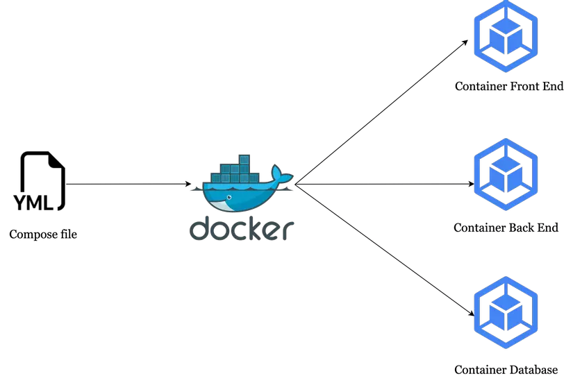

# TÌM HIỂU VỀ DOCKER COMPOSE
## KHÁI NIỆM
- Docker Compose là một công cụ chính thức của Docker giúp bạn định nghĩa, quản lý và vận hành ứng dụng chạy bằng nhiều Container (Multi-container Docker Applications) cùng một lúc thông qua một tệp cấu hình duy nhất: `compose.yaml`

- Nếu như Dockerfile là "bản thiết kế" dùng để đóng gói 1 Container riêng lẻ, thì Docker Compose đóng vai trò là "nhạc trưởng" điều phối toàn bộ hệ sinh thái các Container cùng làm việc với nhau (như Web App, Database, Redis Cache, Message Queue...).
- Thay vì phải gõ hàng chục câu lệnh docker run phức tạp để tạo từng container, thiết lập IP, kết nối mạng và mount volume, ta chỉ cần mô tả toàn bộ kiến trúc đó trong file YAML và kích hoạt tất cả bằng 1 câu lệnh duy nhất.

## TẠI SAO PHẢI SỬ DỤNG DOCKER COMPOSE
- Dưới đây là so sánh giữa việc chạy ứng dụng bằng Docker CLI truyền thống và dùng Docker Compose:
*KHÔNG SỬ DỤNG DOCKER COMPOSE*
- Để chạy một web app kèm Database MySQL, bạn phải tự tay gõ từng dòng lệnh dài ngoẵng:
1. Tạo một mạng chung
docker network create my-net
2. Chạy container Database
docker run -d --name db --network my-net -e MYSQL_ROOT_PASSWORD=secret mysql:8.0
3. Chạy container App và kết nối với DB
docker run -d --name web --network my-net -p 8080:80 -e DB_HOST=db my-app:1.0

=> Rất khó nhớ, dễ gõ sai cờ, khó quản lý khi số lượng container tăng lên 5–10 cái, và người khác trong team không thể biết bạn đã cấu hình những tham số gì.
*SỬ DỤNG DOCKER COMPOSE*
- Tất cả cấu hình trên được gom gọn trong file `compose.yaml`. Bạn chỉ cần gõ:
`docker compose up -d`

=> Docker Compose sẽ tự tạo Network, tự tải Image, tự tạo Volume, truyền biến môi trường và kích hoạt các Container đúng theo thứ tự phụ thuộc.

## DOCKER HOẠT ĐỘNG NHƯ THẾ NÀO
- Khi gõ lệnh `docker compose up`, Docker Compose sẽ thực hiện quy trình theo 4 bước tuần tự như sau:
[ File compose.yaml ]
           │
           ▼
┌─────────────────────┐
│ 1. Parse & Validate │  ---> Đọc file YAML, kiểm tra cú pháp và biến môi trường (.env)
└──────────┬──────────┘
           │
           ▼
┌─────────────────────┐
│ 2. Create Network   │  ---> Tạo 1 Docker Network ảo riêng biệt (mặc định dạng Bridge)
└──────────┬──────────┘
           │
           ▼
┌─────────────────────┐
│ 3. Build / Pull     │  ---> Build Image từ Dockerfile hoặc Kéo (Pull) Image từ Registry
└──────────┬──────────┘
           │
           ▼
┌─────────────────────┐
│ 4. Call Docker API  │  ---> Gửi yêu cầu tới Docker Daemon (dockerd) để khởi tạo 
└─────────────────────┘       các Container, Volume, Mount point theo đúng thứ tự phụ thuộc

- Chi tiết các cơ chế ngầm:
    + Tự động cô lập Mạng (Isolated Network):
    Docker Compose tự động tạo ra một mạng nội bộ chung (mặc định lấy tên thư mục dự án + _default). Tất cả các Container khai báo trong file sẽ tự động tham gia vào mạng này.
    + Cơ chế phân giải tên miền nội bộ (Built-in DNS Service Discovery):
    Nhờ có mạng chung, Docker Daemon sẽ bật cơ chế DNS tích hợp. Các Container có thể gọi nhau bằng Tên Dịch Vụ (Service Name) khai báo trong file YAML thay vì phải nhớ địa chỉ IP.
    *Ví dụ*: Code của dịch vụ web có thể kết nối tới cơ sở dữ liệu bằng chuỗi kết nối mongodb://db:27017 (với db là tên service).
    + Quản lý trạng thái dựa trên tên Dự Án (Project Name):
    Compose gán nhãn (labels) lên mọi Container, Network, Volume mà nó tạo ra dựa trên tên thư mục chứa file (hoặc thuộc tính name: ở đầu file). Nhờ đó, nó biết chính xác Container nào thuộc hệ sinh thái nào để bật/tắt đúng nhóm.

## CÁCH SỬ DỤNG DOCKER COMPOSE
Cấu trúc file `compose.yaml` tiêu chuẩn gồm 4 thành phần chính:
```bash
version: '3.8' # Phiên bản cấu hình Compose

services: # Khai báo các Container (dịch vụ)
  web: # Tên dịch vụ 1
    build: . # Build Dockerfile ở thư mục hiện tại
    ports:
      - "8080:80" # Map port_host:port_container
    environment:
      - DB_HOST=db
    depends_on:
      - db # Chờ container 'db' khởi chạy trước

  db: # Tên dịch vụ 2
    image: mysql:8.0 # Dùng image sẵn trên Docker Hub
    environment:
      MYSQL_ROOT_PASSWORD: secret
    volumes:
      - db_data:/var/lib/mysql # Gắn Volume để giữ dữ liệu DB

volumes: # Khai báo các Volume vĩnh viễn
  db_data:
```

### Bộ câu lệnh Docker Compose cốt lõi
- Khởi chạy toàn bộ hệ thống (chạy ngầm)
`docker compose up -d`

- Dừng và xóa toàn bộ container, Network vừa tạo
`docker compose down`

- Dừng và xóa cả Volume dữ liệu
`docker compose down -v`

- Xem trạng thái các Container do Compose quản lý
`docker compose ps`

- Xem logs của các Container theo thời gian thực
`docker compose ps`

- Ép buộc build lại Image khi có thay đổi trong Dockerfile/Code:
`docker compose up -d --build`

## CÁC MẸO VÀ LƯU Ý
1. Giao tiếp nội bộ giữa các Container bằng Tên Dịch Vụ (Service Name):
- Các Container nằm trong cùng file Compose sẽ tự động chung một Docker Network.
- Bạn không cần chỉ định IP. Container web có thể kết nối thẳng tới Database qua tên dịch vụ: db:3306 (Docker DNS sẽ tự giải mã tên db ra IP tương ứng).

2. Sử dụng file .env để bảo mật thông tin nhạy cảm:
- Không bao giờ hardcode mật khẩu hay API Key trực tiếp vào file docker-compose.yml.

- Tạo file .env cùng thư mục:
```bash
MYSQL_ROOT_PASS=SuperSecret123
```
- Trong file compose.yml, tham chiếu đến nó:
```bash
environment:
  MYSQL_ROOT_PASSWORD: ${MYSQL_ROOT_PASS}
```

3. Cú pháp lệnh Docker Compose hiện đại:
Dùng docker compose (viết liền có dấu cách) thay cho cú pháp cũ docker-compose (có dấu gạch ngang). Bản V2 mới tích hợp sẵn vào Docker CLI giúp chạy nhanh hơn.

*CÁC LƯU Ý KHÁC*
1. Hiểu đúng cờ depends_on (Bẫy kinh điển!):
- depends_on: [db] chỉ đảm bảo container db được khởi chạy (started) trước container web, chứ KHÔNG đảm bảo MySQL bên trong đã sẵn sàng (ready) nhận kết nối.
- Hệ quả: Ứng dụng web bật lên kết nối DB ngay sẽ bị lỗi crash ngay lập tức.
- Khắc phục: Dùng healthcheck trong Compose để kiểm tra khi nào DB thực sự sẵn sàng:
```bash
db:
  image: postgres:15
  healthcheck:
    test: ["CMD-SHELL", "pg_isready -U postgres"]
    interval: 5s
    timeout: 5s
    retries: 5
web:
  build: .
  depends_on:
    db:
      condition: service_healthy # Chỉ chạy web khi DB thực sự healthy
```

2. Dừng nhầm Container do trùng tên dự án:
- Mặc định Compose dùng tên thư mục chứa file làm tên Project (Project Name).
- Nếu bạn có 2 thư mục ở 2 đường dẫn khác nhau nhưng đều đặt tên là app, Docker Compose có thể hiểu nhầm và ghi đè/dừng nhầm các Container của nhau.
- Khắc phục: Khai báo tham số name ở đầu file Compose hoặc dùng cờ docker compose -p my_project_name up.

3. Luôn nhớ Mount Volume cho Database:
- Nếu không gắn volumes cho thư mục dữ liệu của MySQL/PostgreSQL/MongoDB, mỗi khi bạn gõ docker compose down, toàn bộ dữ liệu trong DB sẽ biến mất hoàn toàn.

## ƯU NHƯỢC ĐIỂM CỦA DOCKER COMPOSE
|                                                             Ưu điểm                                                            |                                                                                   Nhược điểm                                                                                  |
|:------------------------------------------------------------------------------------------------------------------------------:|:-----------------------------------------------------------------------------------------------------------------------------------------------------------------------------:|
| Đơn giản hóa quy trình: Quản lý toàn bộ hệ thống container chỉ với một file YAML và một lệnh khởi chạy (docker compose up).    | Hạn chế quy mô lớn: Chỉ phù hợp trên một máy chủ (single host). Khi cần Auto-scaling hay High Availability cho hệ thống lớn, bắt buộc phải dùng Kubernetes hoặc Docker Swarm. |
| Tính nhất quán: Đồng bộ hóa môi trường giữa Local, Test và Production, giảm thiểu tối đa lỗi do sai lệch cấu hình.             | Tiêu tốn tài nguyên: Việc chạy nhiều container đồng thời trên cùng một máy chủ vật lý/máy local dễ gây quá tải RAM và CPU.                                                    |
| Hỗ trợ làm việc nhóm: Dễ dàng chia sẻ file cấu hình qua Git giúp các thành viên tái tạo môi trường làm việc nhanh chóng.       | Rủi ro bảo mật cấu hình: File cấu hình dễ chứa hoặc rò rỉ thông tin nhạy cảm (API key, mật khẩu) nếu không được tách file .env và quản lý chặt chẽ.                           |
| Phù hợp microservices: Khởi chạy đồng thời nhiều dịch vụ và tự động thiết lập mạng nội bộ để các container giao tiếp với nhau. | Thiếu tính năng quản lý nâng cao: Không có cơ chế tự phục hồi đa máy chủ, cân bằng tải tự động hay rolling update mạnh mẽ như Kubernetes.                                     |
| Tiết kiệm thời gian phát triển: Tự động hóa các tác vụ thiết lập mạng (Network), lưu trữ (Volume) và biến môi trường.          |                                                                                                                                                                               |