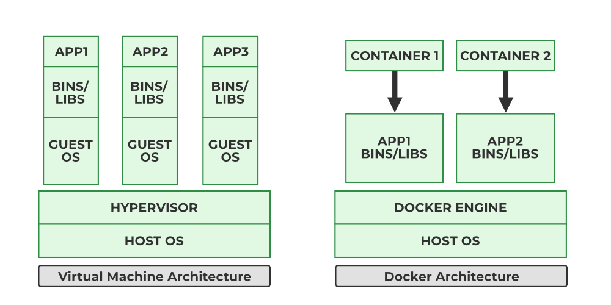
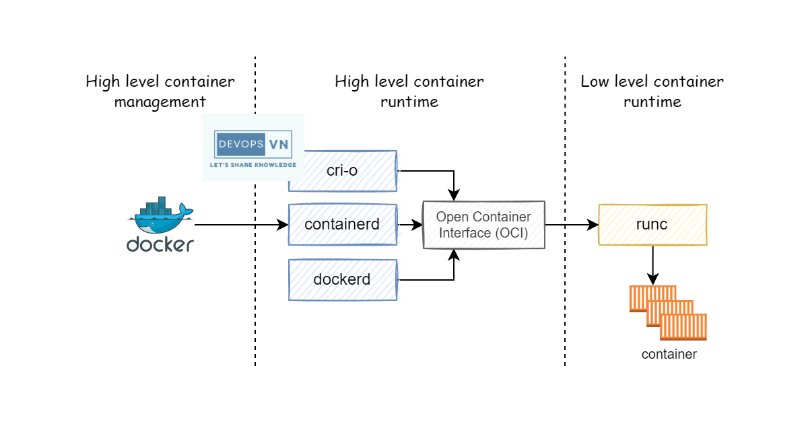

# TÌM HIỂU VỀ CONTAINER
## KHÁI NIỆM
- Docker Container là một đơn vị triển khai phần mềm nhẹ, có khả năng đóng gói mã nguồn ứng dụng cùng với tất cả thư viện, tệp cấu hình và các phụ thuộc cần thiết để chạy ứng dụng đó. Điều này giúp đảm bảo ứng dụng hoạt động nhất quán trong mọi môi trường – từ máy phát triển, máy chủ kiểm thử đến môi trường production.
- Khác với máy ảo, Docker Container không cần cài đặt hệ điều hành riêng mà chia sẻ kernel với hệ điều hành máy chủ, nhờ đó khởi động nhanh và sử dụng ít tài nguyên hơn. Nhờ vào tính linh hoạt và hiệu quả này, Docker Container đã trở thành một phần không thể thiếu trong quy trình CI/CD, DevOps và phát triển phần mềm hiện đại.
- Có thể hiểu Container chính là một tiến trình bình thường chạy trên hệ điều hành máy chủ (Host OS) nhưng được cô lập bởi 3 tính năng chính là: namespaces (cách ly không gian), cgroups (giới hạn tài nguyên), chroot (cách ly ổ đĩa)

### NAMESPACES
- Namespaces chia hệ điều hành thành các "vùng không gian" riêng biệt. Tiến trình nằm trong một Namespace sẽ không nhìn thấy các tài nguyên thuộc Namespace khác.
- Docker sử dụng 6 loại Namespaces cốt lõi:
+ PID Namespace (Process ID): Tiến trình bên trong Container thấy mình có ID là PID 1 (tiến trình gốc), nhưng trên máy host Ubuntu, nó có thể mang một PID hoàn toàn khác (ví dụ PID 45821).
+ NET Namespace (Networking): Cấp cho Container một giao diện mạng ảo (eth0), bảng tuyến đường (routing table) và dải IP riêng hoàn toàn độc lập với máy host.
+ MNT Namespace (Mount): Cho phép Container có hệ thống tập tin (File System) riêng mà không thấy các thư mục /home, /var của máy host.
+ IPC Namespace (Inter-Process Communication): Tách biệt bộ nhớ chia sẻ (shared memory) giữa các tiến trình.
+ UTS Namespace (Unix Timesharing System): Cho phép Container có Hostname riêng (ví dụ hostname trong container khác với ubuntu).
+ USER Namespace: Cho phép một tài khoản chạy dưới dạng root bên trong Container nhưng thực chất chỉ là một user thường (tranbao) trên máy host Ubuntu (tăng cường bảo mật).

### CONTROL GROUPS (cgroups)
- Namespaces chỉ giúp "giấu" tài nguyên, còn cgroups đóng vai trò là "người gác cổng" giới hạn tài nguyên phần cứng.
- cgroups quy định Container này chỉ được xài tối đa 1 CPU và 512MB RAM.
- Nếu Container ngốn quá 512MB RAM, cơ chế OOM Killer (Out Of Memory) của Linux Kernel sẽ lập tức tiêu diệt tiến trình inside Container để bảo vệ máy host không bị treo.

### chroot / pivot_root
- Giúp khóa tiến trình vào trong cây thư mục của Image (chứa Alpine, Ubuntu,...) khiến tiến trình không thể "truy cập ngược" ra thư mục gốc / của máy thật.

## CÁCH CONTAINER HOẠT ĐỘNG
- Docker Container hoạt động dựa trên các tính năng lõi của hệ điều hành như namespaces để cô lập tiến trình và control groups (cgroups) để quản lý tài nguyên. Nhờ đó, mỗi Docker Container có thể chạy độc lập như một hệ thống riêng biệt, dù tất cả đều dùng chung kernel của máy chủ. Điều này giúp Container nhẹ, khởi động nhanh và tiêu tốn ít tài nguyên hơn so với máy ảo truyền thống.
- Khi bạn chạy một Docker Container, nó được tạo từ một Docker Image – một gói chứa toàn bộ mã nguồn, thư viện, cấu hình và phụ thuộc cần thiết. Container này chạy như một tiến trình riêng biệt trên host, được cách ly với các Container khác. Nhờ thiết kế này, Docker Container cho phép lập trình viên dễ dàng tái tạo môi trường, triển khai ứng dụng đồng nhất trên mọi nền tảng từ máy tính cá nhân đến server production.
- Docker Image sử dụng cơ chế lớp (layers) và copy-on-write để tối ưu hóa việc lưu trữ và hiệu suất. Mỗi lệnh trong Dockerfile tạo ra một lớp mới, và các lớp này được tái sử dụng giữa các image khác nhau. Nhờ vậy, Docker tiết kiệm không gian đĩa và tăng tốc quá trình build.

## PHÂN BIỆT CONTAINER VỚI IMAGE
- Mặc dù Docker Container và Docker Image có mối liên hệ chặt chẽ với nhau, chúng lại có những khác biệt quan trọng về cách thức hoạt động. Docker Image là một template chỉ chứa các phần cần thiết để tạo ra một Docker Container. Trong khi đó, Docker Container là một thực thể đang chạy, là môi trường hoạt động thực tế cho ứng dụng của bạn.
- Dưới đây là bảng so sánh giữa Docker Container và Docker Image:

| Tiêu chí           | Docker Container                                                                   | Docker Image                                                                         |
|--------------------|------------------------------------------------------------------------------------|--------------------------------------------------------------------------------------|
| Định nghĩa         | Một thực thể chạy từ Image, chứa tất cả tài nguyên cần thiết để ứng dụng hoạt động | Một template chứa cấu trúc của một Container, bao gồm mã nguồn, thư viện và cấu hình |
| Tính chất          | Biến động, có thể thay đổi trong quá trình chạy                                    | Tĩnh, không thay đổi sau khi được tạo ra                                             |
| Mục đích sử dụng   | Chạy ứng dụng và lưu trạng thái trong suốt vòng đời hoạt động                      | Cung cấp môi trường cơ bản để tạo và triển khai Container                            |
| Quản lý trạng thái | Có trạng thái thay đổi trong suốt quá trình chạy                                   | Không có trạng thái, chỉ là bản sao cố định của môi trường                           |
| Ví dụ              | Một Container đang chạy ứng dụng web hoặc database                                 | Một Image chứa hệ điều hành Linux và ứng dụng web cần thiết                          |
| Tuổi thọ           | Thường có thời gian tồn tại ngắn, có thể tạo và hủy nhanh chóng                    | Bền bỉ và có thể lưu trữ lâu dài trong registry                                      |

## SO SÁNH CONTAINER VỚI MÁY ẢO (VIRTUAL MACHINE)
- Nhiều người thường nhầm lẫn giữa Docker Container và máy ảo (Virtual Machine) vì cả hai đều giúp chạy ứng dụng trong môi trường cách ly. Tuy nhiên, cách hoạt động và hiệu suất của chúng lại hoàn toàn khác nhau. Docker Container nhẹ hơn, khởi động nhanh hơn và không cần hệ điều hành riêng biệt cho mỗi ứng dụng.

- Dưới đây là bảng so sánh giữa Docker Container và máy ảo:

| Tiêu chí              | Docker Container                                         | Virtual Machine (VM)                                        |
|-----------------------|----------------------------------------------------------|-------------------------------------------------------------|
| Kiến trúc             | Chia sẻ kernel hệ điều hành của máy chủ                  | Có hệ điều hành riêng cho mỗi VM                            |
| Tốc độ khởi động      | Rất nhanh (vài giây)                                     | Chậm hơn (vài phút)                                         |
| Hiệu suất             | Cao, sử dụng ít tài nguyên                               | Thấp hơn do overhead của hệ điều hành riêng                 |
| Tính di động          | Rất cao, chạy đồng nhất trên mọi môi trường              | Phụ thuộc vào cấu hình máy ảo                               |
| Kích thước            | Nhẹ, chỉ vài MB đến trăm MB                              | Nặng, thường vài GB trở lên                                 |
| Ứng dụng điển hình    | CI/CD, microservices, môi trường dev/test nhanh          | Ứng dụng cần cô lập hoàn toàn hoặc đa hệ điều hành          |
| Mức độ cô lập         | Cô lập ở mức tiến trình, chia sẻ kernel                  | Cô lập hoàn toàn với hypervisor                             |
| Bảo mật               | Rủi ro cao hơn do chia sẻ kernel                         | An toàn hơn do cô lập hoàn toàn                             |
| Khả năng chạy OS khác | Chỉ chạy được OS cùng kernel với host                    | Có thể chạy bất kỳ OS nào (Windows trên Linux và ngược lại) |
| Quản lý tài nguyên    | Linh hoạt, có thể điều chỉnh giới hạn tài nguyên dễ dàng | Cấp phát cố định khi tạo, khó điều chỉnh khi đang chạy      |

## KIẾN TRÚC VÒNG ĐỜI VÀ CƠ CHẾ LƯU TRỮ CỦA CONTAINER
Lớp Đọc-Ghi (Read-Write Layer)
Mỗi Container được sinh ra từ Image sẽ mang kiến trúc dữ liệu như sau:
+ Image Layers (Read-Only): Nằm bên dưới, không bao giờ thay đổi.
+ Container Layer (Read-Write): Một lớp mỏng phủ lên trên cùng.
+ Khi bạn chạy apk add bash hay tạo file mới trong khi Container đang chạy, dữ liệu sẽ ghi vào lớp Read-Write này.
+ Cơ chế Copy-on-Write (CoW): Nếu bạn sửa một file có sẵn trong Alpine, Docker sẽ copy file đó từ Image Layer lên Container Layer rồi mới chỉnh sửa.
+ Đặc tính Ephemeral (Tạm thời): Khi bạn gõ docker rm <container_id>, toàn bộ lớp Read-Write này biến mất hoàn toàn.

## CONTAINER RUNTIME
- Khi bạn gõ lệnh docker run, không phải một mình phần mềm "Docker" làm tất cả từ A-Z. Việc quản lý Container được chia làm nhiều tầng bởi một chuỗi công cụ theo kiến trúc Runtime (Bộ thực thi) chuẩn OCI (Open Container Initiative):

- Chi tiết vai trò từng thành phần quản lý:
+ Docker Daemon (dockerd): Là dịch vụ chạy ngầm tiếp nhận lệnh từ bạn (Docker CLI). Nó quản lý các tác vụ cao cấp như lưu trữ Image, cấu hình Docker Network, Volume.
+ containerd (High-Level Container Runtime):
    * Được tách ra từ Docker để trở thành một chuẩn chung cho ngành công nghiệp (Kubernetes cũng dùng trực tiếp containerd).
    * Nhiệm vụ: Tải Image, quản lý việc lưu trữ các lớp layer trên đĩa, giám sát trạng thái sống/chết của Container.
+ runc (Low-Level Container Runtime):
    * Là một công cụ nhẹ, nhiệm vụ duy nhất của nó là làm việc trực tiếp với Linux Kernel.
    * Khi nhận lệnh từ containerd, runc sẽ gọi các hàm hệ thống (system calls) của Linux để tạo Namespaces và cgroups, đưa tiến trình vào đó, rồi bàn giao việc điều phối tiến trình lại cho Linux Kernel.
+ Linux Kernel (Máy chủ Ubuntu):
    * Kernel mới chính là người thực sự "quản lý" và "điều phối" CPU/RAM cho tiến trình Container hoạt động, bảo đảm tiến trình không dùng vượt mức tài nguyên quy định.

## BỘ CÂU LỆNH LIÊN QUAN ĐẾN CONTAINER
### KHỞI TẠO VÀ CHẠY CONTAINER
```console
docker run [OPTIONS] IMAGE [COMMAND] [ARG...]
```
- Các flags phổ biến nhất:
    + `-d` (detached): Chạy ngầm Container bên dưới hệ thống.

    + `-it` (interactive + tty): Chạy tương tác, cấp giao diện dòng lệnh (dùng khi muốn chui vào shell).

    + `--name` <tên>: Đặt tên riêng cho Container (nếu không đặt, Docker sẽ tự đặt tên ngẫu nhiên).

    + `-p` <port_host>:<port_container>: Mapping/Forward cổng từ máy thật vào Container.

    + `-v` <path_host>:<path_container>: Mount thư mục từ máy thật vào Container (Volume/Bind Mount).

    + `--rm`: Tự động xóa Container ngay khi nó dừng chạy (rất hợp cho các lab thử nghiệm).

    + `--restart` <policy>: Tự động khởi động lại Container (always, unless-stopped, on-failure).

    + `-e` <KEY=VALUE>: Truyền biến môi trường (Environment Variable) vào Container.

### QUẢN LÝ VÒNG ĐỜI
```bash
docker start <container> :Bật một Container đang ở trạng thái Stopped/Exited.

docker stop <container>: Dừng Container một cách êm đẹp (gửi tín hiệu SIGTERM, đợi 10 giây rồi gửi SIGKILL).

docker kill <container>: Tiêu diệt Container ngay lập tức (gửi tín hiệu SIGKILL).

docker restart <container>: Khởi động lại Container (tương đương stop rồi start).

docker pause <container>: Đóng băng toàn bộ các tiến trình trong Container (dùng cgroups freezer).

docker unpause <container>: Hủy đóng băng, cho tiến trình chạy tiếp tục.
```
### TRA CỨU, GIÁM SÁT VÀ INSPECT
- Liệt kê container
```bash
docker ps : Liệt kê Container
docker ps -a : Liệt kê tất cả Container (bao gồm cả đã dừng - EXITED) 
docker ps -q : chỉ hiển thị ID của container
```

- Kiểm tra thông số bên trong
```bash
docker logs <container>: Xem nhật ký (logs) đầu ra của tiến trình PID 1.
docker top <container>: Xem danh sách các tiến trình (Processes) đang chạy bên trong Container.
docker stats: Xem mức tiêu thụ tài nguyên thời gian thực (CPU, RAM, Network I/O, Disk I/O) của tất cả Container đang chạy.
docker inspect <container>: Xem toàn bộ cấu hình chi tiết ở dạng JSON (địa chỉ IP, Mount point, biến môi trường, trạng thái Healthcheck...).
```

### TƯƠNG TÁC TRỰC TIẾP VỚI CONTAINER
```bash
docker exec : Chạy một lệnh MỚI vào Container đang hoạt động (Dùng nhiều nhất để chui vào bên trong Container làm công tác Troubleshooting)
docker cp : Copy tệp/thư mục giữa máy host Ubuntu và Container
```
**Ví dụ:** 
*Copy file từ máy host VÀO TRONG container*
docker cp index.html my-web:/usr/share/nginx/html/
*Copy file từ trong container RA MÁY HOST*
docker cp my-web:/var/log/nginx/access.log ./local_access.log

### XÓA VÀ DỌN DẸP
```bash
docker rm <container>: Xóa một Container đã dừng (Exited).
docker rm -f <container>: Ép buộc xóa Container (cho dù nó đang chạy).
docker container prune : Xóa TẤT CẢ Container đã bị Dừng (Exited):
```