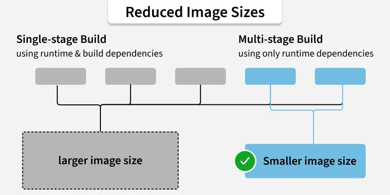

# TÌM HIỂU VỀ DOCKERFILE
## KHÁI NIỆM
- Dockerfile là một tệp văn bản thuần túy (text file) không có đuôi mở rộng, chứa tập hợp các chỉ thị (instructions) theo thứ tự từ trên xuống dưới. Docker Daemon sẽ đọc tệp này để tự động biên dịch (build) thành một Docker Image.
- Nói một cách đơn giản: Nếu Docker Image là một "món ăn đóng hộp", thì Dockerfile chính là công thức nấu ăn chi tiết từng bước.

## CẤU TRÚC VÀ LUỒNG HOẠT ĐỘNG CỦA DOCKER FILE
- Khi chạy lệnh `docker build -t my-app`
+ Docker Client gửi toàn bộ thư mục chứa Dockerfile (gọi là Build Context) sang cho Docker Daemon.
+ Docker Daemon đọc từng dòng lệnh trong Dockerfile.
+ Mỗi lệnh sẽ tạo ra một Image Layer (lớp) mới nằm đè lên các lớp trước.
+ Nếu một bước không có thay đổi so với lần build trước, Docker sẽ dùng cơ chế Cache để bỏ qua bước đó, giúp tốc độ build cực kỳ nhanh.

## CÁC KEYWORDS QUAN TRỌNG TRONG DOCKER FILE
### FROM — Khai báo Image nền (Base Image)
- Mọi Dockerfile phải bắt đầu bằng chỉ thị FROM. Nó xác định hệ điều hành hoặc môi trường chạy ban đầu.
```bash
FROM ubuntu:22.04
# Hoặc dùng môi trường ngôn ngữ có sẵn:
# FROM node:18-alpine
```
- Mẹo: Nên chọn các bản image có đuôi -alpine (ví dụ python:3.9-alpine) vì chúng cực kỳ nhẹ (chỉ khoảng vài MB đến vài chục MB).

### WORKDIR — Thiết lập thư mục làm việc
- Đặt thư mục làm việc mặc định cho tất cả các lệnh tiếp theo (RUN, CMD, ENTRYPOINT, COPY). Nếu thư mục chưa tồn tại, Docker sẽ tự tạo.
```bash
WORKDIR /app
```
### COPY và ADD — Sao chép file vào Image
- Dùng để đưa file/thư mục từ máy host vào bên trong Image.
+ COPY (Khuyên dùng): Chỉ đơn thuần là copy file/thư mục từ máy tính vào Image.
```bash
COPY package.json .
COPY . /app
```
+ ADD: Giống COPY nhưng nâng cao hơn, có thể tự động giải nén các file nén (.tar.gz) hoặc tải file từ một URL trên Internet.

### RUN — Thực thi lệnh trong quá trình Build
- Được dùng để cài đặt phần mềm, thư viện, chạy các câu lệnh Linux ngay tại thời điểm đúc Image. Kết quả của lệnh RUN sẽ được lưu vĩnh viễn vào một Layer mới của Image.
```bash
RUN apt-get update && apt-get install -y \
    curl \
    git \
    && rm -rf /var/lib/apt/lists/*
```

### ENV và ARG — Biến môi trường
- ARG (Build-time Variable): Biến chỉ tồn tại trong quá trình build Image (ví dụ: truyền version thư viện khi build).
- ENV (Runtime Environment Variable): Biến môi trường tồn tại cả khi Container chạy.
```bash
ARG VERSION=1.0
ENV PORT=8080
```

### EXPOSE — Khai báo Cổng (Port)
Khai báo cho Docker biết Container này dự định sẽ lắng nghe ở cổng mạng nào khi chạy (mang tính chất tài liệu/định danh là chính).
```bash
EXPOSE 8080
```

### VOLUME — Khai báo điểm Mount dữ liệu
Khai báo một thư mục bên trong Container sẽ được tự động gắn vào một Volume ngoài máy host để lưu trữ dữ liệu vĩnh viễn (như dữ liệu MySQL).
```bash
VOLUME ["/var/lib/mysql"]
```

### CMD vs ENTRYPOINT — Lệnh mặc định khi chạy Container
- Đây là câu lệnh sẽ chạy khi Container bắt đầu khởi động (khác với RUN là chạy lúc đúc Image).
+ CMD: Định nghĩa lệnh mặc định. Lệnh này có thể bị ghi đè dễ dàng nếu người dùng truyền lệnh khác lúc chạy docker run.
```bash
CMD ["python", "app.py"]
```
+ ENTRYPOINT: Định nghĩa lệnh cố định cho Container. Lệnh này rất khó bị ghi đè, thường dùng khi muốn biến Container thành một công cụ thực thi chuyên biệt.
```bash
ENTRYPOINT ["python", "app.py"]
```
## CÁC QUY TẮC KHI VIẾT DOCKERFILE
- Giữ Image nhỏ gọn nhất có thể:
    + Dùng base image nhẹ như alpine hoặc slim.
    + Gộp nhiều lệnh RUN lại làm một (sử dụng dấu &&) để giảm số lượng Image Layers.
- Sử dụng tệp .dockerignore:
    + Tạo một file tên .dockerignore ngay bên cạnh Dockerfile để loại bỏ các thư mục rác (như node_modules, .git, file log) không bị copy vào Image, giúp giảm dung lượng và tăng tốc độ build.
- Sắp xếp thứ tự các lệnh hợp lý để tối ưu Cache:
    + Đặt các lệnh ít thay đổi (như cài OS, cài thư viện npm install / pip install) lên trên.
    + Đặt các lệnh hay thay đổi (như COPY . . mã nguồn) xuống cuối. Nhờ đó, mỗi khi bạn sửa code, Docker chỉ phải build lại bước copy code chứ không phải tải và cài lại toàn bộ thư viện từ đầu!
- Không lưu trữ bí mật (Secrets): Không bao giờ ghi mật khẩu Database, API Keys trực tiếp vào Dockerfile. Hãy dùng biến môi trường truyền vào lúc chạy Container.

## MULTI-STAGE BUILD
### Khái niệm
- Multi-stage build (Build nhiều giai đoạn) là một tính năng của Docker cho phép bạn sử dụng nhiều câu lệnh FROM trong cùng một tệp Dockerfile.
- Mỗi câu lệnh FROM sẽ bắt đầu một giai đoạn (stage) build mới với một Base Image riêng biệt. Bạn có thể chọn lọc và chép (copy) các tệp kết quả (như tệp thực thi, các gói tĩnh) từ giai đoạn này sang giai đoạn khác.

### Tại sao cần dùng Multi-Stage Build
Giai đoạn Biên dịch (Build Stage)              Giai đoạn Vận hành (Production Stage)
┌──────────────────────────────────────────────┐     ┌──────────────────────────────────────────────┐
│  Cần: SDK, Compiler, Source Code, Tools...   │  ►  │  Chỉ cần: Tệp chạy (Binary), Runtime nhẹ... │
│  👉 Dẫn đến: Image cực kỳ NẶNG (vài GB)     │     │  👉 Mong muốn: Image siêu NHẸ (vài MB)       │
└──────────────────────────────────────────────┘     └──────────────────────────────────────────────┘

- Nếu không dùng Multi-stage build, bạn sẽ gặp các vấn đề lớn sau:
+ Dung lượng Image quá lớn: Bạn bắt buộc phải giữ lại toàn bộ trình biên dịch (như gcc, go, npm, Node.js SDK...) trong Image cuối cùng dù ứng dụng khi chạy thực tế không hề cần đến chúng.
+ Rủi ro bảo mật (Security Risks): Việc chứa mã nguồn gốc, công cụ build hay các thư viện thừa trong Production Image sẽ tạo ra bề mặt tấn công rộng cho hacker khai thác lỗ hổng.
+ Giải pháp cũ rất phức tạp: Trước khi có Multi-stage build, lập trình viên phải viết 2 Dockerfile riêng biệt (một cái để build, một cái để chạy) và dùng các kịch bản Shell Script để copy file qua lại giữa các Container — việc này rất cồng kềnh và dễ lỗi.

### Multi-Stage Build hoạt động như thế nào
Multi-stage build hoạt động theo cơ chế "Lọc bỏ phế thải, chỉ lấy thành phẩm":


┌────────────────────────────────────────────────────────────────────────┐
 │ STAGE 1: "builder" (FROM golang:1.22)                                  │
 │                                                                        │
 │   • Tải mã nguồn (.go)                                                │
 │   • Biên dịch code thành file thực thi: /app/main                      │
 │   • Tổng dung lượng Stage 1: ~800 MB (gồm cả Go SDK)                  │
 └───────────────────────────────────┬────────────────────────────────────┘
                                     │
                        COPY --from=builder /app/main .
                                     │ (Chỉ bốc duy nhất file /app/main)
                                     ▼
 ┌────────────────────────────────────────────────────────────────────────┐
 │ STAGE 2: "Production" (FROM alpine:3.20)                               │
 │                                                                        │
 │   • Hệ điều hành Alpine siêu nhẹ (~5 MB)                               │
 │   • Tiếp nhận duy nhất file /app/main                                  │
 └────────────────────────────────────────────────────────────────────────┘
                   👉 IMAGE CUỐI CÙNG CHỈ NẶNG ~15 MB!

Docker sẽ lần lượt thực thi từng giai đoạn từ trên xuống dưới. Tuy nhiên, chỉ có giai đoạn cuối cùng (Stage cuối) mới được lưu lại thành Image chính thức. Toàn bộ tài nguyên, bộ công cụ build ở các Stage phía trước sẽ bị loại bỏ hoàn toàn.

### Cách sử dụng Multi-Stage Build
Cú pháp cốt lõi dựa trên 2 quy tắc:
+ Đặt tên gợi nhớ cho Stage bằng từ khóa AS <tên_stage>.
+ Dùng cú pháp COPY --from=<tên_stage> để chép dữ liệu từ Stage trước sang Stage sau.

Ví dụ:
```bash
# ----------------------------------------------------
# GIAI ĐOẠN 1: Build (Tạo file thực thi)
# ----------------------------------------------------
FROM golang:1.22-alpine AS builder
WORKDIR /app
# Coppy file dependency và tải về
COPY go.mod go.sum ./
RUN go mod download
# Copy mã nguồn và biên dịch
COPY . .
RUN CGO_ENABLED=0 GOOS=linux go build -o myapp .

# ----------------------------------------------------
# GIAI ĐOẠN 2: Production (Image gọn nhẹ để chạy)
# ----------------------------------------------------
FROM alpine:3.20
WORKDIR /app
# Lấy tệp /app/myapp từ giai đoạn "builder" đưa sang thư mục /app hiện tại
COPY --from=builder /app/myapp .
# Khai báo cổng và lệnh chạy
EXPOSE 8080
CMD ["./myapp"]
```
### Các câu lệnh 
|             Cú pháp            |                               Ý nghĩa                               |
|:------------------------------:|:-------------------------------------------------------------------:|
| FROM image AS stage_name       | Khai báo một giai đoạn build mới và đặt tên cho nó.                 |
| COPY --from=stage_name src dst | Copy file/folder từ giai đoạn stage_name sang giai đoạn hiện tại.   |
| COPY --from=0 src dst          | Copy từ Stage đầu tiên (nếu không đặt tên AS, Docker đánh số từ 0). |

## LAYER CACHING
