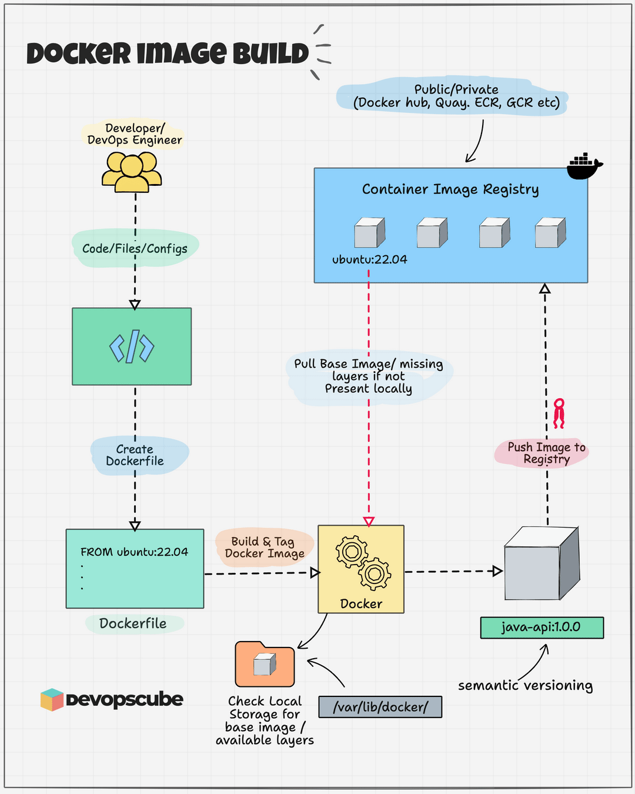

# TÌM HIỂU VỀ DOCKER IMAGE
## KHÁI NIỆM
- Docker Image là một tệp tập hợp chỉ đọc (read-only template) đóng gói toàn bộ những gì cần thiết để một ứng dụng có thể chạy độc lập: từ mã nguồn, thư viện, file cấu hình, biến môi trường cho đến các thành phần của hệ điều hành nền (Base OS).
- Nếu Container là một "thực thể sống" đang chạy thì Docker Image chính là "khuôn đúc" hay "file cài đặt tĩnh" tạo ra thực thể đó.

## KIẾN TRÚC CÁC LỚP CỦA IMAGE
- Một Docker Image không phải là một file đơn lẻ mà là một tập hợp gồm nhiều lớp tập tin (Layers) chồng lên nhau.
    + Tất cả các lớp của Image đều ở trạng thái Chỉ đọc (Read-Only).
    + Mỗi khi bạn ghi một dòng lệnh trong Dockerfile (RUN, COPY, ADD), Docker sẽ tạo ra một Layer mới nằm đè lên Layer cũ.

**Cơ chế Copy-on-Write (CoW):**
- Khi một Container được chạy từ Image, Docker không copy toàn bộ Image đó. Nó chỉ tạo duy nhất một lớp mỏng có thể ghi (Thin Writable Layer) lên trên cùng.
    + Nếu Container muốn đọc một file: Nó đọc trực tiếp từ các lớp Read-Only phía dưới.
    + Nếu Container muốn sửa một file từ Image: Cơ chế CoW sẽ tự động nhân bản (copy) file đó lên Writable Layer trên cùng và sửa trên bản copy đó. File gốc ở lớp Read-Only bên dưới hoàn toàn giữ nguyên.

=> Lợi ích: 100 Container chạy từ cùng 1 Image 1GB sẽ dùng chung 1GB Read-Only đó trên ổ cứng chứ không tốn 100GB không gian lưu trữ!

## CƠ CHẾ TÁI SỬ DỤNG LAYER VÀ CACHING
Nhờ cấu trúc Layer, Docker mang lại khả năng tối ưu thời gian build và dung lượng lưu trữ cực kỳ thông minh.
- Bản chất:
    + Dung lượng: Nếu Image A và Image B có chung lớp nền ubuntu:22.04, hệ thống máy Host chỉ tải và lưu trữ lớp ubuntu:22.04 này đúng 1 lần duy nhất.
    + Thời gian Build (Build Cache): Khi bạn build lại Image, Docker sẽ kiểm tra xem từ dòng lệnh nào trong Dockerfile có sự thay đổi. Tất cả các lệnh trước đó chưa bị thay đổi sẽ được dùng lại ngay lập tức từ Cache (xuất hiện chữ CACHED khi build) mà không cần chạy lại.

## Cơ chế "Tạo hình ảnh đại diện" qua Image Manifest & Content-Addressable Storage
Docker không chỉ định danh Image hay Layer bằng tên gọi/tag đơn thuần (như v1.0), mà dùng mã băm SHA-256 của chính nội dung dữ liệu bên trong tệp đó.
- Bản chất:
    + Mỗi Layer và mỗi Image đều có một chuỗi Hash riêng (ví dụ: sha256:a3ed95ca...).
    + Nếu nội dung của Layer không đổi, mã Hash giữ nguyên. Nếu có bất kỳ sự thay đổi dù chỉ 1 byte dữ liệu, mã Hash sẽ thay đổi hoàn toàn.
=> Lợi ích: Tính năng này ngăn chặn việc dữ liệu bị hư hỏng (data corruption) hoặc bị can thiệp trái phép (tampering) trong quá trình tải qua mạng. Đồng thời giúp Docker phát hiện các Layer trùng lặp tuyệt đối để không tải lại.

## Cơ chế Ephemeral Nature (Tính chất ngắn hạn / Bất biến)
- Image mang tính chất Immutable (Bất biến):
    + Một khi một Image đã được build xong, bạn không thể sửa đổi trực tiếp các layer bên trong nó. Muốn thay đổi, bạn bắt buộc phải tạo/build một Image mới.
    + Mọi dữ liệu phát sinh trong quá trình Container chạy sẽ nằm ở Writable Layer và sẽ biến mất hoàn toàn khi Container bị xóa (nếu không dùng Docker Volume). Tính chất này buộc các nhà phát triển phải thiết kế ứng dụng theo chuẩn Stateless (không phụ thuộc vào trạng thái lưu trữ cục bộ).

## QUÁ TRÌNH BUILD IMAGE DIỄN RA


- Khi ta gõ 1 câu lệnh `docker build -t my-app:v1 .`
- Toàn bộ máy Docker sẽ kích hoạt một quy trình gồm 5 bước cốt lõi:
┌──────────────┐ Dấu chấm (.) ┌──────────────────┐  HTTP POST (REST API) ┌──────────────────┐
│  Thư mục root├─────────────►│ Build Context    ├──────────────────────►│ Docker Daemon    │
│ (Mã nguồn)   │              │ (File .tar.gz)   │                       │ (`dockerd`)      │
└──────────────┘              └──────────────────┘                       └─────────┬────────┘
                                                                                    │
                               ┌────────────────────────────────────────────────────┘
                               ▼
            ┌──────────────────────────────────────┐
            │ Đọc Dockerfile & Khai báo Base Image │
            └──────────────────┬───────────────────┘
                               │
                               ▼  (Lặp lại cho mỗi chỉ thị RUN/COPY/ADD...)
            ┌──────────────────────────────────────┐
            │ 1. Tạo Container tạm (Temporary)    │
            │ 2. Chạy lệnh (RUN/COPY...)           │
            │ 3. `docker commit` đóng băng thành Layer│
            │ 4. Xóa Container tạm                 │
            └──────────────────┬───────────────────┘
                               │
                               ▼
            ┌──────────────────────────────────────┐
            │ Gán Tag (my-app:v1) & Hoàn tất       │
            └──────────────────────────────────────┘
*Bước 1: Ghép và gửi Build Context*
Dấu chấm . ở cuối câu lệnh chỉ định Build Context (thư mục chứa mã nguồn và Dockerfile).
+ Docker Client sẽ quét thư mục này, loại bỏ các file được khai báo trong .dockerignore.
+ Client đóng gói toàn bộ thư mục thành một file nén và gửi qua REST API sang cho Docker Daemon (truyền qua Unix Socket hoặc TCP Socket).

*Bước 2: Tải hoặc dùng lại Base Image*
Daemon nhận Build Context, mở file Dockerfile và đọc chỉ thị FROM.
+ Nếu Base Image (ví dụ: ubuntu:22.04) chưa có trên máy, Daemon sẽ gửi request lên Docker Hub để kéo (pull) tất cả các Layer của Base Image đó về.

*Bước 3: Vòng lặp "Tạo - Thực thi - Đóng băng" (Tạo từng Layer)*
Đây là bước quan trọng nhất. Với mỗi dòng lệnh tiếp theo trong Dockerfile (như RUN, COPY, WORKDIR...):
+ Tạo Container tạm: Daemon tạo một Container tạm thời từ Layer của bước trước đó.
+ Thực thi lệnh: Daemon cho chạy câu lệnh của dòng hiện tại inside Container tạm đó (ví dụ: chạy apt-get install hoặc COPY file vào).
+ Lưu thay đổi (Commit): Khi lệnh hoàn thành, Daemon sẽ "chụp ảnh" (snapshot) lớp Read-Write của Container tạm này bằng cơ chế tương tự docker commit để tạo thành một Image Layer mới (gắn mã SHA256).
+ Xóa Container tạm: Daemon dừng và xóa Container tạm đi, chỉ giữ lại Layer vừa đúc.
+ Layer mới này sẽ làm "móng" cho dòng lệnh tiếp theo trong Dockerfile.

*Bước 4: Tận dụng cơ chế Caching (Tối ưu hóa)*
Trước khi chạy một bước, Daemon sẽ kiểm tra xem trong máy đã từng có Layer nào được đúc từ đúng câu lệnh này với cùng dữ liệu đầu vào chưa:
+ Nếu có, nó sẽ in ra thông báo ---> Using cache và bỏ qua việc tạo Container tạm, giúp tiết kiệm gian cực lớn.
+ Nếu một Layer bị thay đổi (ví dụ: bạn sửa code nên lệnh COPY . . tạo ra hash khác), toàn bộ các bước phía sau Layer đó bắt buộc phải build lại từ đầu (Cache Invalidation).

*Bước 5: Gán Tag và hoàn tất*
Sau khi chạy hết dòng lệnh cuối cùng, Daemon thu gom tất cả các Layer lại, tạo một manifest tổng thể và gán nhãn (tag) my-app:v1 cho Image hoàn chỉnh.

## IMAGE BASE ĐẦU TIÊN
Mọi Image trong thế giới Docker đều phải bắt đầu từ một điểm mốc gốc. Điểm mốc tuyệt đối, không có cha mẹ (parentless) đó chính là: Image scratch.
```bash
FROM scratch
```
### BẢN CHẤT CỦA SCRATH
- `scratch` không phải là một hệ điều hành, cũng không phải là một file hay thư mục nào cả. Nó là một Image rỗng tuyệt đối (0 Bytes) được Docker định nghĩa sẵn.
+ Nó không có Shell (/bin/sh hay /bin/bash).
+ Nó không có bất kỳ thư viện C nào (glibc), không có các lệnh Linux cơ bản (ls, cd, cp...).
+ Nó đại diện cho "khoảng không vô tận" trong Docker.

### `SCRATCH` ĐƯỢC DÙNG ĐỂ LÀM GÌ
1. Tạo nên các base OS Image khác
- Các hệ điều hành như ubuntu, debian, alpine, centos mà ta hay dùng ở dòng FROM thực chất đều được đúc từ scratch.
- Ví dụ, file Dockerfile chính thức để tạo ra Image alpine chỉ đơn giản là:
```bash
FROM scratch
ADD alpine-minirootfs-3.23.5-x86_64.tar.gz /
CMD ["/bin/sh"]
```
(Docker chỉ việc lấy một file nén hệ thống tập tin Linux gốc giải nén vào scratch là ta có một OS hoàn chỉnh).

2. Chạy các ứng dụng biên dịch tĩnh
- Nếu bạn viết ứng dụng bằng các ngôn ngữ biên dịch ra file thực thi độc lập (như Go / Golang, Rust, hoặc C/C++ biên dịch tĩnh):
- File binary đó không cần môi trường OS hay thư viện bên ngoài để chạy. Bạn có thể thả thẳng file binary đó vào scratch:

```bash
FROM scratch
COPY my-go-binary /
ENTRYPOINT ["/my-go-binary"]
```
Kết quả: Ta thu được một Docker Image siêu an toàn và siêu nhẹ chỉ đúng vài Megabytes (bằng đúng dung lượng file code Go của bạn), hoàn toàn loại bỏ được rủi ro bảo mật từ các lỗ hổng hệ điều hành!

