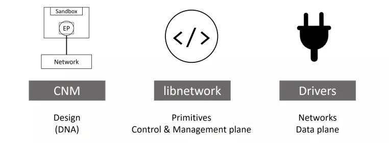

# TÌM HIỂU VỀ DOCKER NETWORK
## KHÁI NIỆM
- Docker Network là một hệ thống mạng ảo được Docker thiết kế để cho phép các container giao tiếp với nhau hoặc với các dịch vụ bên ngoài. Mỗi container trong Docker chạy trên một lớp mạng riêng biệt, và nhờ có Docker Network, chúng có thể chia sẻ dữ liệu, gửi nhận tín hiệu hoặc tương tác qua các cổng dịch vụ một cách dễ dàng.
- Docker mặc định tạo ra 3 network cơ bản khi cài đặt: bridge (default), host, và none. Ngoài ra, Docker còn cung cấp nhiều loại network khác như bridge, host, overlay, macvlan, giúp người dùng linh hoạt trong việc thiết lập môi trường phù hợp với từng kịch bản triển khai.
- Docker Network cung cấp tính năng network isolation (cô lập mạng), DNS resolution tự động giữa các container và IPAM (IP Address Management) tích hợp. Trong các mô hình triển khai microservices, Kubernetes hay Docker Swarm, việc cấu hình Docker Network đúng cách là yếu tố then chốt để duy trì tính khả dụng và mở rộng của toàn bộ hạ tầng. 

## CÁC THÀNH PHẦN TRONG DOCKER NETWORK
- Docker networking được cấu thành từ ba thành phần chính quan trọng nhất:
    + Container network model (CNM): là một hướng dẫn thiết kế chi tiết hay có thể coi là một chuẩn thiết kế networking cho hệ thống container, nó định nghĩa những block cơ bản cần thiết để cấu thành nên Docker network
    + libnetwork: là một bản implementation của CNM, và được sử dụng bởi Docker, được viết bằng ngôn ngữ Go và implement đầy đủ những thành phần cốt lõi của CNM.
    + Các drivers: là các bản implement custom của mô hình CNM cho các mô hình mạng khác nhau, giúp chúng ta ứng dụng trong từng trường hợp sử dụng khác nhau.


### Container network model (CNM)

### Libnetwork
- libnetwork là một bản implementation của CNM, nó là một open-source viết bằng Go, cross-platform và được sử dụng bởi Docker.
- Từ thời kì đầu của Docker, tất cả phần implement của CNM được nằm trong docker daemon, nhưng cho tới khi nó trở nên quá to và không tuân theo quy tắc thiết kế module theo chuẩn Unix, nó đã được tách ra thành một thư viện riêng biệt và dó là cách mà libnetwork được hình thành.
- Ngoài việc implement các thành phần có trong CNM, nó còn có các chức năng khác như service discovery, ingress-base container load balancing (cơ chế load balancing trong docker swarm), network control plane, management plane (giúp quản lý network trên docker host).

### Drivers
- libnetwork có thể coi như là một lớp trừu tượng định nghĩa các thành phần trong CNM, chức năng quản lý networking cho docker host, còn các driver chính là các bản implement cụ thể cho từng mục đích sử dụng khác nhau. Hay nói các khác chính driver mang đến khả năng kết nối thực sự và tách biệt các mạng với nhau. Mối tương quan giữa driver và libnetwork được thể hiện trong hình dưới đây.
- Trong Docker đã có tích hợp sẵn một số driver, được gọi là các native drivers hay local drivers:
    + Trên Linux bao gồm: bridge, overlay, macvlan.
    + Trên Window bao gồm: nat, overlay, transparent, 12bridge.
- Một số driver của bên thứ ba phát trên cũng có thế được sử dụng trong docker, chúng được gọi là remote drivers. Một số cái tên tiêu biểu có thể kể đến như: calico, contiv, kuryv...
- Mỗi một driver kể trên chịu trách nhiệm cho việc tạo, quản lý, xóa bỏ các resource trên các network thuộc loại của nó. Ví dụ overlay driver sẽ chịu trách nhiệm tạo, thêm, xóa bỏ các resource trong các overlay network.
- Các driver định nghĩa ở trên cũng có thể hoạt động đồng thời cùng lúc để có thể build nên những mô hình cấu trúc phức tạp phục vụ nhu cầu của người dùng. Trong phần tiếp theo của bài viết này, chúng ta sẽ đi vào tìm hiểu một số loại driver phổ biến thường được sử dụng trong docker.

## CÁC LOẠI NETWORK DRIVER PHỔ BIẾN
- Mỗi Docker Network được vận hành thông qua một network driver – thành phần đóng vai trò quyết định cách các container giao tiếp với nhau và với bên ngoài. Mỗi loại driver mang lại một kiểu cấu trúc mạng khác nhau, phù hợp với từng mục đích sử dụng trong phát triển và triển khai hệ thống. 
- Các loại Docker Network driver phổ biến bao gồm:

    + Bridge (mặc định): Cho phép các container trên cùng một host giao tiếp với nhau qua mạng ảo.
    + Host: Container dùng chung network namespace với host, giúp giảm độ trễ mạng nhưng ít tính cô lập.
    + Overlay: Kết nối các container giữa nhiều host khác nhau, thường dùng trong Docker Swarm hoặc hệ thống phân tán.
    + Macvlan: Gán địa chỉ MAC thật cho container, giúp nó xuất hiện như một thiết bị vật lý trên mạng.
    + None: Tắt toàn bộ chức năng mạng, container hoàn toàn biệt lập.
- Ngoài ra, Docker cũng hỗ trợ tích hợp driver tùy chỉnh thông qua plugin system từ bên thứ ba. Các plugin như Calico hoặc Weave Net cung cấp các tính năng nâng cao như network policies, encryption và multi-cloud networking giúp mở rộng chức năng mạng của Docker 
- Việc hiểu và lựa chọn đúng network driver không chỉ giúp tối ưu hiệu suất giao tiếp giữa các container, mà còn đảm bảo bảo mật, kiểm soát tài nguyên và khả năng mở rộng của hệ thống. 

## TẠO VÀ QUẢN LÝ DOCKER NETWORK HIỆU QUẢ
- Docker cung cấp nhiều tùy chọn linh hoạt thông qua dòng lệnh (CLI), cho phép bạn thiết lập cấu trúc mạng phù hợp với từng loại ứng dụng và mục tiêu triển khai. 
- Trong môi trường production, việc sử dụng user-defined network thay vì default bridge network được khuyến khích vì mang lại: Isolation tốt hơn giữa các container, tự động phân giải DNS và kết nối linh hoạt hơn.
### TẠO DOCKER NETWORK
- Bạn có thể tạo một Docker network mới bằng lệnh: 
```bash
docker network create --driver bridge my_custom_network
```
- Trong đó:
    + `--driver`: chỉ định loại docker network driver (ví dụ: bridge, host, overlay…)
    + `my_custom_network`: tên mạng do bạn đặt
- Ngoài ra, bạn có thể thêm các tùy chọn như subnet, gateway hoặc IP range để kiểm soát tốt hơn cấu hình mạng:
```bash
docker network create \

  --driver bridge \

  --subnet 192.168.100.0/24 \

  --gateway 192.168.100.1 \

  --ip-range 192.168.100.128/25 \

  --dns 8.8.8.8 \

  --dns 8.8.4.4 \

  --label environment=production \

  --label project=myapp \

  my_advanced_network
```
### QUẢN LÝ DOCKER NETWORK
Docker cung cấp các lệnh đơn giản để theo dõi và quản lý mạng:
```bash
docker network ls #Liệt kê các network đang tồn tại
docker network inspect my_custom_network #Kiểm tra chi tiết một mạng cụ thể
docker network connect my_custom_network my_container #Gắn container vào một network 
docker network disconnect my_custom_network my_container #Gỡ container khỏi network
docker network rm my_custom_network #Xóa network không dùng
```

- Các lệnh quản lý nâng cao
```bash
# Xóa tất cả networks không sử dụng
docker network prune
# Kết nối container với IP tĩnh
docker network connect --ip 192.168.100.10 my_custom_network my_container
# Kiểm tra networks với filter
docker network ls --filter driver=bridge
docker network ls --filter label=environment=production
```

## BẢO MẬT VÀ TỐI ƯU HIỆU SUẤT DOCKER NETWORK
Để đảm bảo hệ thống container hoạt động ổn định và an toàn, việc bảo mật và tối ưu hiệu suất Docker Network là vô cùng quan trọng. Một mạng Docker được cấu hình tốt không chỉ giúp cải thiện tốc độ truyền dữ liệu mà còn bảo vệ các container tránh khỏi các nguy cơ tấn công mạng. Trong môi trường production, network security và performance optimization phải được tích hợp ngay từ giai đoạn thiết kế kiến trúc.
### Các cách bảo mật Docker Network phổ biến
- Việc bảo mật Docker Network giúp ngăn chặn truy cập trái phép và bảo vệ dữ liệu khi container giao tiếp với nhau hoặc với bên ngoài. Một số cách bảo mật phổ biến gồm:
    + Phân tách mạng riêng biệt: Tạo nhiều mạng Docker riêng cho từng nhóm container hoặc dịch vụ để hạn chế khả năng truy cập chéo không mong muốn.
    + Sử dụng firewall và luật lọc truy cập: Áp dụng iptables hoặc các công cụ firewall khác để kiểm soát luồng dữ liệu vào ra giữa các container và mạng ngoài.
    + Giới hạn truy cập Internet: Với những container không cần truy cập ra ngoài, bạn nên sử dụng mạng none hoặc cấu hình chặn outbound phù hợp.
    + Giám sát lưu lượng mạng: Dùng các công cụ như cAdvisor, Netdata để theo dõi và phát hiện các hoạt động bất thường trên mạng Docker.
    + Mã hóa overlay network: Trong môi trường Docker Swarm hoặc đa host, bật tính năng mã hóa để bảo vệ dữ liệu truyền tải giữa các node.

### Các cách tối ưu hiệu suất Docker Network
- Để mạng Docker vận hành hiệu quả, giảm độ trễ và tối ưu tài nguyên, bạn cần lưu ý những điểm sau:
    + Lựa chọn loại mạng phù hợp: Sử dụng bridge cho các container trên cùng host, overlay cho môi trường đa host, tránh dùng host nếu không thực sự cần thiết để giữ tính cô lập.
    + Hạn chế số lượng container trên một mạng: Mạng có quá nhiều container có thể gây tắc nghẽn DNS nội bộ và giảm hiệu suất truyền thông.
    + Tắt các tính năng không cần thiết: Vô hiệu hóa multicast hoặc service discovery nếu không dùng để giảm tải cho hệ thống.
    + Điều chỉnh thông số MTU: Đồng bộ MTU giữa các node giúp giảm phân mảnh gói tin, tăng tốc độ truyền dữ liệu trong mạng overlay.