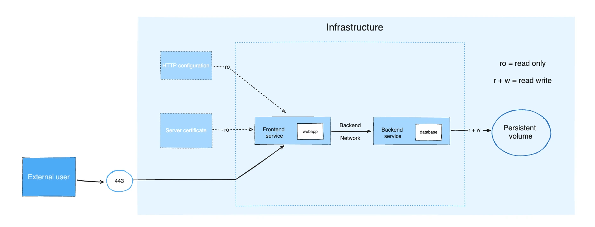

# TÌM HIỂU VỀ DOCKER STORAGE
- Để ứng dụng chạy ổn định và không bị mất dữ liệu, Docker Storage (Lưu trữ trong Docker) là một trong những chủ đề quan trọng nhất bạn cần làm chủ.
## VẤN ĐỀ LƯU TRỮ MẶC ĐỊNH CỦA CONTAINER
- Mặc định, khi một Container ghi dữ liệu, dữ liệu đó sẽ nằm ở Writable Layer (lớp ghi được) của chính Container đó. Cấu trúc này có 3 nhược điểm rất lớn:
+ Dữ liệu tạm thời (Non-persistent): Khi Container bị xóa (docker rm), toàn bộ dữ liệu mới phát sinh trong lớp ghi này sẽ biến mất vĩnh viễn.
+ Hiệu năng kém: Việc ghi vào Writable Layer phải đi qua một bộ quản lý có tên là Storage Driver (dùng cơ chế Union File System như overlay2). Cơ chế này tốn thêm chi phí xử lý của CPU/RAM, làm giảm tốc độ đọc/ghi (I/O).
+ Khó chia sẻ: Dữ liệu nằm khép kín bên trong một Container, các Container khác hoặc máy thật (Host) rất khó truy cập vào.

## CÁC CƠ CHẾ LƯU TRỮ CHÍNH TRONG DOCKER

- *Volumes* : được lưu trữ trong host trên linux có đường dẫn : var/lib/docker/volumes/ và được quản lý bởi Docker. Những tiến trình không phải Docker sẽ không làm thay đổi được những file này.
- *Bind mounts* : có thể được lưu trữ ở bất kỳ đâu trong máy host. Những tiến trình không phải từ Docker vẫn có thể thay đổi dữ liệu trong này bất kỳ khi nào. (vd chúng ta có thể code từ máy host và khi mount thì trong docker những dữ liệu đấy sẽ được đồng bộ)
- *tmpfs mounts* : được lưu trữ trong memory (vì vậy khi docker khởi động lại hay dừng container thì dữ liệu trong đây sẽ mất đi)

### VOLUME
- Bản chất: Là một vùng không gian lưu trữ do Docker quản lý hoàn toàn trên hệ điều hành máy thật (thường nằm ở /var/lib/docker/volumes/).
- Ưu điểm:
+ Hoàn toàn độc lập với vòng đời của Container (xóa Container dữ liệu vẫn còn).
+ Hiệu năng I/O cao hơn Writable Layer.
+ Dễ dàng sao lưu (backup), di chuyển và chia sẻ giữa nhiều Container.
+ Hoạt động an toàn, nhất quán trên cả Windows, Linux và macOS.
- Thích hợp cho: Lưu trữ dữ liệu cơ sở dữ liệu (MySQL, PostgreSQL, MongoDB...), dữ liệu sản xuất (Production).
`docker volume create [volume_name]`

- Sau khi tạo một volume, để kiểm tra xem đã tạo thành công chưa thì sử dụng câu lệnh 
`docker volume ls -f "name=[volume_name]"`
*Cách sử dụng*
- Cách 1: sử dụng Docker CLI
```bash
# Tạo một Volume đặt tên là "db_data"
docker volume create db_data

# Chạy Container MySQL và gắn Volume "db_data" vào thư mục chứa dữ liệu của MySQL
docker run -d --name my-db \
  -v db_data:/var/lib/mysql \
  mysql:8.0
```
- Cách 2: Khai báo trong file `compose.yaml`
Ví dụ:
```bash
services:
  web:
    image: node:20
    ports:
      - "3000:3000"
    volumes:
      # 1. Bind Mount: Đồng bộ code từ máy thật vào Container để dev
      - .:/app
      
  db:
    image: postgres:16
    environment:
      POSTGRES_PASSWORD: secret
    volumes:
      # 2. Named Volume: Lưu dữ liệu Postgres vĩnh viễn
      - pgdata:/var/lib/postgresql/data

# Khai báo Volume cấp cao nhất (Top-level)
volumes:
  pgdata: # Docker sẽ tự quản lý Volume này
```

### BIND MOUNTS
- Bản chất: Gắn trực tiếp một thư mục hoặc tệp tin cụ thể từ bất kỳ đâu trên máy thật vào bên trong Container (ví dụ: gắn /home/user/my-code vào /app trong Container).
- Ưu điểm: Giúp Container truy cập trực tiếp vào các file trên máy thật theo thời gian thực.
- Nhược điểm: Phụ thuộc chặt chẽ vào cấu trúc thư mục của máy thật. Nếu đường dẫn trên máy thật thay đổi, Container sẽ bị lỗi.
- Thích hợp cho: Môi trường phát triển (Development). Bạn sửa code ở máy thật, Container cập nhật ngay lập tức mà không cần build lại Image (Hot-reload).
*Cách sử dụng*
```bash
# Gắn thư mục code hiện tại (dùng $(pwd)) vào thư mục /app trong Container
docker run -d --name my-app \
  -v $(pwd):/app \
  -p 3000:3000 \
  node:20
```

### tmpfs Mounts
- Bản chất: Dữ liệu được lưu trực tiếp trên bộ nhớ RAM của máy thật chứ không ghi xuống ổ cứng (HDD/SSD).
- Ưu điểm: Tốc độ đọc/ghi siêu nhanh, cực kỳ an toàn vì dữ liệu sẽ xóa sạch khi Container dừng lại.
- Thích hợp cho: Lưu trữ thông tin nhạy cảm (API Keys, Secret, Session) hoặc các file tạm thời cần tốc độ xử lý cao.

## SO SÁNH 3 LOẠI STORAGE
| Tiêu chí                         | Volumes                                            | Bind Mounts                          | tmpfs Mounts              |
|----------------------------------|----------------------------------------------------|--------------------------------------|---------------------------|
| Vị trí lưu trữ                   | Thư mục riêng của Docker (/var/lib/docker)         | Bất kỳ vị trí nào trên máy thật      | Bộ nhớ RAM                |
| Bảo vệ dữ liệu khi xóa Container | Có (Dữ liệu vẫn còn)                               | Có (Dữ liệu vẫn còn)                 | Không (Mất sạch dữ liệu)  |
| Đối tượng quản lý                | Docker CLI / Docker Daemon                         | Người dùng / Hệ điều hành máy thật   | Hệ điều hành / Bộ nhớ RAM |
| Trường hợp sử dụng phù hợp       | Database, file tải lên của người dùng (Production) | Source code khi đang lập trình (Dev) | Lưu Token, Key, File tạm  |


## CÁC CÂU LỆNH QUẢN LÝ VOLUME
```bash
# Liệt kê tất cả các Volume hiện có trên máy
docker volume ls

# Xem thông tin chi tiết (nơi lưu thực tế trên máy thật, ngày tạo...)
docker volume inspect <ten_volume>

# Xóa một Volume (Lưu ý: Container đang dùng Volume này phải dừng trước)
docker volume rm <ten_volume>

# Dọn dẹp tất cả các Volume "rác" không còn Container nào sử dụng
docker volume prune
```