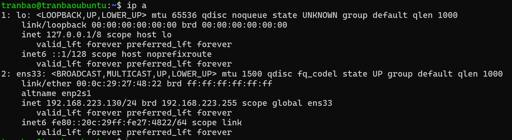
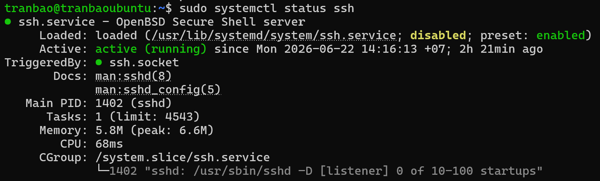
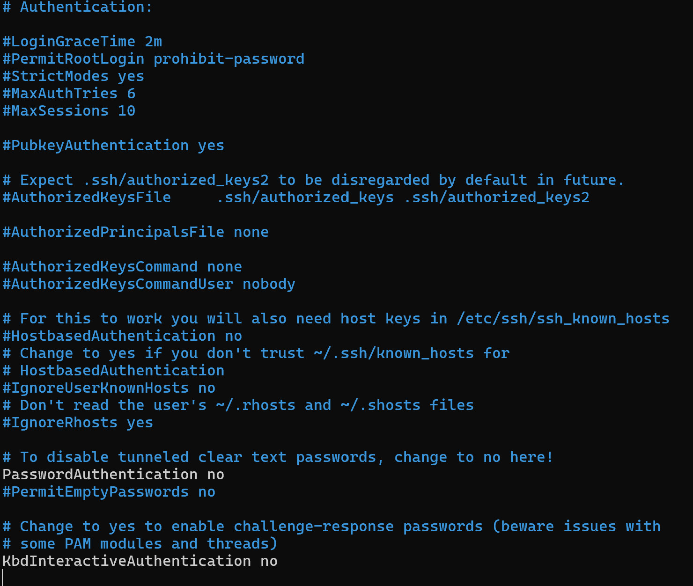

# SSH TỪ MÁY WINDOWS SANG MÁY ẢO UBUNTU SERVER 24.04
## MÔ TẢ
- Mô hình máy chính Windows thực hiện SSH đến máy ảo Ubuntu Server 24.04 sử dụng SSH Key

## CÁC BƯỚC THỰC HIỆN
## 1. Generate SSH key sử dụng thuật toán RSA
- Ở trên màn hình Terminal của Windows, ta gõ câu lệnh `ssh-keygen -t rsa -b 4096`
- Sau đó ở thư mục C:\Users\Tran Bao\.ssh sẽ xuất hiện private key và public key

## 2. Kiểm tra địa chỉ IP của máy ảo Ubuntu
- Gõ câu lệnh `ip a` trên máy ảo Ubuntu để kiểm tra địa chỉ IP

## 3. Kiểm tra dịch vụ SSH có đang hoạt động trong Ubuntu
- Sử dụng câu lệnh `sudo systemctl status ssh` để kiểm tra xem ssh service có đang hoạt động hay không

- Ta có thể thấy service đang running nên không cần phải cài đặt nữa

## 3. Tạo thư mục chứa Public Key tại thư mục cá nhân trong Ubuntu
- Sử dụng câu lệnh `mkdir -p ~/.ssh` để tạo thư mục ssh
- Sử dụng câu lệnh `sudo nano ~/.ssh/authorized_keys` rồi thêm public key ssh trong file id_rsa.pub
- Cấu hình quyền cho thư mục ssh và file authorized_keys
`chmod 700 ~/.ssh`
`chmod 600 ~/.ssh/authorized_keys`

## 4. Cấu hình lại dịch vụ SSH trên Ubuntu
`sudo nano /etc/ssh/sshd_config`

- Ở đây, tìm và chỉnh sửa các dòng sau:
+ PubkeyAuthentication yes (Bật tính năng đăng nhập bằng Key).
+ PasswordAuthentication no (Tắt tính năng đăng nhập bằng mật khẩu thường - chỉ làm bước này khi bạn chắc chắn bước 2 đã thành công để tránh bị khóa bên ngoài).

## 5. Restart lại dịch vụ SSH
`sudo systemctl restart ssh`

## 6. Thực hiện SSH từ Windows đến Ubuntu
- Vào terminal gõ `ssh username@dia_chi_ip` để thực hiện kết nối
