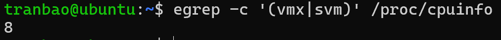
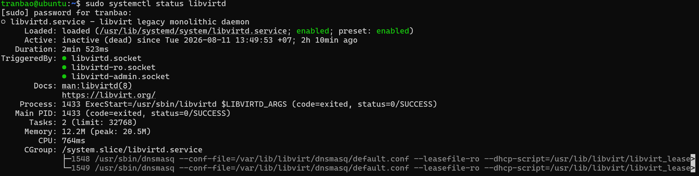

# CÁCH CÀI ĐẶT KVM TRÊN UBUNTU
## MÔ TẢ
- Thực hành cài đặt KVM trên máy ảo Ubuntu Server 24.04

## THỰC HÀNH
### Bước 1: Kiểm tra
- Đầu tiên ta sẽ cần bật tính năng Virtualize VT-x/AMD-V trong Setting của máy ảo ở VMWare
- Sau đó ta cần phải kiểm tra xem máy ảo có hỗ trợ cài đặt KVM không, ta sẽ sử dụng câu lệnh:
``` console
egrep -c '(vmx|svm)' /proc/cpuinfo
```

- Nếu trả về kết quả > 0 thì sẽ chuyển sang luôn bước 3
- Nếu kết quả trả về là 0, thì vào BIOS của máy tính và bật các tính năng như Intel Virtualization Technology lên. Nếu sau khi bật IVT lên mà kết quả vẫn là 0 thì tiến hàng sang bước 2

### Bước 2: Tắt VBS (Virtual Based Security) Trên Windows 11
- Ta sẽ thực hiện từng bước như dưới đây:
``` bash
1/ Disable Credential Guard with Registry settings
       Key path: HKEY_LOCAL_MACHINE\SYSTEM\CurrentControlSet\Control\Lsa
       Key name: LsaCfgFlags
       Type: REG_DWORD
       Value: 0


       Key path: HKEY_LOCAL_MACHINE\SOFTWARE\Policies\Microsoft\Windows\DeviceGuard
       Key name: LsaCfgFlags
       Type: REG_DWORD
       Value: 0

2/ Disable Credential Guard with UEFI lock, run Windows Command Prompt as administrator
       mountvol X: /s
       copy %WINDIR%\System32\SecConfig.efi X:\EFI\Microsoft\Boot\SecConfig.efi /Y
       bcdedit /create {0cb3b571-2f2e-4343-a879-d86a476d7215} /d "DebugTool" /application osloader
       bcdedit /set {0cb3b571-2f2e-4343-a879-d86a476d7215} path "\EFI\Microsoft\Boot\SecConfig.efi"
       bcdedit /set {bootmgr} bootsequence {0cb3b571-2f2e-4343-a879-d86a476d7215}
       bcdedit /set {0cb3b571-2f2e-4343-a879-d86a476d7215} loadoptions DISABLE-LSA-ISO
       bcdedit /set {0cb3b571-2f2e-4343-a879-d86a476d7215} device partition=X:
       mountvol X: /d

3/ Disable VBS with Registry settings, Delete the following registry keys:
       Key path: HKEY_LOCAL_MACHINE\SYSTEM\CurrentControlSet\Control\DeviceGuard
       Key name: EnableVirtualizationBasedSecurity

       Key path: HKEY_LOCAL_MACHINE\SYSTEM\CurrentControlSet\Control\DeviceGuard
       Key name: RequirePlatformSecurityFeatures

4/ Run Windows Command Prompt as administrator
       bcdedit /set {0cb3b571-2f2e-4343-a879-d86a476d7215} loadoptions DISABLE-LSA-ISO,DISABLE-VBS
       bcdedit /set vsmlaunchtype off

5/ Open Group policies editor 

Computer Configuration -> Admininistrative Templates -> System -> Device Guard -> select "Turn ON Virtualization Base Security "  and choose "Disable" option.

6/ Turn off all options in Core isolation of windows 11 24h2
Windows start -> core isolation -> Turn off all options

7/ Windows Start -> In Feature windows 11, uncheck: Hyper-V, Virtual machine plafrorm, Windows subsystem for Linux

8/ Restart PC
Restart the device. Before the OS boots, a prompt appears notifying that UEFI was modified, and asking for confirmation. (Press F3 and press enter to continue).
```
### Bước 3: Cài đặt
- Tiến hành cài đặt 
``` bash
sudo apt update
sudo apt -y install bridge-utils cpu-checker libvirt-clients virtinst virt-manager libvirt-daemon-system qemu-system-x86 qemu-utils qemu-kvm
```
- Tác dụng chi tiết của từng gói:
    + `qemu-kvm`: Phần mềm giả lập phần cứng và ảo hóa cốt lõi.
    + `libvirt-daemon-system`: Daemon quản lý các tiến trình ảo hóa của libvirt.
    + `libvirt-clients`: Các công cụ dòng lệnh (như virsh) để quản lý máy ảo.
    + `bridge-utils`: Cung cấp công cụ tạo mạng cầu nối (bridge network) cho máy ảo kết nối mạng ngoài.
    + `virtinst`: Cung cấp lệnh virt-install dùng để tạo máy ảo mới nhanh chóng qua dòng lệnh.

### Bước 4: Cấp quyền sử dụng KVM cho tài khoản 
``` bash
sudo adduser $USER libvirt
sudo adduser $USER kvm
```

### Bước 5: Kiểm tra KVM đã cài đặt thành công hay chưa
``` bash
virsh 
#hoặc
sudo systemctl status libvirtd
```


- Nếu dịch vụ chưa chạy (running) thì khởi động nó lên hoặc đặt chế độ chạy ngầm khi hệ thống khởi động
``` bash
sudo systemctl start libvirtd #khởi chạy dịch vụ
#hoặc
sudo systemctl enable libvirtd #chạy ngầm khi hệ thống khởi động


