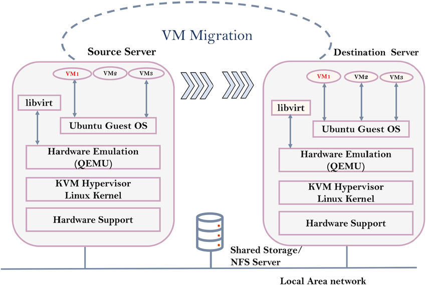
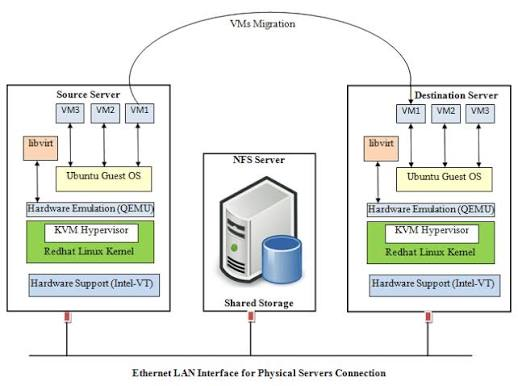

# TÌM HIỂU VỀ LIVE MIGRATION
## KHÁI NIỆM
- KVM Migration (Di chuyển máy ảo trong KVM) là một kỹ thuật quản trị mạng và ảo hóa quan trọng, cho phép dịch chuyển toàn bộ một máy ảo (Guest VM) từ máy chủ vật lý này (Source Host) sang máy chủ vật lý khác (Destination Host).
- Kỹ thuật này rất quan trọng trong việc bảo trì hạ tầng không gián đoạn (Zero-downtime maintenance), cân bằng tải tài nguyên (Load Balancing) và khôi phục sau sự cố (Disaster Recovery).

## PHÂN LOẠI KVM MIGRATION
### OFFLINE MIGRATION
- Bản chất: Máy ảo được tắt hoàn toàn (Power Off) trước khi tiến hành di chuyển.
- Cơ chế: Dữ liệu cấu hình (file XML) và file đĩa ảo (.qcow2/.raw) được chép từ máy chủ nguồn sang máy chủ đích. Sau đó, máy ảo được bật lại tại máy chủ đích.
- Đặc điểm: An toàn tuyệt đối, không yêu cầu mạng tốc độ cao hay Shared Storage, nhưng có thời gian gián đoạn (Downtime)

### LIVE MIGRATION
- Bản chất: Di chuyển máy ảo khi máy ảo vẫn đang bật, các dịch vụ và ứng dụng bên trong vẫn đang phục vụ người dùng bình thường.
- Cơ chế: Toàn bộ trạng thái bộ nhớ (RAM), CPU registers, và kết nối I/O của máy ảo được đồng bộ qua mạng từ Host nguồn sang Host đích.
- Đặc điểm: Thời gian gián đoạn gần như bằng 0 (chỉ từ vài miligiây đến vài giây), người dùng cuối hoàn toàn không nhận ra máy ảo vừa bị chuyển sang server khác.

## CƠ CHẾ HOẠT ĐỘNG CỦA LIVE MIGRATION

**Giai đoạn 1: Pre-copy (Sao chép trước)**
- KVM bắt đầu copy toàn bộ trang nhớ (RAM Pages) từ Host nguồn sang Host đích trong khi máy ảo vẫn đang chạy.
- Trong lúc copy, máy ảo vẫn tiếp tục ghi dữ liệu mới vào RAM. Những vùng RAM bị thay đổi này gọi là Dirty Pages.
- KVM sẽ tiếp tục lặp lại việc copy các Dirty Pages này sang Host đích theo từng vòng (iterative rounds).

**Giai đoạn 2: Stop and Copy (Dừng và Chuyển giao cuối)**
- Khi dung lượng Dirty Pages còn lại rất ít (hoặc tốc độ copy vượt qua tốc độ ghi RAM của máy ảo), KVM sẽ tạm dừng (Pause) máy ảo trên Host nguồn trong vài miligiây.
- KVM copy nấc Dirty Pages cuối cùng + Trạng thái CPU Registers + Trạng thái thiết bị vIRTIO sang Host đích.

**Giai đoạn 3: Resume (Kích hoạt lại)**
- Máy ảo trên Host đích được khôi phục trạng thái (Resume) và tiếp tục xử lý các lệnh.
- Máy ảo trên Host nguồn bị xóa khỏi RAM và tắt hoàn toàn.
- Cụm Mạng (Virtual Switch) phát gói tin GARP (Gratuitous ARP) để cập nhật bảng Switch vật lý, trỏ lưu lượng mạng (IP) về vị trí server mới.

## ĐIỀU KIỆN ĐỂ CHẠY LIVE MIGRATION
Để KVM Live Migration hoạt động mượt mà, hạ tầng cần đáp ứng các tiêu chuẩn sau:
- Shared Storage (Lưu trữ tập trung) — Quan trọng nhất
    + File đĩa ảo (.qcow2) của máy ảo phải nằm trên kho lưu trữ dùng chung mà cả Host Nguồn và Host Đích đều truy cập được (như NFS, Ceph RBD, iSCSI, SAN).
    + Lưu ý: Nếu không có Shared Storage, bạn bắt buộc phải dùng tính năng Block Live Migration (chuyển cả RAM lẫn toàn bộ dung lượng ổ đĩa qua mạng), thời gian chuyển sẽ lâu hơn rất nhiều.

- Đồng bộ Mạng (Network Consistency)
    + Cả 2 Host vật lý phải nằm trên cùng một dải Subnet/VLAN để IP của máy ảo không bị đổi sau khi di chuyển.
    + Tên Bridges/vSwitches trên cả 2 Host phải cấu hình giống hệt nhau (ví dụ: cùng là virbr0 hoặc br0).

- Tương thích CPU (CPU Compatibility)
    + Hai máy chủ vật lý nên dùng CPU cùng dòng (ví dụ: cùng Intel hoặc cùng AMD).
    + Nếu 2 CPU khác thế hệ (ví dụ: Intel Gen 10 và Gen 13), bạn cần cấu hình model CPU của máy ảo thành dạng chuẩn hóa như custom hoặc passthrough phù hợp để tránh lỗi Instruction Set.

- Phân giải tên miền / SSH Trust
    + Cả 2 Host phải phân giải được tên miền/IP của nhau và nên thiết lập SSH Passwordless Key giữa 2 máy chủ.
